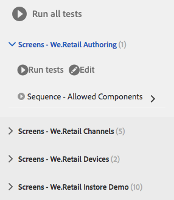

# Prueba de la IU{#testing-your-ui}

>[!NOTE]
>
>A partir de AEM 6.5, el marco de prueba de la interfaz de usuario de hobbes.js está obsoleto. Adobe no planea realizar más mejoras y recomienda a los clientes que utilicen la automatización de Selenium.
>
>Consulte [Funciones obsoletas y eliminadas](/help/release-notes/deprecated-removed-features.md).

AEM proporciona un marco para automatizar las pruebas de la IU AEM. Con el marco, las pruebas de interfaz de usuario se escriben y ejecutan directamente en un navegador web. La estructura proporciona una API de javascript para crear pruebas.

El marco de AEM prueba utiliza Hobbes.js, una biblioteca de pruebas escrita en JavaScript. El marco Hobbes.js fue desarrollado para probar AEM como parte del proceso de desarrollo. El módulo ya está disponible para uso público para probar las aplicaciones AEM.

>[!NOTE]
>
>Consulte la documentación de Hobbes.js [](https://helpx.adobe.com/experience-manager/6-5/sites/developing/using/reference-materials/test-api/index.html) para obtener detalles completos de la API.

## Estructura de las pruebas {#structure-of-tests}

Al utilizar pruebas automatizadas dentro de AEM, es importante comprender los siguientes términos:

| Acción | Una **acción** es una actividad específica de una página Web, como hacer clic en un vínculo o en un botón. |
|---|---|
| Caso de prueba | Un **Caso de prueba** es una situación específica que puede estar formada por una o más **Acciones**. |
| Test Suite | Un **Test Suite** es un grupo de **Casos de prueba** relacionados que juntos prueban un caso de uso específico. |

## Ejecutando pruebas {#executing-tests}

### Visualización de grupos de pruebas {#viewing-test-suites}

Abra la consola de pruebas para ver los grupos de pruebas registrados. El panel Pruebas contiene una lista de los grupos de pruebas y sus casos de prueba.

Vaya a la consola Herramientas mediante **Navegación global -> Herramientas > Operaciones -> Pruebas**.


Al abrir la consola, los grupos de pruebas se muestran a la izquierda junto con una opción para ejecutarlos de forma secuencial. El espacio a la derecha que se muestra con un fondo de cuadros es un marcador de posición para mostrar el contenido de la página a medida que se ejecutan las pruebas.


### Ejecución de un único grupo de pruebas {#running-a-single-test-suite}

Los grupos de pruebas se pueden ejecutar de forma individual. Al ejecutar un grupo de pruebas, la página cambia a medida que se ejecutan los casos de prueba y sus acciones y los resultados aparecen una vez finalizada la prueba. Los iconos indican los resultados.

Un icono de marca de verificación indica una prueba pasada:


El icono &quot;X&quot; indica que la prueba ha fallado:


Para ejecutar un grupo de pruebas:

1. En el panel Pruebas, toque o haga clic en el nombre del caso de prueba que desee ejecutar para expandir los detalles de las acciones.

   

1. Toque o haga clic en el botón **Ejecutar prueba**.

   

1. El marcador de posición se reemplaza por el contenido de la página a medida que se ejecuta la prueba.

   

1. Revise los resultados del caso de prueba tocando o haciendo clic en la descripción para abrir el panel **Resultado**. Al tocar o hacer clic en el nombre del caso de prueba en el panel **Resultado** se muestran todos los detalles.

   

### Ejecución de varias pruebas {#running-multiple-tests}

Los grupos de pruebas se ejecutan secuencialmente en el orden en que aparecen en la consola. Puede explorar en profundidad una prueba para ver los resultados detallados.


1. En el panel Pruebas, toque o haga clic en el botón **Ejecutar todas las pruebas** o en el botón **Ejecutar pruebas** debajo del título del grupo de pruebas que desee ejecutar.

   

1. Para vista de los resultados de cada caso de prueba, toque o haga clic en el título del caso de prueba. Al tocar o hacer clic en el nombre de la prueba en el panel **Resultado** se muestran todos los detalles.

   

## Creación y uso de un grupo de pruebas simple {#creating-and-using-a-simple-test-suite}

El siguiente procedimiento lo lleva a cabo a través de la creación y ejecución de un grupo de pruebas con [contenido de We.Retail](/help/sites-developing/we-retail.md), pero puede modificar fácilmente la prueba para utilizar una página web diferente.

Para obtener más información sobre cómo crear sus propios grupos de pruebas, consulte la [documentación de la API de Hobbes.js](https://helpx.adobe.com/experience-manager/6-5/sites/developing/using/reference-materials/test-api/index.html).

1. Abra CRXDE Lite. ([https://localhost:4502/crx/de](https://localhost:4502/crx/de))
1. Haga clic con el botón secundario en la carpeta `/etc/clientlibs` y haga clic en **Crear > Crear carpeta**. Escriba `myTests` para el nombre y haga clic en **Aceptar**.
1. Haga clic con el botón secundario en la carpeta `/etc/clientlibs/myTests` y haga clic en **Crear > Crear nodo**. Utilice los siguientes valores de propiedad y haga clic en **Aceptar**:

   * Nombre: `myFirstTest`
   * Tipo: `cq:ClientLibraryFolder`

1. Añada las siguientes propiedades al nodo myFirstTest:

   | Nombre | Tipo | Value |
   |---|---|---|
   | `categories` | Cadena[] | `granite.testing.hobbes.tests` |
   | `dependencies` | Cadena[] | `granite.testing.hobbes.testrunner` |

   >[!NOTE]
   >
   >**Solo AEM Forms**
   >
   >
   >Para probar los formularios adaptables, agregue los siguientes valores a las categorías y dependencias. Por ejemplo:
   >
   >
   >**categorías**:  `granite.testing.hobbes.tests, granite.testing.hobbes.af.commons`
   >
   >
   >**dependencias**:  `granite.testing.hobbes.testrunner, granite.testing.hobbes.af`

1. Haga clic en **Guardar todo**.
1. Haga clic con el botón secundario en el nodo `myFirstTest` y haga clic en **Crear > Crear archivo**. Asigne un nombre al archivo `js.txt` y haga clic en **Aceptar**.
1. En el archivo `js.txt`, escriba el siguiente texto:

   ```
   #base=.
   myTestSuite.js
   ```

1. Haga clic en **Guardar todo** y cierre el archivo `js.txt`.
1. Haga clic con el botón secundario en el nodo `myFirstTest` y haga clic en **Crear > Crear archivo**. Asigne un nombre al archivo `myTestSuite.js` y haga clic en **Aceptar**.
1. Copie el siguiente código en el archivo `myTestSuite.js` y luego guarde el archivo:

   ```
   new hobs.TestSuite("Experience Content Test Suite", {path:"/etc/clientlibs/myTests/myFirstTest/myTestSuite.js"})
      .addTestCase(new hobs.TestCase("Navigate to Experience Content")
         .navigateTo("/content/we-retail/us/en/experience/arctic-surfing-in-lofoten.html")
      )
      .addTestCase(new hobs.TestCase("Hover Over Topnav")
         .mouseover("li.visible-xs")
      )
      .addTestCase(new hobs.TestCase("Click Topnav Link")
         .click("li.active a")
   );
   ```

1. Vaya a la consola **Testing** para probar el grupo de pruebas.
