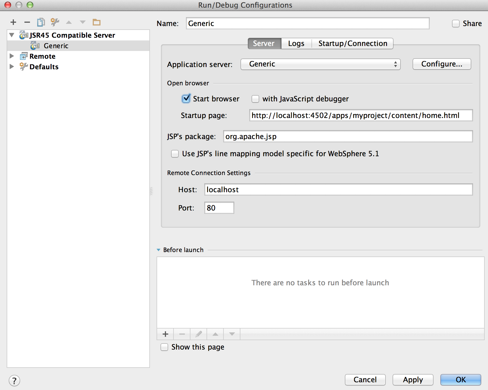

# Desarrollo de AEM proyectos con IntelliJ IDEA{#how-to-develop-aem-projects-using-intellij-idea}

## Información general {#overview}

Para comenzar con AEM desarrollo de IntelliJ, se requieren los siguientes pasos.

Cada uno de ellos se explica con más detalle en el resto de este Manual de procedimientos.

* Instalar IntelliJ
* Configurar el proyecto de AEM en función de Maven
* Preparación de la compatibilidad con JSP para IntelliJ en el Maven POM
* Importar el proyecto Maven en IntelliJ

>[!NOTE]
>
>Esta guía se basa en IntelliJ IDEA Ultimate Edition 12.1.4 y AEM 5.6.1.

### Instalar IntelliJ IDEA {#install-intellij-idea}

Descargar IntelliJ IDEA desde [la página Descargas en JetBrains](https://www.jetbrains.com/idea/download/index.html).

A continuación, siga las instrucciones de instalación de esa página.

### Configurar el proyecto de AEM en función de Maven {#set-up-your-aem-project-based-on-maven}

A continuación, configure el proyecto con Maven como se describe en [Cómo crear AEM proyectos con Apache Maven](/help/sites-developing/ht-projects-maven.md).

Para comenzar a trabajar con AEM proyectos en IntelliJ IDEA, la configuración básica de [Introducción en 5 minutos](https://maven.apache.org/guides/getting-started/maven-in-five-minutes.html) es suficiente.

### Preparar compatibilidad con JSP para IntelliJ IDEA {#prepare-jsp-support-for-intellij-idea}

IntelliJ IDEA también puede proporcionar soporte para trabajar con JSP, por ejemplo

* finalización automática de bibliotecas de etiquetas
* conocimiento de los objetos definidos por `<cq:defineObjects />` y `<sling:defineObjects />`

Para que esto funcione, siga las instrucciones de [Cómo trabajar con JSP](/help/sites-developing/ht-projects-maven.md#how-to-work-with-jsps) en [Cómo crear AEM proyectos con Apache Maven](/help/sites-developing/ht-projects-maven.md).

### Importar el proyecto Maven {#import-the-maven-project}

1. Abra el **Importar** diálogo en IntelliJ IDEA por

   * seleccionar **Importar proyecto** en la pantalla de bienvenida si todavía no tiene ningún proyecto abierto
   * seleccionar **Archivo -> Importar proyecto** del menú principal

1. En el cuadro de diálogo Importar, seleccione el archivo POM del proyecto.

   

1. Continúe con la configuración predeterminada como se muestra en el cuadro de diálogo siguiente.

   

1. Siga los siguientes cuadros de diálogo haciendo clic en **Siguiente** y **Finalizar**.
1. Ahora está configurado para AEM Desarrollo con IntelliJ IDEA

   

### Depuración de JSP con IntelliJ IDEA {#debugging-jsps-with-intellij-idea}

Los siguientes pasos son necesarios para depurar JSPs con IntelliJ IDEA

* Configuración de una faceta web en el proyecto
* Instalación del complemento de soporte JSR45
* Configuración de un perfil de depuración
* Configuración de AEM para el modo de depuración

#### Configuración de una faceta web en el proyecto {#set-up-a-web-facet-in-the-project}

IntelliJ IDEA necesita comprender dónde encontrar los JSP para la depuración. Como IDEA no puede interpretar la variable `content-package-maven-plugin` , debe configurarse manualmente.

1. Vaya a **Archivo -> Estructura del proyecto**
1. Seleccione el **Contenido** módulo
1. Haga clic en **+** encima de la lista de módulos y seleccione **Web**
1. Como Directorio de recursos web, seleccione la `content/src/main/content/jcr_root subdirectory` de su proyecto como se muestra en la captura de pantalla siguiente.


#### Instalación del complemento de soporte JSR45 {#install-the-jsr-support-plugin}

1. Vaya a la **Complementos** en la configuración de IntelliJ IDEA
1. Vaya a la **Integración con JSR45** Complemento y seleccione la casilla de verificación situada junto a él
1. Haga clic en **Aplicar**
1. Reinicie IntelliJ IDEA cuando se solicite


#### Configuración de un perfil de depuración {#configure-a-debug-profile}

1. Vaya a **Ejecutar -> Editar configuraciones**
1. Visita el **+** y seleccione **JSR45 remoto**
1. En el cuadro de diálogo de configuración, seleccione **Configurar** junto a **Servidor de aplicaciones** y configurar un servidor genérico
1. Establezca la página de inicio como una dirección URL adecuada si desea abrir un explorador cuando inicie la depuración
1. Eliminar todo **Antes del inicio** tareas si utiliza vlt autosync o configura las tareas apropiadas de Maven si no lo hace
1. En el **Inicio/Conexión** , ajuste el puerto si es necesario
1. Copie los argumentos de la línea de comandos que propone IntelliJ IDEA

 

#### Configuración de AEM para el modo de depuración {#configure-aem-for-debug-mode}

El último paso requerido es comenzar AEM con las opciones de JVM propuestas por IntelliJ IDEA.

Para ello, inicie el archivo jar AEM directamente y agregue estas opciones, por ejemplo, con la siguiente línea de comandos:

`java -Xdebug -Xrunjdwp:transport=dt_socket,address=58242,suspend=n,server=y -Xmx1024m -jar cq-quickstart-6.5.0.jar`

También puede agregar estas opciones al script de inicio en `crx-quickstart/bin/start` como se muestra a continuación.

```shell
# ...

# default JVM options
if [ -z "$CQ_JVM_OPTS" ]; then
 CQ_JVM_OPTS='-server -Xmx1024m -Djava.awt.headless=true'
fi

CQ_JVM_OPTS="$CQ_JVM_OPTS -Xdebug -Xrunjdwp:transport=dt_socket,address=58242,suspend=n,server=y"

# ...
```

#### Iniciar depuración {#start-debugging}

Ahora está todo configurado para depurar sus JSP en AEM.

1. Select **Ejecutar -> Depurar -> Su perfil de depuración**
1. Definir puntos de interrupción en el código de componente
1. Acceder a una página en el explorador


### Depuración de paquetes con IntelliJ IDEA {#debugging-bundles-with-intellij-idea}

El código de los paquetes se puede depurar mediante una conexión de depuración remota genérica estándar. Puede seguir la [Documentación de JetBrain sobre depuración remota](https://www.jetbrains.com/idea/webhelp/run-debug-configuration-remote.html).
