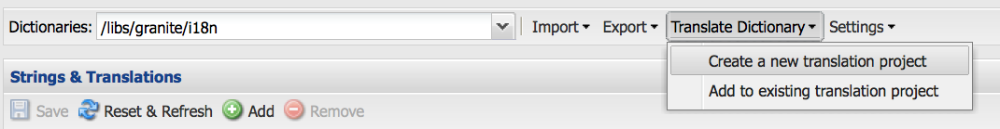

# Uso del traductor para administrar diccionarios{#using-translator-to-manage-dictionaries}

AEM proporciona una consola para gestionar las distintas traducciones de textos que se utilizan en la interfaz de usuario de los componentes. Esta consola está disponible en

`https://<hostname>:<port-number>/libs/cq/i18n/translator.html`

Utilice la herramienta de traducción para administrar las cadenas en inglés y sus traducciones. Los diccionarios se crean en el repositorio, por ejemplo /apps/myproject/i18n.

Tenga en cuenta que la herramienta Traductor y los diccionarios que administra sirven para presentar la interfaz de usuario de los componentes en distintos idiomas. Si desea traducir contenido generado por usuarios o páginas, consulte [Traducción de contenido para sitios](/help/sites-administering/translation.md) multilingües y [Traducción de contenido](/help/communities/translate-ugc.md)generado por usuarios.

>[!CAUTION]
>
>Editar solo los diccionarios que se han creado para el proyecto y en los que residen `/apps`.
>
>Los diccionarios del sistema AEM también están disponibles en esta herramienta. No cambie los diccionarios del sistema de AEM, ya que esto puede causar problemas con la interfaz de usuario de AEM. Además, los cambios se pueden perder al actualizar. Los diccionarios del sistema AEM se encuentran en `/libs`.

>[!NOTE]
>
>Aunque la herramienta Traductor tiene una interfaz de usuario clásica, se utiliza para traducir frases independientemente de la interfaz en la que se encuentren.

El traductor enumera los textos utilizados en AEM con las diferentes traducciones de idiomas:


Puede buscar, filtrar y editar el texto en inglés y los textos traducidos. También puede exportar diccionarios al formato XLIFF para su traducción y, a continuación, volver a importar las traducciones a los diccionarios.

También es posible añadir los diccionarios i18n a un proyecto de traducción desde esta consola. Puede crear uno nuevo o agregarlo a un proyecto existente.

1. Haga clic en **Traducir diccionario**.

   

1. Seleccione la opción Crear o Agregar según sus necesidades. Se abre un cuadro de diálogo.

   

1. Rellene los campos según sea necesario y haga clic en Aceptar. 

1. Ahora puede hacer clic en **Aceptar** o ver el diccionario de Target.

   >[!NOTE]
   >
   >Para obtener más información sobre los proyectos de traducción, consulte [Administración de proyectos](/help/sites-administering/tc-manage.md)de traducción.

## Creación de un diccionario {#creating-a-dictionary}

Cree un diccionario para administrar las cadenas de IU localizadas. Después de crear un diccionario, puede utilizar la herramienta Traducción para administrarlo.

1. Con CRXDE Lite, agregue el nodo raíz ( `sling:Folder`) del nuevo diccionario como estructura para contener las definiciones de idioma:

   ` /apps/<projectName>/i18n`

   Por ejemplo, `/apps/myProject/i18n`

1. Agregue la estructura de idioma requerida en esta raíz. Por ejemplo:

   ```shell
   /apps/myProject/i18n [sling:Folder]
       - de.json [nt:file] [mix:language]
           + jcr:language = de
       - fr.json [nt:file] [mix:language]
           + jcr:language = fr
   ```

   >[!NOTE]
   >
   >Esta es la estructura del módulo [](https://sling.apache.org/site/internationalization-support.html)Sling i18n.

1. Vuelva a cargar el traductor y la ruta del diccionario (p. ej. `/apps/myProject/i18n`) estará disponible en el selector desplegable de la barra de herramientas. Seleccione esta opción para empezar a agregar cadenas y sus traducciones.

   >[!NOTE]
   >
   >El traductor sólo guardará las traducciones para los idiomas que realmente están presentes debajo de la ruta (p. ej. `/apps/myProject/i18n`).
   >
   >Asegúrese de que se corresponden con los idiomas mostrados en la cuadrícula.

## Administración de cadenas de diccionario {#managing-dictionary-strings}

Utilice la herramienta Traducción para administrar las cadenas de los diccionarios. Puede agregar, modificar y eliminar cadenas en inglés, así como proporcionar cadenas traducidas.

>[!CAUTION]
>
>Editar solo los diccionarios que se han creado para el proyecto y en los que residen `/apps`.
>
>No cambie los diccionarios del sistema de AEM, ya que esto puede causar problemas con la interfaz de usuario de AEM. Además, los cambios se pueden perder al actualizar. Los diccionarios del sistema AEM se encuentran en `/libs`.

### Adición, cambio y eliminación de cadenas {#adding-changing-and-removing-strings}

Agregue cadenas inglesas a un diccionario que haya internacionalizado el componente. Solo agregue cadenas internacionalizadas para no desperdiciar recursos traduciendo cadenas que no se utilizan.

Las cadenas que agregue a un diccionario deben coincidir exactamente con la cadena especificada en el código. Si la cadena inglesa predeterminada que se utiliza en el código no coincide con la cadena inglesa de un diccionario, la cadena traducida no aparece en la interfaz de usuario cuando es necesario. Las cadenas distinguen entre mayúsculas y minúsculas.

**Proporcionar sugerencias de traducción**

Utilice la propiedad Commenet de la cadena de diccionario para proporcionar información al traductor para aclarar el significado de la cadena. Normalmente, la interfaz de usuario ayuda a los usuarios a determinar el significado de palabras ambiguas. Sin embargo, el traductor no ve la cadena en el contexto de la interfaz de usuario. La sugerencia de traducción elimina la ambigüedad. Por ejemplo, un comentario ayuda al traductor a comprender que la palabra Solicitud en inglés se utiliza como un sustantivo en lugar de como un verbo.

Las sugerencias de traducción también distinguen cadenas que son idénticas y tienen distintos significados. Por ejemplo, la palabra Buscar puede ser un sustantivo o un verbo, lo que requiere dos entradas &quot;Buscar&quot; en el diccionario con dos sugerencias de traducción diferentes. El código que solicita la cadena también incluye la sugerencia de traducción para que se utilice la cadena correcta en la interfaz de usuario.

**Inclusión de variables indizadas**

Incluya variables en la cadena localizada para crear un significado contextual en una frase. Por ejemplo, después de iniciar sesión en una aplicación web, la página principal muestra el mensaje &quot;Welcome back Administrator&quot; (Bienvenido administrador). Tienes 2 mensajes en tu bandeja de entrada&quot;. El contexto de página determina el nombre de usuario y el número de mensajes.

Para incluir variables en la cadena localizada, coloque índices entre corchetes en la ubicación de las variables en el primer argumento del método get. Utilice la sugerencia de localización para describir los valores. El traductor debe comprender el significado de las variables porque los distintos idiomas utilizan diferentes estructuras de frase.

Tenga en cuenta que [el código que solicita la cadena](/help/sites-developing/i18n-dev.md#including-variables-in-localized-sentences) traducida proporciona valores para las variables indizadas según el contexto.

Por ejemplo, la siguiente cadena aparece cuando un usuario inicia sesión en un sitio web y se incluye en el diccionario:

`Welcome back {0}. You have {1} messages.`

El siguiente comentario describe las variables:

`{0} = the user name, {1} = the number of items in the user's inbox`

**Modificación de cadenas**

Cambie o elimine las cadenas en inglés a medida que se cambien o eliminen en el código. Cuando se cambia una cadena, la cadena original permanece y se crea una nueva cadena que refleja el cambio. Antes de eliminar una cadena, asegúrese de que ningún código la utiliza.

Utilice el procedimiento siguiente para agregar una cadena.

1. En el menú desplegable Diccionarios, seleccione el diccionario al que va a agregar una cadena. En el menú desplegable, los diccionarios se representan por su ruta en el repositorio.
1. Arriba de la tabla Cadenas y traducciones, haga clic en Agregar.

   

1. En el cuadro Cadena del cuadro de diálogo Agregar cadena, escriba la cadena en inglés. En el cuadro Comentario, escriba una sugerencia de traducción para el traductor si es necesario.
1. Haga clic en Aceptar.
1. Haga clic en Guardar.

   

Utilice el siguiente procedimiento para cambiar una cadena en un diccionario.

1. En el menú desplegable Diccionarios, seleccione el diccionario que contiene la cadena que desea cambiar.
1. Haga doble clic en la cadena que desee cambiar.
1. En el cuadro de diálogo Editar cadena, seleccione Modificar cadena o Comentario (Crea una copia).

   

1. Modifique la cadena o el comentario y haga clic en Aceptar.
1. Haga clic en Guardar.

   

Utilice el procedimiento siguiente para quitar una cadena de un diccionario.

1. En el menú desplegable Diccionarios, seleccione el diccionario del que está quitando una cadena.
1. Haga clic en Quitar.

   

1. Haga clic en Guardar.

   

### Búsqueda de cadenas {#searching-for-strings}

La barra de búsqueda situada en la parte inferior de la herramienta Traductor proporciona opciones de selección de cadenas:

* **** Filtrar por texto: Un patrón que coincide con la cadena, el comentario o las traducciones en inglés. En la tabla solo aparecen los elementos que coinciden con todo o parte del patrón.
* **** Cambios: Cualquiera, Modificado, Nuevo, Eliminado: Mostrar los elementos que se han cambiado y no guardado.

   * Cualquiera: Mostrar los elementos que se han modificado, agregado o eliminado.
   * Modificado: Mostrar los elementos que se han cambiado.
   * Nuevo: Mostrar los elementos que se han agregado.
   * Eliminado: Mostrar los elementos que se van a eliminar.
   * Varias selecciones: Muestra los elementos que tienen todas las propiedades seleccionadas.

* **Tiene un comentario**: Mostrar los elementos que tienen comentarios para los traductores.
* **** Traducciones que faltan: Mostrar elementos en los que al menos un idioma no tenga una traducción.


1. En la barra de búsqueda, seleccione las opciones de filtrado.
1. Para filtrar con las opciones, haga clic en Filtro.
1. Para eliminar los filtros y ver todos los elementos en el diccionario, haga clic en Borrar.

### Edición de cadenas traducidas {#editing-translated-strings}

Después de agregar la cadena en inglés a un diccionario, puede agregar traducciones de la cadena. También puede [exportar el diccionario](/help/sites-developing/i18n-translator.md#exporting-a-dictionary) para que lo traduzca un tercero.

1. Seleccione [el diccionario](#creating-a-dictionary) específico del proyecto, ya que especifica la ruta en el repositorio que contiene las traducciones. Por ejemplo, seleccione **Diccionarios** como:

   `/apps/myProject/i18n`

   >[!CAUTION]
   >
   >Editar solo los diccionarios que se han creado para el proyecto y en los que residen `/apps`.
   >
   >Los diccionarios del sistema AEM también están disponibles en esta herramienta. No cambie los diccionarios del sistema de AEM, ya que esto puede causar problemas con la interfaz de usuario de AEM. Además, los cambios se pueden perder al actualizar. Los diccionarios del sistema AEM se encuentran en `/libs`.

1. Para editar los textos traducidos de una de las cadenas, puede:

   * Haga doble clic en el idioma correspondiente para la cadena requerida para editar ese texto único:
   

   * Haga doble clic en los campos **Cadena** o **Comentario** de la cadena requerida para abrir el cuadro de diálogo **Editar cadena** , edite las traducciones según sea necesario y haga clic en **Aceptar** para cerrar el cuadro de diálogo:
   

1. Haga clic en **Guardar** en la barra de herramientas para confirmar los cambios.

   >[!NOTE]
   >
   >Al hacer clic en **Restablecer y actualizar** (en lugar de en **Guardar**), se revierte cualquier cambio en los textos anteriores.

## Uso de traductores de terceros {#using-third-party-translators}

Para apoyar el uso de servicios de traducción de terceros, la herramienta Traducción le permite exportar e importar diccionarios.

### Exportación de un diccionario {#exporting-a-dictionary}

Exporte un diccionario a un archivo XLIFF para que un servicio de terceros pueda traducir las cadenas del diccionario.

* Exporte un diccionario e incluya el inglés y los términos traducidos para un idioma.
* Exporte algunas o todas las cadenas en inglés.

Al exportar un archivo XLIFF e incluir un idioma, la estructura de nodos del diccionario en el repositorio debe incluir ese idioma. Si no se incluye el idioma, se producen errores. Por ejemplo, para exportar el archivo XLIFF en francés, la carpeta de diccionario debe incluir el nodo secundario denominado `mix:language` `fr`. (Consulte [Creación de un diccionario](/help/sites-developing/i18n-translator.md#creating-a-dictionary)).

Utilice el siguiente procedimiento para exportar un archivo XLIFF para un idioma específico.

1. Abrir la herramienta Traducción `http://<host>:<port>/libs/cq/i18n/translator.html`
1. Utilice el menú desplegable Diccionarios para seleccionar el diccionario que desea exportar.
1. Haga clic en Exportar > Exportar opciones Xliff completas de *XX* , donde *XX* es el código de idioma de dos letras como DE o FR.

   El archivo XLIFF se abre en una nueva ficha o ventana.

1. Utilice los comandos del explorador Web para guardar la página como un archivo en el sistema de archivos, como Archivo > Guardar página como.

Utilice el siguiente procedimiento para exportar todas o algunas de las cadenas inglesas únicamente.

1. Abra la herramienta Traducción. `http://<host>:<port>/libs/cq/i18n/translator.html`
1. Utilice el menú desplegable Diccionarios para seleccionar el diccionario que desea exportar.
1. Si va a exportar un subconjunto de las cadenas, seleccione los elementos del diccionario que desea exportar. Al seleccionar ningún elemento se exportan todos los elementos.
1. Haga clic en Exportar > Exportar selección como Xliff (solo cadenas).
1. En el cuadro de diálogo que aparece, copie el texto y péguelo en un archivo de texto.

### Importación de un diccionario {#importing-a-dictionary}

Importe un archivo XLIFF en un diccionario para rellenar el diccionario. Cuando el diccionario incluye una traducción para una cadena en inglés y el archivo XLIFF contiene una traducción diferente para la misma cadena, se reemplaza la traducción del diccionario.

1. Abrir la herramienta Traducción `http://<host>:<port>/libs/cq/i18n/translator.html`
1. Haga clic en Importar > Traducciones XLIFF.
1. Seleccione el archivo que desea importar y haga clic en Aceptar.

## Administración de idiomas admitidos {#managing-supported-lanuages}

Agregue o elimine idiomas compatibles con la herramienta Traducción y que se proporcionan a los usuarios de las páginas web.

### Cambio de los idiomas enumerados en la tabla de diccionarios {#changing-languages-listed-in-the-dictionary-table}

La herramienta Traductor incluye los siguientes idiomas en la tabla de diccionario:

* de - Alemán
* fr - Francés
* it - Italiano
* es - Español
* ja - Japonés
* pt-br - Portugués brasileño
* zh-cn - Chino simplificado
* zh-tw - Chino tradicional (soporte limitado)
* ko-kr - Coreano

Utilice el siguiente procedimiento para agregar o quitar idiomas.

1. Con CRXDE Lite, cree un nuevo nodo:

   `/etc/languages`

1. En este nodo, cree una propiedad:

   * **Nombre**: `languages`
   * **Tipo**: `Multi-String`
   * **Valor**: la lista de idiomas que desea mostrar. Por ejemplo:

      * fr
      * es
   >[!NOTE]
   >
   >Los códigos de idioma deben escribirse en minúsculas.

1. Haga clic en **Guardar todo** en CRXDE Lite y vuelva a cargar el traductor. La cuadrícula se actualizará para mostrar los idiomas definidos.

   >[!NOTE]
   >
   >El traductor sólo guardará las traducciones de idiomas que están realmente [presentes en el diccionario](#creating-a-dictionary) (es decir, debajo de la ruta del diccionario como `/apps/myProject/i18n`).
   >
   >Asegúrese de que se corresponden con los idiomas mostrados en la cuadrícula.

### Poner los idiomas a disposición de los autores {#making-languages-available-to-authors}

Después de definir un diccionario para un idioma nuevo en la instancia de AEM, debe hacer que esté disponible para que lo seleccionen los autores (por ejemplo, para utilizarlo en **Preferencias**):

1. Para cambiar la lista de idiomas disponibles en **Preferencias** de la consola de **seguridad** :

   1. Cree una superposición en el código de la aplicación para:

      ```
              /libs/cq/security/widgets/source/widgets/security/Preferences.js
       and update as required.
      ```

1. Para que el idioma esté disponible en **Preferencias** desde la consola **Sitios** web, debe realizar los siguientes cambios en la aplicación:

   1. Cree una superposición para la estructura en:

      `/libs/cq/security/content/tools/userProperties`

   1. Dentro de la superposición, actualice la lista de idiomas en:

      `items/common/items /lang/options`

1. Guarde todo y vuelva a cargar la consola adecuada.

### Cambio de los nombres de idiomas y los países predeterminados {#changing-language-names-and-default-countries}

Varios países usan el mismo idioma, por ejemplo, Estados Unidos, Reino Unido y Australia, todos usan inglés. Esto se indica mediante un código que indica tanto el idioma como el país, como `en_US`, `en_GB` y `en_AU`.

Los países predeterminados se utilizan al mostrar los indicadores (por ejemplo, en el cuadro de diálogo de copia de idioma), para resolver el país de un código de idioma.

>[!NOTE]
>
>Para las localizaciones administradas por el traductor de arriba, solo funciona el idioma exacto. Si se utiliza la lista desplegable de preferencias de idioma `en_uk`, debe haber un `en_uk` diccionario en el repositorio.

Para cambiar las definiciones predeterminadas:

1. Una lista de idiomas se almacena en:

   `/libs/wcm/core/resources/languages`

   Superponga esto copiándolo en:

   `/apps/wcm/core/resources/languages`

   A continuación, cambie o amplíe la lista. La propiedad `defaultCountry` en un nodo de idioma (p. ej. `ja`) debe contener el código completo, como `ja_jp`, que definiría `jp` como el país predeterminado para el idioma `ja`.

1. Actualice **CQ WCM Language Manager**.

   * **Lista** de idiomas:

      Ruta a la lista de idiomas del repositorio. Establezca esta opción en la ubicación utilizada para la superposición:

      ```
             /apps/wcm/core/resources/languages
      ```
   Puede hacerlo mediante la Consola Web OSGi:

   ```shell
   https://<hostname>:<port-number>/system/console/configMgr/com.day.cq.wcm.core.impl.LanguageManagerImpl
   ```

## Publicación de diccionarios {#publishing-dictionaries}

Incorpore los diccionarios en el proceso de gestión de versiones de sus aplicaciones AEM. Por ejemplo, incluya el diccionario en el paquete de contenido de la aplicación para su implementación en la instancia de publicación. Esta estrategia ofrece los siguientes beneficios:

* Los diccionarios están disponibles para los componentes de su entorno de publicación.
* Los cambios en las cadenas de la interfaz de usuario de los componentes se implementan junto con las traducciones actualizadas.

Del mismo modo, las pruebas de cadenas de diccionario deben realizarse como parte de su ciclo de vida normal de desarrollo de software.

>[!NOTE]
>
>La funcionalidad de publicación regular, o replicación, no debe usarse para diccionarios. En su lugar, los diccionarios deben tratarse del mismo modo que el código y la configuración. Esto incluye el uso del control de código fuente para realizar un seguimiento de los cambios y el uso de paquetes de contenido para aplicar cambios al autor y la publicación.

>[!NOTE]
>
>Cuando se utiliza Dispatcher, es necesario [invalidar las páginas](https://helpx.adobe.com/experience-manager/dispatcher/using/page-invalidate.html) en caché para incluir nuevas cadenas dicacionarias en las cadenas de componentes procesadas.

