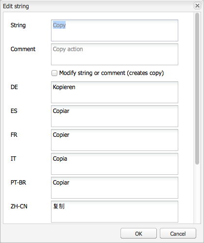

# Uso del traductor para administrar diccionarios{#using-translator-to-manage-dictionaries}

AEM proporciona una consola para administrar las distintas traducciones de textos utilizados en la interfaz de usuario de los componentes. Esta consola está disponible en

`https://<hostname>:<port-number>/libs/cq/i18n/translator.html`

Utilice la herramienta de traducción para administrar las cadenas en inglés y sus traducciones. Los diccionarios se crean en el repositorio, por ejemplo /apps/myproject/i18n.

Tenga en cuenta que la herramienta Traductor y los diccionarios que administra sirven para presentar la interfaz de usuario de los componentes en diferentes idiomas. Si desea traducir contenido generado por el usuario o la página, consulte [Traducción de contenido para sitios multilingües](/help/sites-administering/translation.md) y [Traducción del contenido generado por el usuario](/help/communities/translate-ugc.md).

>[!CAUTION]
>
>Editar solo los diccionarios creados para su proyecto y que residen en `/apps`.
>
>AEM diccionarios del sistema también están disponibles en esta herramienta. No cambie los diccionarios AEM del sistema, ya que esto puede causar problemas con la interfaz de usuario de AEM. Además, los cambios se pueden perder al actualizar. AEM diccionarios del sistema se encuentran en `/libs`.

>[!NOTE]
>
>Aunque la herramienta Traductor tiene una interfaz de usuario clásica, se utiliza para la traducción de frases independientemente de la interfaz en la que se encuentren.

El traductor enumera los textos utilizados en AEM con las diferentes traducciones del idioma entre ellos:


Puede buscar, filtrar y editar el texto en inglés y los textos traducidos. También puede exportar diccionarios al formato XLIFF para traducirlos y luego importarlos de nuevo en los diccionarios.

También es posible añadir los diccionarios i18n a un proyecto de traducción desde esta consola. Puede crear una nueva o agregarla a un proyecto existente.

1. Haga clic en **Traducir diccionario**.

   

1. Seleccione la opción Crear o Agregar según sus necesidades. Se abre un cuadro de diálogo.

   

1. Rellene los campos como sea necesario y haga clic en Aceptar. 

1. Ahora puede hacer clic en **OK** o consulte el diccionario de Target.

   >[!NOTE]
   >
   >Para obtener más información sobre los proyectos de traducción, consulte [Administración de proyectos de traducción](/help/sites-administering/tc-manage.md).

## Creación de un diccionario {#creating-a-dictionary}

Cree un diccionario para administrar las cadenas de IU localizadas. Después de crear un diccionario, puede utilizar la herramienta Traducción para administrarlo.

1. Con el CRXDE Lite , agregue el nodo raíz ( `sling:Folder`) para el nuevo diccionario como la estructura para contener las definiciones de idioma:

   ` /apps/<projectName>/i18n`

   Por ejemplo, `/apps/myProject/i18n`. 

1. Añada la estructura de idioma requerida debajo de esta raíz. Por ejemplo:

   ```shell
   /apps/myProject/i18n [sling:Folder]
       - de.json [nt:file] [mix:language]
           + jcr:language = de
       - fr.json [nt:file] [mix:language]
           + jcr:language = fr
   ```

   >[!NOTE]
   >
   >Esta es la estructura de [Módulo Sling i18n](https://sling.apache.org/site/internationalization-support.html).

1. Vuelva a cargar el traductor y la ruta del diccionario (p. ej. `/apps/myProject/i18n`) estará disponible en el selector desplegable de la barra de herramientas. Seleccione esta opción para empezar a añadir cadenas y sus traducciones.

   >[!NOTE]
   >
   >El traductor solo guardará las traducciones para los idiomas que realmente están presentes debajo de la ruta (p. ej. `/apps/myProject/i18n`).
   >
   >Asegúrese de que se corresponden con los idiomas mostrados en la cuadrícula.

## Administración de cadenas de diccionario {#managing-dictionary-strings}

Utilice la herramienta Traducción para administrar las cadenas en los diccionarios. Puede agregar, modificar y eliminar cadenas en inglés, así como proporcionar cadenas traducidas.

>[!CAUTION]
>
>Editar solo los diccionarios creados para su proyecto y que residen en `/apps`.
>
>No cambie los diccionarios AEM del sistema, ya que esto puede causar problemas con la interfaz de usuario de AEM. Además, los cambios se pueden perder al actualizar. AEM diccionarios del sistema se encuentran en `/libs`.

### Adición, cambio y eliminación de cadenas {#adding-changing-and-removing-strings}

Añada cadenas en inglés a un diccionario que su componente haya internacionalizado. Solo agregue cadenas que estén internacionalizadas para que no malgaste recursos traduciendo cadenas que no se utilicen.

Las cadenas que agregue a un diccionario deben coincidir exactamente con la cadena especificada en el código. Si la cadena predeterminada en inglés que se utiliza en el código no coincide con la cadena en inglés de un diccionario, la cadena traducida no aparece en la interfaz de usuario cuando es necesario. Las cadenas distinguen entre mayúsculas y minúsculas.

**Proporcionar sugerencias de traducción**

Utilice la propiedad Commenet de la cadena de diccionario para proporcionar información al traductor para aclarar el significado de la cadena. Normalmente, la interfaz de usuario ayuda a los usuarios a determinar el significado de las palabras ambiguas. Sin embargo, el traductor no ve la cadena dentro del contexto de la interfaz de usuario. La sugerencia de traducción elimina la ambigüedad. Por ejemplo, un comentario ayuda al traductor a comprender que la palabra en inglés Solicitud se utiliza como sustantivo en lugar de como verbo.

Las sugerencias de traducción también distinguen cadenas que son idénticas y tienen distintos significados. Por ejemplo, la palabra Buscar puede ser un sustantivo o un verbo, y requiere dos entradas &quot;Buscar&quot; en el diccionario con dos sugerencias de traducción diferentes. El código que solicita la cadena también incluye la sugerencia de traducción para que se utilice la cadena correcta en la interfaz de usuario.

**Inclusión de variables indexadas**

Incluya variables en la cadena localizada para crear un significado contextual en una oración. Por ejemplo, después de iniciar sesión en una aplicación web, la página principal muestra el mensaje &quot;Bienvenido de nuevo administrador&quot;. Tienes 2 mensajes en la bandeja de entrada&quot;. El contexto de página determina el nombre de usuario y el número de mensajes.

Para incluir variables en la cadena localizada, coloque índices entre corchetes en la ubicación de las variables en el primer argumento del método get . Utilice la sugerencia de localización para describir los valores. El traductor debe comprender el significado de las variables porque los distintos idiomas utilizan diferentes estructuras de frases.

Tenga en cuenta que [el código que solicita la cadena traducida](/help/sites-developing/i18n-dev.md#including-variables-in-localized-sentences) proporciona valores para las variables indexadas según el contexto.

Por ejemplo, la siguiente cadena aparece cuando un usuario inicia sesión en un sitio web y está incluido en el diccionario:

`Welcome back {0}. You have {1} messages.`

El comentario siguiente describe las variables:

`{0} = the user name, {1} = the number of items in the user's inbox`

**Modificación de cadenas**

Cambie o elimine cadenas en inglés a medida que se cambien o eliminen en el código. Al cambiar una cadena, la cadena original se mantiene y se crea una cadena nueva que refleja el cambio. Antes de eliminar una cadena, asegúrese de que ningún código la utilice.

Utilice el siguiente procedimiento para añadir una cadena.

1. En el menú desplegable Diccionarios , seleccione el diccionario al que va a agregar una cadena. En el menú desplegable, los diccionarios se representan por su ruta en el repositorio.
1. Sobre la tabla Cadenas y traducciones, haga clic en Agregar.

   

1. En el cuadro Cadena del cuadro de diálogo Agregar cadena, escriba la cadena en inglés. En el cuadro Comentario, escriba una sugerencia de traducción para el traductor si es necesario.
1. Haga clic en Aceptar.
1. Haga clic en Guardar.

   

Utilice el siguiente procedimiento para cambiar una cadena en un diccionario.

1. En el menú desplegable Diccionarios , seleccione el diccionario que contiene la cadena que se va a cambiar.
1. Haga doble clic en la cadena que desea cambiar.
1. En el cuadro de diálogo Editar cadena, seleccione Modificar cadena o comentario (crea una copia).

   

1. Modifique la cadena o el comentario y haga clic en Aceptar.
1. Haga clic en Guardar.

   

Utilice el siguiente procedimiento para eliminar una cadena de un diccionario.

1. En el menú desplegable Diccionarios , seleccione el diccionario del que está quitando una cadena.
1. Haga clic en Quitar.

   

1. Haga clic en Guardar.

   

### Búsqueda de cadenas {#searching-for-strings}

La barra de búsqueda situada en la parte inferior de la herramienta Traductor proporciona opciones de selección de cadenas:

* **Filtrar por texto:** Patrón que coincide con la cadena, comentario o traducción en inglés. En la tabla solo aparecen los elementos que coinciden con todo o parte del patrón.
* **Cambios: Cualquiera, Modificado, Nuevo, Eliminado:** Mostrar los elementos que se han cambiado y no se han guardado.

   * Cualquiera: Mostrar los elementos que se han modificado, agregado o eliminado.
   * Modificado: Mostrar los elementos modificados.
   * Nuevo: Mostrar los elementos que se agregan.
   * Eliminado: Mostrar los elementos que se van a quitar.
   * Múltiples selecciones: Mostrar elementos que tengan todas las propiedades seleccionadas.

* **Tiene comentario**: Mostrar elementos que tengan comentarios para traductores.
* **Traducciones que faltan:** Mostrar elementos en los que al menos un idioma no tenga una traducción.


1. En la barra de búsqueda, seleccione las opciones de filtrado.
1. Para filtrar con las opciones, haga clic en Filtrar.
1. Para eliminar los filtros y ver todos los elementos en el diccionario, haga clic en Borrar.

### Edición de cadenas traducidas {#editing-translated-strings}

Después de agregar la cadena en inglés a un diccionario, puede agregar traducciones de la cadena. También puede [exportar el diccionario](/help/sites-developing/i18n-translator.md#exporting-a-dictionary) que lo traduzca un tercero.

1. Select [el diccionario específico del proyecto](#creating-a-dictionary) ya que especifica la ruta en el repositorio que contiene las traducciones. Por ejemplo, seleccione **Diccionarios** como:

   `/apps/myProject/i18n`

   >[!CAUTION]
   >
   >Editar solo los diccionarios creados para su proyecto y que residen en `/apps`.
   >
   >AEM diccionarios del sistema también están disponibles en esta herramienta. No cambie los diccionarios AEM del sistema, ya que esto puede causar problemas con la interfaz de usuario de AEM. Además, los cambios se pueden perder al actualizar. AEM diccionarios del sistema se encuentran en `/libs`.

1. Para editar los textos traducidos de una de las cadenas, puede:

   * Haga doble clic en el idioma correspondiente para la cadena necesaria para editar ese texto único:

   

   * Haga doble clic en el botón **Cadena** o **Comentario** campos de la cadena necesaria para abrir el **Editar cadena** , edite las traducciones según sea necesario y, a continuación, haga clic en **OK** para cerrar el cuadro de diálogo:

   

1. Haga clic en **Guardar** en la barra de herramientas para confirmar los cambios.

   >[!NOTE]
   >
   >Haga clic en **Restablecer y actualizar** (en lugar de **Guardar**) revierte cualquier cambio realizado en los textos anteriores.

## Uso de traductores de terceros {#using-third-party-translators}

Para admitir el uso de servicios de traducción de terceros, la herramienta Translation permite exportar e importar diccionarios.

### Exportación de un diccionario {#exporting-a-dictionary}

Exporte un diccionario a un archivo XLIFF para que un servicio de terceros pueda traducir las cadenas de diccionario.

* Exporte un diccionario e incluya el inglés y los términos traducidos para un idioma.
* Exporte algunas o todas las cadenas en inglés.

Al exportar un archivo XLIFF e incluir un idioma, la estructura de nodos del diccionario en el repositorio debe incluir ese idioma. Si el idioma no está incluido, se producen errores. Por ejemplo, para exportar el archivo XLIFF en francés, la carpeta de diccionario debe incluir la variable `mix:language` nodo secundario llamado `fr`. (Consulte [Creación de un diccionario](/help/sites-developing/i18n-translator.md#creating-a-dictionary).)

Utilice el siguiente procedimiento para exportar un archivo XLIFF para un idioma específico.

1. Abrir la herramienta Traducción `http://<host>:<port>/libs/cq/i18n/translator.html`
1. Utilice el menú desplegable Diccionarios para seleccionar el diccionario que desea exportar.
1. Haga clic en Exportar > Exportar completo *XX* Opciones Xliff, donde *XX* es el código de idioma de dos letras como DE o FR.

   El archivo XLIFF se abre en una nueva pestaña o ventana.

1. Utilice los comandos del explorador Web para guardar la página como un archivo en el sistema de archivos, como Archivo > Guardar página como.

Utilice el siguiente procedimiento para exportar todas o algunas de las cadenas en inglés.

1. Abra la herramienta Traducción . `http://<host>:<port>/libs/cq/i18n/translator.html`
1. Utilice el menú desplegable Diccionarios para seleccionar el diccionario que desea exportar.
1. Si va a exportar un subconjunto de las cadenas, seleccione los elementos del diccionario que desea exportar. Si no se selecciona ningún elemento, se exportan todos los elementos.
1. Haga Clic En Exportar > Exportar Selección Como Xliff (Solo Cadenas).
1. En el cuadro de diálogo que aparece, copie el texto y péguelo en un archivo de texto.

### Importación de un diccionario {#importing-a-dictionary}

Importe un archivo XLIFF en un diccionario para rellenar el diccionario. Cuando el diccionario incluye una traducción para una cadena en inglés y el archivo XLIFF contiene una traducción diferente para la misma cadena, se reemplaza la traducción del diccionario.

1. Abrir la herramienta Traducción `http://<host>:<port>/libs/cq/i18n/translator.html`
1. Haga clic en Importar > Traducciones XLIFF.
1. Seleccione el archivo que desea importar y haga clic en Aceptar.

## Administración de idiomas admitidos {#managing-supported-lanuages}

Agregue o elimine los idiomas compatibles con la herramienta de traducción y que se proporcionan a los usuarios de las páginas web.

### Cambio de los idiomas enumerados en la tabla de diccionario {#changing-languages-listed-in-the-dictionary-table}

La herramienta Traductor incluye los siguientes idiomas en la tabla de diccionario:

* de - Alemán
* fr - Francés
* it - italiano
* es - español
* ja - Japonés
* pt-br - Portugués de Brasil
* zh-cn: chino simplificado
* zh-tw - Chino tradicional (compatibilidad limitada)
* ko-kr - Coreano

Utilice el siguiente procedimiento para añadir o eliminar idiomas.

1. Con el CRXDE Lite, cree un nuevo nodo:

   `/etc/languages`

1. En este nodo, cree una propiedad:

   * **Nombre**: `languages`
   * **Tipo**: `Multi-String`
   * **Valor**: la lista de idiomas que desea mostrar. Por ejemplo:

      * fr
      * es

   >[!NOTE]
   >
   >Los códigos de idioma deben estar en minúsculas.

1. Haga clic en **Guardar todo** en CRXDE Lite y vuelva a cargar el traductor. La cuadrícula se actualizará para mostrar los idiomas definidos.

   >[!NOTE]
   >
   >El traductor solo guardará las traducciones para los idiomas que en realidad son [presente en el diccionario](#creating-a-dictionary) (es decir, debajo de la ruta del diccionario, como `/apps/myProject/i18n`).
   >
   >Asegúrese de que se corresponden con los idiomas mostrados en la cuadrícula.

### Poner los idiomas a disposición de los autores {#making-languages-available-to-authors}

Después de definir un diccionario para un idioma nuevo de la instancia de AEM, debe hacer que esté disponible para que los autores lo seleccionen (por ejemplo, para utilizarlo en **Preferencias**):

1. Para cambiar la lista de idiomas disponibles en **Preferencias** del **Seguridad** consola:

   1. Cree una superposición en el código de la aplicación para:

      ```
              /libs/cq/security/widgets/source/widgets/security/Preferences.js
       and update as required.
      ```

1. Para que el idioma esté disponible en **Preferencias** de la variable **Sitios web** consola necesita realizar los siguientes cambios en la aplicación:

   1. Cree una superposición para la estructura en:

      `/libs/cq/security/content/tools/userProperties`

   1. Dentro de la superposición, actualice la lista de idiomas en:

      `items/common/items /lang/options`

1. Guarde todo y vuelva a cargar la consola adecuada.

### Cambio de los nombres de idioma y los países predeterminados {#changing-language-names-and-default-countries}

Varios países usan el mismo idioma, por ejemplo, Estados Unidos, el Reino Unido y Australia, todos usan inglés. Esto se indica con un código que indica tanto el idioma como el país, como `en_US`, `en_GB` y `en_AU`.

Los países predeterminados se utilizan al mostrar los indicadores (por ejemplo, en el cuadro de diálogo de copia de idioma), se utilizan para resolver el país para un código de idioma.

>[!NOTE]
>
>Para las localizaciones tal y como las ha gestionado el traductor de arriba, solo funciona el idioma exacto. Si utiliza la lista desplegable de preferencias de idioma `en_uk`, debe haber un `en_uk` en el repositorio.

Para cambiar las definiciones predeterminadas:

1. Una lista de idiomas se almacena en:

   `/libs/wcm/core/resources/languages`

   Superponga esto copiándolo en:

   `/apps/wcm/core/resources/languages`

   A continuación, cambiar o ampliar la lista allí. La propiedad `defaultCountry` en un nodo de idioma (p. ej. `ja`) debe contener el código completo, como `ja_jp`, que definiría `jp` como país predeterminado para el idioma `ja`.

1. Actualice el **CQ WCM Language Manager**.

   * **Lista de idiomas**:

      Ruta a la lista de idiomas del repositorio. Configúrelo en la ubicación utilizada para la superposición:

      ```
             /apps/wcm/core/resources/languages
      ```
   Puede hacerlo mediante la consola web OSGi:

   ```shell
   https://<hostname>:<port-number>/system/console/configMgr/com.day.cq.wcm.core.impl.LanguageManagerImpl
   ```

## Publicar diccionarios {#publishing-dictionaries}

Incorpore los diccionarios en el proceso de administración de versiones de sus aplicaciones AEM. Por ejemplo, incluya el diccionario en el paquete de contenido de la aplicación para su implementación en la instancia de publicación. Esta estrategia ofrece las siguientes ventajas:

* Los diccionarios están disponibles para los componentes de su entorno de publicación.
* Los cambios en las cadenas de la interfaz de usuario de los componentes se implementan junto con las traducciones actualizadas.

Del mismo modo, las pruebas de cadenas de diccionario deben realizarse como parte de su ciclo de vida normal de desarrollo de software.

>[!NOTE]
>
>La funcionalidad de publicación regular, o la replicación, no debe utilizarse para diccionarios. En su lugar, los diccionarios deben tratarse del mismo modo que el código y la configuración. Esto incluye el uso del control de código fuente para realizar el seguimiento de los cambios y el uso de paquetes de contenido para aplicar cambios a la creación y publicación.

>[!NOTE]
>
>Al utilizar Dispatcher, debe [invalidar páginas en caché](https://helpx.adobe.com/experience-manager/dispatcher/using/page-invalidate.html) para incluir nuevas cadenas dicacionarias en cadenas de componentes procesados.
