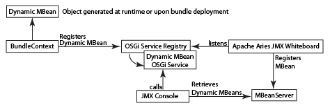
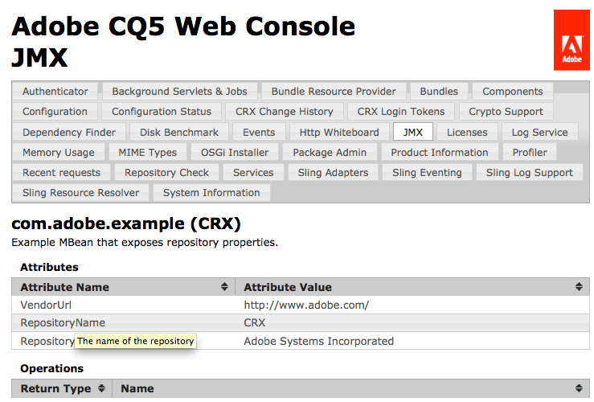

# Integración de servicios con la consola de JMX{#integrating-services-with-the-jmx-console}

Cree e implemente MBeans para administrar servicios mediante la consola de JMX. Exponga los atributos y las operaciones del servicio para permitir que se realicen tareas de administración.

Para obtener información sobre el uso de la consola JMX, consulte [Monitoreo de recursos del servidor con la consola JMX](/help/sites-administering/jmx-console.md).

## El marco JMX en Felix y CQ5 {#the-jmx-framework-in-felix-and-cq}

En la plataforma Apache Felix, se implementan MBeans como servicios OSGi. Cuando se registra un servicio MBean en el Registro de servicios OSGi, el módulo de pizarra JMX de Aries registra automáticamente el MBean con el servidor MBean. A continuación, el MBean está disponible para la consola JMX, que expone los atributos públicos y las operaciones.



## Creación de MBeans para CQ5 y CRX {#creating-mbeans-for-cq-and-crx}

Los MBeans que se crean para la administración de recursos CQ5 o CRX se basan en la interfaz javax.management.DynamicMBean. Para crearlos, siga los patrones de diseño habituales establecidos en la especificación JMX:

* Cree la interfaz de administración, incluidos get, set y sus métodos para definir atributos y otros métodos para definir operaciones.
* Cree la clase de implementación. La clase debe implementar DynamicMBean o extender una clase de implementación de DynamicMBean.
* Siga la convención de nombres estándar para que el nombre de la clase de implementación sea el nombre de la interfaz con el sufijo MBean.

Además de definir la interfaz de administración, la interfaz también define la interfaz de servicio OSGi. La clase de implementación implementa el servicio OSGi.

### Uso de anotaciones para proporcionar información de MBean {#using-annotations-to-provide-mbean-information}

El paquete [com.adobe.granite.jmx.anottation](https://helpx.adobe.com/experience-manager/6-5/sites/developing/using/reference-materials/javadoc/com/adobe/granite/jmx/annotation/package-summary.html) proporciona varias anotaciones y clases para proporcionar fácilmente metadatos MBean a la consola JMX. Utilice estas anotaciones y clases en lugar de agregar información directamente al objeto MBeanInfo de MBean.

**Anotaciones**

Añada anotaciones en la interfaz de administración para especificar metadatos MBean. La información aparece en la consola JMX para cada clase de implementación implementada. Están disponibles las anotaciones siguientes (para obtener información completa, consulte [com.adobe.granite.jmx.anottation JavaDocs](https://helpx.adobe.com/experience-manager/6-5/sites/developing/using/reference-materials/javadoc/com/adobe/granite/jmx/annotation/package-summary.html)):

* **Descripción:** Proporciona una descripción de la clase o método MBean. Cuando se utiliza en la declaración de clase, la descripción aparece en la página de la consola JMX para MBean. Cuando se utiliza en un método, la descripción aparece como texto al pasar el ratón por encima para el atributo o la operación correspondiente.
* **Impacto:** El impacto de un método. Los valores de parámetro válidos son los campos definidos por [javax.management.MBeanOperationInfo](https://docs.oracle.com/javase/1.5.0/docs/api/javax/management/MBeanOperationInfo.html).

* **Nombre:** especifica el nombre que se mostrará para un parámetro de operación. Utilice esta anotación para anular el nombre real del parámetro de método que se utiliza en la interfaz.
* **OpenTypeInfo:** especifica la clase que se utilizará para representar datos compuestos o datos tabulares en la consola JMX. Para usar con MBeans abiertos
* **TabularTypeInfo:** se utiliza para anotar la clase que se utiliza para representar datos tabulares.

**Clases**

Se proporcionan clases para crear MBeans dinámicos que consumen las anotaciones que se agregan a sus interfaces:

* **AnnotatedStandardMBean:** una subclase de la clase javax.management.StandardMBean que proporciona automáticamente a la consola JMX los metadatos de anotación.
* **OpenAnnotatedStandardMBean:** una subclase de la clase AnnotatedStandardMBean para crear Mbeans abiertos que consumen la anotación OpenTypeInfo.

### Desarrollo de MBeans {#developing-mbeans}

Normalmente, el MBean es una reflexión sobre el servicio OSGi que desea administrar. En la plataforma Felix, se crea el MBean como se haría para la implementación en otras plataformas de servidor Java. Una diferencia principal es que puede utilizar anotaciones para especificar información de MBean:

* Interfaz de administración: Define atributos mediante captador, establecedor y es un método. Define las operaciones con cualquier otro método público. Utiliza anotaciones para proporcionar metadatos para el objeto BeanInfo.
* Clase MBean: Implementa la interfaz de administración. Extiende la clase AnnotatedStandardMBean para que procese las anotaciones en la interfaz.

El siguiente ejemplo de MBean proporciona información sobre el repositorio de CRX. La interfaz utiliza la anotación Descripción para proporcionar información a la consola JMX.

#### Interfaz de administración {#management-interface}

```java
package com.adobe.example.myapp;

import com.adobe.granite.jmx.annotation.Description;

@Description("Example MBean that exposes repository properties.")
public interface ExampleMBean {

    @Description("The name of the repository.")
    String getRepositoryName();

    @Description("The vendor of the repository.")
    String   getRepositoryVendor();

    @Description("The URL of repository vendor.")
    String getVendorUrl();
}
```

La clase de implementación utiliza el servicio SlingRepository para recuperar información sobre el repositorio de CRX.

#### Clase de implementación de MBean {#mbean-implementation-class}

```java
package com.adobe.example.myapp;

import org.apache.felix.scr.annotations.*;
import org.apache.sling.jcr.api.SlingRepository;

import com.adobe.granite.jmx.annotation.AnnotatedStandardMBean;

import javax.management.*;

public class ExampleMBeanImpl extends AnnotatedStandardMBean implements ExampleMBean {

    @Reference(cardinality = ReferenceCardinality.OPTIONAL_UNARY)
    private SlingRepository repository;

    public ExampleMBeanImpl() throws NotCompliantMBeanException {
        super(ExampleMBean.class);
    }

    public String getRepositoryName() {
        return repository.getDescriptor("jcr.repository.name");
    }

    public String getRepositoryVendor() {
        return repository.getDescriptor("jcr.repository.vendor");
    }

    public String getVendorUrl() {
        return repository.getDescriptor("jcr.repository.vendor.url");
    }
}
```

El siguiente gráfico muestra la página de este MBean en la consola JMX.



### Registrando MBeans {#registering-mbeans}

Cuando se registran los MBeans como un servicio OSGi, se registran automáticamente en el servidor MBean. Para instalar un MBean en CQ5, inclúyalo en un paquete y exporte el servicio MBean como lo haría con cualquier otro servicio OSGi.

Además de los metadatos relacionados con OSGi, también debe proporcionar los metadatos que necesita el módulo de pizarra JMX de Aries para registrar el MBean con el servidor MBean:

* **Nombre de la interfaz DynamicMBean:** Declare que el servicio MBean implementa la interfaz  `javax.management.DynamicMBea`n. Esta declaración notifica al módulo Pizarra JMX de Aries que el servicio es un servicio MBean.

* **El dominio MBean y las propiedades clave:** En Felix, usted proporciona esta información como propiedad del servicio OSGi de MBean. Es la misma información que proporciona normalmente al servidor MBean en un objeto `javax.management.ObjectName`.

Cuando su MBean es un reflejo de un servicio singular, sólo se requiere una instancia del servicio MBean. En este caso, si utiliza el complemento Felix SCR Maven, puede utilizar las anotaciones Apache Felix Service Component Runtime (SCR) en la clase de implementación MBean para especificar los metadatos relacionados con JMX. Para crear instancias de varias instancias de MBean, puede crear otra clase que realice el registro del servicio OSGi de MBean. En este caso, los metadatos relacionados con JMX se generan durante la ejecución.

**MBean simple**

Los MBeans para los que puede definir todos los atributos y las operaciones en tiempo de diseño se pueden implementar mediante anotaciones SCR en la clase de implementación MBean. En el siguiente ejemplo, el atributo `value` de la anotación `Service` declara que el servicio implementa la interfaz `DynamicMBean`. El atributo `name` de la anotación `Property` especifica el dominio JMX y las propiedades clave.

#### Clase de implementación de MBean con anotaciones de SCR {#mbean-implementation-class-with-scr-annotations}

```java
package com.adobe.example.myapp;

import org.apache.felix.scr.annotations.*;
import org.apache.sling.jcr.api.SlingRepository;

import com.adobe.granite.jmx.annotation.AnnotatedStandardMBean;

import javax.management.*;

@Component(immediate = true)
@Property(name = "jmx.objectname", value="com.adobe.example:type=CRX")
@Service(value = DynamicMBean.class)
public class ExampleMBeanImpl extends AnnotatedStandardMBean implements ExampleMBean {

    @Reference(cardinality = ReferenceCardinality.OPTIONAL_UNARY)
    private SlingRepository repository;

    public ExampleMBeanImpl() throws NotCompliantMBeanException {
        super(ExampleMBean.class);
    }

    public String getRepositoryName() {
        return repository.getDescriptor("jcr.repository.name");
    }

    public String getRepositoryVendor() {
        return repository.getDescriptor("jcr.repository.vendor");
    }

    public String getVendorUrl() {
        return repository.getDescriptor("jcr.repository.vendor.url");
    }
}
```

**Varias instancias de servicio MBean**

Para administrar varias instancias de un servicio administrado, cree varias instancias del servicio MBean correspondiente. Además, las instancias de servicio de MBean deben crearse o eliminarse cuando se inician o se detienen instancias administradas. Puede crear una clase de administrador MBean para crear instancias de servicios MBean en tiempo de ejecución y administrar el ciclo vital del servicio.

Utilice BundleContext para registrar el MBean como un servicio OSGi. Incluya la información relacionada con JMX en el objeto Dictionary que utilice como argumento del método BundleContext.registerService.

En el siguiente ejemplo de código, el servicio ExampleMBean está registrado mediante programación. El objeto componentContext es ComponentContext, que proporciona acceso a BundleContext.

#### Fragmento de código: Registro programático del servicio MBean {#code-snippet-programmatic-mbean-service-registration}

```java
Dictionary mbeanProps = new Hashtable();
mbeanProps.put("jmx.objectname", "com.adobe.example:type=CRX");
ExampleMBeanImpl mbean = new ExampleMBeanImpl();
ServiceRegistration serviceregistration =
            componentContext.getBundleContext().registerService(DynamicMBean.class.getName(), mbean, mbeanProps);
```

El ejemplo de MBean en la siguiente sección proporciona más detalles.

Un administrador de servicios MBean resulta útil cuando las configuraciones de servicio se almacenan en el repositorio. El administrador puede recuperar la información del servicio y usarla para configurar y crear el MBean correspondiente. La clase manager también puede detectar eventos de cambio de repositorio y actualizar los servicios MBean en consecuencia.

## Ejemplo: Monitoreo de modelos de flujo de trabajo mediante JMX {#example-monitoring-workflow-models-using-jmx}

El MBean de este ejemplo proporciona información sobre los modelos de flujo de trabajo de CQ5 almacenados en el repositorio. Una clase de administrador MBean crea MBeans basados en modelos de flujo de trabajo almacenados en el repositorio y registra su servicio OSGi durante la ejecución. Este ejemplo consta de un solo paquete que contiene los siguientes miembros:

* WorkflowMBean: La interfaz de administración.
* WorkflowMBeanImpl: La clase de implementación MBean.
* WorkflowMBeanManager: Interfaz de la clase de administrador MBean.
* WorkflowMBeanManagerImpl: La clase de implementación del administrador de MBean.

**Nota:** Para simplificar, el código de este ejemplo no realiza el registro ni reacciona a las excepciones generadas.

WorkflowMBeanManagerImpl incluye un método de activación de componentes. Cuando se activa el componente, el método realiza las siguientes tareas:

* Obtiene un objeto BundleContext para el paquete.
* Consulta el repositorio para obtener las rutas de los modelos de flujo de trabajo existentes.
* Crea MBeans para cada modelo de flujo de trabajo.
* Registra los MBeans con el registro de servicio OSGi.

Los metadatos MBean aparecen en la consola de JMX con el dominio com.adobe.example, el tipo workflow_model y Properties es la ruta del nodo de configuración del modelo de workflow.


### Ejemplo de MBean {#the-example-mbean}

Este ejemplo requiere una interfaz y una implementación MBean que reflejen la interfaz `com.day.cq.workflow.model.WorkflowModel`. El MBean es muy sencillo para que el ejemplo pueda centrarse en los aspectos de configuración e implementación del diseño. El MBean expone un solo atributo, el nombre del modelo.

#### Interfaz de WorkflowMBean {#workflowmbean-interface}

```java
package com.adobe.example.myapp.api;

import com.adobe.granite.jmx.annotation.Description;

@Description("Example MBean that exposes Workflow model properties.")
public interface WorkflowMBean {

 @Description("The name of the Workflow model.")
 String getModelName();
}
```

#### WorkflowMBeanImpl {#workflowmbeanimpl}

```java
package com.adobe.example.myapp.impl;

import javax.management.NotCompliantMBeanException;

import com.day.cq.workflow.model.WorkflowModel;
import com.adobe.example.myapp.api.WorkflowMBean;
import com.adobe.granite.jmx.annotation.AnnotatedStandardMBean;

public class WorkflowMBeanImpl extends AnnotatedStandardMBean implements WorkflowMBean {

 WorkflowModel model;

 protected WorkflowMBeanImpl(WorkflowModel inmodel)
   throws NotCompliantMBeanException {
  super(WorkflowMBean.class);
  model=inmodel;
 }

 public String getModelName() {
  return model.getTitle();
 }
}
```

### El Administrador de MBean de ejemplo {#the-example-mbean-manager}

El servicio WorkflowMBeanManager incluye el método de activación de componentes que crea servicios WorkflowMBean. La implementación del servicio incluye los siguientes métodos:

* activar: El activador de componentes. Crea la sesión JCR para leer los nodos de configuración WorkflowModel. El nodo raíz donde se almacenan las configuraciones de modelo se define en un campo estático. El nombre del nodo de configuración también se define en un campo estático. Este método llama a otros métodos que obtienen las rutas del modelo de nodo y crean el modelo WorkflowMBeans.
* getModelIds: Recorre el repositorio debajo del nodo raíz y recupera la ruta de cada nodo de modelo.
* makeMBean: Utiliza la ruta de acceso del modelo para crear un objeto WorkflowModel, crea un WorkflowMBean para él y registra su servicio OSGi.

>[!NOTE]
>
>La implementación WorkflowMBeanManager solo crea servicios MBean para configuraciones de modelo que existen cuando se activa el componente. Una implementación más sólida escucha los eventos del repositorio en cuanto a las nuevas configuraciones de modelo y los cambios o eliminaciones de la configuración de modelo existente. Cuando se produce un cambio, el administrador puede crear, modificar o eliminar el servicio WorkflowMBean correspondiente.


#### Interfaz WorkflowMBeanManager {#workflowmbeanmanager-interface}

```java
package com.adobe.example.myapp.api;

public interface WorkflowMBeanManager {

}
```

#### WorkflowMBeanManagerImpl {#workflowmbeanmanagerimpl}

```java
package com.adobe.example.myapp.impl;

import java.util.*;

import org.apache.felix.scr.annotations.*;

import javax.jcr.Session;
import javax.jcr.Node;
import javax.jcr.NodeIterator;
import javax.jcr.RepositoryException;
import javax.management.ObjectName;

import org.apache.sling.jcr.api.SlingRepository;
import org.osgi.framework.ServiceRegistration;
import org.osgi.service.component.ComponentContext;

import org.slf4j.Logger;
import org.slf4j.LoggerFactory;

import com.day.cq.workflow.WorkflowService;
import com.day.cq.workflow.WorkflowSession;
import com.adobe.example.myapp.api.WorkflowMBean;
import com.adobe.example.myapp.api.WorkflowMBeanManager;

/**Instantiates and registers WorkflowMBean services */
@Component(immediate=true)
@Service(value=WorkflowMBeanManager.class)
public class WorkflowMBeanManagerImpl implements WorkflowMBeanManager {
 //The ComponentContext provides access to the BundleContext
 private ComponentContext componentContext;

 //Use the SlingRepository service to read model nodes
 @Reference
        private SlingRepository repository = null;

 //Use the WorkflowService service to create WorkflowModel objects
 @Reference
 private WorkflowService workflowservice = null;

  private Session session;

         //Details about model nodes
  private static final String MODEL_ROOT ="/etc/workflow/models";
  private static final String MODEL_NODE = "model";

  private Set<String> modelIds = new HashSet<String>();

        //Storage for ServiceRegistrations for MBean services
  private Collection<ServiceRegistration> mbeanRegistrations= new Vector<ServiceRegistration>(0,1);

 @Activate
        protected void activate(ComponentContext ctx) {
             //Traverse the repository and load the model nodes
             try {
                   session = repository.loginAdministrative(null);
                   // load and store model node paths
                   if (session.nodeExists(MODEL_ROOT)) {
                          getModelIds(session.getNode(MODEL_ROOT));
                   }
                   //Create MBeans for each model
                   for(String modid: modelIds){
                    makeMBean(modid);
                    }
             }catch(Exception e){ }
          }

        /**
         * Add JMX domain and key properties to a collection
         * Instantiate a WorkflowModel and its WorkflowMBeanImpl object
         * Register the MBean OSGi service
         */
 private void makeMBean(String modelId) {
             // create MBean for the model
             try {
                 Dictionary<String, String> mbeanProps = new Hashtable<String, String>();
                 //These properties appear on the JMX Console home page
                 mbeanProps.put("jmx.objectname", "com.adobe.example:type=workflow_model,id=" + ObjectName.quote(modelId));
                 WorkflowSession wfsession = workflowservice.getWorkflowSession(session);
                 WorkflowMBeanImpl mbean = new WorkflowMBeanImpl(wfsession.getModel(modelId));

                ServiceRegistration serviceregistration = componentContext.getBundleContext().registerService(WorkflowMBean.class.getName(), mbean, mbeanProps);
                //Store the ServiceRegistration objects for deactivation
                mbeanRegistrations.add(serviceregistration);
             } catch (Throwable t) {}
         }

        /**
         * Traverses the repository branch below a given Node. Stores the path of each model node.
         */
 private void getModelIds(Node node) throws RepositoryException {
  try{
                     NodeIterator iter = node.getNodes();
                     while (iter.hasNext()) {
                           Node n = iter.nextNode();
                           //Look for "jcr:content" nodes
                           if (n.getName().equals("jcr:content")) {
                                //get the path of the model node and save it
                                if(n.hasNode(MODEL_NODE)){
                                      modelIds.add(n.getNode(MODEL_NODE).getPath());
                                 }
                           } else{
                                   //Scan child nodes
                                   getModelIds(n);
                           }
                       }
  }catch(Exception e){ }
       }

        /**
         * Log out of the JCR session and unregister WorkflowMBean services
         */
        @Deactivate
        protected void deactivate() {
          session.logout();
          session=null;
          for(ServiceRegistration sr:mbeanRegistrations){
         sr.unregister();
          }
        }
}
```

### El archivo POM para el MBean de ejemplo {#the-pom-file-for-the-example-mbean}

Para su comodidad, puede copiar y pegar el siguiente código XML en el archivo pom.xml del proyecto para crear el paquete de componentes. El POM hace referencia a varios complementos y dependencias requeridos.

**Plugins:**

* Complemento del compilador Apache Maven: Compila clases Java a partir del código fuente.
* Complemento Apache Felix Maven Bundle: Crea el paquete y el manifiesto
* Complemento Apache Felix Maven SCR: Crea el archivo descriptor de componente y configura el encabezado de manifiesto service-component.

**Nota:** En el momento de escribir este artículo, el complemento maven scr no es compatible con el complemento m2e para Eclipse. (Consulte [Félix error 3170](https://issues.apache.org/jira/browse/FELIX-3170).) Para utilizar el IDE de Eclipse, instale Maven y utilice la interfaz de la línea de comandos para realizar compilaciones.

#### Ejemplo de archivo POM {#example-pom-file}

```xml
<project xmlns="https://maven.apache.org/POM/4.0.0"
  xmlns:xsi="https://www.w3.org/2001/XMLSchema-instance"
  xsi:schemaLocation="https://maven.apache.org/POM/4.0.0 https://maven.apache.org/xsd/maven-4.0.0.xsd">
  <modelVersion>4.0.0</modelVersion>
  <groupId>com.adobe.example.myapp</groupId>
  <artifactId>workflow-mbean</artifactId>
  <version>0.0.2-SNAPSHOT</version>
  <name>mbean-simple</name>
  <url>www.adobe.com</url>
  <description>A simple MBean</description>
  <packaging>bundle</packaging>
    <properties>
        <project.build.sourceEncoding>UTF-8</project.build.sourceEncoding>
    </properties>
    <build>
        <plugins>
        <plugin>
            <groupId>org.apache.maven.plugins</groupId>
            <artifactId>maven-compiler-plugin</artifactId>
            <configuration>
                <source>1.5</source>
                <target>1.5</target>
            </configuration>
        </plugin>
            <plugin>
                <groupId>org.apache.felix</groupId>
                <artifactId>maven-scr-plugin</artifactId>
                <version>1.7.2</version>
                <executions>
                    <execution>
                        <id>generate-scr-scrdescriptor</id>
              <goals>
                 <goal>scr</goal>
              </goals>
            </execution>
         </executions>
            </plugin>
             <plugin>
            <groupId>org.apache.felix</groupId>
            <artifactId>maven-bundle-plugin</artifactId>
            <version>1.4.3</version>
            <extensions>true</extensions>
            <configuration>
                <instructions>
                    <Export-Package>com.adobe.example.myapp.*;version=${project.version}</Export-Package>
                </instructions>
            </configuration>
        </plugin>
        </plugins>
    </build>
    <dependencies>
        <dependency>
            <groupId>org.apache.felix</groupId>
            <artifactId>org.apache.felix.scr.annotations</artifactId>
            <version>1.6.0</version>
            <scope>provided</scope>
        </dependency>
         <dependency>
            <groupId>org.apache.sling</groupId>
            <artifactId>org.apache.sling.api</artifactId>
            <version>2.0.8</version>
            <scope>provided</scope>
        </dependency>
         <dependency>
            <groupId>org.apache.felix</groupId>
            <artifactId>org.apache.felix.scr</artifactId>
            <version>1.6.1-R1236132</version>
            <scope>provided</scope>
        </dependency>
        <dependency>
            <groupId>org.apache.sling</groupId>
            <artifactId>org.apache.sling.jcr.api</artifactId>
            <version>2.0.4</version>
        </dependency>
        <dependency>
            <groupId>com.adobe.granite</groupId>
            <artifactId>com.adobe.granite.jmx</artifactId>
            <version>0.1.6</version>
            <scope>provided</scope>
        </dependency>
        <dependency>
       <groupId>com.day.cq.wcm</groupId>
       <artifactId>cq-wcm-mobile-api</artifactId>
       <version>5.5.2</version>
       <scope>provided</scope>
      </dependency>
      <dependency>
       <groupId>com.day.cq.workflow</groupId>
       <artifactId>cq-workflow-api</artifactId>
       <version>5.5.0</version>
       <scope>provided</scope>
      </dependency>
      <dependency>
       <groupId>javax.jcr</groupId>
       <artifactId>jcr</artifactId>
       <version>2.0</version>
       <scope>provided</scope>
      </dependency>
      <dependency>
                <groupId>org.slf4j</groupId>
  <artifactId>slf4j-api</artifactId>
  <version>1.6.4</version>
  <scope>provided</scope>
 </dependency>
    </dependencies>
</project>
```

Añada el siguiente perfil al archivo de configuración principal para utilizar el repositorio público de Adobes.

#### Maven Perfil {#maven-profile}

```xml
<profile>
    <id>adobe-public</id>
    <activation>
         <activeByDefault>false</activeByDefault>
    </activation>
    <properties>
         <releaseRepository-Id>adobe-public-releases</releaseRepository-Id>
         <releaseRepository-Name>Adobe Public Releases</releaseRepository-Name>
         <releaseRepository-URL>https://repo.adobe.com/nexus/content/groups/public</releaseRepository-URL>
    </properties>
    <repositories>
         <repository>
             <id>adobe-public-releases</id>
             <name>Adobe Basel Public Repository</name>
             <url>https://repo.adobe.com/nexus/content/groups/public</url>
             <releases>
                 <enabled>true</enabled>
                 <updatePolicy>never</updatePolicy>
             </releases>
             <snapshots>
                 <enabled>false</enabled>
             </snapshots>
         </repository>
     </repositories>
     <pluginRepositories>
         <pluginRepository>
             <id>adobe-public-releases</id>
             <name>Adobe Basel Public Repository</name>
             <url>https://repo.adobe.com/nexus/content/groups/public</url>
             <releases>
                 <enabled>true</enabled>
                 <updatePolicy>never</updatePolicy>
             </releases>
             <snapshots>
                 <enabled>false</enabled>
             </snapshots>
         </pluginRepository>
     </pluginRepositories>
</profile>
```
