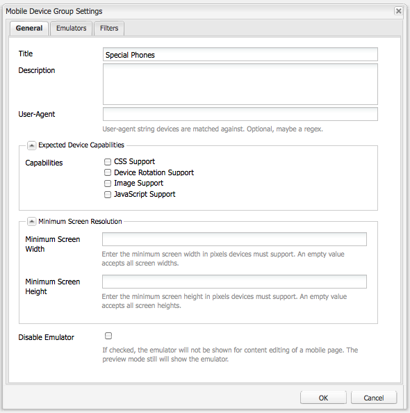

# Creación de sitios para dispositivos móviles{#creating-sites-for-mobile-devices}

>[!NOTE]
>
>Adobe SPA recomienda utilizar el Editor de para proyectos que requieran una representación del lado del cliente basada en el marco de trabajo de la aplicación de una sola página (por ejemplo, React). [Más información](/help/sites-developing/spa-overview.md).

Crear un sitio móvil es similar a crear un sitio estándar, ya que también implica crear plantillas y componentes. Para obtener más información sobre la creación de plantillas y componentes, consulte las siguientes páginas: [Plantillas](/help/sites-developing/templates.md), [Componentes](/help/sites-developing/components.md), y [Introducción al desarrollo de AEM Sites](/help/sites-developing/getting-started.md). La principal diferencia consiste en habilitar las funcionalidades móviles integradas de Adobe Experience Manager AEM () dentro del sitio. Se logra creando una plantilla que depende del componente de página móvil.

Considere utilizar [diseño interactivo](/help/sites-developing/responsive.md), creando un único sitio que admite varios tamaños de pantalla.

Para empezar, puede echar un vistazo a la **Sitio de demostración móvil de We.Retail** AEM que está disponible en la.

Para crear un sitio móvil, siga estos pasos:

1. Cree el componente de página:

   * Configure las variables `sling:resourceSuperType` propiedad a `wcm/mobile/components/page`
De este modo, el componente se basa en el componente de página móvil.

   * Cree el `body.jsp` con la lógica específica del proyecto.

1. Cree la plantilla de página:

   * Configure las variables `sling:resourceType` al componente de página recién creado.
   * Configure las variables `allowedPaths` propiedad.

1. Cree la página de diseño para el sitio.
1. Cree la página raíz del sitio debajo de `/content` nodo:

   * Configure las variables `cq:allowedTemplates` propiedad.
   * Configure las variables `cq:designPath` propiedad.

1. En las propiedades de página de la página raíz del sitio, establezca los grupos de dispositivos en **Móvil** pestaña.
1. Cree las páginas del sitio con la nueva plantilla.

El componente de la página móvil ( `/libs/wcm/mobile/components/page`):

* Añade el **Móvil** pestaña al cuadro de diálogo de propiedades de página.
* A través de su `head.jsp`, recupera el grupo de dispositivos móviles actual de la solicitud y, si se encuentra un grupo de dispositivos, utiliza el `drawHead()` para incluir el componente init del emulador asociado del grupo de dispositivos (solo en modo de autor) y el CSS de procesamiento del grupo de dispositivos.

>[!NOTE]
>
>La página raíz del sitio móvil debe estar en el nivel 1 de la jerarquía de nodos y se recomienda que esté debajo del nodo /content.

## Creación de un sitio móvil con el Administrador de varios sitios {#creating-a-mobile-site-with-the-multi-site-manager}

Utilice el Administrador de varios sitios (MSM) para crear una Live Copy móvil a partir de un sitio estándar. El sitio estándar se transforma automáticamente en un sitio móvil: el sitio móvil tiene todas las funciones de los sitios móviles (por ejemplo, la edición dentro de un emulador) y se puede administrar de forma sincronizada con el sitio estándar. Consulte la sección [Creación de una Live Copy para diferentes canales](/help/sites-administering/msm.md) en la página Administrador de varios sitios.

## API móvil del lado del servidor {#server-side-mobile-api}

Los paquetes Java™ que contienen las clases móviles son:

* [com.day.cq.wcm.mobile.api](https://developer.adobe.com/experience-manager/reference-materials/6-5/javadoc/com/day/cq/wcm/mobile/api/device/capability/package-summary.html) : define MobileConstants.
* [com.day.cq.wcm.mobile.api.device](https://developer.adobe.com/experience-manager/reference-materials/6-5/javadoc/com/day/cq/wcm/mobile/api/device/package-summary.html) : define Device, DeviceGroup y DeviceGroupList.
* [com.day.cq.wcm.mobile.api.device.capability](https://developer.adobe.com/experience-manager/reference-materials/6-5/javadoc/com/day/cq/wcm/mobile/api/device/capability/package-summary.html) : define DeviceCapability.
* [com.day.cq.wcm.mobile.api.wurfl](https://developer.adobe.com/experience-manager/reference-materials/6-5/javadoc/com/day/cq/wcm/workflow/api/package-summary.html) - define WurflQueryEngine.
* [com.day.cq.wcm.mobile.core](https://developer.adobe.com/experience-manager/reference-materials/6-5/javadoc/com/day/cq/wcm/mobile/core/package-summary.html) : define MobileUtil, que proporciona varios métodos de utilidad que giran en torno a WCM Mobile.

### Componentes móviles {#mobile-components}

El **Sitio de demostración móvil de We.Retail** utiliza los siguientes componentes móviles, que se encuentran a continuación `/libs/foundation/components`:

<table>
 <tbody>
  <tr>
   <td>Nombre</td>
   <td>Grupo</td>
   <td>Características</td>
  </tr>
  <tr>
   <td>mobilefooter</td>
   <td>oculto</td>
   <td>- pie de página</td>
  </tr>
  <tr>
   <td>mobileimage</td>
   <td>Móvil</td>
   <td>: basado en el componente de base de imagen<br /> : procesa una imagen si el dispositivo es capaz de<br /> </td>
  </tr>
  <tr>
   <td>mobilelist</td>
   <td>Móvil</td>
   <td>- basado en el componente de base de lista<br /> - list_teaser.jsp procesa una imagen si el dispositivo es capaz<br /> </td>
  </tr>
  <tr>
   <td>mobilelogo</td>
   <td>oculto</td>
   <td>- basado en el componente base del logotipo<br /> : procesa una imagen si el dispositivo es capaz de<br /> </td>
  </tr>
  <tr>
   <td>mobilereference</td>
   <td>Móvil</td>
   <td><p>: similar al componente de base de referencia</p> <p>: asigna un componente textimage a uno mobiletextimage y un componente de imagen a uno mobileimage</p> </td>
  </tr>
  <tr>
   <td>mobiletextimage</td>
   <td>Móvil</td>
   <td>- basado en el componente base textimage<br /> : procesa una imagen si el dispositivo es capaz de</td>
  </tr>
  <tr>
   <td>mobiletopnav</td>
   <td>oculto</td>
   <td><p>: basado en el componente de base de topnav</p> <p>- solo procesa el texto</p> </td>
  </tr>
 </tbody>
</table>

#### Creación de un componente móvil {#creating-a-mobile-component}

AEM El marco de trabajo móvil de la permite desarrollar componentes sensibles al dispositivo que emite la solicitud. AEM Los siguientes ejemplos de código muestran cómo utilizar la API móvil de en un jsp de componente y, en particular, cómo:

* Obtenga el dispositivo de la solicitud:
  `Device device = slingRequest.adaptTo(Device.class);`

* Obtenga el grupo de dispositivos:
  `DeviceGroup deviceGroup = device.getDeviceGroup();`

* Obtenga las funciones del grupo de dispositivos:
  `Collection<DeviceCapability> capabilities = deviceGroup.getCapabilities();`

* Obtenga los atributos del dispositivo (clave/valores de capacidad sin procesar de la base de datos WURFL):
  `Map<String,String> deviceAttributes = device.getAttributes();`

* Obtenga el dispositivo user-agent:
  `String userAgent = device.getUserAgent();`

* Obtener la lista de grupos de dispositivos (grupos de dispositivos asignados al sitio por el autor) de la página actual:
  `DeviceGroupList deviceGroupList = currentPage.adaptTo(DeviceGroupList.class);`

* Comprobar si el grupo de dispositivos admite imágenes
  `if (deviceGroup.hasCapability(DeviceCapability.CAPABILITY_IMAGES)) {`
...
O
  `if MobileUtil.hasCapability(request, DeviceCapability.CAPABILITY_IMAGES) {`
...

>[!NOTE]
>
>En un jsp, `slingRequest` está disponible a través de la `<sling:defineObjects>` etiqueta y `currentPage` a través de `<cq:defineObjects>` etiqueta.

### Emuladores {#emulators}

La creación basada en emuladores proporciona a los autores los medios para crear páginas de contenido destinadas a clientes móviles. La creación de contenido móvil sigue el mismo principio de la edición WYSIWYG in situ. Para que los autores perciban el aspecto de la página en un dispositivo móvil, se edita una página de contenido móvil mediante un emulador de dispositivo.

Los emuladores de dispositivos móviles se basan en el marco de emuladores genérico. Para obtener más información, consulte [Emuladores](/help/sites-developing/emulators.md).

El emulador de dispositivos muestra el dispositivo móvil en la página, mientras que la edición habitual (parsys, componentes) se produce en la pantalla del dispositivo. El emulador de dispositivos depende de los grupos de dispositivos configurados para el sitio. Se pueden asignar varios emuladores a un grupo de dispositivos. Todos los emuladores están disponibles en la página de contenido. De forma predeterminada, se muestra el primer emulador asignado al primer grupo de dispositivos asignado al sitio. Los emuladores se pueden cambiar a través del carrusel de emuladores en la parte superior de la página o a través del botón de edición del Sidekick.

**Creación de un emulador**

Para crear un emulador, consulte [Creación de un emulador móvil personalizado](/help/sites-developing/emulators.md) en la página Emuladores genérica.

**Características principales de los emuladores móviles**

* Un grupo de dispositivos está compuesto por uno o más emuladores: la página de configuración del grupo de dispositivos, por ejemplo, /etc/mobile/groups/touch, contiene el `emulators` propiedad debajo de `jcr:content` nodo.
Nota: aunque es posible que el mismo emulador pertenezca a varios grupos de dispositivos, no tiene mucho sentido.

* Mediante el cuadro de diálogo de configuración del grupo de dispositivos, la variable `emulators` se establece con la ruta de los emuladores deseados. Por ejemplo: `/libs/wcm/mobile/components/emulators/iPhone4`.

* Los componentes del emulador (por ejemplo, `/libs/wcm/mobile/components/emulators/iPhone4`) ampliar el componente base del emulador móvil ( `/libs/wcm/mobile/components/emulators/base`).

* Todos los componentes que amplían el emulador móvil base están disponibles para seleccionarlos al configurar un grupo de dispositivos. Por lo tanto, los emuladores personalizados se pueden crear o ampliar fácilmente.
* A petición, en el modo de edición se utiliza la implementación del emulador para procesar la página.
* Cuando la plantilla de la página se basa en el componente de página móvil, las funcionalidades del emulador se integran automáticamente en la página (a través del `head.jsp` del componente de página móvil).

### Grupos de dispositivos {#device-groups}

Los grupos de dispositivos móviles proporcionan una segmentación de dispositivos móviles en función de las capacidades de los dispositivos. Un grupo de dispositivos proporciona la información necesaria para la creación basada en el emulador en la instancia de autor y para la representación correcta del contenido en la instancia de publicación: una vez que los autores han añadido contenido a la página móvil y lo han publicado, la página se puede solicitar en la instancia de publicación. En este caso, en lugar de la vista de edición del emulador, la página de contenido se procesa mediante uno de los grupos de dispositivos configurados. La selección del grupo de dispositivos se realiza en función de [detección de dispositivos móviles](#devicedetection). A continuación, el grupo de dispositivos coincidente proporciona la información de estilo necesaria.

Los grupos de dispositivos se definen como páginas de contenido a continuación `/etc/mobile/devices` y utilice el **Grupo de dispositivos móviles** plantilla. La plantilla de grupo de dispositivos sirve como plantilla de configuración para definiciones de grupos de dispositivos en forma de páginas de contenido. Sus principales características son:

* Ubicación: `/libs/wcm/mobile/templates/devicegroup`
* Ruta permitida: `/etc/mobile/groups/*`
* Componente Página: `wcm/mobile/components/devicegroup`

#### Asignación de grupos de dispositivos al sitio {#assigning-device-groups-to-your-site}

Al crear un sitio para móviles, debe asignar grupos de dispositivos al sitio. AEM proporciona tres grupos de dispositivos en función del HTML del dispositivo y de las capacidades de renderización de JavaScript:

* **Función** teléfonos móviles, para dispositivos funcionales como el Sony Ericsson W800 con soporte para HTML básico pero sin soporte para imágenes y JavaScript.
* **Inteligente** teléfonos, para dispositivos como el BlackBerry® con soporte para HTML básico e imágenes, pero sin soporte para JavaScript.

* **Touch** teléfonos, para dispositivos como el iPad con compatibilidad total con HTML, imágenes, JavaScript y rotación de dispositivos.

Como los emuladores se pueden asociar a un grupo de dispositivos (consulte la sección ). [Creación de un grupo de dispositivos](#creating-a-device-group)), la asignación de un grupo de dispositivos a un sitio permite a los autores seleccionar entre los emuladores asociados al grupo de dispositivos para editar la página.

Para asignar un grupo de dispositivos al sitio:

1. En el explorador, vaya a **Siteadmin** consola.
1. Abra la página raíz del sitio móvil siguiente **Sitios web**.
1. Abra las propiedades de la página.
1. Seleccione el **Móvil** pestaña:

   * Defina los grupos de dispositivos.
   * Haga clic en **Aceptar**.

>[!NOTE]
>
>Cuando se han definido los grupos de dispositivos para un sitio, todas las páginas del sitio los heredan.

#### Filtros de grupo del dispositivo {#device-group-filters}

Los filtros de grupo de dispositivos definen criterios basados en capacidades para determinar si un dispositivo pertenece al grupo. Al crear un grupo de dispositivos, puede seleccionar los filtros que desea utilizar para evaluar los dispositivos.

AEM En tiempo de ejecución, cuando el usuario recibe una solicitud HTTP desde un dispositivo, cada filtro asociado a un grupo compara las capacidades del dispositivo con criterios específicos. Se considera que el dispositivo pertenece al grupo cuando tiene todas las capacidades que requieren los filtros. Las capacidades se recuperan de la base de datos WURFL™.

Los grupos de dispositivos pueden usar cero o más filtros para la detección de capacidades. Además, se puede utilizar un filtro con varios grupos de dispositivos. AEM proporciona un filtro predeterminado que determina si el dispositivo tiene las capacidades seleccionadas para un grupo:

* CSS
* JPG e imágenes PNG
* JavaScript
* Rotación del dispositivo

Si el grupo de dispositivos no utiliza un filtro, las funcionalidades seleccionadas que están configuradas para el grupo son las únicas funcionalidades que requiere un dispositivo.

Para obtener más información, consulte [Creación de filtros de grupo de dispositivos](/help/sites-developing/groupfilters.md).

#### Creación de un grupo de dispositivos {#creating-a-device-group}

AEM Cree un grupo de dispositivos cuando los grupos que instala la aplicación no cumplan con sus requisitos.

1. En el explorador, vaya a **Herramientas** consola.
1. Crear una página a continuación **Herramientas** > **Móvil** > **Grupos de dispositivos**. En el **Crear página** diálogo:

   * Como **Título**, introduzca `Special Phones`.

   * Como **Nombre**, introduzca `special`.

   * Seleccione el **Plantilla del grupo de dispositivos móviles**.
   * Haga clic en **Crear**.

1. En CRXDE, agregue un **static.css** archivo que contiene los estilos del grupo de dispositivos debajo de `/etc/mobile/groups/special` nodo.

1. Abra el **Teléfonos especiales** página.
1. Para configurar el grupo de dispositivos, haga clic en **Editar** botón junto a **Configuración**.
En el **General** pestaña:

   * **Título**: nombre del grupo de dispositivos móviles.
   * **Descripción**: descripción del grupo.
   * **User-Agent**: cadena de user-agent con la que se comparan los dispositivos. Es opcional y puede ser una expresión regular. Ejemplo: `BlackBerryZ10`
   * **Funcionalidades**: define si el grupo puede gestionar la rotación de imágenes, CSS, JavaScript o dispositivos.
   * **Ancho de pantalla mínimo** y **Altura**
   * **Desactivar emulador**: para habilitar/deshabilitar el emulador durante la edición de contenido.

   En el **Emuladores** pestaña:

   * **Emuladores**: seleccione los emuladores asignados a este grupo de dispositivos.

   En el **Filtros** pestaña:

   * Para añadir un filtro, haga clic en Add Item y seleccione un filtro de la lista desplegable.
   * Los filtros se evalúan en el orden en que aparecen. Cuando un dispositivo no cumple los criterios de un filtro, los filtros posteriores de la lista no se evalúan.

1. Haga clic en Aceptar.

El cuadro de diálogo de configuración del grupo de dispositivos móviles tiene el siguiente aspecto:



#### CSS personalizado por grupo de dispositivos {#custom-css-per-device-group}

Como se ha descrito anteriormente, es posible asociar un CSS personalizado a una página de grupo de dispositivos, como el CSS de una página de diseño. Este CSS se utiliza para influir en el procesamiento específico del grupo de dispositivos del contenido de la página en Autor y Publicación. A continuación, este CSS se incluye automáticamente:

* En la página de la instancia de autor, para cada emulador utilizado por este grupo de dispositivos.
* En la página de la instancia de publicación, si el agente de usuario de la solicitud coincide con un dispositivo móvil de este grupo de dispositivos en particular.

## Detección de dispositivos del lado del servidor {#server-side-device-detection}

Utilice filtros y una biblioteca de especificaciones de dispositivos para determinar las capacidades del dispositivo que realiza la solicitud HTTP.

### Desarrollar filtros de grupo de dispositivos {#develop-device-group-filters}

Cree un filtro de grupo de dispositivos para definir un conjunto de requisitos de capacidad de los dispositivos. Cree tantos filtros como necesite para dirigirse a los grupos necesarios de capacidades de dispositivos.

Diseñe los filtros de modo que pueda utilizar combinaciones de ellos para definir los grupos de capacidades. Normalmente, hay superposición de las capacidades de diferentes grupos de dispositivos. Por lo tanto, puede utilizar algunos filtros con varias definiciones de grupos de dispositivos.

Después de crear un filtro, puede utilizarlo en la configuración de grupo.

Para obtener más información, vaya a [Creación de filtros de grupo de dispositivos](/help/sites-developing/groupfilters.md).

### Uso de la base de datos WURFL™ {#using-the-wurfl-database}

AEM utiliza una versión truncada del [WURFL](https://wurfl.sourceforge.net/)™ una base de datos para consultar las capacidades de los dispositivos, como la resolución de pantalla o la compatibilidad con JavaScript, en función del agente de usuario del dispositivo.

El código XML de la base de datos WURFL™ se representa como nodos a continuación `/var/mobile/devicespecs` al analizar la variable `wurfl.xml`archivo en `/libs/wcm/mobile/devicespecs/wurfl.xml.` La expansión a nodos se produce la primera vez que el `cq-mobile-core` paquete iniciado.

Las funcionalidades de dispositivo se almacenan como propiedades de nodo y los nodos representan modelos de dispositivo. Puede utilizar consultas para recuperar las capacidades de un dispositivo o agente de usuario.

A medida que evoluciona la base de datos WURFL™, es posible que necesite personalizarla o reemplazarla. Para actualizar la base de datos de dispositivos móviles, tiene las siguientes opciones:

* Reemplace el archivo por la última versión, si tiene una licencia que permita este uso. Consulte Instalación de una base de datos WURFL diferente.
* AEM Utilice la versión disponible en la versión de y configure una expresión regular que coincida con las cadenas del agente de usuario y que apunte a un dispositivo WURFL™ existente. Consulte [Adición de una coincidencia de usuario-agente basada en regexp](#adding-a-regexp-based-user-agent-matching).

#### Prueba de la asignación de un agente de usuario a las capacidades WURFL™ {#testing-the-mapping-of-a-user-agent-to-wurfl-capabilities}

AEM Cuando un dispositivo accede al sitio móvil, detecta el dispositivo, lo asigna a un grupo de dispositivos según sus capacidades y envía una vista de la página que corresponde al grupo de dispositivos. El grupo de dispositivos coincidente proporciona la información de estilo necesaria. Las asignaciones se pueden probar en la página de prueba del agente de usuario móvil:

`https://localhost:4502/etc/mobile/useragent-test.html`

#### Instalación de una base de datos WURFL™ diferente {#installing-a-different-wurfl-database}

AEM La base de datos truncada WURFL™ que se instala con el sistema de distribución de datos es una versión anterior al 30 de agosto de 2011. Si su versión de WURFL fue lanzada después del 30 de agosto de 2011, asegúrese de que su uso cumpla con su licencia.

Para instalar una base de datos WURFL™:

1. En CRXDE Lite, cree la siguiente carpeta: `/apps/wcm/mobile/devicespecs`
1. Copie el archivo WURFL™ en la carpeta.
1. Cambie el nombre del archivo como `wurfl.xml`.

AEM El análisis automático de la `wurfl.xml` y actualiza los nodos siguientes `/var/mobile/devicespecs`.

>[!NOTE]
>
>Cuando la base de datos WURFL™ completa está habilitada, el análisis y la activación pueden tardar unos minutos. Puede ver los registros para obtener información del progreso.

#### Adición de una coincidencia de usuario-agente basada en regexp {#adding-a-regexp-based-user-agent-matching}

Agregue un user-agent como expresión regular debajo de /apps/wcm/mobile/devicespecs/wurfl/regexp para que apunte a un tipo de dispositivo WURFL™ existente.

1. Entrada **CRXDE Lite**, cree un nodo debajo de /apps/wcm/mobile/devicespecs/regexp, por ejemplo, `apple_ipad_ver1`.
1. Agregue las siguientes propiedades al nodo:

   * **regexp**: expresión regular que define user-agents, por ejemplo, .&#42;Mozilla.&#42;iPad.&#42;AppleWebKit.&#42;Safari.&#42;
   * **deviceId**: el ID del dispositivo tal como se define en el archivo wurfl.xml, por ejemplo, `apple_ipad_ver1`

La configuración anterior hace que los dispositivos para los que el agente de usuario coincide con la expresión regular proporcionada se asignen al ID del dispositivo apple_ipad_ver1 WURFL™, si existe.

## Detección de dispositivos de cliente {#client-side-device-detection}

AEM En esta sección se describe cómo utilizar la detección de dispositivos del lado del cliente para optimizar la representación de páginas o para proporcionar al cliente versiones de sitios web alternativas.

AEM admite la detección del lado del cliente del dispositivo basada en `BrowserMap`. `BrowserMap` AEM se envía en la biblioteca de cliente de, en la sección `/etc/clientlibs/browsermap`.

`BrowserMap` proporciona tres estrategias que puede utilizar para proporcionar un sitio web alternativo a un cliente, que se emplea en el siguiente orden:

1. [Vínculos alternativos](#providing-alternate-links)
1. [URL específica del grupo de dispositivos](#definingdevicegroupspecificurl)
1. [URL basada en selector](#defining-selector-based-urls)

>[!NOTE]
>
Para obtener más información sobre la integración de la biblioteca de clientes, consulte [Uso de bibliotecas de HTML del lado del cliente](/help/sites-developing/clientlibs.md).

### Proporcionar vínculos alternativos {#providing-alternate-links}

El `PageVariantsProvider` El servicio OSGi puede generar vínculos alternativos para sitios que pertenecen a la misma familia. Para configurar sitios que el servicio va a considerar, se debe usar un `cq:siteVariant` El nodo debe añadirse a `jcr:content` desde la raíz del sitio.

El `cq:siteVariant` El nodo debe tener las siguientes propiedades:

* `cq:childNodesMapTo` : determina a qué atributo del elemento de vínculo se asignarán los nodos secundarios; se recomienda organizar el contenido del sitio web de forma que los secundarios del nodo raíz representen la raíz de una variante de idioma del sitio web global (por ejemplo, `/content/mysite/en`, `/content/mysite/de`), en cuyo caso el valor de `cq:childNodesMapTo` debería ser `hreflang`;
* `cq:variantDomain` - indica lo que `Externalizer` Este dominio se utilizará para generar las variantes de página de las URL absolutas; si este valor no se define, las variantes de página se generarán mediante vínculos relativos;
* `cq:variantFamily` - indica a qué familia de sitios web pertenece este sitio; múltiples representaciones específicas del dispositivo del mismo sitio web deben pertenecer a la misma familia;
* `media` : almacena los valores del atributo media del elemento de vínculo; se recomienda utilizar el nombre del `BrowserMap` registrado `DeviceGroups`, de modo que la `BrowserMap` La biblioteca de puede reenviar automáticamente los clientes a la variante correcta del sitio web.

#### PageVariantsProvider y externalizador {#pagevariantsprovider-and-externalizer}

Cuando el valor de la variable `cq:variantDomain` propiedad de a `cq:siteVariant` el nodo no está vacío, el `PageVariantsProvider` El servicio genera vínculos absolutos utilizando este valor como dominio configurado para `Externalizer` servicio. Asegúrese de configurar la variable `Externalizer` para reflejar su configuración.

>[!NOTE]
>
AEM Al trabajar con los servicios de configuración, existen varios métodos para administrar los parámetros de configuración de dichos servicios; consulte [Configurar OSGi](/help/sites-deploying/configuring-osgi.md) para obtener más información y las prácticas recomendadas.

### Definición de una URL específica de un grupo de dispositivos {#defining-a-device-group-specific-url}

Si no desea utilizar vínculos alternativos, puede configurar una dirección URL global para cada uno `DeviceGroup`. Adobe recomienda crear su propia biblioteca de cliente que incruste el `browsermap.standard` la biblioteca de cliente, pero redefine los grupos de dispositivos.

BrowserMap está diseñado de tal manera que las definiciones de Grupos de dispositivos se pueden anular creando y añadiendo un Grupo de dispositivos con el mismo nombre a la variable `BrowserMap` de la biblioteca de cliente personalizada.

>[!NOTE]
>
Para obtener más información, consulte [BrowserMap personalizado](#creatingacustomisedbrowsermap).

### Definición de direcciones URL basadas en selector {#defining-selector-based-urls}

Si no se ha empleado ninguno de los mecanismos anteriores para indicar un lugar alternativo para `BrowserMap`, luego selectores que utilizarán los nombres de `DeviceGroups` se añadirá a la `URL`s, en cuyo caso debe proporcionar sus propios servlets que gestionarán las solicitudes.

Por ejemplo, una exploración del dispositivo `www.example.com/index.html` identificado como `smartphone` por BrowserMap se reenvía a `www.example.com/index.smartphone.html.`

### Uso De BrowserMap En Las Páginas {#using-browsermap-on-your-pages}

Para utilizar la biblioteca de cliente estándar BrowserMap en una página, debe incluir la variable `/libs/wcm/core/browsermap/browsermap.jsp` archivo con un `cq:include`en la etiqueta de la página `head` sección.

```xml
<cq:include script="/libs/wcm/core/browsermap/browsermap.jsp" />
```

Además de agregar la variable `BrowserMap` biblioteca de cliente en su `JSP` archivos, también tiene que añadir una `cq:deviceIdentificationMode` Propiedad de cadena establecida en `client-side` a la `jcr:content` debajo de la raíz del sitio web.

### Anular el comportamiento predeterminado de BrowserMap {#overriding-browsermap-s-default-behaviour}

Si desea realizar la personalización `BrowserMap` - anulando el `DeviceGroups` Para agregar más sondeos, debe crear su propia biblioteca de cliente en la que incrustar el `browsermap.standard`biblioteca del lado del cliente.

Además, debe llamar manualmente al `BrowserMap.forwardRequest()` en su `JavaScript` código.

>[!NOTE]
>
Para obtener más información sobre la integración de la biblioteca de clientes, consulte [Uso de bibliotecas de HTML del lado del cliente](/help/sites-developing/clientlibs.md).

Una vez creado el personalizado `BrowserMap` La biblioteca de cliente de, Adobe, sugiere el siguiente enfoque:

1. Crear un `browsermap.jsp` en su aplicación

   ```xml
   <%@include file="/libs/foundation/global.jsp" %>
   <%@ taglib prefix="c" uri="https://java.sun.com/jsp/jstl/core" %>
   <%@ page import="
       com.day.cq.wcm.api.variants.PageVariant,
       com.day.cq.wcm.api.variants.PageVariantsProvider,
       com.day.cq.wcm.api.devicedetection.DeviceIdentificationMode,
       com.day.cq.wcm.api.WCMMode"
   %>
   <%
       final PageVariantsProvider p = sling.getService(PageVariantsProvider.class);
       if(p == null) {
           throw new IllegalStateException("Missing PageVariantsProvider service");
       }
       for(PageVariant v : p.getVariants(currentPage, slingRequest)) {
           final String curVar = v.getAttributes().get("data-current-variant");
           String media = v.getAttributes().get("media");
           if (media != null) {
               media = media.replaceAll(" ", "");
           }
   %>
       <link
           rel="alternate"
           data-cq-role="site.variant"
           title="<%= xssAPI.encodeForHTMLAttr(v.getTitle()) %>"
           hreflang="<%= xssAPI.encodeForHTMLAttr(v.getAttributes().get("hreflang")) %>"
           media="<%= xssAPI.encodeForHTMLAttr(media) %>"
           href="<%= xssAPI.getValidHref(v.getURL()) %>"
           <% if(curVar != null) { %> data-current-variant="<%= curVar %>"<% } %>
       />
   <%
       }
       Boolean browserMapEnabled = true;
       final DeviceIdentificationMode dim = sling.getService(DeviceIdentificationMode.class);
       String[] selectors  = slingRequest.getRequestPathInfo().getSelectors();
       boolean isPortletRequest = false;
       for (int i = 0; i < selectors.length; i++) {
           if ("portlet".equals(selectors[i])) {
               isPortletRequest = true;
               break;
           }
       }
       if (isPortletRequest) {
           log.debug("Request was made by a portlet container - BrowserMap will not be embedded");
       } else {
           final WCMMode wcmMode = WCMMode.fromRequest(slingRequest);
           boolean shouldIncludeClientLib = false;
           if (WCMMode.EDIT != wcmMode && WCMMode.PREVIEW != wcmMode && WCMMode.DESIGN != wcmMode) {
               if (dim != null) {
                   final String mode = dim.getDeviceIdentificationModeForPage(currentPage);
                   shouldIncludeClientLib = DeviceIdentificationMode.CLIENT_SIDE.equals(mode);
                   if (shouldIncludeClientLib) {
                       browserMapEnabled = (Boolean) request.getAttribute("browsermap.enabled");
                       if (browserMapEnabled == null) {
                           browserMapEnabled = true;
                       }
                   }
               }
           }
   %>
           <c:if test="<%= !browserMapEnabled %>">
               <meta name="browsermap.enabled" content="false">
           </c:if>
           <c:if test="<%= shouldIncludeClientLib %>">
               <meta name="viewport" content="width=device-width, initial-scale=1.0">
               <cq:includeClientLib categories="browsermap.custom"/>
           </c:if>
   <%
       }
   %>
   ```

1. Incluya el `broswermap.jsp` archivo en la sección de la cabeza.

   ```xml
   <cq:include script="browsermap.jsp" />
   ```

### Exclusión de BrowserMap de determinadas páginas {#excluding-browsermap-from-certain-pages}

Si desea excluir la biblioteca BrowserMap de algunas de las páginas en las que no necesita detección de clientes, puede añadir un atributo de solicitud:

```xml
<%
request.setAttribute("browsermap.enabled", false);
%>
```

Esto hará que la `/libs/wcm/core/browsermap/browsermap.jsp` para añadir una etiqueta meta a la página que hará que `BrowserMap` para no realizar ninguna detección:

```xml
<meta name="browsermap.enabled" content="false">
```

### Probar una versión específica de un sitio Web {#testing-a-specific-version-of-a-web-site}

Normalmente, la secuencia de comandos BrowserMap siempre redirige a los visitantes a la versión del sitio web más adecuada y, por lo general, a los visitantes al escritorio o al sitio móvil cuando es necesario.

Puede forzar al dispositivo de cualquier solicitud a probar una versión específica de un sitio web añadiendo el `device` a su URL. La siguiente URL representa la versión móvil del sitio web de los Geometrixx Outdoors.

`https://localhost:4502/content/geometrixx-outdoors/en.html?wcmmode=disabled&device=smartphone`

>[!NOTE]
>
El `wcmmode` El parámetro se ha establecido en `disabled` para simular el comportamiento de una instancia de publicación.

El valor del dispositivo de anulación se almacena en una cookie para que pueda navegar por su sitio web sin agregar el `device` parámetro para cada `URL`.

Como consecuencia, debe llamar a lo mismo `URL` con el `device` establezca en `browser` para volver a la versión de escritorio del sitio web.

>[!NOTE]
>
BrowserMap almacena el valor del dispositivo de anulación en una cookie llamada `BMAP_device`. Eliminar esta cookie garantiza que CQ ofrecerá la versión adecuada del sitio web según su dispositivo actual (por ejemplo, escritorio o móvil).

## Procesamiento de solicitudes móviles {#mobile-request-processing}

AEM procesa una solicitud emitida por un dispositivo móvil que pertenece al grupo de dispositivos táctiles de la siguiente manera:

1. Un iPad AEM envía una solicitud a la instancia de publicación de la, por ejemplo, `https://localhost:4503/content/geometrixx_mobile/en/products.html`
1. AEM determina si el sitio de la página solicitada es un sitio móvil (comprobando si la página de primer nivel). `/content/geometrixx_mobile` amplía el componente de página móvil). En caso afirmativo:
1. AEM busca las funcionalidades del dispositivo en función del agente de usuario en el encabezado de la solicitud.
1. AEM La función asigna las capacidades del dispositivo al grupo de dispositivos y establece lo siguiente `touch` como selector de grupo de dispositivos.
1. AEM redirige la solicitud a `https://localhost:4503/content/geometrixx_mobile/en/products.touch.html.`
1. AEM envía la respuesta de a iPad:

   * `products.touch.html` se procesa de la forma habitual y se puede almacenar en caché.
   * Los componentes de renderización utilizan selectores para adaptar la presentación.
   * AEM El selector móvil se agrega automáticamente a todos los vínculos internos de la página.

### Estadísticas {#statistics}

AEM Puede obtener algunas estadísticas sobre el número de solicitudes realizadas al servidor de la por dispositivos móviles. El número de solicitudes se puede desglosar:

* por grupo de dispositivos y dispositivo
* por año, mes y día

Para ver las estadísticas:

1. Vaya a la **Herramientas** consola.
1. Abra el **Estadísticas de dispositivos** página siguiente **Herramientas** > **Móvil**.
1. Haga clic en el vínculo para ver las estadísticas de un año, mes o día específicos.

El **Estadísticas** La página tiene el siguiente aspecto:


>[!NOTE]
>
El **Estadísticas** AEM La página se crea la primera vez que un dispositivo móvil accede a la página y se detecta una página de acceso a la misma. Antes de eso, no está disponible.

Si necesita generar una entrada en las estadísticas, puede continuar de la siguiente manera:

1. Utilice un dispositivo móvil o un emulador (como por ejemplo https://chrispederick.com/work/user-agent-switcher/ en Firefox).
1. Solicite una página móvil en la instancia de autor desactivando el modo de creación, por ejemplo:
   `https://localhost:4502/content/geometrixx_mobile/en/products.html?wcmmode=disabled`

El **Estadísticas** ya está disponible.

### Almacenamiento en caché de páginas de apoyo para vínculos de &quot;enviar vínculo a un amigo&quot; {#supporting-page-caching-for-send-link-to-a-friend-links}

Las páginas móviles se pueden almacenar en caché en Dispatcher, ya que las páginas representadas para un grupo de dispositivos se distinguen en la dirección URL de la página por el selector de grupo de dispositivos, por ejemplo `/content/mobilepage.touch.html`. Una solicitud a una página móvil sin selector nunca se almacena en caché, ya que en este caso, la detección de dispositivos funciona y finalmente redirige al grupo de dispositivos coincidente (o &quot;no coincidente&quot;, en ese caso). Una página móvil representada con un selector de grupo de dispositivos se procesa mediante la reescritura de vínculos, que reescribe todos los vínculos de la página para contener también el selector de grupo de dispositivos, lo que impide volver a realizar la detección de dispositivos cada vez que se hace clic en una página ya clasificada.

Por lo tanto, podría encontrar el siguiente escenario:

Usuario al que se redirige Alice `coolpage.feature.html`y envía esa dirección URL a un amigo Bob que accede con un cliente diferente que pertenece a `touch` grupo de dispositivos.

If `coolpage.feature.html` AEM se proporciona desde una caché front-end, no tiene la oportunidad de analizar la solicitud para averiguar que el selector móvil no coincide con el nuevo agente de usuario, y Bob obtiene una representación incorrecta.

AEM Para solucionarlo, puede incluir una sencilla interfaz de usuario de selección en las páginas, donde los usuarios finales pueden anular el grupo de dispositivos seleccionado por los usuarios de la interfaz de usuario de. En el ejemplo anterior, un vínculo (o icono) en la página permite al usuario final cambiar a `coolpage.touch.html` si piensan que su dispositivo es lo suficientemente bueno para eso.
