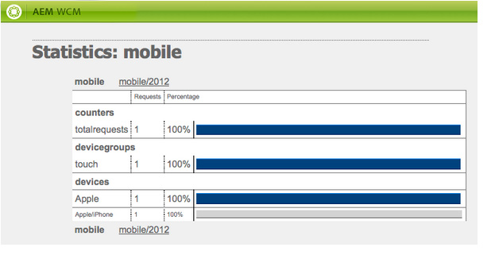

# Creación de sitios para dispositivos móviles{#creating-sites-for-mobile-devices}

>[!NOTE]
>
>Adobe recomienda utilizar el Editor de SPA para proyectos que requieren una representación del lado del cliente basada en el marco de aplicaciones de una sola página (por ejemplo, React). [Más información](/help/sites-developing/spa-overview.md).

La creación de un sitio móvil es similar a la creación de un sitio estándar, ya que también implica la creación de plantillas y componentes. Para obtener más información sobre la creación de plantillas y componentes, consulte las siguientes páginas: [Plantillas](/help/sites-developing/templates.md), [Componentes](/help/sites-developing/components.md) y [Introducción al desarrollo de AEM Sites](/help/sites-developing/getting-started.md). La principal diferencia consiste en habilitar las funcionalidades móviles integradas AEM dentro del sitio. Se logra creando una plantilla que depende del componente de página móvil.

También debe considerar la posibilidad de utilizar [diseño interactivo](/help/sites-developing/responsive.md), creando un sitio único que se adapta a varios tamaños de pantalla.

Para empezar, puede consultar la **Sitio de demostración móvil de We.Retail** que está disponible en AEM.

Para crear un sitio móvil, siga este procedimiento:

1. Cree el componente de página:

   * Configure las variables `sling:resourceSuperType` propiedad a `wcm/mobile/components/page`
De este modo, el componente depende del componente de página móvil.

   * Cree la variable `body.jsp` con la lógica específica del proyecto.

1. Cree la plantilla de página:

   * Configure las variables `sling:resourceType` al componente de página recién creado.
   * Configure las variables `allowedPaths` propiedad.

1. Cree la página de diseño para el sitio.
1. Cree la página raíz del sitio debajo del `/content` nodo:

   * Configure las variables `cq:allowedTemplates` propiedad.
   * Configure las variables `cq:designPath` propiedad.

1. En las propiedades de página de la página raíz del sitio, configure los grupos de dispositivos en la variable **Móvil** pestaña .
1. Cree las páginas del sitio utilizando la nueva plantilla.

El componente de página móvil ( `/libs/wcm/mobile/components/page`):

* Agrega la variable **Móvil** al cuadro de diálogo de propiedades de la página.
* A través de su `head.jsp`, recupera el grupo de dispositivos móviles actual de la solicitud y, si se encuentra un grupo de dispositivos, utiliza el `drawHead()` para incluir el componente de init del emulador asociado del grupo de dispositivos (solo en modo de autor) y el CSS de renderización del grupo de dispositivos.

>[!NOTE]
>
>La página raíz del sitio móvil debe estar en el nivel 1 de la jerarquía de nodos y se recomienda que esté debajo del nodo /content.

## Creación de un sitio móvil con el administrador de varios sitios {#creating-a-mobile-site-with-the-multi-site-manager}

Utilice Multi Site Manager (MSM) para crear una Live Copy móvil desde un sitio estándar. El sitio estándar se transforma automáticamente en un sitio móvil: el sitio móvil tiene todas las características de los sitios móviles (por ejemplo, la edición dentro de un emulador) y se puede administrar de forma sincronizada con el sitio estándar. Consulte la sección [Creación de una Live Copy para diferentes canales](/help/sites-administering/msm.md) en la página Administrador de varios sitios .

## API móvil del lado del servidor {#server-side-mobile-api}

Los paquetes Java que contienen las clases móviles son:

* [com.day.cq.wcm.mobile.api](https://helpx.adobe.com/experience-manager/6-5/sites/developing/using/reference-materials/javadoc/com/day/cq/wcm/mobile/api/device/capability/package-summary.html) - define MobileConstants.
* [com.day.cq.wcm.mobile.api.device](https://helpx.adobe.com/experience-manager/6-5/sites/developing/using/reference-materials/javadoc/com/day/cq/wcm/mobile/api/device/package-summary.html) : define Device, DeviceGroup y DeviceGroupList.
* [com.day.cq.wcm.mobile.api.device.capacity](https://helpx.adobe.com/experience-manager/6-5/sites/developing/using/reference-materials/javadoc/com/day/cq/wcm/mobile/api/device/capability/package-summary.html) : define DeviceCapability.
* [com.day.cq.wcm.mobile.api.wurfl](https://helpx.adobe.com/experience-manager/6-5/sites/developing/using/reference-materials/javadoc/com/day/cq/wcm/workflow/api/package-summary.html) - define WurflQueryEngine.
* [com.day.cq.wcm.mobile.core](https://helpx.adobe.com/experience-manager/6-5/sites/developing/using/reference-materials/javadoc/com/day/cq/wcm/mobile/core/package-summary.html) - define MobileUtil, que proporciona varios métodos de utilidad relacionados con WCM Mobile.

### Componentes móviles {#mobile-components}

La variable **Sitio de demostración móvil de We.Retail** utiliza los siguientes componentes móviles, que se encuentran a continuación `/libs/foundation/components`:

<table>
 <tbody>
  <tr>
   <td>Nombre</td>
   <td>Grupo</td>
   <td>Características</td>
  </tr>
  <tr>
   <td>mobilefooter</td>
   <td>oculto</td>
   <td>- pie de página</td>
  </tr>
  <tr>
   <td>mobileimage</td>
   <td>Móvil</td>
   <td>- basado en el componente de base de la imagen<br /> - renderiza una imagen si el dispositivo es capaz<br /> </td>
  </tr>
  <tr>
   <td>mobilelist</td>
   <td>Móvil</td>
   <td>- basado en el componente base de la lista<br /> - listitem_teaser.jsp procesa una imagen si el dispositivo es capaz<br /> </td>
  </tr>
  <tr>
   <td>mobilelogo</td>
   <td>oculto</td>
   <td>- basado en el componente de base del logotipo<br /> - renderiza una imagen si el dispositivo es capaz<br /> </td>
  </tr>
  <tr>
   <td>mobilereference</td>
   <td>Móvil</td>
   <td><p>- similar al componente de base de referencia</p> <p>: asigna un componente textimage a un componente mobiletextimage uno y un componente de imagen a una imagen móvil uno</p> </td>
  </tr>
  <tr>
   <td>mobiletextimage</td>
   <td>Móvil</td>
   <td>- basado en el componente de base textimage<br /> - renderiza una imagen si el dispositivo es capaz</td>
  </tr>
  <tr>
   <td>mobiletopnav</td>
   <td>oculto</td>
   <td><p>- se basa en el componente de base de la navegación superior</p> <p>- solo procesa texto</p> </td>
  </tr>
 </tbody>
</table>

#### Creación de un componente móvil {#creating-a-mobile-component}

El marco móvil AEM permite desarrollar componentes que son sensibles al dispositivo que emite la solicitud. Los siguientes ejemplos de código muestran cómo utilizar la API móvil AEM en un jsp de componente y, en particular, cómo:

* Obtenga el dispositivo de la solicitud:
   `Device device = slingRequest.adaptTo(Device.class);`

* Obtenga el grupo de dispositivos:
   `DeviceGroup deviceGroup = device.getDeviceGroup();`

* Obtenga las funciones de grupo de dispositivos:
   `Collection<DeviceCapability> capabilities = deviceGroup.getCapabilities();`

* Obtenga los atributos del dispositivo (clave/valores de capacidad sin procesar de la base de datos WURFL):
   `Map<String,String> deviceAttributes = device.getAttributes();`

* Obtenga el agente de usuario del dispositivo:
   `String userAgent = device.getUserAgent();`

* Obtenga la lista de grupos de dispositivos (grupos de dispositivos asignados al sitio por el autor) desde la página actual:
   `DeviceGroupList deviceGroupList = currentPage.adaptTo(DeviceGroupList.class);`

* Comprobar si el grupo de dispositivos admite imágenes
   `if (deviceGroup.hasCapability(DeviceCapability.CAPABILITY_IMAGES)) {`
...
O

...   `if MobileUtil.hasCapability(request, DeviceCapability.CAPABILITY_IMAGES) {`
...

>[!NOTE]
>
>En un jsp, `slingRequest` está disponible a través de la variable `<sling:defineObjects>` y `currentPage` a través de `<cq:defineObjects>` etiqueta.

### Emuladores {#emulators}

La creación basada en emuladores proporciona a los autores los medios para crear páginas de contenido destinadas a clientes móviles. La creación de contenido móvil sigue el mismo principio de edición WYSIWYG in situ. Para que los autores puedan percibir el aspecto de la página en un dispositivo móvil, se edita una página de contenido móvil con un emulador de dispositivo.

Los emuladores de dispositivos móviles se basan en el marco genérico del emulador. Para obtener más información, consulte [Emuladores](/help/sites-developing/emulators.md) página.

El emulador de dispositivo muestra el dispositivo móvil en la página, mientras que la edición habitual (parsys, componentes) se produce en la pantalla del dispositivo. El emulador de dispositivo depende de los grupos de dispositivos configurados para el sitio. Se pueden asignar varios emuladores a un grupo de dispositivos. Todos los emuladores están disponibles en la página de contenido. De forma predeterminada, se muestra el primer emulador asignado al primer grupo de dispositivos asignado al sitio. Los emuladores se pueden cambiar mediante el carrusel del emulador en la parte superior de la página o mediante el botón de edición de la barra de tareas.

**Creación de un emulador**

Para crear un emulador, consulte la [Creación de un emulador móvil personalizado](/help/sites-developing/emulators.md) en la página Emuladores genéricos .

**Características principales de los emuladores móviles**

* Un grupo de dispositivos se compone de uno o varios emuladores: la página de configuración del grupo de dispositivos, p. ej. /etc/mobile/groups/touch, contiene la variable `emulators` debajo de la variable `jcr:content` nodo .
Nota: aunque es posible que el mismo emulador pertenezca a varios grupos de dispositivos, no tiene mucho sentido.

* A través del cuadro de diálogo de configuración del grupo de dispositivos, la variable `emulators` se establece con la ruta del emulador o emuladores deseados. Por ejemplo: `/libs/wcm/mobile/components/emulators/iPhone4`.

* Los componentes del emulador (p. ej. `/libs/wcm/mobile/components/emulators/iPhone4`) amplíe el componente de emulador móvil base ( `/libs/wcm/mobile/components/emulators/base`).

* Todos los componentes que amplían el emulador móvil base se pueden seleccionar al configurar un grupo de dispositivos. Por lo tanto, los emuladores personalizados se pueden crear o ampliar fácilmente.
* A la hora de la solicitud en modo de edición, se utiliza la implementación del emulador para procesar la página.
* Cuando la plantilla de la página depende del componente de página móvil, las funcionalidades del emulador se integran automáticamente en la página (a través de la función `head.jsp` del componente de página móvil).

### Grupos de dispositivos {#device-groups}

Los grupos de dispositivos móviles proporcionan segmentación de dispositivos móviles en función de las capacidades de los dispositivos. Un grupo de dispositivos proporciona la información necesaria para la creación basada en emuladores en la instancia de autor y para la representación de contenido correcta en la instancia de publicación: una vez que los autores han añadido contenido a la página móvil y lo han publicado, la página se puede solicitar en la instancia de publicación. En este caso, en lugar de la vista de edición del emulador, la página de contenido se representa mediante uno de los grupos de dispositivos configurados. La selección del grupo de dispositivos se produce en función de [detección de dispositivos móviles](#devicedetection). El grupo de dispositivos correspondiente proporciona la información de estilo necesaria.

Los grupos de dispositivos se definen como páginas de contenido a continuación `/etc/mobile/devices` y utilice el **Grupo de dispositivos móviles** plantilla. La plantilla de grupo de dispositivos sirve como plantilla de configuración para las definiciones de grupo de dispositivos en forma de páginas de contenido. Sus principales características son:

* Lugar de residencia: `/libs/wcm/mobile/templates/devicegroup`
* Ruta permitida: `/etc/mobile/groups/*`
* Componente Página: `wcm/mobile/components/devicegroup`

#### Asignación de grupos de dispositivos al sitio {#assigning-device-groups-to-your-site}

Al crear un sitio móvil, debe asignar grupos de dispositivos al sitio. AEM proporciona tres grupos de dispositivos en función del HTML del dispositivo y las capacidades de renderización JavaScript:

* **Función** teléfonos, para dispositivos de características como el Sony Ericsson W800 con soporte para HTML básico pero sin soporte para imágenes y JavaScript.
* **Smart** teléfonos, para dispositivos como Blackberry con compatibilidad con HTML e imágenes básicos, pero sin compatibilidad con JavaScript.

* **Táctil** teléfonos, para dispositivos como iPad con compatibilidad total con HTML, imágenes, JavaScript y rotación de dispositivos.

Como emuladores se pueden asociar a un grupo de dispositivos (consulte la sección [Creación de un grupo de dispositivos](#creating-a-device-group)), al asignar un grupo de dispositivos a un sitio, los autores pueden seleccionar entre los emuladores asociados al grupo de dispositivos para editar la página.

Para asignar un grupo de dispositivos a su sitio:

1. En el navegador, vaya a la consola **Siteadmin**.
1. Abra la página raíz del sitio móvil a continuación. **Sitios web**.
1. Abra las propiedades de página.
1. Seleccione el **Móvil** pestaña:

   * Defina los grupos de dispositivos.
   * Haga clic en **Aceptar**.

>[!NOTE]
>
>Cuando los grupos de dispositivos se han definido para un sitio, todos los sitios del sitio los heredan.

#### Filtros de grupo del dispositivo {#device-group-filters}

Los filtros de grupo de dispositivos definen criterios basados en la capacidad para determinar si un dispositivo pertenece al grupo. Al crear un grupo de dispositivos, puede seleccionar los filtros que desea utilizar para evaluar los dispositivos.

En tiempo de ejecución cuando AEM recibe una solicitud HTTP de un dispositivo, cada filtro asociado a un grupo compara las capacidades del dispositivo con criterios específicos. Se considera que el dispositivo pertenece al grupo cuando tiene todas las capacidades que requieren los filtros. Las capacidades se recuperan de la base de datos WURFL™.

Los grupos de dispositivos pueden usar cero o más filtros para la detección de capacidades. Además, se puede utilizar un filtro con varios grupos de dispositivos. AEM proporciona un filtro predeterminado que determina si el dispositivo tiene las capacidades seleccionadas para un grupo:

* CSS
* Imágenes de JPG y PNG
* JavaScript
* Rotación de dispositivo

Si el grupo de dispositivos no utiliza un filtro, las funciones seleccionadas que están configuradas para el grupo son las únicas que requiere un dispositivo.

Para obtener más información, consulte [Creación de filtros de grupo de dispositivos](/help/sites-developing/groupfilters.md).

#### Creación de un grupo de dispositivos {#creating-a-device-group}

Cree un grupo de dispositivos cuando los grupos que AEM instale no cumplan con sus requisitos.

1. En el explorador, vaya a la **Herramientas** consola.
1. Cree una nueva página a continuación **Herramientas** > **Móvil** > **Grupos de dispositivos**. En el **Crear página** diálogo:

   * Como **Título** enter `Special Phones`.

   * Como **Nombre** enter `special`.

   * Seleccione el **Plantilla de grupo de dispositivos móviles**.
   * Haga clic en **Crear**.

1. En CRXDE, agregue un **static.css** archivo que contiene los estilos del grupo de dispositivos debajo de la variable `/etc/mobile/groups/special` nodo .

1. Abra el **Teléfonos especiales** página.
1. Para configurar el grupo de dispositivos, haga clic en el botón **Editar** botón situado al lado **Configuración**.
En el **General** pestaña:

   * **Título**: nombre del grupo de dispositivos móviles.
   * **Descripción**: descripción del grupo.
   * **User-Agent**: cadena de usuario-agente con la que coinciden los dispositivos. Es opcional y puede ser un regex. Ejemplo: `BlackBerryZ10`
   * **Competencias**: define si el grupo puede gestionar imágenes, CSS, JavaScript o rotación del dispositivo.
   * **Ancho mínimo de la pantalla** y **Altura**
   * **Deshabilitar emulador**: para activar o desactivar el emulador durante la edición de contenido.

   En el **Emuladores** pestaña:

   * **Emuladores**: seleccione los emuladores asignados a este grupo de dispositivos.

   En el **Filtros** pestaña:

   * Para agregar un filtro, haga clic en Agregar elemento y seleccione un filtro en la lista desplegable.
   * Los filtros se evalúan en el orden en que aparecen. Cuando un dispositivo no cumple los criterios de un filtro, los filtros posteriores de la lista no se evalúan.


1. Haga clic en Aceptar.

El cuadro de diálogo de configuración del grupo de dispositivos móviles tiene el siguiente aspecto:


#### CSS personalizada por grupo de dispositivos {#custom-css-per-device-group}

Como se ha descrito anteriormente, es posible asociar una CSS personalizada con una página de grupo de dispositivos, como la CSS de una página de diseño. Esta CSS se utiliza para influir en el procesamiento específico del grupo de dispositivos del contenido de la página en el autor y en la publicación. Esta CSS se incluye automáticamente:

* En la página de la instancia de autor para cada emulador utilizado por este grupo de dispositivos.
* En la página de la instancia de publicación si el agente de usuario de la solicitud coincide con un dispositivo móvil de este grupo de dispositivos en particular.

## Detección de dispositivos del lado del servidor {#server-side-device-detection}

Utilice filtros y una biblioteca de especificaciones del dispositivo para determinar las capacidades del dispositivo que realiza la solicitud HTTP.

### Desarrollo de filtros de grupo de dispositivos {#develop-device-group-filters}

Cree un filtro de grupo de dispositivos para definir un conjunto de requisitos de capacidad de dispositivos. Cree tantos filtros como necesite para dirigirse a los grupos necesarios de capacidades del dispositivo.

Diseñe los filtros de modo que pueda utilizar combinaciones de ellos para definir los grupos de capacidades. Normalmente, hay superposición de las capacidades de diferentes grupos de dispositivos. Por lo tanto, puede utilizar algunos filtros con varias definiciones de grupo de dispositivos.

Después de crear un filtro, puede utilizarlo en la configuración del grupo.

Para obtener más información, vaya a [Creación de filtros de grupo de dispositivos](/help/sites-developing/groupfilters.md).

### Uso de la base de datos WURFL™ {#using-the-wurfl-database}

AEM utiliza una versión truncada del [WURFL](https://wurfl.sourceforge.net/)Base de datos ™ para consultar las capacidades de los dispositivos, como la resolución de pantalla o la compatibilidad con javascript, en función del agente de usuario del dispositivo.

El código XML de la base de datos WURFL™ se representa como nodos a continuación `/var/mobile/devicespecs` analizando la variable `wurfl.xml`file at `/libs/wcm/mobile/devicespecs/wurfl.xml.` La expansión a nodos ocurre la primera vez que se produce la variable `cq-mobile-core` se ha iniciado el paquete.

Las capacidades del dispositivo se almacenan como propiedades de nodo y los nodos representan modelos de dispositivo. Puede utilizar consultas para recuperar las capacidades de un dispositivo o agente de usuario.

Como la base de datos WURFL™ está evolucionando, es posible que tenga que personalizarla o reemplazarla. Para actualizar la base de datos de dispositivos móviles, tiene las siguientes opciones:

* Sustituya el archivo por la última versión, si dispone de una licencia que permita este uso. Consulte Instalación de una base de datos WURFL diferente.
* Utilice la versión disponible en AEM y configure una regexp que coincida con sus cadenas User-Agent y señale a un dispositivo WURFL™ existente. Consulte [Adición de una coincidencia de agente-usuario basada en regexp](#adding-a-regexp-based-user-agent-matching).

#### Prueba de la asignación de un agente de usuario a las capacidades de WURFL™ {#testing-the-mapping-of-a-user-agent-to-wurfl-capabilities}

Cuando un dispositivo accede al sitio móvil, AEM detecta el dispositivo, lo asigna a un grupo de dispositivos según sus capacidades y envía una vista de la página que corresponde al grupo de dispositivos. El grupo de dispositivos correspondiente proporciona la información de estilo necesaria. Las asignaciones se pueden probar en la página de prueba del agente de usuario móvil:

`https://localhost:4502/etc/mobile/useragent-test.html`

#### Instalación de una base de datos WURFL™ diferente {#installing-a-different-wurfl-database}

La base de datos WURFL™ truncada que se instala con AEM es una versión anterior al 30 de agosto de 2011. Si su versión de WURFL se publicó después del 30 de agosto de 2011, asegúrese de que su uso cumpla con su licencia.

Para instalar una base de datos WURFL™:

1. En CRXDE Lite, cree la siguiente carpeta: `/apps/wcm/mobile/devicespecs`
1. Copie el archivo WURFL™ en la carpeta .
1. Cambie el nombre del archivo como `wurfl.xml`.

AEM analiza automáticamente el `wurfl.xml` y actualiza los nodos siguientes `/var/mobile/devicespecs`.

>[!NOTE]
>
>Cuando la base de datos WURFL™ completa está habilitada, el análisis y la activación pueden tardar unos minutos. Puede ver los registros para obtener información de progreso.

#### Adición de una coincidencia de agente-usuario basada en regexp {#adding-a-regexp-based-user-agent-matching}

Agregue un usuario-agente como una expresión regular debajo de /apps/wcm/mobile/devicespecs/wurfl/regexp para apuntar a un tipo de dispositivo WURFL™ existente.

1. En **CRXDE Lite**, cree un nodo debajo de /apps/wcm/mobile/devicespecs/regexp, por ejemplo apple_ipad_ver1.
1. Agregue las siguientes propiedades al nodo :

   * **regexp**: expresión regular que define usuarios-agentes, por ejemplo: .&#42;Mozilla.&#42;iPad.&#42;AppleWebKit.&#42;Safari.&#42;
   * **deviceId**: el ID del dispositivo tal como se define en el archivo wurfl.xml, por ejemplo: apple_ipad_ver1

La configuración anterior hace que los dispositivos para los que User-Agent coincide con la expresión regular suministrada se asignen al ID del dispositivo apple_ipad_ver1 WURFL™, si existe.

## Detección de dispositivos del lado del cliente {#client-side-device-detection}

En esta sección se describe cómo utilizar la detección de AEM del lado del cliente del dispositivo para optimizar el procesamiento de la página o proporcionar al cliente versiones de sitios web alternativas.

AEM admite la detección del lado del cliente del dispositivo basada en `BrowserMap`. `BrowserMap` se envía en AEM como biblioteca de cliente en `/etc/clientlibs/browsermap`.

`BrowserMap` proporciona tres estrategias que puede utilizar para proporcionar un sitio web alternativo a un cliente, que se emplean en el siguiente orden:

1. [Vínculos alternativos](#providing-alternate-links)
1. [URL específica del grupo de dispositivos](#definingdevicegroupspecificurl)
1. [URL basada en selector](#defining-selector-based-urls)

>[!NOTE]
>
>Para obtener más información sobre la integración de la biblioteca de clientes, lea la [Uso de bibliotecas de HTML del lado del cliente](/help/sites-developing/clientlibs.md) para obtener más información.

### Proporcionar vínculos alternativos {#providing-alternate-links}

La variable `PageVariantsProvider` El servicio OSGi puede generar vínculos alternativos para sitios pertenecientes a la misma familia. Para configurar los sitios que el servicio debe tener en cuenta, se debe configurar un `cq:siteVariant` se debe agregar al nodo `jcr:content` de la raíz del sitio.

La variable `cq:siteVariant` debe tener las siguientes propiedades:

* `cq:childNodesMapTo` - determina a qué atributo del elemento de vínculo se asignarán los nodos secundarios; se recomienda organizar el contenido del sitio web de forma que los elementos secundarios del nodo raíz representen la raíz de una variante de idioma del sitio web global (p. ej. `/content/mysite/en`, `/content/mysite/de`), en cuyo caso el valor de la variable `cq:childNodesMapTo` debe `hreflang`;
* `cq:variantDomain` - indica qué `Externalizer` se utilizará para generar las variantes de página en direcciones URL absolutas; si no se establece este valor, las variantes de página se generarán mediante vínculos relativos;
* `cq:variantFamily` - indica a qué familia de sitios web pertenece este sitio; las representaciones múltiples específicas del dispositivo del mismo sitio web deben pertenecer a la misma familia;
* `media` - almacena los valores del atributo media del elemento link; se recomienda utilizar el nombre del `BrowserMap` registrado `DeviceGroups`, de modo que `BrowserMap` puede reenviar automáticamente a los clientes a la variante correcta del sitio web.

#### PageVariantsProvider y externalizador {#pagevariantsprovider-and-externalizer}

Cuando el valor de la variable `cq:variantDomain` propiedad de a `cq:siteVariant` el nodo no está vacío, la variable `PageVariantsProvider` generará vínculos absolutos usando este valor como un dominio configurado para el `Externalizer` servicio. Asegúrese de configurar la variable `Externalizer` para reflejar su configuración.

>[!NOTE]
>
>Al trabajar con AEM hay varios métodos para administrar los ajustes de configuración de dichos servicios; see [Configuración de OSGi](/help/sites-deploying/configuring-osgi.md) para obtener más información y las prácticas recomendadas.

### Definición de una URL específica de un grupo de dispositivos {#defining-a-device-group-specific-url}

Si no desea utilizar vínculos alternativos, puede configurar una dirección URL global para cada `DeviceGroup`. Se recomienda crear su propia biblioteca de cliente que incruste el `browsermap.standard` biblioteca de cliente, pero redefine los grupos de dispositivos.

El mapa del explorador se ha diseñado de modo que las definiciones de los grupos de dispositivos se puedan anular creando y agregando un nuevo grupo de dispositivos con el mismo nombre al `BrowserMap` del cliente personalizado.

>[!NOTE]
>
>Para obtener más información, lea la [Mapa del explorador personalizado](#creatingacustomisedbrowsermap) para obtener más información.

### Definición de direcciones URL basadas en selector {#defining-selector-based-urls}

Si no se ha utilizado ninguno de los mecanismos anteriores para indicar un lugar alternativo para `BrowserMap`y, a continuación, selectores que utilizarán los nombres de la variable `DeviceGroups` se agregará al `URL`s, en cuyo caso debe proporcionar sus propios servlets que gestionarán las solicitudes.

Por ejemplo, un dispositivo de navegación `www.example.com/index.html` identificado como `smartphone` por BrowserMap se reenvía a `www.example.com/index.smartphone.html.`

### Uso de BrowserMap en las páginas {#using-browsermap-on-your-pages}

Para utilizar la biblioteca de cliente de BrowserMap estándar en una página, debe incluir la variable `/libs/wcm/core/browsermap/browsermap.jsp` usando un `cq:include`en la página `head` para obtener más información.

```xml
<cq:include script="/libs/wcm/core/browsermap/browsermap.jsp" />
```

Además de agregar la variable `BrowserMap` biblioteca de cliente en su `JSP` , también tiene que agregar una `cq:deviceIdentificationMode` Propiedad String establecida en `client-side` a `jcr:content` debajo de la raíz del sitio web.

### Anulación del comportamiento predeterminado de BrowserMap {#overriding-browsermap-s-default-behaviour}

Si desea personalizar `BrowserMap` - anulando el `DeviceGroups` o agregando más sondeos: entonces debe crear su propia biblioteca del lado del cliente en la que incruste el `browsermap.standard`biblioteca del lado del cliente.

Además, debe llamar manualmente a la función `BrowserMap.forwardRequest()` en su `JavaScript` código.

>[!NOTE]
>
>Para obtener más información sobre la integración de la biblioteca de clientes, lea la [Uso de bibliotecas de HTML del lado del cliente](/help/sites-developing/clientlibs.md) para obtener más información.

Una vez creado el `BrowserMap` biblioteca de cliente, sugerimos el siguiente enfoque:

1. Cree un `browsermap.jsp` en la aplicación

   ```xml
   <%@include file="/libs/foundation/global.jsp" %>
   <%@ taglib prefix="c" uri="https://java.sun.com/jsp/jstl/core" %>
   <%@ page import="
       com.day.cq.wcm.api.variants.PageVariant,
       com.day.cq.wcm.api.variants.PageVariantsProvider,
       com.day.cq.wcm.api.devicedetection.DeviceIdentificationMode,
       com.day.cq.wcm.api.WCMMode"
   %>
   <%
       final PageVariantsProvider p = sling.getService(PageVariantsProvider.class);
       if(p == null) {
           throw new IllegalStateException("Missing PageVariantsProvider service");
       }
       for(PageVariant v : p.getVariants(currentPage, slingRequest)) {
           final String curVar = v.getAttributes().get("data-current-variant");
           String media = v.getAttributes().get("media");
           if (media != null) {
               media = media.replaceAll(" ", "");
           }
   %>
       <link
           rel="alternate"
           data-cq-role="site.variant"
           title="<%= xssAPI.encodeForHTMLAttr(v.getTitle()) %>"
           hreflang="<%= xssAPI.encodeForHTMLAttr(v.getAttributes().get("hreflang")) %>"
           media="<%= xssAPI.encodeForHTMLAttr(media) %>"
           href="<%= xssAPI.getValidHref(v.getURL()) %>"
           <% if(curVar != null) { %> data-current-variant="<%= curVar %>"<% } %>
       />
   <%
       }
       Boolean browserMapEnabled = true;
       final DeviceIdentificationMode dim = sling.getService(DeviceIdentificationMode.class);
       String[] selectors  = slingRequest.getRequestPathInfo().getSelectors();
       boolean isPortletRequest = false;
       for (int i = 0; i < selectors.length; i++) {
           if ("portlet".equals(selectors[i])) {
               isPortletRequest = true;
               break;
           }
       }
       if (isPortletRequest) {
           log.debug("Request was made by a portlet container - BrowserMap will not be embedded");
       } else {
           final WCMMode wcmMode = WCMMode.fromRequest(slingRequest);
           boolean shouldIncludeClientLib = false;
           if (WCMMode.EDIT != wcmMode && WCMMode.PREVIEW != wcmMode && WCMMode.DESIGN != wcmMode) {
               if (dim != null) {
                   final String mode = dim.getDeviceIdentificationModeForPage(currentPage);
                   shouldIncludeClientLib = DeviceIdentificationMode.CLIENT_SIDE.equals(mode);
                   if (shouldIncludeClientLib) {
                       browserMapEnabled = (Boolean) request.getAttribute("browsermap.enabled");
                       if (browserMapEnabled == null) {
                           browserMapEnabled = true;
                       }
                   }
               }
           }
   %>
           <c:if test="<%= !browserMapEnabled %>">
               <meta name="browsermap.enabled" content="false">
           </c:if>
           <c:if test="<%= shouldIncludeClientLib %>">
               <meta name="viewport" content="width=device-width, initial-scale=1.0">
               <cq:includeClientLib categories="browsermap.custom"/>
           </c:if>
   <%
       }
   %>
   ```

1. Incluya la variable `broswermap.jsp` en la sección del encabezado.

   ```xml
   <cq:include script="browsermap.jsp" />
   ```

### Exclusión de BrowserMap de ciertas páginas {#excluding-browsermap-from-certain-pages}

Si desea excluir la biblioteca de BrowserMap de algunas de las páginas en las que no necesita detección de clientes, puede añadir un atributo de solicitud:

```xml
<%
request.setAttribute("browsermap.enabled", false);
%>
```

Esto hará que la variable `/libs/wcm/core/browsermap/browsermap.jsp` secuencia de comandos para agregar una metaetiqueta a la página que realizará `BrowserMap` para no realizar ninguna detección:

```xml
<meta name="browsermap.enabled" content="false">
```

### Prueba de una versión específica de un sitio web {#testing-a-specific-version-of-a-web-site}

Normalmente, la secuencia de comandos de BrowserMap siempre redirige a los visitantes a la versión más adecuada del sitio web, redireccionando generalmente a los visitantes al escritorio o al sitio móvil cuando es necesario.

Puede forzar el dispositivo de cualquier solicitud para probar una versión específica de un sitio web agregando la variable `device` a su URL. La siguiente URL renderizará la versión móvil del sitio web de Geometrixx Outdoors.

`https://localhost:4502/content/geometrixx-outdoors/en.html?wcmmode=disabled&device=smartphone`

>[!NOTE]
>
>La variable `wcmmode` el parámetro está configurado en `disabled` para simular el comportamiento de una instancia de publicación.

El valor del dispositivo sobrescrito se almacena en una cookie para que pueda navegar por el sitio web sin agregar la variable `device` para cada `URL`.

Como consecuencia, debe llamar al mismo `URL` con la variable `device` configure como `browser` para volver a la versión de escritorio del sitio web.

>[!NOTE]
>
>BrowserMap almacena el valor del dispositivo sobrescrito en una cookie denominada `BMAP_device`. Al eliminar esta cookie, se asegurará de que CQ proporcione la versión apropiada del sitio web según su dispositivo actual (p. ej., escritorio o móvil).

## Procesamiento de solicitudes móviles {#mobile-request-processing}

AEM procesa una solicitud emitida por un dispositivo móvil que pertenece al grupo de dispositivos táctiles de la siguiente manera:

1. Una iPad envía una solicitud a la instancia de publicación de AEM, por ejemplo: `https://localhost:4503/content/geometrixx_mobile/en/products.html`
1. AEM determina si el sitio de la página solicitada es un sitio móvil (comprobando si la página de primer nivel `/content/geometrixx_mobile` amplía el componente de página móvil). En caso afirmativo:
1. AEM busca las capacidades del dispositivo en función del agente de usuario en el encabezado de la solicitud.
1. AEM asigna las capacidades del dispositivo al grupo de dispositivos y los conjuntos `touch` como selector de grupos de dispositivos.
1. AEM redirige la solicitud a `https://localhost:4503/content/geometrixx_mobile/en/products.touch.html.`
1. AEM envía la respuesta a iPad:

   * `products.touch.html` se procesa de la forma habitual y se puede almacenar en caché.
   * Los componentes de renderización utilizan selectores para adaptar la presentación.
   * AEM agrega automáticamente el selector móvil a todos los vínculos internos de la página.

### Estadísticas {#statistics}

Puede obtener algunas estadísticas sobre el número de solicitudes realizadas al servidor de AEM por dispositivos móviles. El número de solicitudes se puede desglosar:

* por grupo de dispositivos y dispositivo
* por año, mes y día

Para ver las estadísticas:

1. Vaya a la **Herramientas** consola.
1. Abra el **Estadísticas de dispositivo** página siguiente **Herramientas** > **Móvil**.
1. Haga clic en el vínculo para ver las estadísticas de un año, mes o día concretos.

La variable **Estadísticas** La página tiene el siguiente aspecto:



>[!NOTE]
>
>La variable **Estadísticas** se crea la primera vez que un dispositivo móvil accede a AEM y se detecta. Antes de eso, no está disponible.

Si necesita generar una entrada en las estadísticas, puede continuar de la siguiente manera:

1. Utilice un dispositivo móvil o un emulador (como, por ejemplo, https://chrispederick.com/work/user-agent-switcher/ en Firefox).
1. Solicite una página móvil en la instancia de autor desactivando el modo de creación, por ejemplo:
   `https://localhost:4502/content/geometrixx_mobile/en/products.html?wcmmode=disabled`

La variable **Estadísticas** ya está disponible.

### Compatibilidad con el almacenamiento en caché de páginas para los vínculos &quot;enviar vínculo a un amigo&quot; {#supporting-page-caching-for-send-link-to-a-friend-links}

Las páginas móviles generalmente se pueden almacenar en caché en Dispatcher, ya que las páginas procesadas para un grupo de dispositivos se distinguen en la dirección URL de la página mediante el selector de grupos de dispositivos, por ejemplo `/content/mobilepage.touch.html`. Una solicitud a una página móvil sin selector nunca se almacena en caché, como en este caso, la detección de dispositivos funciona y finalmente redirige al grupo de dispositivos coincidente (o &quot;nomatch&quot;). El reescritura de vínculos procesa una página móvil representada con un selector de grupo de dispositivos. De este modo, reescribe todos los vínculos de la página para que también contengan el selector de grupos de dispositivos, evitando así volver a realizar la detección de dispositivos por cada clic en una página cualificada.

Por lo tanto, podría encontrar el siguiente escenario:

El usuario Alice es redirigido a `coolpage.feature.html`, y envía esa dirección URL a un amigo Bob que accede a ella con un cliente diferente que pertenece al grupo `touch` grupo de dispositivos.

If `coolpage.feature.html` se suministra desde una caché del front-end, AEM no tiene la oportunidad de analizar la solicitud para averiguar que el selector móvil no coincide con el nuevo agente de usuario y Bob obtiene la representación incorrecta.

Para solucionarlo, puede incluir una sencilla IU de selección en las páginas, donde los usuarios finales pueden anular el grupo de dispositivos seleccionado por AEM. En el ejemplo anterior, un vínculo (o un icono) en la página permite al usuario final cambiar a `coolpage.touch.html` si piensa que su dispositivo es lo suficientemente bueno para eso.
