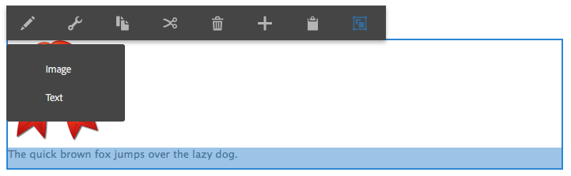

# Configurar varios editores in-situ {#configure-multiple-in-place-editors}

Puede configurar el Editor de texto enriquecido en Adobe Experience Manager para que tenga varios editores in-situ. Cuando esté configurado, puede seleccionar el contenido adecuado y abrir el editor correspondiente.



## Configurar varios editores {#configure-multiple-editors}

Para habilitar varios editores in situ, se ha mejorado la estructura de un tipo de nodo `cq:InplaceEditingConfig` con la definición de tipo de nodo `cq:ChildEditorConfig`.

Por ejemplo:

```js
   /**
       * Configures in-place editing of a component.
       *
       * @prop active true to activate in-place editing for the component.
       * @prop editorType ID of in-place editor to use.
       * @prop cq:childEditors collection of {@link cq:ChildEditorConfig} nodes.
       * @prop configPath path to editor's config (optional).
       * @node config editor's config (used if no configPath is specified; optional).
     */
    [cq:InplaceEditingConfig] > nt:unstructured
      - active (boolean)
      - editorType (string)
      + cq:childEditors (nt:base) = nt:unstructured
      - configPath (string)
      + config (nt:unstructured) = nt:unstructured

    /**
      * Configures one child editor for a sub-component. The name of the this node is
      * used as DD ID.
      *
      * @prop type type of the inline editor. For example, ["image"].
      * @prop title Title of the inline editor.
      * @prop icon Icon to represent the inline editor.
    */
    [cq:ChildEditorConfig] > nt:unstructured
      orderable
      - type (string)
      - title (string)
```

Para configurar varios editores, siga estos pasos:

1. En el nodo `cq:inplaceEditing` (de tipo `cq:InplaceEditingConfig`) defina las siguientes propiedades:

   * Nombre:`editorType`
   * Tipo: `String`
   * Value: `hybrid`

1. En este nodo, cree un nodo:

   * Nombre: `cq:ChildEditors`
   * Tipo: `nt:unstructured`

1. En el nodo `cq:childEditors`, cree un nodo para cada editor in-situ:

   * Nombre: El nombre de cada nodo es el nombre de la propiedad que representa, como sucede con los destinatarios de colocación. Por ejemplo, `image` y `text`.
   * Tipo: `cq:ChildEditorConfig`

   >[!NOTE]
   >
   >Existe una correlación entre los destinatarios de colocación definidos y los editores secundarios. El nombre del nodo `cq:ChildEditorConfig` se considera como el ID de destinatario de colocación, para utilizarlo como parámetro del editor secundario seleccionado. Si el subárea editable no tiene un destinatario de colocación, por ejemplo, en un componente de texto, el nombre del editor secundario se seguirá considerando como ID para identificar el área editable correspondiente.

1. En cada uno de estos nodos (`cq:ChildEditorConfig`) defina las propiedades:

   * Nombre: `type`.
   * Valor: El nombre del editor in situ registrado; por ejemplo, `image` y `text`.

   * Nombre: `title`.
   * Valor: Título que se muestra en la lista de selección de componentes de los editores disponibles. Por ejemplo, `Image` y `Text`.

### Configuración adicional para editores de texto enriquecido {#additional-configuration-for-rich-text-editors}

La configuración de varios editores de texto enriquecido es ligeramente diferente, ya que puede configurar cada instancia de RTE por separado. Para obtener más información, consulte [configuración del Editor de texto enriquecido](/help/sites-administering/rich-text-editor.md). Para tener varios RTE, cree una configuración para cada RTE in situ. Adobe recomienda crear el nuevo nodo de configuración en `cq:InplaceEditingConfig` ya que cada RTE individual puede tener una configuración diferente. En el nuevo nodo, cree cada configuración RTE individual.

```xml
    texttext
        cq:dialog
        cq:editConfig
            cq:inplaceEditing
                cq:childEditors
                    someconfig
                        text1
                            rtePlugins
                        text2
                            rtePlugins
```

>[!NOTE]
>
>Sin embargo, para RTE, la propiedad `configPath` se admite cuando solo hay una instancia del editor de texto (subárea editable) en el componente. Este uso de `configPath` se proporciona para admitir la compatibilidad con versiones anteriores de los diálogos de interfaz de usuario más antiguos del componente.

>[!CAUTION]
>
>No asigne un nombre al nodo de configuración RTE como `config`. De lo contrario, las configuraciones de RTE solo están disponibles para los administradores y no para los usuarios del grupo `content-author`.

## Ejemplos de código {#code-samples}

Puede encontrar el código de esta página en el proyecto [aem-authoring-hybrideditors en GitHub](https://github.com/Adobe-Marketing-Cloud/aem-authoring-hybrideditors). Puede descargar el proyecto completo como [archivo ZIP](https://github.com/Adobe-Marketing-Cloud/aem-authoring-hybrideditors/archive/master.zip).

## Añadir un editor en el lugar {#add-an-in-place-editor}

Para obtener información general sobre cómo agregar un editor in-situ, consulte el documento [personalizar la creación de páginas](/help/sites-developing/customizing-page-authoring-touch.md#add-new-in-place-editor).

>[!MORELIKETHIS]
>
>* [Configure el Editor de texto enriquecido en Experience Manager](/help/sites-administering/rich-text-editor.md).

