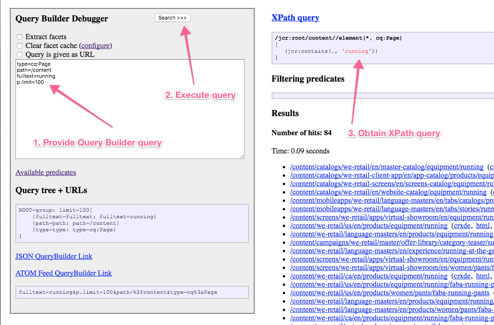

# API del Generador de consultas{#query-builder-api}

La funcionalidad de [Asset Share Query Builder](/help/assets/assets-finder-editor.md) se expone a través de una API Java™ y una API REST. Esta sección describe estas API.

El generador de consultas del lado del servidor ( [`QueryBuilder`](https://helpx.adobe.com/experience-manager/6-5/sites/developing/using/reference-materials/javadoc/com/day/cq/search/QueryBuilder.html)) acepta una descripción de consulta, crea y ejecuta una consulta XPath, opcionalmente filtra el conjunto de resultados y también extrae facetas, si lo desea.

La descripción de la consulta es simplemente un conjunto de predicados ([`Predicate`](https://helpx.adobe.com/experience-manager/6-5/sites/developing/using/reference-materials/javadoc/com/day/cq/search/Predicate.html)). Algunos ejemplos son un predicado de texto completo, que corresponde a la función `jcr:contains()` en XPath.

Para cada tipo de predicado, hay un componente de evaluador ([`PredicateEvaluator`](https://helpx.adobe.com/experience-manager/6-5/sites/developing/using/reference-materials/javadoc/com/day/cq/search/eval/PredicateEvaluator.html)) que sabe cómo controlar ese predicado específico para XPath, filtrado y extracción de facetas. Es fácil crear evaluadores personalizados, que están conectados a través del tiempo de ejecución del componente OSGi.

La API de REST proporciona acceso a las mismas funciones a través de HTTP con respuestas enviadas en JSON.

>[!NOTE]
>
>La API de QueryBuilder se crea mediante la API de JCR. También puede consultar el JCR de Adobe Experience Manager utilizando la API JCR desde un paquete OSGi. Para obtener más información, consulte [Adobe Experience Manager con la API de JCR](https://experienceleague.adobe.com/docs/experience-manager-65/developing/platform/access-jcr.html).

## Sesión de Gem {#gem-session}

[Adobe Experience Manager (AEM) Gems](https://experienceleague.adobe.com/docs/experience-manager-gems-events/gems/overview.html) es una serie de conocimientos técnicos sobre Adobe Experience Manager que ofrecen expertos de Adobe. Esta sesión dedicada al generador de consultas es útil para obtener una descripción general y utilizar la herramienta.

>[!NOTE]
>
>Sesión de AEM Gem [Busque fácilmente formularios con el generador de consultas de AEM](https://experienceleague.adobe.com/docs/experience-manager-gems-events/gems/gems2017/aem-search-forms-using-querybuilder.html) para obtener una descripción detallada del generador de consultas.

## Consultas de muestra {#sample-queries}

Estos ejemplos se proporcionan en notación de estilo de propiedades Java™. Para usarlos con la API de Java™, use un Java™ `HashMap` como en el ejemplo de API que sigue.

Para el servlet JSON `QueryBuilder`, cada ejemplo incluye un vínculo a la instalación local de CQ (en la ubicación predeterminada, `http://localhost:4502`). Inicie sesión en la instancia de CQ antes de utilizar estos vínculos.

>[!CAUTION]
>
>De forma predeterminada, el servlet json de query builder muestra un máximo de diez visitas.
>
>Añadir el siguiente parámetro permite que el servlet muestre todos los resultados de la consulta:
>
>**`p.limit=-1`**

>[!NOTE]
>
>Para ver los datos JSON devueltos en el navegador, es posible que desee utilizar un complemento como JSONView para Firefox.

### Devolver todos los resultados {#returning-all-results}

La siguiente consulta **devuelve diez resultados** (o, para ser precisos, un máximo de diez), pero le informa del **Número de visitas:** que están disponibles:

`http://localhost:4502/bin/querybuilder.json?path=/content&1_property=sling:resourceType&1_property.value=foundation/components/text&1_property.operation=like&orderby=path`

```xml
path=/content
1_property=sling:resourceType
1_property.value=foundation/components/text
1_property.operation=like
orderby=path
```

La misma consulta (con el parámetro `p.limit=-1`) **devolverá todos los resultados** (podría ser un número alto dependiendo de su instancia):

`http://localhost:4502/bin/querybuilder.json?path=/content&1_property=sling:resourceType&1_property.value=foundation/components/text&1_property.operation=like&p.limit=-1&orderby=path`

```xml
path=/content
1_property=sling:resourceType
1_property.value=foundation/components/text
1_property.operation=like
p.limit=-1
orderby=path
```

### Usar p.guessTotal para devolver los resultados {#using-p-guesstotal-to-return-the-results}

El propósito del parámetro `p.guessTotal` es devolver el número adecuado de resultados que se pueden mostrar combinando los valores mínimos viables de p.offset y p.limit. La ventaja de utilizar este parámetro es un rendimiento mejorado con grandes conjuntos de resultados. Esto evita calcular el total completo (por ejemplo, llamar a result.getSize()) y leer todo el conjunto de resultados, optimizado hasta el motor e índice de Oak. Esto puede ser una diferencia significativa cuando hay 100 000 resultados, tanto en tiempo de ejecución como en uso de memoria.

La desventaja del parámetro es que los usuarios no ven el total exacto. Pero puede establecer un número mínimo como p.guessTotal=1000 para que siempre se lea hasta 1000, de modo que obtenga totales exactos para conjuntos de resultados más pequeños, pero si es más que eso, solo puede mostrar &quot;y más&quot;.

Agregue `p.guessTotal=true` a la consulta siguiente para ver cómo funciona:

`http://localhost:4502/bin/querybuilder.json?path=/content&1_property=sling:resourceType&1_property.value=foundation/components/text&1_property.operation=like&p.guessTotal=true&orderby=path`

```xml
path=/content
1_property=sling:resourceType
1_property.value=foundation/components/text
1_property.operation=like
p.guessTotal=true
orderby=path
```

La consulta devuelve el valor predeterminado `p.limit` de `10` resultados con un desplazamiento de `0`:

```xml
"success": true,
"results": 10,
"total": 10,
"more": true,
"offset": 0,
```

A partir de AEM 6.0 SP2, también puede utilizar un valor numérico para contar hasta un número personalizado de resultados máximos. Utilice la misma consulta que la anterior, pero cambie el valor de `p.guessTotal` a `50`:

`http://localhost:4502/bin/querybuilder.json?path=/content&1_property=sling:resourceType&1_property.value=foundation/components/text&1_property.operation=like&p.guessTotal=50&orderby=path`

Devuelve un número con el mismo límite predeterminado de diez resultados con un desplazamiento de 0, pero solo muestra un máximo de 50 resultados:

```xml
"success": true,
"results": 10,
"total": 50,
"more": true,
"offset": 0,
```

### Implementación de paginación {#implementing-pagination}

De forma predeterminada, el Generador de consultas también proporcionaría el número de visitas. En función del tamaño del resultado, esto puede llevar mucho tiempo, ya que determinar el recuento preciso implica comprobar todos los resultados para el control de acceso. La mayoría del total se utiliza para implementar la paginación en la interfaz de usuario final. Como determinar el recuento exacto puede ser lento, se recomienda utilizar la función guessTotal para implementar la paginación.

Por ejemplo, la IU de puede adaptar el siguiente enfoque:

* Obtenga y muestre el recuento preciso del número total de visitas ([SearchResult.getTotalMatches()](https://helpx.adobe.com/experience-manager/6-5/sites/developing/using/reference-materials/javadoc/com/day/cq/search/result/SearchResult.html#gettotalmatches) o el total en la respuesta querybuilder.json) menores o iguales a 100;
* Establezca `guessTotal` en 100 mientras realiza la llamada al Generador de consultas.

* La respuesta puede tener el siguiente resultado:

   * `total=43`, `more=false` - Indica que el número total de visitas es 43. La interfaz de usuario puede mostrar hasta diez resultados como parte de la primera página y proporcionar paginación para las tres páginas siguientes. También puede usar esta implementación para mostrar un texto descriptivo como **&quot;43 resultados encontrados&quot;**.
   * `total=100`, `more=true` - Indica que el número total de visitas es mayor que 100 y que se desconoce el recuento exacto. La IU puede mostrarse hasta diez como parte de la primera página y proporcionar paginación para las siguientes diez páginas. También puede usar esto para mostrar un texto como **&quot;se encontraron más de 100 resultados&quot;**. A medida que el usuario va a las páginas siguientes, las llamadas realizadas al Generador de consultas aumentarán el límite de `guessTotal`, así como los parámetros `offset` y `limit`.

`guessTotal` debe usarse en casos en los que la interfaz de usuario necesite utilizar desplazamiento infinito para evitar que el Generador de consultas determine el recuento exacto de visitas.

### Busque los archivos jar y ordénelos, primero los más recientes {#find-jar-files-and-order-them-newest-first}

`http://localhost:4502/bin/querybuilder.json?type=nt:file&nodename=*.jar&orderby=@jcr:content/jcr:lastModified&orderby.sort=desc`

```xml
type=nt:file
nodename=*.jar
orderby=@jcr:content/jcr:lastModified
orderby.sort=desc
```

### Buscar todas las páginas y ordenarlas por última modificación {#find-all-pages-and-order-them-by-last-modified}

`http://localhost:4502/bin/querybuilder.json?type=cq:Page&orderby=@jcr:content/cq:lastModified`

```xml
type=cq:Page
orderby=@jcr:content/cq:lastModified
```

### Buscar todas las páginas y ordenarlas por última vez modificadas, pero en orden descendente {#find-all-pages-and-order-them-by-last-modified-but-descending}

`http://localhost:4502/bin/querybuilder.json?type=cq:Page&orderby=@jcr:content/cq:lastModified&orderby.sort=desc]`

```xml
type=cq:Page
orderby=@jcr:content/cq:lastModified
orderby.sort=desc
```

### Búsqueda de texto completo, ordenada por puntuación {#fulltext-search-ordered-by-score}

`http://localhost:4502/bin/querybuilder.json?fulltext=Management&orderby=@jcr:score&orderby.sort=desc`

```xml
fulltext=Management
orderby=@jcr:score
orderby.sort=desc
```

### Buscar páginas etiquetadas con una etiqueta determinada {#search-for-pages-tagged-with-a-certain-tag}

`http://localhost:4502/bin/querybuilder.json?type=cq:Page&tagid=marketing:interest/product&tagid.property=jcr:content/cq:tags`

```xml
type=cq:Page
tagid=marketing:interest/product
tagid.property=jcr:content/cq:tags
```

Utilice el predicado `tagid` como en el ejemplo si conoce el ID de etiqueta explícito.

Utilice el predicado `tag` para la ruta del título de la etiqueta (sin espacios).

En el ejemplo anterior, ya que está buscando páginas ( `cq:Page` nodos), utilice la ruta relativa de ese nodo para el predicado `tagid.property`, que es `jcr:content/cq:tags`. De manera predeterminada, `tagid.property` sería simplemente `cq:tags`.

### Buscar en varias rutas (mediante grupos) {#search-under-multiple-paths-using-groups}

`http://localhost:4502/bin/querybuilder.json?fulltext=Management&group.1_path=/content/geometrixx/en/company/management&group.2_path=/content/geometrixx/en/company/bod&group.p.or=true`

```xml
fulltext=Management
group.p.or=true
group.1_path=/content/geometrixx/en/company/management
group.2_path=/content/geometrixx/en/company/bod
```

Esta consulta usa un *grupo* (denominado &quot;`group`&quot;), que actúa para delimitar subexpresiones dentro de una consulta, como lo hacen los paréntesis en las anotaciones más estándar. Por ejemplo, la consulta anterior podría expresarse con un estilo más familiar como:

`"Management" and ("/content/geometrixx/en/company/management" or "/content/geometrixx/en/company/bod")`

Dentro del grupo del ejemplo, el predicado `path` se utiliza varias veces. Para diferenciar y ordenar las dos instancias del predicado (el orden es necesario para algunos predicados), debe codificar los predicados con *N* `_ where`*N* como el índice de orden. En el ejemplo anterior, los predicados resultantes son `1_path` y `2_path`.

El `p` de `p.or` es un delimitador especial que indica que lo que sigue (en este caso un `or`) es un *parámetro* del grupo, a diferencia de un subpredicado del grupo, como `1_path`.

Si no se proporciona ningún `p.or`, todos los predicados se unen ANDed, es decir, cada resultado debe satisfacer todos los predicados.

>[!NOTE]
>
>No puede utilizar el mismo prefijo numérico en una sola consulta, incluso para diferentes predicados.

### Buscar propiedades {#search-for-properties}

Aquí está buscando todas las páginas de una plantilla determinada, utilizando la propiedad `cq:template`:

`http://localhost:4502/bin/querybuilder.json?property=cq%3atemplate&property.value=%2fapps%2fgeometrixx%2ftemplates%2fhomepage&type=cq%3aPageContent`

```xml
type=cq:PageContent
property=cq:template
property.value=/apps/geometrixx/templates/homepage
```

Esto tiene el inconveniente de que se devuelven los nodos `jcr:content` de las páginas, no las páginas en sí. Para resolver esto, puede buscar por ruta relativa:

`http://localhost:4502/bin/querybuilder.json?property=jcr%3acontent%2fcq%3atemplate&property.value=%2fapps%2fgeometrixx%2ftemplates%2fhomepage&type=cq%3aPage`

```xml
type=cq:Page
property=jcr:content/cq:template
property.value=/apps/geometrixx/templates/homepage
```

### Buscar varias propiedades {#search-for-multiple-properties}

Cuando utilice el predicado de propiedad varias veces, debe volver a agregar el número de prefijos:

`http://localhost:4502/bin/querybuilder.json?1_property=jcr%3acontent%2fcq%3atemplate&1_property.value=%2fapps%2fgeometrixx%2ftemplates%2fhomepage&2_property=jcr%3acontent%2fjcr%3atitle&2_property.value=English&type=cq%3aPage`

```xml
type=cq:Page
1_property=jcr:content/cq:template
1_property.value=/apps/geometrixx/templates/homepage
2_property=jcr:content/jcr:title
2_property.value=English
```

### Buscar varios valores de propiedad {#search-for-multiple-property-values}

Para evitar grupos grandes cuando desee buscar varios valores de una propiedad ( `"A" or "B" or "C"`), puede proporcionar varios valores al predicado `property`:

`http://localhost:4502/bin/querybuilder.json?property=jcr%3atitle&property.1_value=Products&property.2_value=Square&property.3_value=Events`

```xml
property=jcr:title
property.1_value=Products
property.2_value=Square
property.3_value=Events
```

Para las propiedades de varios valores, también puede requerir que varios valores coincidan con ( `"A" and "B" and "C"`):

`http://localhost:4502/bin/querybuilder.json?property=jcr%3atitle&property.and=true&property.1_value=test&property.2_value=foo&property.3_value=bar`

```xml
property=jcr:title
property.and=true
property.1_value=test
property.2_value=foo
property.3_value=bar
```

## Refinamiento de lo que se devuelve {#refining-what-is-returned}

De forma predeterminada, el servlet JSON de QueryBuilder devuelve un conjunto predeterminado de propiedades para cada nodo en el resultado de búsqueda (por ejemplo, ruta, nombre y título). Para obtener control sobre las propiedades que se devuelven, puede realizar una de las siguientes acciones:

Especificar

```
p.hits=full
```

En cuyo caso, todas las propiedades se incluyen para cada nodo:

`http://localhost:4502/bin/querybuilder.json?p.hits=full&property=jcr%3atitle&property.value=Triangle`

```xml
property=jcr:title
property.value=Triangle
p.hits=full
```

Uso

```
p.hits=selective
```

Y especifique las propiedades en las que desea entrar

```
p.properties
```

Separado por un espacio:

`http://localhost:4502/bin/querybuilder.json?p.hits=selective&property=jcr%3atitle&property.value=Triangle`

[`http://localhost:4502/bin/querybuilder.json?`](http://localhost:4502/bin/querybuilder.json?p.hits=selective&p.properties=sling%3aresourceType%20jcr%3aprimaryType&property=jcr%3atitle&property.value=Triangle) [p.hits=selectivo&amp;](http://localhost:4502/bin/querybuilder.json?p.hits=selective&p.nodedepth=5&p.properties=sling%3aresourceType%20jcr%3apath&property=jcr%3atitle&property.value=Triangle)p.properties=sling%3aresourceType%20jcr%3primaryType&amp;property=jcr%3title&amp;property.value=Triangle

```xml
property=jcr:title
property.value=Triangle
p.hits=selective
p.properties=sling:resourceType jcr:primaryType
```

También puede incluir nodos secundarios en la respuesta de QueryBuilder. Para ello, debe especificar

```
p.nodedepth=n
```

Donde `n` es el número de niveles que desea que devuelva la consulta. Para que se devuelva un nodo secundario, debe especificarlo el selector de propiedades

```
p.hits=full
```

Ejemplo:

`http://localhost:4502/bin/querybuilder.json?p.hits=full&p.nodedepth=5&property=jcr%3atitle&property.value=Triangle`

```xml
property=jcr:title
property.value=Triangle
p.hits=full
p.nodedepth=5
```

## Más predicados {#morepredicates}

Para obtener más predicados, consulte la [página de referencia de predicados de Query Builder](/help/sites-developing/querybuilder-predicate-reference.md).

También puede comprobar el [Javadoc para las `PredicateEvaluator` clases](https://helpx.adobe.com/experience-manager/6-5/sites/developing/using/reference-materials/javadoc/com/day/cq/search/eval/PredicateEvaluator.html). El Javadoc para estas clases contiene la lista de propiedades que puede utilizar.

El prefijo del nombre de clase (por ejemplo, &quot;`similar`&quot; en [`SimilarityPredicateEvaluator`](https://helpx.adobe.com/experience-manager/6-5/sites/developing/using/reference-materials/javadoc/com/day/cq/search/eval/SimilarityPredicateEvaluator.html)) es la *propiedad principal* de la clase. Esta propiedad también es el nombre del predicado que se utilizará en la consulta (en minúsculas).

Para estas propiedades principales, puede acortar la consulta y utilizar &quot; `similar=/content/en`&quot; en lugar de la variante completa &quot; `similar.similar=/content/en`&quot;. El formulario completo debe utilizarse para todas las propiedades no principales de una clase.

## Ejemplo de uso de API de Query Builder {#example-query-builder-api-usage}

```java
   String fulltextSearchTerm = "Geometrixx";

    // create query description as hash map (simplest way, same as form post)
    Map<String, String> map = new HashMap<String, String>();

// create query description as hash map (simplest way, same as form post)
    map.put("path", "/content");
    map.put("type", "cq:Page");
    map.put("group.p.or", "true"); // combine this group with OR
    map.put("group.1_fulltext", fulltextSearchTerm);
    map.put("group.1_fulltext.relPath", "jcr:content");
    map.put("group.2_fulltext", fulltextSearchTerm);
    map.put("group.2_fulltext.relPath", "jcr:content/@cq:tags");

    // can be done in map or with Query methods
    map.put("p.offset", "0"); // same as query.setStart(0) below
    map.put("p.limit", "20"); // same as query.setHitsPerPage(20) below

    Query query = builder.createQuery(PredicateGroup.create(map), session);
    query.setStart(0);
    query.setHitsPerPage(20);

    SearchResult result = query.getResult();

    // paging metadata
    int hitsPerPage = result.getHits().size(); // 20 (set above) or lower
    long totalMatches = result.getTotalMatches();
    long offset = result.getStartIndex();
    long numberOfPages = totalMatches / 20;

    //Place the results in XML to return to client
    DocumentBuilderFactory factory =     DocumentBuilderFactory.newInstance();
    DocumentBuilder builder = factory.newDocumentBuilder();
    Document doc = builder.newDocument();

    //Start building the XML to pass back to the AEM client
    Element root = doc.createElement( "results" );
    doc.appendChild( root );

    // iterating over the results
    for (Hit hit : result.getHits()) {
       String path = hit.getPath();

      //Create a result element
      Element resultel = doc.createElement( "result" );
      root.appendChild( resultel );

      Element pathel = doc.createElement( "path" );
      pathel.appendChild( doc.createTextNode(path ) );
      resultel.appendChild( pathel );
    }
```

>[!NOTE]
>
>Para aprender a crear un paquete OSGi que use la API de QueryBuilder y ese paquete OSGi dentro de una aplicación de Adobe Experience Manager, consulte [Creación de paquetes OSGi de Adobe CQ que usen la API de Query Builder](https://helpx.adobe.com/experience-manager/using/using-query-builder-api.html)I.

La misma consulta ejecutada a través de HTTP mediante el servlet Query Builder (JSON):

`http://localhost:4502/bin/querybuilder.json?path=/content&type=cq:Page&group.p.or=true&group.1_fulltext=Geometrixx&group.1_fulltext.relPath=jcr:content&group.2_fulltext=Geometrixx&group.2_fulltext.relPath=jcr:content/@cq:tags&p.offset=0&p.limit=20`

## Almacenamiento y carga de consultas {#storing-and-loading-queries}

Las consultas se pueden almacenar en el repositorio para poder utilizarlas más adelante. El `QueryBuilder` proporciona el método &quot;`storeQuery`&quot; con la siguiente firma:

```java
void storeQuery(Query query, String path, boolean createFile, Session session) throws RepositoryException, IOException;
```

Al utilizar el método [`QueryBuilder#storeQuery`](https://helpx.adobe.com/experience-manager/6-5/sites/developing/using/reference-materials/javadoc/com/day/cq/search/QueryBuilder.html#storequerycomdaycqsearchqueryjavalangstringbooleanjavaxjcrsession), el elemento `Query` dado se almacena en el repositorio como un archivo o como una propiedad según el valor del argumento `createFile`. El siguiente ejemplo muestra cómo guardar un(a) `Query` en la ruta de acceso `/mypath/getfiles` como archivo:

```java
builder.storeQuery(query, "/mypath/getfiles", true, session);
```

Se puede cargar cualquier consulta previamente almacenada desde el repositorio mediante el método [`QueryBuilder#loadQuery`](https://helpx.adobe.com/experience-manager/6-5/sites/developing/using/reference-materials/javadoc/com/day/cq/search/QueryBuilder.html#loadqueryjavalangstringjavaxjcrsession):

```java
Query loadQuery(String path, Session session) throws RepositoryException, IOException
```

Por ejemplo, un(a) `Query` almacenado(a) en la ruta de acceso `/mypath/getfiles` se puede cargar mediante el siguiente fragmento de código:

```java
Query loadedQuery = builder.loadQuery("/mypath/getfiles", session);
```

## Pruebas y depuración {#testing-and-debugging}

Para reproducir y depurar consultas de QueryBuilder, puede utilizar la consola de QueryBuilder en

`http://localhost:4502/libs/cq/search/content/querydebug.html`

O bien, el servlet json de querybuilder en

`http://localhost:4502/bin/querybuilder.json?path=/tmp`

( `path=/tmp` es solo un ejemplo).

### Recomendaciones generales de depuración {#general-debugging-recommendations}

### Obtener XPath explicable mediante el registro {#obtain-explain-able-xpath-via-logging}

Explicar **todas** las consultas durante el ciclo de desarrollo con respecto al conjunto de índices objetivo.

* Habilite los registros DEBUG para que QueryBuilder obtenga una consulta XPath subyacente y explicable

   * Vaya a https://&lt;serveraddress>:&lt;serverport>/system/console/slinglog. Cree un registrador para `com.day.cq.search.impl.builder.QueryImpl` en **DEBUG**.

* Después de habilitar DEBUG para la clase anterior, los registros muestran el XPath generado por el Generador de consultas.
* Copie la consulta XPath de la entrada de registro de la consulta QueryBuilder asociada, por ejemplo:

   * `com.day.cq.search.impl.builder.QueryImpl XPath query: /jcr:root/content//element(*, cq:Page)[(jcr:contains(jcr:content, "Geometrixx") or jcr:contains(jcr:content/@cq:tags, "Geometrixx"))]`

* Pegue la consulta XPath en [Explicar consulta](/help/sites-administering/operations-dashboard.md#explain-query) como XPath para obtener el plan de consulta

### Obtenga XPath explicable mediante el depurador de Query Builder {#obtain-explain-able-xpath-via-the-query-builder-debugger}

* Use AEM QueryBuilder Debugger para generar una consulta XPath explicable:

Explicar **todas** las consultas durante el ciclo de desarrollo con respecto al conjunto de índices objetivo.

**Obtener XPath explicable mediante el registro**

* Habilite los registros DEBUG para que QueryBuilder obtenga una consulta XPath subyacente y explicable

   * Vaya a https://&lt;serveraddress>:&lt;serverport>/system/console/slinglog. Cree un registrador para `com.day.cq.search.impl.builder.QueryImpl` en **DEBUG**.

* Después de habilitar DEBUG para la clase anterior, los registros muestran el XPath generado por el Generador de consultas.
* Copie la consulta XPath de la entrada de registro de la consulta QueryBuilder asociada, por ejemplo:

   * `com.day.cq.search.impl.builder.QueryImpl XPath query: /jcr:root/content//element(*, cq:Page)[(jcr:contains(jcr:content, "Geometrixx") or jcr:contains(jcr:content/@cq:tags, "Geometrixx"))]`

* Pegue la consulta XPath en [Explicar consulta](/help/sites-administering/operations-dashboard.md#explain-query) como XPath para obtener el plan de consulta

**Obtenga XPath explicable mediante el depurador de Query Builder**

* Use AEM QueryBuilder Debugger para generar una consulta XPath explicable:



1. Proporcione la consulta del Generador de consultas en el depurador de Query Builder
1. Ejecución de la búsqueda
1. Obtener el XPath generado
1. Pegue la consulta XPath en Explicar consulta como XPath para obtener el plan de consulta

>[!NOTE]
>
>Las consultas que no son de querybuilder (XPath, JCR-SQL2) se pueden proporcionar directamente a Explain Query.

Para ver un resumen sobre cómo depurar consultas con QueryBuilder, consulte el siguiente vídeo.

>[!NOTE]
>
>[https://www.youtube.com/watch?v=BnyXjhRKYKc](https://www.youtube.com/watch?v=BnyXjhRKYKc)

## Depuración de consultas con registro {#debugging-queries-with-logging}

>[!NOTE]
>
>La configuración de los registradores se describe en la sección [Creación de sus propios registradores y escritores](/help/sites-deploying/configure-logging.md#creating-your-own-loggers-and-writers).

Salida de registro (nivel INFO) de la implementación del generador de consultas al ejecutar la consulta descrita en Pruebas y depuración:

```xml
com.day.cq.search.impl.builder.QueryImpl executing query (predicate tree):
null=group: limit=20, offset=0[
    {group=group: or=true[
        {1_fulltext=fulltext: fulltext=Geometrixx, relPath=jcr:content}
        {2_fulltext=fulltext: fulltext=Geometrixx, relPath=jcr:content/@cq:tags}
    ]}
    {path=path: path=/content}
    {type=type: type=cq:Page}
]
com.day.cq.search.impl.builder.QueryImpl XPath query: /jcr:root/content//element(*, cq:Page)[(jcr:contains(jcr:content, "Geometrixx") or jcr:contains(jcr:content/@cq:tags, "Geometrixx"))]
com.day.cq.search.impl.builder.QueryImpl no filtering predicates
com.day.cq.search.impl.builder.QueryImpl query execution took 69 ms
```

Si tiene una consulta con evaluadores de predicado que filtran o que utilizan un orden personalizado por comparador, esto también se indicará en la consulta:

```xml
com.day.cq.search.impl.builder.QueryImpl executing query (predicate tree):
null=group: [
    {nodename=nodename: nodename=*.jar}
    {orderby=orderby: orderby=@jcr:content/jcr:lastModified}
    {type=type: type=nt:file}
]
com.day.cq.search.impl.builder.QueryImpl custom order by comparator: jcr:content/jcr:lastModified
com.day.cq.search.impl.builder.QueryImpl XPath query: //element(*, nt:file)
com.day.cq.search.impl.builder.QueryImpl filtering predicates: {nodename=nodename: nodename=*.jar}
com.day.cq.search.impl.builder.QueryImpl query execution took 272 ms
```

## Vínculos Javadoc {#javadoc-links}

| **Javadoc** | **Descripción** |
|---|---|
| [com.day.cq.search](https://helpx.adobe.com/experience-manager/6-5/sites/developing/using/reference-materials/javadoc/com/day/cq/search/package-summary.html) | QueryBuilder básico y API de consulta |
| [com.day.cq.search.result](https://helpx.adobe.com/experience-manager/6-5/sites/developing/using/reference-materials/javadoc/com/day/cq/search/result/package-summary.html) | API de resultados |
| [com.day.cq.search.facets](https://helpx.adobe.com/experience-manager/6-5/sites/developing/using/reference-materials/javadoc/com/day/cq/search/facets/package-summary.html) | Facetas |
| [com.day.cq.search.facets.buckets](https://helpx.adobe.com/experience-manager/6-5/sites/developing/using/reference-materials/javadoc/com/day/cq/search/facets/buckets/package-summary.html) | Contenedores (incluidos en las facetas) |
| [com.day.cq.search.eval](https://helpx.adobe.com/experience-manager/6-5/sites/developing/using/reference-materials/javadoc/com/day/cq/search/eval/package-summary.html) | Evaluadores de predicados |
| [com.day.cq.search.facets.extractores](https://helpx.adobe.com/experience-manager/6-5/sites/developing/using/reference-materials/javadoc/com/day/cq/search/facets/extractors/package-summary.html) | Extractores de facetas (para evaluadores) |
| [com.day.cq.search.writer](https://helpx.adobe.com/experience-manager/6-5/sites/developing/using/reference-materials/javadoc/com/day/cq/search/writer/package-summary.html) | Escritor de visitas de resultados JSON para el servlet Querybuilder (/bin/querybuilder.json) |
