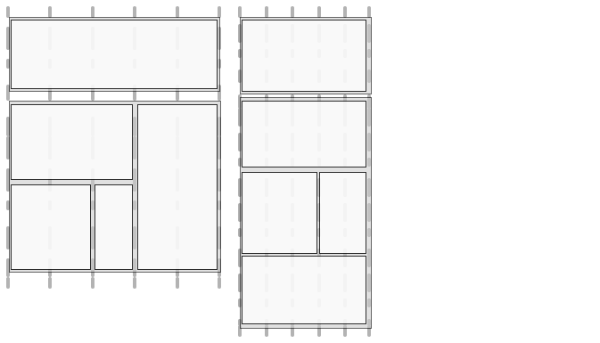

# Diseño adaptable para páginas Web{#responsive-design-for-web-pages}

>[!NOTE]
>
>Adobe recomienda el uso del Editor de SPA para proyectos que requieren una representación de cliente basada en el marco de aplicaciones de una sola página (como _React_). [Más información](/help/sites-developing/spa-overview.md).


Diseñe las páginas web para que se adapten a la ventanilla del cliente en la que se muestran. Con el diseño interactivo, las mismas páginas se pueden mostrar eficazmente en varios dispositivos en ambas orientaciones. La siguiente imagen muestra algunas formas en que una página puede responder a los cambios en el tamaño de la ventanilla:

* Diseño: Utilice diseños de una sola columna para ventanillas móviles más pequeñas y diseños de varias columnas para ventanillas móviles más grandes.
* Tamaño del texto: Utilice un tamaño de texto mayor (cuando sea necesario, como encabezados) en ventanillas móviles más grandes.
* Contenido: Incluya solo el contenido más importante cuando se muestre en dispositivos más pequeños.
* Navegación: Las herramientas específicas del dispositivo se proporcionan para acceder a otras páginas.
* Imágenes: Representaciones de imágenes adecuadas para la ventanilla del cliente. según las dimensiones de la ventana.


Desarrolle aplicaciones de Adobe Experience Manager (AEM) que generen páginas HTML5 que se adapten a varios tamaños de ventana y orientaciones. Por ejemplo, los siguientes rangos de anchuras de ventanilla se corresponden con varios tipos de dispositivos y orientaciones

* Ancho máximo de 480 píxeles (teléfono, vertical)
* Ancho máximo de 767 píxeles (teléfono, horizontal)
* Anchura entre 768 píxeles y 979 píxeles (tableta, vertical)
* Anchura entre 980 y 1199 píxeles (tableta, horizontal)
* Ancho de 1200 px o bueno (escritorio)

Consulte los siguientes temas para obtener información sobre la implementación del comportamiento de diseño interactivo:

* [Consultas de medios](/help/sites-developing/responsive.md#using-media-queries)
* [Cuadrículas fluidas](/help/sites-developing/responsive.md#developing-a-fluid-grid)
* [Imágenes adaptables](/help/sites-developing/responsive.md#using-adaptive-images)

A medida que lo diseñe, utilice **[!UICONTROL Barra de tareas]** para previsualización de las páginas para distintos tamaños de pantalla.

## Antes de desarrollar {#before-you-develop}

Antes de desarrollar la aplicación de AEM que admite las páginas web, se deben tomar varias decisiones de diseño. Por ejemplo, necesita tener la siguiente información:

* Los dispositivos a los que está dirigido.
* Tamaños de la ventanilla del destinatario.
* Los diseños de página para cada uno de los tamaños de ventanilla de destino.

### Estructura de la aplicación {#application-structure}

La estructura típica de la aplicación AEM admite todas las implementaciones de diseño adaptables:

* Los componentes de página residen debajo de /apps/*nombre_de_aplicación*/components
* Las plantillas residen debajo de /apps/*nombre_de_aplicación*/templates
* Los diseños residen debajo de /etc/designs

## Uso de consultas de medios {#using-media-queries}

Las consultas de medios permiten el uso selectivo de estilos CSS para la representación de páginas. AEM herramientas y funciones de desarrollo le permiten implementar de forma eficaz y eficiente consultas de medios en sus aplicaciones.

El grupo W3C proporciona la recomendación [Consultas de medios](https://www.w3.org/TR/css3-mediaqueries/) que describe esta función de CSS3 y la sintaxis.

### Creación del archivo CSS {#creating-the-css-file}

En el archivo CSS, defina consultas de medios en función de las propiedades de los dispositivos que vaya a utilizar. La siguiente estrategia de implementación es eficaz para administrar estilos en cada consulta de medios:

* Utilice ClientLibraryFolder para definir la CSS que se ensamblará cuando se procese la página.
* Defina cada consulta de medios y los estilos asociados en archivos CSS independientes. Es útil utilizar nombres de archivo que representen las características del dispositivo de la consulta de medios.
* Defina estilos comunes a todos los dispositivos en un archivo CSS independiente.
* En el archivo css.txt de ClientLibraryFolder, ordene los archivos CSS de lista como se requiere en el archivo CSS ensamblado.

El ejemplo de We.Retail Media utiliza esta estrategia para definir estilos en el diseño del sitio. El archivo CSS utilizado por We.Retail se encuentra en `*/apps/weretail/clientlibs/clientlib-site/less/grid.less`.

La siguiente tabla lista los archivos de la carpeta secundaria css.

<table>
 <tbody>
  <tr>
   <th>Nombre de archivo</th>
   <th>Descripción</th>
   <th>Consulta de medios</th>
  </tr>
  <tr>
   <td>style.css</td>
   <td>Estilos comunes.</td>
   <td>N/D</td>
  </tr>
  <tr>
   <td>bootstrap.css</td>
   <td>Estilos comunes, definidos por el Bootstrap de Twitter.</td>
   <td>N/D</td>
  </tr>
  <tr>
   <td>responsive-1200px.css</td>
   <td>Estilos para todos los medios con una anchura o un ancho de 1200 píxeles.</td>
   <td><p>@media (min-width: 1200px) {<br /> ...<br /> }</p> </td>
  </tr>
  <tr>
   <td>responsive-980px-1199px.css</td>
   <td>Estilos para medios con una anchura de entre 980 y 1199 píxeles.</td>
   <td><p>@media (min-width: 980 px) y (anchura máxima: 1199px) {<br /> ...<br /> }</p> </td>
  </tr>
  <tr>
   <td>responsive-768px-979px.css</td>
   <td>Estilos para medios con una anchura de entre 768 y 979 píxeles. </td>
   <td><p>@media (min-width: 768 px) y (anchura máxima: 979px) {<br />...<br /> }</p> </td>
  </tr>
  <tr>
   <td>responsive-767px-max.css</td>
   <td>Estilos para todos los medios con una anchura inferior a 768 píxeles.</td>
   <td><p>@media (ancho máximo: 767px) {<br />...<br /> }</p> </td>
  </tr>
  <tr>
   <td>responsive-480px.css</td>
   <td>Estilos para todos los medios con una anchura inferior a 481 píxeles.</td>
   <td>@media (ancho máximo: 480) {<br />...<br /> }</td>
  </tr>
 </tbody>
</table>

El archivo css.txt de la carpeta `/etc/designs/weretail/clientlibs` lista los archivos CSS que incluye la carpeta de la biblioteca del cliente. El orden de los archivos implementa la prioridad de estilo. Los estilos son más específicos a medida que disminuye el tamaño del dispositivo.

`#base=css`

```
style.css
 bootstrap.css
```

```
responsive-1200px.css
 responsive-980px-1199px.css
 responsive-768px-979px.css
 responsive-767px-max.css
 responsive-480px.css
```

**Sugerencia**: Los nombres de archivo descriptivos permiten identificar fácilmente el tamaño de la ventanilla de destino.

### Uso de Consultas de medios con páginas AEM {#using-media-queries-with-aem-pages}

Incluya la carpeta de la biblioteca de cliente en la secuencia de comandos JSP del componente de página para generar el archivo CSS que incluye las consultas de medios y para hacer referencia al archivo.

```xml
<ui:includeClientLib categories="apps.weretail.all"/>
```

>[!NOTE]
>
>La carpeta de biblioteca de cliente `apps.weretail.all` incrusta la biblioteca clientlibs.

La secuencia de comandos JSP genera el siguiente código HTML que hace referencia a las hojas de estilo:

```xml
<link rel="stylesheet" href="/etc/designs/weretail/clientlibs-all.css" type="text/css">
<link href="/etc/designs/weretail.css" rel="stylesheet" type="text/css">
```

## Vista previa para dispositivos específicos {#previewing-for-specific-devices}

Consulte previsualizaciones de las páginas en diferentes tamaños de ventanilla para probar el comportamiento del diseño interactivo. En el modo **[!UICONTROL Previsualización]**, **[!UICONTROL Barra de tareas]** incluye un menú desplegable **[!UICONTROL Dispositivos]** que se utiliza para seleccionar un dispositivo. Al seleccionar un dispositivo, la página cambia para adaptarse al tamaño de la ventanilla móvil.


Para habilitar la previsualización del dispositivo en **[!UICONTROL Barra de tareas]**, debe configurar la página y el servicio **[!UICONTROL MobileEmulatorProvider]**. Otra configuración de página controla la lista de dispositivos que aparece en la lista **[!UICONTROL Dispositivos]**.

### Añadir la Lista Dispositivos {#adding-the-devices-list}

La lista **[!UICONTROL Dispositivos]** aparece en **[!UICONTROL Barra de tareas]** cuando la página incluye la secuencia de comandos JSP que procesa la lista **[!UICONTROL Dispositivos]**. Para agregar la lista **[!UICONTROL Dispositivos]** a **[!UICONTROL Barra de tareas]**, incluya la secuencia de comandos `/libs/wcm/mobile/components/simulator/simulator.jsp` en la sección `head` de la página.

Incluya el siguiente código en el JSP que define la sección `head`:

`<cq:include script="/libs/wcm/mobile/components/simulator/simulator.jsp"/>`

Para ver un ejemplo, abra el archivo `/apps/weretail/components/page/head.jsp` en CRXDE Lite.

### Registrando componentes de página para la simulación {#registering-page-components-for-simulation}

Para habilitar el simulador de dispositivos para admitir las páginas, registre los componentes de la página con el servicio de fábrica MobileEmulatorProvider y defina la propiedad `mobile.resourceTypes`.

Al trabajar con AEM existen varios métodos para gestionar los parámetros de configuración de dichos servicios; consulte [Configuración de OSGi](/help/sites-deploying/configuring-osgi.md) para obtener más información.

Por ejemplo, para crear un nodo ` [sling:OsgiConfig](/help/sites-deploying/configuring-osgi.md#adding-a-new-configuration-to-the-repository)` en la aplicación:

* Carpeta principal: `/apps/application_name/config`
* Nombre: `com.day.cq.wcm.mobile.core.impl.MobileEmulatorProvider-*alias*`

   El sufijo - `*alias*` es necesario porque el servicio MobileEmulatorProvider es un servicio de fábrica. Utilice cualquier alias que sea único para esta fábrica.

* jcr:primaryType: `sling:OsgiConfig`

Añada la siguiente propiedad node:

* Nombre: `mobile.resourceTypes`
* Tipo: `String[]`
* Valor: Rutas a los componentes de página que representan las páginas Web. Por ejemplo, la aplicación geometrixx-media utiliza los siguientes valores:

   ```
   geometrixx-media/components/page
    geometrixx-unlimited/components/pages/page
    geometrixx-unlimited/components/pages/coverpage
    geometrixx-unlimited/components/pages/issue
   ```

### Especificación de los grupos de dispositivos {#specifying-the-device-groups}

Para especificar los grupos de dispositivos que aparecen en la lista Dispositivos, agregue una propiedad `cq:deviceGroups` al nodo `jcr:content` de la página raíz del sitio. El valor de la propiedad es una matriz de rutas a los nodos de grupo de dispositivos.

Los nodos de grupo de dispositivos se encuentran en la carpeta `/etc/mobile/groups`.

Por ejemplo: la página raíz del sitio de Geometrixx Medias es `/content/geometrixx-media`. El nodo `/content/geometrixx-media/jcr:content` incluye la siguiente propiedad:

* Nombre: `cq:deviceGroups`
* Tipo: `String[]`
* Value: `/etc/mobile/groups/responsive`

Utilice la consola Herramientas para [crear y editar grupos de dispositivos](/help/sites-developing/groupfilters.md).

>[!NOTE]
>
>Para los grupos de dispositivos que se utilizan para el diseño interactivo, edite el grupo de dispositivos y, en la ficha General, seleccione Deshabilitar emulador. Esta opción evita que aparezca el carrusel del emulador, lo que no es relevante para el diseño interactivo.


## Uso de imágenes adaptables {#using-adaptive-images}

Puede utilizar consultas de medios para seleccionar un recurso de imagen para mostrarlo en la página. Sin embargo, todos los recursos que utilizan una consulta de medios para condicionalizar su uso se descargan al cliente. La consulta de medios simplemente determina si se muestra el recurso descargado.

Para recursos de gran tamaño como imágenes, la descarga de todos los recursos no es un uso eficaz de la canalización de datos del cliente. Para descargar recursos de forma selectiva, utilice javascript para iniciar la solicitud de recursos después de que las consultas de medios realicen la selección.

La siguiente estrategia carga un único recurso que se elige mediante consultas de medios:

1. Añada un elemento DIV para cada versión del recurso. Incluya el URI del recurso como el valor de un valor de atributo. El explorador no interpreta el atributo como un recurso.
1. Añada una consulta de medios a cada elemento DIV adecuado para el recurso.
1. Cuando se carga el documento o se cambia el tamaño de la ventana, el código javascript prueba la consulta de medios de cada elemento DIV.
1. En función de los resultados de las consultas, determine qué recurso incluir.
1. Inserte un elemento HTML en el DOM que haga referencia al recurso.

### Evaluación de consultas de medios mediante Javascript {#evaluating-media-queries-using-javascript}

Las implementaciones de la [interfaz MediaQueryList](https://dev.w3.org/csswg/cssom-view/#the-mediaquerylist-interface) que define W3C le permiten evaluar consultas de medios mediante javascript. Puede aplicar lógica a los resultados de la consulta de medios y ejecutar secuencias de comandos dirigidas a la ventana actual:

* Los exploradores que implementan la interfaz MediaQueryList admiten la función `window.matchMedia()`. Esta función prueba consultas de medios con una cadena determinada. La función devuelve un objeto `MediaQueryList` que proporciona acceso a los resultados de la consulta.

* Para los exploradores que no implementan la interfaz, puede utilizar un relleno poligonal `matchMedia()`, como [matchMedia.js](https://github.com/paulirish/matchMedia.js), una biblioteca de javascript disponible libremente.

#### Selección de recursos específicos de medios {#selecting-media-specific-resources}

El [elemento de imagen](https://picture.responsiveimages.org/) propuesto por W3C utiliza consultas de medios para determinar el origen que se debe utilizar para los elementos de imagen. El elemento de imagen utiliza atributos de elemento para asociar consultas de medios con rutas de imagen.

La biblioteca [picturefill.js](https://github.com/scottjehl/picturefill), disponible libremente, proporciona una funcionalidad similar a la del elemento `picture` propuesto y utiliza una estrategia similar. La biblioteca picturefill.js llama a `window.matchMedia` para evaluar las consultas de medios definidas para un conjunto de `div` elementos. Cada elemento `div` también especifica un origen de imagen. El origen se utiliza cuando la consulta de medios del elemento `div` devuelve `true`.

La biblioteca `picturefill.js` requiere código HTML similar al siguiente ejemplo:

```xml
<div data-picture>
    <div data-src='path to default image'></div>
    <div data-src='path to small image'    data-media="(media query for phone)"></div>
    <div data-src='path to medium image'   data-media="(media query for tablet)"></div>
    <div data-src='path to large image'     data-media="(media query for monitor)"></div>
</div>
```

Cuando se procesa la página, picturefull.js inserta un elemento `img` como último elemento secundario del elemento `<div data-picture>`:

```xml
<div data-picture>
    <div data-src='path to default image'></div>
    <div data-src='path to small image'    data-media="(media query for phone)"></div>
    <div data-src='path to medium image'   data-media="(media query for tablet)"></div>
    <div data-src='path to large image'     data-media="(media query for monitor)"></div>
    
</div>
```

En una página AEM, el valor del atributo `data-src` es la ruta a un recurso en el repositorio.

### Implementación de imágenes adaptables en AEM {#implementing-adaptive-images-in-aem}

Para implementar imágenes adaptables en la aplicación de AEM, debe agregar las bibliotecas de javascript necesarias e incluir el marcado HTML necesario en las páginas.

**Bibliotecas**

Obtenga las siguientes bibliotecas de javascript e inclúyalas en una carpeta de biblioteca de cliente:

* [matchMedia.js](https://github.com/paulirish/matchMedia.js) (para exploradores que no implementan la interfaz MediaQueryList)
* [picturefill.js](https://github.com/scottjehl/picturefill)
* jquery.js (disponible mediante la carpeta de biblioteca de cliente `/etc/clientlibs/granite/jquery` (categoría = jquery)
* [jquery.debouncedresize.js](https://github.com/louisremi/jquery-smartresize) (un evento jquery que se produce una vez después de cambiar el tamaño de la ventana)

**Sugerencia:** Puede concatenar automáticamente varias carpetas de bibliotecas de cliente  [incrustándolas](/help/sites-developing/clientlibs.md#embedding-code-from-other-libraries).

**HTML**

Cree un componente que genere los elementos div necesarios que espera el código de picturefill.js. En una página AEM, el valor del atributo data-src es la ruta a un recurso en el repositorio. Por ejemplo, un componente de página puede codificar las consultas de medios y las rutas asociadas para las representaciones de imágenes en DAM. O bien, cree un componente de imagen personalizado que permita a los autores seleccionar representaciones de imagen o especificar opciones de representación en tiempo de ejecución.

El siguiente ejemplo de HTML selecciona entre dos representaciones DAM de la misma imagen.

```xml
<div data-picture>
    <div data-src='/content/dam/geometrixx-media/articles/meridien.png'></div>
    <div data-src='/content/dam/geometrixx-media/articles/meridien.png/jcr:content/renditions/cq5dam.thumbnail.319.319.png'    data-media="(min-width: 769px)"></div>
    <div data-src='/content/dam/geometrixx-media/articles/meridien.png/jcr:content/renditions/cq5dam.thumbnail.140.100.png'   data-media="(min-width: 481px)"></div>
</div>
```

>[!NOTE]
>
>El componente de base de imagen adaptable implementa imágenes adaptables:
>
>* Carpeta de biblioteca de cliente: `/libs/foundation/components/adaptiveimage/clientlibs`
>* Secuencia de comandos que genera el código HTML: `/libs/foundation/components/adaptiveimage/adaptiveimage.jsp`

>
>
La sección siguiente proporciona detalles sobre este componente.


### Explicación de la representación de imágenes en AEM {#understanding-image-rendering-in-aem}

Para personalizar la representación de imágenes, debe comprender la implementación predeterminada de representación de imágenes estáticas AEM. AEM proporciona el componente Imagen y un servlet de procesamiento de imágenes que funcionan juntos para procesar imágenes para páginas web. La siguiente secuencia de eventos se produce cuando el componente Imagen se incluye en el sistema de párrafos de la página:

1. Creación: Los autores editan el componente Imagen para especificar el archivo de imagen que se incluirá en una página HTML. La ruta de acceso al archivo se almacena como un valor de propiedad del nodo del componente Imagen.
1. Solicitud de página: El JSP del componente de página genera el código HTML. El JSP del componente Imagen genera y agrega un elemento img a la página.
1. Solicitud de imagen: El navegador web carga la página y solicita la imagen según el atributo src del elemento img.
1. Representación de imágenes: El servlet de procesamiento de imágenes devuelve la imagen al explorador Web.


Por ejemplo, el JSP del componente Imagen genera el siguiente elemento HTML:

``

Cuando el explorador carga la página, solicita la imagen utilizando el valor del atributo src como dirección URL. Sling descompone la dirección URL:

* Medio: `/content/mywebsite/en/_jcr_content/par/image_0`
* Extensión de nombre de archivo: `.jpg`
* Selector: `img`
* Sufijo: `1358372073597.jpg`

El nodo `image_0` tiene un valor `jcr:resourceType` de `foundation/components/image`, que tiene un valor `sling:resourceSuperType` de `foundation/components/parbase`. El componente parbase incluye la secuencia de comandos img.GET.java que coincide con el selector y la extensión de nombre de archivo de la dirección URL de la solicitud. CQ utiliza esta secuencia de comandos (servlet) para procesar la imagen.

Para ver el código fuente de la secuencia de comandos, utilice CRXDE Lite para abrir la `/libs/foundation/components/parbase/img.GET.java`
archivo.

## Escalado de imágenes para el tamaño actual de la ventanilla {#scaling-images-for-the-current-viewport-size}

Escale las imágenes en tiempo de ejecución según las características de la ventanilla del cliente para proporcionar imágenes que se ajusten a los principios del diseño interactivo. Utilice el mismo patrón de diseño que la representación de imágenes estáticas mediante un servlet y un componente de creación.

El componente debe realizar las siguientes tareas:

* Almacene la ruta y las dimensiones deseadas del recurso de imagen como valores de propiedad.
* Genere `div` elementos que contengan selectores de medios y llamadas de servicio para procesar la imagen.

>[!NOTE]
>
>El cliente web utiliza las bibliotecas de javascript matchMedia y Picturefill (o bibliotecas similares) para evaluar los selectores de medios.


El servlet que procesa la solicitud de imagen debe realizar las siguientes tareas:

* Recupere la ruta y las dimensiones de la imagen de las propiedades del componente.
* Ajuste la escala de la imagen según las propiedades y devuelva la imagen.

**Soluciones disponibles**

AEM instala las siguientes implementaciones que puede utilizar o ampliar.

* Componente de base de imagen adaptable que genera consultas de medios y solicitudes HTTP al servlet de componente de imagen adaptable que escala las imágenes.
* El paquete Geometrixx Commons instala los servlets de muestra del servlet de modificación de referencia de imagen que modifican la resolución de la imagen.

### Explicación del componente de imagen adaptable {#understanding-the-adaptive-image-component}

El componente de imagen adaptable genera llamadas al servlet de componente de imagen adaptable para procesar una imagen cuyo tamaño se ajusta a la pantalla del dispositivo. El componente incluye los siguientes recursos:

* JSP: Añade elementos div que asocian consultas de medios con llamadas al servlet del componente de imagen adaptable.
* Bibliotecas de clientes: La carpeta clientlibs es una `cq:ClientLibraryFolder` que ensambla la biblioteca de javascript matchMedia polyfill y una biblioteca de javascript modificada de Picturefill.
* Cuadro de diálogo Editar: El nodo `cq:editConfig` anula el componente de imagen de base de CQ, de modo que el destinatario de colocación crea un componente de imagen adaptable en lugar de un componente de imagen de base.

#### Añadir los elementos DIV {#adding-the-div-elements}

La secuencia de comandos adaptive-image.jsp incluye el siguiente código que genera elementos div y consultas de medios:

```
<div data-picture data-alt='<%= alt %>'>
    <div data-src='<%= path + ".img.320.low." + extension + suffix %>'       data-media="(min-width: 1px)"></div>                                        <%-- Small mobile --%>
    <div data-src='<%= path + ".img.320.medium." + extension + suffix %>'    data-media="(min-width: 320px)"></div>  <%-- Portrait mobile --%>
    <div data-src='<%= path + ".img.480.medium." + extension + suffix %>'    data-media="(min-width: 321px)"></div>  <%-- Landscape mobile --%>
    <div data-src='<%= path + ".img.476.high." + extension + suffix %>'      data-media="(min-width: 481px)"></div>   <%-- Portrait iPad --%>
    <div data-src='<%= path + ".img.620.high." + extension + suffix %>'      data-media="(min-width: 769px)"></div>  <%-- Landscape iPad --%>
    <div data-src='<%= path + ".img.full.high." + extension + suffix %>'     data-media="(min-width: 1025px)"></div> <%-- Desktop --%>

    <%-- Fallback content for non-JS browsers. Same img src as the initial, unqualified source element. --%>
    <noscript>
        ' alt='<%= alt %>'>
    </noscript>
</div>
```

La variable `path` contiene la ruta del recurso actual (el nodo del componente de imagen adaptable). El código genera una serie de elementos `div` con la siguiente estructura:

`<div data-scr = "*path-to-parent-node*.adaptive-image.adapt.*width*.*quality*.jpg" data-media="*media query*"></div>`

El valor del atributo `data-scr` es una dirección URL que Sling resuelve en el servlet del componente de imagen adaptable que procesa la imagen. El atributo data-media contiene la consulta de medios que se evalúa en relación con las propiedades del cliente.

El siguiente código HTML es un ejemplo de los elementos `div` que genera JSP:

```xml
<div data-src='/content/geometrixx-media/en/events/the-lineup-you-ve-been-waiting-for/jcr:content/article-content-par/adaptive_image.adapt.320.low.jpg'></div>
    <div data-src='/content/geometrixx-media/en/events/the-lineup-you-ve-been-waiting-for/jcr:content/article-content-par/adaptive_image.adapt.320.medium.jpg'    data-media="(min-width: 320px)"></div>
    <div data-src='/content/geometrixx-media/en/events/the-lineup-you-ve-been-waiting-for/jcr:content/article-content-par/adaptive_image.adapt.480.medium.jpg'    data-media="(min-width: 321px)"></div>
    <div data-src='/content/geometrixx-media/en/events/the-lineup-you-ve-been-waiting-for/jcr:content/article-content-par/adaptive_image.adapt.476.high.jpg'     data-media="(min-width: 481px)"></div>
    <div data-src='/content/geometrixx-media/en/events/the-lineup-you-ve-been-waiting-for/jcr:content/article-content-par/adaptive_image.adapt.620.high.jpg'     data-media="(min-width: 769px)"></div>
    <div data-src='/content/geometrixx-media/en/events/the-lineup-you-ve-been-waiting-for/jcr:content/article-content-par/adaptive_image.adapt.full.high.jpg'     data-media="(min-width: 1025px)"></div>
```

#### Cambio de los selectores de tamaño de imagen {#changing-the-image-size-selectors}

Si personaliza el componente de imagen adaptable y cambia los selectores de anchura, también debe configurar el servlet del componente de imagen adaptable para admitir los anchos.

### Explicación del servlet del componente de imagen adaptable {#understanding-the-adaptive-image-component-servlet}

El servlet de componente de imagen adaptable cambia el tamaño de una imagen JPEG según una anchura especificada y establece la calidad JPEG.

#### Interfaz del servlet del componente de imagen adaptable {#the-interface-of-the-adaptive-image-component-servlet}

El servlet de componente de imagen adaptable está enlazado al servlet Sling predeterminado y admite las extensiones de archivo .jpg, .jpeg, .gif y .png. El selector de servlet es img.

>[!CAUTION]
>
>Los archivos .gif de animación no son compatibles con AEM para representaciones adaptables.

Por lo tanto, Sling resuelve las direcciones URL de solicitud HTTP con el siguiente formato para este servlet:

`*path-to-node*.img.*extension*`

Por ejemplo, Sling envía solicitudes HTTP con la dirección URL `http://localhost:4502/content/geometrixx/adaptiveImage.img.jpg` al servlet del componente de imagen adaptable.

Dos selectores adicionales especifican la anchura de la imagen solicitada y la calidad JPEG. El ejemplo siguiente solicita una imagen de anchura de 480 píxeles y calidad media:

`http://localhost:4502/content/geometrixx/adaptiveImage.adapt.480.MEDIUM.jpg`

**Propiedades de imagen admitidas**

El servlet acepta un número finito de anchuras y cualidades de imagen. De forma predeterminada, se admiten los anchos siguientes (en píxeles):

* completa
* 320
* 480
* 476
* 620

El valor completo indica que no hay escala.

Se admiten los siguientes valores para la calidad JPEG:

* BAJO
* MEDIO
* ALTO

Los valores numéricos son 0,4, 0,82 y 1,0, respectivamente.

**Cambio de los anchos admitidos predeterminados**

Utilice la consola web ([http://localhost:4502/system/console/configMgr](http://localhost:4502/system/console/configMgr)) o un nodo sling:OsgiConfig para configurar los anchos admitidos en el servlet del componente de imagen adaptable de Adobe CQ.

Para obtener información sobre cómo configurar los servicios de AEM, consulte [Configuración de OSGi](/help/sites-deploying/configuring-osgi.md).

<table>
 <tbody>
  <tr>
   <th> </th>
   <th>Consola web</th>
   <th>sling:OsgiConfig</th>
  </tr>
  <tr>
   <th>Nombre de servicio o nodo</th>
   <td>El nombre de servicio de la ficha Configuración es el servlet de componente de imagen adaptable de Adobe CQ</td>
   <td>com.day.cq.wcm.foundation.impl. AdaptiveImageComponentServlet</td>
  </tr>
  <tr>
   <th>Propiedad</th>
   <td><p>Anchos admitidos</p>
    <ul>
     <li>Para agregar un ancho admitido, haga clic en un botón + e introduzca un entero positivo.</li>
     <li>Para eliminar un ancho admitido, haga clic en el botón - asociado.</li>
     <li>Para modificar un ancho admitido, edite el valor del campo.</li>
    </ul> </td>
   <td><p>adapt.supported.widths</p>
    <ul>
     <li>La propiedad es un valor de tipo String multivalor.</li>
    </ul> </td>
  </tr>
 </tbody>
</table>

#### Detalles de implementación {#implementation-details}

La clase `com.day.cq.wcm.foundation.impl.AdaptiveImageComponentServlet` amplía la clase [AbstractImageServlet](https://helpx.adobe.com/experience-manager/6-5/sites/developing/using/reference-materials/javadoc/com/day/cq/wcm/commons/AbstractImageServlet.html). El código fuente AdaptiveImageComponentServlet se encuentra en la carpeta `/libs/foundation/src/impl/src/com/day/cq/wcm/foundation/impl`.

La clase utiliza anotaciones Félix SCR para configurar el tipo de recurso y la extensión de archivo con los que está asociado el servlet, así como el nombre del primer selector.

```java
@Component(metatype = true, label = "Adobe CQ Adaptive Image Component Servlet",
        description = "Render adaptive images in a variety of qualities")
@Service
@Properties(value = {
    @Property(name = "sling.servlet.resourceTypes", value = "foundation/components/adaptiveimage", propertyPrivate = true),
    @Property(name = "sling.servlet.selectors", value = "img", propertyPrivate = true),
    @Property(name = "sling.servlet.extensions", value ={
            "jpg",
            "jpeg",
            "png",
            "gif"
    }, propertyPrivate = true)
})
```

El servlet utiliza la anotación SCR de propiedad para establecer la calidad y las dimensiones de la imagen admitidas de forma predeterminada.

```java
@Property(value = {
            "320", // iPhone portrait
            "480", // iPhone landscape
            "476", // iPad portrait
            "620" // iPad landscape
    },
            label = "Supported Widths",
            description = "List of widths this component is permitted to generate.")
```

La clase `AbstractImageServlet` proporciona el método `doGet` que procesa la solicitud HTTP. Este método determina el recurso asociado con la solicitud, recupera las propiedades de recurso del repositorio y las devuelve en un objeto [ImageContext](https://helpx.adobe.com/experience-manager/6-5/sites/developing/using/reference-materials/javadoc/com/day/cq/wcm/commons/AbstractImageServlet.ImageContext.html).

>[!NOTE]
>
>La clase [com.day.cq.commons.DownloadResource](https://helpx.adobe.com/experience-manager/6-5/sites/developing/using/reference-materials/javadoc/com/day/cq/commons/DownloadResource.html) proporciona el `getFileReference method`, que recupera el valor de la propiedad `fileReference` del recurso.

La clase `AdaptiveImageComponentServlet` anula el método `createLayer`. El método obtiene la ruta del recurso de imagen y la anchura de imagen solicitada del objeto `ImageContext`. A continuación, llama a los métodos de la clase `info.geometrixx.commons.impl.AdaptiveImageHelper`, que realiza la escala de imagen real.

La clase AdaptiveImageComponentServlet también anula el método writeLayer. Este método aplica la calidad JPEG a la imagen.

### Servlet de modificación de referencia de imagen (Geometrixx común) {#image-reference-modification-servlet-geometrixx-common}

El servlet de modificación de referencia de imagen de ejemplo genera atributos de tamaño para que el elemento img escale una imagen en la página web.

#### Llamando al servlet {#calling-the-servlet}

El servlet está enlazado a `cq:page` recursos y admite la extensión de archivo .jpg. El selector de servlet es `image`. Por lo tanto, Sling resuelve las direcciones URL de solicitud HTTP con el siguiente formato para este servlet:

`path-to-page-node.image.jpg`

Por ejemplo, Sling envía solicitudes HTTP con la dirección URL `http://localhost:4502/content/geometrixx/en.image.jpg` al servlet de modificación de referencia de imagen.

Tres selectores adicionales especifican la anchura, la altura y la calidad (opcional) de la imagen solicitada. El ejemplo siguiente solicita una imagen de anchura de 770 píxeles, altura de 360 píxeles y calidad media.

`http://localhost:4502/content/geometrixx/en.image.770.360.MEDIUM.jpg`

**Propiedades de imagen admitidas**

El servlet acepta un número finito de dimensiones de imagen y valores de calidad.

De forma predeterminada, se admiten los siguientes valores (widthxheight):

* 256 x 192
* 370 x 150
* 480 x 200
* 127 x 127
* 770 x 360
* 620 x 290
* 480 x 225
* 320 x 150
* 375 x 175
* 303 x 142
* 1170 x 400
* 940 x 340
* 770 x 300
* 480 x 190

Se admiten los siguientes valores para la calidad de imagen:

* Baja
* Media
* Alta

Al trabajar con AEM existen varios métodos para gestionar los parámetros de configuración de dichos servicios; consulte [Configuración de OSGi](/help/sites-deploying/configuring-osgi.md) para obtener más información.

#### Especificación del recurso de imagen {#specifying-the-image-resource}

La ruta de la imagen, las dimensiones y los valores de calidad deben almacenarse como propiedades de un nodo en el repositorio:

* El nombre del nodo es `image`.
* El nodo principal es el nodo `jcr:content` de un recurso `cq:page`.

* La ruta de acceso de la imagen se almacena como el valor de una propiedad denominada `fileReference`.

Al crear una página, utilice **Barra de tareas** para especificar la imagen y agregar el nodo `image` a las propiedades de la página:

1. En **Barra de tareas**, haga clic en la ficha **Página** y, a continuación, haga clic en **Propiedades de la página**.
1. Haga clic en la ficha **Imagen** y especifique la imagen.
1. Haga clic en **Aceptar**.

#### Detalles de implementación {#implementation-details-1}

La clase info.geometrixx.commons.impl.servlets.ImageReferenceModificationServlet amplía la clase [AbstractImageServlet](https://helpx.adobe.com/experience-manager/6-5/sites/developing/using/reference-materials/javadoc/com/day/cq/wcm/commons/AbstractImageServlet.html). Si tiene instalado el paquete cq-geometrixx-commons-pkg, el código fuente ImageReferenceModificationServlet se encuentra en la carpeta `/apps/geometrixx-commons/src/core/src/main/java/info/geometrixx/commons/impl/servlets`.

La clase utiliza anotaciones Félix SCR para configurar el tipo de recurso y la extensión de archivo con los que está asociado el servlet, así como el nombre del primer selector.

```java
@Component(metatype = true, label = "Adobe CQ Image Reference Modification Servlet",
        description = "Render the image associated with a page in a variety of dimensions and qualities")
@Service
@Properties(value = {
    @Property(name = "sling.servlet.resourceTypes", value = NameConstants.NT_PAGE, propertyPrivate = true),
    @Property(name = "sling.servlet.selectors", value = "image", propertyPrivate = true),
    @Property(name = "sling.servlet.extensions", value = "jpg", propertyPrivate = true)
})
```

El servlet utiliza la anotación SCR de propiedad para establecer la calidad y las dimensiones de la imagen admitidas de forma predeterminada.

```java
@Property(label = "Image Quality",
            description = "Quality must be a double between 0.0 and 1.0", value = "0.82")
@Property(value = {
                "256x192", // Category page article list images
                "370x150", // "Most popular" desktop & iPad & carousel min-width: 1px
                "480x200", // "Most popular" phone
                "127x127", // article summary phone square images
                "770x360", // article summary, desktop
                "620x290", // article summary, tablet
                "480x225", // article summary, phone (landscape)
                "320x150", // article summary, phone (portrait) and fallback
                "375x175", // 2-column article summary, desktop
                "303x142", // 2-column article summary, tablet
                "1170x400", // carousel, full
                "940x340",  // carousel min-width: 980px
                "770x300",  // carousel min-width: 768px
                "480x190"   // carousel min-width: 480px
            },
            label = "Supported Resolutions",
            description = "List of resolutions this component is permitted to generate.")
```

La clase `AbstractImageServlet` proporciona el método `doGet` que procesa la solicitud HTTP. Este método determina el recurso asociado a la llamada, recupera las propiedades de los recursos del repositorio y las guarda en un objeto [ImageContext](https://helpx.adobe.com/experience-manager/6-5/sites/developing/using/reference-materials/javadoc/com/day/cq/wcm/commons/AbstractImageServlet.ImageContext.html).

La clase `ImageReferenceModificationServlet` anula el método `createLayer` e implementa la lógica que determina el recurso de imagen que se va a procesar. El método recupera un nodo secundario del nodo `jcr:content` de la página denominado `image`. Se crea un objeto [Image](https://helpx.adobe.com/experience-manager/6-5/sites/developing/using/reference-materials/javadoc/com/day/cq/wcm/foundation/Image.html) a partir de este nodo `image` y el método `getFileReference` devuelve la ruta al archivo de imagen a partir de la propiedad `fileReference` del nodo de imagen.

>[!NOTE]
>La clase [com.day.cq.commons.DownloadResource](https://helpx.adobe.com/experience-manager/6-5/sites/developing/using/reference-materials/javadoc/com/day/cq/commons/DownloadResource.html) proporciona el método getFileReferencemod.


## Desarrollo de una cuadrícula fluida {#developing-a-fluid-grid}

AEM le permite implementar de manera eficiente y eficaz las cuadrículas fluidas. En esta página se explica cómo puede integrar la cuadrícula fluida o una implementación de cuadrícula existente (como [Bootstrap](https://twitter.github.com/bootstrap/)) en la aplicación AEM.

Si no está familiarizado con las cuadrículas fluidas, consulte la sección [Introducción a las cuadrículas fluidas](/help/sites-developing/responsive.md#developing-a-fluid-grid) en la parte inferior de esta página. Esta introducción proporciona una visión general de las cuadrículas fluidas y una guía para diseñarlas.

### Definición de la cuadrícula mediante un componente Página {#defining-the-grid-using-a-page-component}

Utilice los componentes de página para generar los elementos HTML que definen los bloques de contenido de la página. ClientLibraryFolder al que hace referencia la página proporciona la CSS que controla el diseño de los bloques de contenido:

* Componente de página: Añade elementos div que representan filas de bloques de contenido. Los elementos div que representan bloques de contenido incluyen un componente parsys en el que los autores agregan contenido.
* Carpeta de biblioteca de cliente: Proporciona el archivo CSS que incluye consultas de medios y estilos para los elementos div.

Por ejemplo, la aplicación geometrixx-media de ejemplo contiene el componente media-home. Este componente de página inserta dos secuencias de comandos que generan dos elementos `div` de la clase `row-fluid`:

* La primera fila contiene un elemento `div` de la clase `span12` (el contenido abarca 12 columnas). El elemento `div` contiene el componente parsys.

* La segunda fila contiene dos `div` elementos, uno de la clase `span8` y el otro de la clase `span4`. Cada elemento `div` incluye el componente parsys.

```xml
<div class="page-content">
    <div class="row-fluid">
        <div class="span12">
            <cq:include path="grid-12-par" resourceType="foundation/components/parsys" />
        </div>
    </div>
    <div class="row-fluid">
        <div class="span8">
            <cq:include path="grid-8-par" resourceType="foundation/components/parsys" />
        </div>
        <div class="span4">
            <cq:include path="grid-4-par" resourceType="foundation/components/parsys" />
        </div>
    </div>
</div>
```

>[!NOTE]
>
>Cuando un componente incluye varios `cq:include` elementos que hacen referencia al componente parsys, cada atributo `path` debe tener un valor diferente.


#### Escalar la cuadrícula del componente Página {#scaling-the-page-component-grid}

El diseño asociado al componente de página geometrixx-media (`/etc/designs/geometrixx-media`) contiene el `clientlibs` ClientLibraryFolder. ClientLibraryFolder define estilos CSS para clases `row-fluid`, clases `span*` y clases `span*` que son secundarias de clases `row-fluid`. Las consultas de medios permiten redefinir estilos para diferentes tamaños de ventanilla.

El siguiente ejemplo de CSS es un subconjunto de esos estilos. Este subconjunto se centra en las clases `span12`, `span8` y `span4` y en las consultas de medios para dos tamaños de ventanilla. Observe las siguientes características de la CSS:

* Los estilos `.span` definen los anchos de los elementos mediante números absolutos.
* Los estilos `.row-fluid .span*` definen los anchos de elemento como porcentajes del elemento principal. Los porcentajes se calculan a partir de los anchos absolutos.
* Las consultas de medios para ventanillas móviles más grandes asignan anchuras absolutas mayores.

>[!NOTE]
>
>El ejemplo de Geometrixx Medias integra la estructura [Bootstrap](https://twitter.github.com/bootstrap/javascript.html) de javascript en su implementación de cuadrícula fluida. La estructura Bootstrap proporciona el archivo bootstrap.css.

```xml
/* default styles (no media queries) */
 .span12 { width: 940px }
 .span8 { width: 620px }
 .span4 { width: 300px }
 .row-fluid .span12 { width: 100% }
 .row-fluid .span8 { width: 65.95744680851064% }
 .row-fluid .span4 { width: 31.914893617021278% }

@media (min-width: 768px) and (max-width: 979px) {
 .span12 { width: 724px; }
 .span8 {     width: 476px; }
 .span4 {     width: 228px; }
 .row-fluid .span12 {     width: 100%;}
 .row-fluid .span8 {     width: 65.74585635359117%; }
 .row-fluid .span4 {     width: 31.491712707182323%; }
}

@media (min-width: 1200px) {
 .span12 { width: 1170px }
 .span8 { width: 770px }
 .span4 { width: 370px }
 .row-fluid .span12 { width: 100% }
 .row-fluid .span8 { width: 65.81196581196582% }
 .row-fluid .span4 { width: 31.623931623931625% }
}
```

#### Cambio de posición del contenido en la cuadrícula de componentes de la página {#repositioning-content-in-the-page-component-grid}

Las páginas de la aplicación Geometrixx Medias de ejemplo distribuyen filas de bloques de contenido horizontalmente en ventanillas móviles anchas. En ventanillas móviles más pequeñas, los mismos bloques se distribuyen verticalmente. El siguiente ejemplo de CSS muestra los estilos que implementan este comportamiento para el código HTML que genera el componente de página de inicio de medios:

* La CSS predeterminada para la página de bienvenida de medios asigna el estilo `float:left` a las clases `span*` que están dentro de las clases `row-fluid`.

* Las consultas de medios para ventanillas móviles más pequeñas asignan el estilo `float:none` a las mismas clases.

```xml
/* default styles (no media queries) */
    .row-fluid [class*="span"] {
        width: 100%;
        float: left;
}

@media (max-width: 767px) {
    [class*="span"], .row-fluid [class*="span"] {
        float: none;
        width: 100%;
    }
}
```

#### Modularizar los componentes de la página {#tip-modularize-your-page-components}

Modulice los componentes para hacer un uso eficaz del código. Es probable que el sitio utilice diferentes tipos de páginas, como una página de bienvenida, una página de artículos o una página de productos. Cada tipo de página contiene diferentes tipos de contenido y es probable que utilice diferentes diseños. Sin embargo, cuando determinados elementos de cada diseño son comunes en varias páginas, puede volver a utilizar el código que implementa esa parte del diseño.

**Usar superposiciones de componentes de página**

Cree un componente de página principal que proporcione secuencias de comandos para generar las distintas partes de una página, como secciones `head` y `body`, y secciones `header`, `content` y `footer` dentro del cuerpo.

Cree otros componentes de página que utilicen el componente de página principal como `cq:resourceSuperType`. Estos componentes incluyen secuencias de comandos que anulan las secuencias de comandos de la página principal según sea necesario.

Por ejemplo, la aplicación goemetrixx-media incluye el componente de página (el `sling:resourceSuperType` es el componente de página de base). Varios componentes secundarios (como artículo, categoría y media-home) utilizan este componente de página como `sling:resourceSuperType`. Cada componente secundario incluye un archivo content.jsp que anula el archivo content.jsp del componente de página.

**Reutilización de secuencias de comandos**

Cree varias secuencias de comandos JSP que generen combinaciones de filas y columnas comunes para varios componentes de página. Por ejemplo, la secuencia de comandos `content.jsp` del artículo y los componentes media-home hacen referencia a la secuencia de comandos `8x4col.jsp`.

**Organizar estilos CSS según el tamaño de la ventanilla de destino**

Incluya estilos CSS y consultas multimedia para diferentes tamaños de ventanilla en archivos independientes. Utilice las carpetas de la biblioteca del cliente para concatenarlas.

### Inserción de componentes en la cuadrícula de página {#inserting-components-into-the-page-grid}

Cuando los componentes generan un solo bloque de contenido, generalmente la cuadrícula que establece el componente de página controla la ubicación del contenido.

Los autores deben tener en cuenta que el bloque de contenido se puede representar en varios tamaños y posiciones relativas. El texto del contenido no debe utilizar direcciones relativas para hacer referencia a otros bloques de contenido.

Si es necesario, el componente debe proporcionar todas las bibliotecas CSS o javascript necesarias para el código HTML que genera. Utilice una carpeta de biblioteca de cliente dentro del componente para generar los archivos CSS y JS. Para exponer los archivos, [cree una dependencia o incruste la biblioteca](/help/sites-developing/clientlibs.md#creating-client-library-folders) en otra carpeta de biblioteca de cliente debajo de la carpeta /etc.

**Subcuadrículas**

Si el componente contiene varios bloques de contenido, agregue los bloques de contenido dentro de una fila para establecer una subcuadrícula en la página:

* Utilice los mismos nombres de clase que el componente de página que contiene para expresar elementos div como filas y bloques de contenido.
* Para anular el comportamiento que implementa la CSS del diseño de página, utilice un nombre de segunda clase para el elemento div de fila y proporcione la CSS asociada en una carpeta de biblioteca de cliente.

Por ejemplo, el componente `/apps/geometrixx-media/components/2-col-article-summary` genera dos columnas de contenido. El HTML que genera tiene la siguiente estructura:

```xml
<div class="row-fluid mutli-col-article-summary">
    <div class="span6">
        <article>
            <div class="article-summary-image">...</div>
            <div class="social-header">...</div>
            <div class="article-summary-description">...</div>
            <div class="social">...</div>
        </article>
    </div>
</div>
```

Los selectores `.row-fluid .span6` de la CSS de la página se aplican a los elementos `div` de la misma clase y estructura en este HTML. Sin embargo, el componente también incluye la carpeta /apps/geometrixx-media/components/2-col-article-summary/clientlibs de la biblioteca del cliente:

* El CSS utiliza las mismas consultas de medios que el componente de página para establecer cambios en el diseño en los mismos anchos de página discretos.
* Los selectores utilizan la clase `multi-col-article-summary` del elemento de fila `div` para anular el comportamiento de la clase `row-fluid` de la página.

Por ejemplo, los siguientes estilos se incluyen en el archivo `/apps/geometrixx-media/components/2-col-article-summary/clientlibs/css/responsive-480px.css`:

```xml
@media (max-width: 480px) {
    .mutli-col-article-summary .article-summary-image {
        float: left;
        width: 127px;
    }
    .mutli-col-article-summary .article-summary-description {
        width: auto;
        margin-left: 127px;
    }
    .mutli-col-article-summary .article-summary-description h4 {
        padding-left: 10px;
    }
    .mutli-col-article-summary .article-summary-text {
        margin-left: 127px;
        min-height: 122px;
        top: 0;
    }
}
```

## Introducción a las cuadrículas de fluidos {#introduction-to-fluid-grids}

Las cuadrículas fluidas permiten que los diseños de página se adapten a las dimensiones de la ventanilla del cliente. Las cuadrículas constan de columnas lógicas y filas que colocan los bloques de contenido en la página.

* Las columnas determinan las posiciones horizontales y los anchos de los bloques de contenido.
* Las filas determinan las posiciones verticales relativas de los bloques de contenido.

Con la tecnología HTML5, puede implementar la cuadrícula y manipularla para adaptar los diseños de página a diferentes tamaños de ventanilla:

* Los elementos HTML `div` contienen bloques de contenido que abarcan un determinado número de columnas.
* Uno o más de estos elementos div comprenden una fila cuando comparten un elemento principal común.

### Uso de anchos discretos {#using-discrete-widths}

Para cada intervalo de anchura de la ventanilla móvil objetivo, utilice un ancho de página estático y bloques de contenido de ancho constante. Al cambiar manualmente el tamaño de una ventana del navegador, los cambios en el tamaño del contenido se producen en anchos de ventana discretos (también conocidos como puntos de interrupción). En consecuencia, los diseños de página se respetan más de cerca, lo que maximiza la experiencia del usuario.

#### Escalar la cuadrícula {#scaling-the-grid}

Utilice cuadrículas para escalar los bloques de contenido y adaptarlos a diferentes tamaños de ventanilla. Los bloques de contenido abarcan un número específico de columnas. A medida que los anchos de columna aumentan o disminuyen para adaptarse a diferentes tamaños de ventanilla, el ancho de los bloques de contenido aumenta o disminuye en consecuencia. La escala puede admitir ventanillas de tamaño grande y mediano que son lo suficientemente anchas como para adaptarse a la colocación paralela de los bloques de contenido.


#### Cambio de posición de contenido en la cuadrícula {#repositioning-content-in-the-grid}

El tamaño de los bloques de contenido puede estar limitado por un ancho mínimo, más allá del cual la escala ya no es efectiva. Para ventanillas móviles más pequeñas, la cuadrícula se puede utilizar para distribuir verticalmente bloques de contenido en lugar de horizontalmente.



### Diseño de la cuadrícula {#designing-the-grid}

Determine las columnas y filas que necesita para colocar los bloques de contenido en las páginas. Los diseños de página determinan el número de columnas y filas que abarcan la cuadrícula.

**Número de columnas**

Incluya suficientes columnas para colocar horizontalmente los bloques de contenido en todos los diseños, para todos los tamaños de la ventanilla. Debe utilizar más columnas de las que se necesitan actualmente para dar cabida a futuros diseños de página.

**Contenido de fila**

Utilice filas para controlar la posición vertical de los bloques de contenido. Determine los bloques de contenido que comparten la misma fila:

* Los bloques de contenido que se encuentran uno al lado del otro horizontalmente en cualquiera de los diseños están en la misma fila.
* Los bloques de contenido que están ubicados uno al lado del otro horizontalmente (ventanillas móviles más anchas) y verticalmente (ventanillas móviles más pequeñas) están en la misma fila.

### Implementaciones de cuadrícula {#grid-implementations}

Cree clases y estilos CSS para controlar el diseño de los bloques de contenido de una página. Los diseños de página suelen basarse en el tamaño y la posición relativos de los bloques de contenido dentro de la ventanilla. La ventanilla móvil determina el tamaño real de los bloques de contenido. Su CSS debe tener en cuenta los tamaños relativo y absoluto. Puede implementar una cuadrícula fluida mediante tres tipos de clases CSS:

* Una clase para un elemento `div` que es un contenedor para todas las filas. Esta clase establece el ancho absoluto de la cuadrícula.
* Una clase para `div` elementos que representan una fila. Esta clase controla la posición horizontal o vertical de los bloques de contenido que contiene.
* Clases para `div` elementos que representan bloques de contenido de diferentes anchuras. Los anchos se expresan como porcentaje del elemento principal (la fila).

Los anchos de las ventanillas móviles con objetivo (y sus consultas de medios asociadas) delimitan los anchos discretos que se utilizan para un diseño de página.

#### Anchos de bloques de contenido {#widths-of-content-blocks}

Generalmente, el estilo `width` de las clases de bloques de contenido se basa en las siguientes características de la página y la cuadrícula:

* El ancho absoluto de página que utiliza para cada tamaño de ventanilla de destino. Son valores conocidos.
* Ancho absoluto de las columnas de la cuadrícula para cada ancho de página. Estos valores se determinan.
* Ancho relativo de cada columna como porcentaje del ancho total de la página. Estos valores se calculan.

El CSS incluye una serie de consultas de medios que utilizan la siguiente estructura:

```xml
@media(query_for_targeted_viewport){

  .class_for_container{ width:absolute_page_width }
  .class_for_row { width:100%}

  /* several selectors for content blocks   */
  .class_for_content_block1 { width:absolute_block_width1 }
  .class_for_content_block2 { width:absolute_block_width2 }
  ...

  /* several selectors for content blocks inside rows */
  .class_for_row .class_for_content_block1 { width:relative_block_width1 }
  .class_for_row .class_for_content_block2 { width:relative_block_width2 }
  ...
}
```

Utilice el siguiente algoritmo como punto de partida para desarrollar las clases de elementos y los estilos CSS de sus páginas.

1. Defina un nombre de clase para el elemento div que contenga todas las filas, por ejemplo `content.`
1. Defina una clase CSS para elementos div que representen filas, como `row-fluid`.
1. Defina los nombres de clase para los elementos de bloque de contenido. Se requiere una clase para todos los anchos posibles, en términos de grupos de columnas. Por ejemplo, utilice la clase `span3` para elementos `div` que ocupen 3 columnas, utilice clases `span4` para grupos de 4 columnas. Defina tantas clases como columnas haya en la cuadrícula.

1. Para cada tamaño de ventanilla que vaya a segmentar, agregue la consulta de medios correspondiente al archivo CSS. Añada los siguientes elementos en cada consulta de medios:

   * Un selector para la clase `content`, por ejemplo `.content{}`.
   * Selectores para cada clase span, por ejemplo `.span3{ }`.
   * Un selector para la clase `row-fluid`, por ejemplo `.row-fluid{ }`
   * Selectores para clases span que están dentro de clases de fluido de fila, por ejemplo `.row-fluid span3 { }`.

1. Añadir estilos de ancho para cada selector:

   1. Configure el ancho de los selectores `content` en el tamaño absoluto de la página, por ejemplo `width:480px`.
   1. Establezca el ancho de todos los selectores de fluido de fila en 100%.
   1. Defina la anchura de todos los selectores de span en la anchura absoluta del bloque de contenido. Una cuadrícula trivial utiliza columnas distribuidas uniformemente del mismo ancho: `(absolute width of page)/(number of columns)`.
   1. Defina el ancho de los selectores `.row-fluid .span` como un porcentaje del ancho total. Calcule esta anchura mediante la fórmula `(absolute span width)/(absolute page width)*100`.

#### Colocación de bloques de contenido en filas {#positioning-content-blocks-in-rows}

Utilice el estilo flotante de la clase `.row-fluid` para controlar si los bloques de contenido de una fila están dispuestos horizontal o verticalmente.

* El estilo `float:left` o `float:right` provoca la distribución horizontal de elementos secundarios (bloques de contenido).

* El estilo `float:none` causa la distribución vertical de elementos secundarios.

Añada el estilo al selector `.row-fluid` dentro de cada consulta de medios. Establezca el valor según el diseño de página que esté utilizando para esa consulta de medios. Por ejemplo, el diagrama siguiente ilustra una fila que distribuye contenido horizontalmente para ventanillas móviles anchas y verticalmente para ventanillas móviles estrechas.


La siguiente CSS podría implementar este comportamiento:

```xml
@media (min-width: 768px) and (max-width: 979px) {
   .row-fluid {
       width:100%;
       float:left
   }
}

@media (max-width:480px){
    .row-fluid {
       width:100%;
       float:none
   }
}
```

#### Asignación de clases a bloques de contenido {#assigning-classes-to-content-blocks}

Para el diseño de página de cada tamaño de ventanilla de visualización objetivo, determine el número de columnas que ocupa cada bloque de contenido. A continuación, determine qué clase utilizar para los elementos div de esos bloques de contenido.

Una vez establecidas las clases div, puede implementar la cuadrícula con la aplicación AEM.
