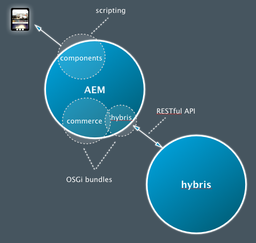

# Desarrollar con SAP Commerce Cloud {#developing-with-sap-commerce-cloud}

>[!NOTE]
>
>El marco de comercio electrónico se puede utilizar con cualquier solución de comercio electrónico. Algunos detalles y ejemplos que se tratan aquí se referirán a la solución [hybris](https://www.hybris.com/).

El marco de integración incluye una capa de integración con una API. Esto le permite:

* conectar un sistema de comercio electrónico y extraer los datos del producto en AEM

* crear componentes de AEM para capacidades comerciales independientes del motor de comercio electrónico específico



>[!NOTE]
>
>[También hay ](/help/sites-developing/ecommerce.md#api-documentation) documentación de API disponible.

Se proporcionan varios componentes de AEM listos para usar para utilizar la capa de integración. Actualmente son:

* un componente de visualización de productos
* un carro de compras
* cierre de compra

Para la búsqueda se proporciona un enlace de integración que le permite utilizar la búsqueda AEM, la búsqueda del sistema de comercio electrónico, una búsqueda de terceros (como Search&amp;Promote) o una combinación de ellos.

## Selección del motor de comercio electrónico {#ecommerce-engine-selection}

El marco de comercio electrónico se puede utilizar con cualquier solución de comercio electrónico; el motor que se utiliza debe ser identificable por AEM:

* Los motores de comercio electrónico son servicios OSGi que admiten la interfaz `CommerceService`

   * Los motores se pueden distinguir mediante una propiedad de servicio `commerceProvider`

* AEM admite `Resource.adaptTo()` para `CommerceService` y `Product`

   * La implementación `adaptTo` busca una propiedad `cq:commerceProvider` en la jerarquía del recurso:

      * Si se encuentra, el valor se utiliza para filtrar la búsqueda del servicio de comercio.

      * Si no se encuentra, se utiliza el servicio de comercio de mayor clasificación.
   * Se utiliza una mezcla `cq:Commerce` para que se pueda agregar la `cq:commerceProvider` a los recursos con establecimiento inflexible de tipos.


* La propiedad `cq:commerceProvider` también se utiliza para hacer referencia a la definición de fábrica de comercio adecuada.

   * Por ejemplo, una propiedad `cq:commerceProvider` con el valor `hybris` se correlacionará con la configuración OSGi para **Day CQ Commerce Factory for Hybris** (com.adobe.cq.commerce.hybris.impl.HybrisServiceFactory), donde el parámetro `commerceProvider` también tiene el valor `hybris`.

   * Aquí se pueden configurar otras propiedades, como **Catalog version** (cuando sea apropiado y esté disponible).

Consulte los siguientes ejemplos:

| `cq:commerceProvider = geometrixx` | en una instalación AEM estándar se requiere una implementación específica; por ejemplo, el ejemplo de geometrixx, que incluye extensiones mínimas de la API genérica |
|--- |--- |
| `cq:commerceProvider = hybris` | implementación de hybris |

### Ejemplo {#example}

```shell
/content/store
+ cq:commerceProvider = hybris
  + mens
    + polo-shirt-1
    + polo-shirt-2
    + employee
+ cq:commerceProvider = jcr
  + adobe-logo-shirt
    + cq:commerceType = product
    + price = 12.50
  + adobe-logo-shirt_S
    + cq:commerceType = variant
    + size = S
  + adobe-logo-shirt_XL
    + cq:commerceType = variant
    + size = XL
    + price = 14.50
```

>[!NOTE]
>
>Con CRXDE Lite puede ver cómo se gestiona esto en el componente de producto para la implementación de hybris:
>
>`/apps/geometrixx-outdoors/components/hybris/product/product.jsp`

### Desarrollo para hibris 4 {#developing-for-hybris}

La extensión híbris del marco de integración de comercio electrónico se ha actualizado para admitir Hybris 5, manteniendo al mismo tiempo la compatibilidad con Hybris 4.

La configuración predeterminada del código se ajusta para Hybris 5.

Para desarrollar Hybris 4 se requiere lo siguiente:

* Al invocar a maven, agregue el siguiente argumento de línea de comandos al comando

   `-P hybris4`

   Descarga la distribución preconfigurada de Hybris 4 y la incrusta en el paquete `cq-commerce-hybris-server`.

* En el administrador de configuración OSGi:

   * Deshabilite la compatibilidad con Hybris 5 para el servicio Analizador de respuestas predeterminado.

   * Asegúrese de que el servicio del controlador de autenticación básico de Hybris tenga una clasificación de servicio inferior a la del servicio del controlador OAuth de Hybris.

### Administración de sesiones {#session-handling}

hybris utiliza una sesión de usuario para almacenar información como el carro de compras del cliente. La identificación de sesión se devuelve de hybris en una cookie `JSESSIONID` que debe enviarse en solicitudes posteriores a hybris. Para evitar almacenar la identificación de sesión en el repositorio, se codifica en otra cookie almacenada en el explorador del comprador. Se realizan los siguientes pasos:

* En la primera solicitud no se establece ninguna cookie en la solicitud del comprador; por lo tanto, se envía una solicitud a la instancia de hybris para crear una sesión.

* Las cookies de sesión se extraen de la respuesta, se codifican en una nueva cookie (por ejemplo, `hybris-session-rest`) y se configuran en la respuesta al comprador. La codificación de una nueva cookie es obligatoria, ya que la cookie original solo es válida para una ruta determinada y, de lo contrario, no se enviaría de nuevo desde el explorador en solicitudes posteriores. La información de ruta también debe agregarse al valor de la cookie.

* En solicitudes posteriores, las cookies se descodifican de las cookies `hybris-session-<*xxx*>` y se configuran en el cliente HTTP que se utiliza para solicitar datos de hybris.

>[!NOTE]
>
>Se crea una sesión nueva anónima cuando la sesión original ya no es válida.

#### CommerceSession {#commercesession}

* Esta sesión &quot;posee&quot; el **carro de compras**

   * realiza tareas de adición/eliminación/etc.

   * realiza los distintos cálculos en el carro de compras;

      `commerceSession.getProductPrice(Product product)`

* Tiene la *ubicación de almacenamiento* para los datos **order**

   `CommerceSession.getUserContext()`

* También posee la conexión de procesamiento **pago**

* También posee la conexión **de despacho**

### Sincronización y publicación de productos {#product-synchronization-and-publishing}

Los datos del producto que se mantienen en hibris deben estar disponibles en AEM. Se ha aplicado el siguiente mecanismo:

* Una carga inicial de ID la proporciona hybris como fuente. Puede haber actualizaciones en esta fuente.
* hybris proporcionará información de actualización a través de una fuente (que AEM encuestas).
* Cuando AEM utiliza datos del producto, enviará solicitudes de nuevo a hybris para los datos actuales (solicitud de obtención condicional con la última fecha de modificación).
* En el caso de la hibris, es posible especificar el contenido de los piensos de forma declarativa.
* La asignación de la estructura de fuente al modelo de contenido de AEM se produce en el adaptador de fuente del lado AEM.


* El importador (b) se utiliza para la configuración inicial de la estructura de árbol de páginas en AEM para catálogos.
* Los cambios en el catálogo de los híbridos se indican para AEM mediante una fuente, que luego se propagan a la AEM b).

   * Producto agregado/eliminado/modificado con respecto a la versión del catálogo.

   * Producto aprobado.

* La extensión hybris proporciona un importador de encuestas (&quot;esquema de híbridos&quot;), que puede configurarse para importar cambios en AEM en un intervalo especificado (por ejemplo, cada 24 horas en las que el intervalo se especifica en segundos):

   ```JavaScript
       http://localhost:4502/content/geometrixx-outdoors/en_US/jcr:content.json
        {
        * "jcr:mixinTypes": ["cq:PollConfig"],
        * "enabled": true,
        * "source": "hybris:outdoors",
        * "jcr:primaryType": "cq:PageContent",
        * "interval": 86400
        }
   ```

* La configuración de catálogo de AEM reconoce las **versiones de catálogo de almacenamiento en etapas** y **en línea**.

* La sincronización de productos entre las versiones del catálogo requerirá una (des)activación de la página de AEM correspondiente (a, c)

   * Añadir un producto en una versión de catálogo **Online** requiere la activación de la página del producto.

   * La eliminación de un producto requiere la desactivación.

* La activación de una página en el AEM c) requiere una marca de verificación b) y sólo es posible si

   * El producto está en una **versión de catálogo en línea** para páginas de producto.

   * Los productos a los que se hace referencia están disponibles en una **versión de catálogo en línea** para otras páginas (por ejemplo: páginas de campaña).

* Las páginas de productos activadas deben tener acceso a la versión (d) **en línea** de los datos del producto.

* La instancia de publicación de AEM requiere acceso a hybris para la recuperación de datos personalizados y del producto (d).

### Arquitectura {#architecture}

#### Arquitectura del producto y las variantes {#architecture-of-product-and-variants}

Un solo producto puede tener varias variaciones; por ejemplo, puede variar según el color o el tamaño. Un producto debe definir qué propiedades impulsan la variación; denominamos estos *ejes de variante*.

Sin embargo, no todas las propiedades son ejes de variante. Las variaciones también pueden afectar a otras propiedades; por ejemplo, el precio puede depender del tamaño. Estas propiedades no pueden ser seleccionadas por el comprador y, por lo tanto, no se consideran ejes de variante.

Cada producto o variante está representado por un recurso y, por lo tanto, asigna 1:1 a un nodo de repositorio. Es un corolario que un producto específico y/o una variante se puedan identificar de forma única por su trayectoria.

El recurso de producto/variante no siempre contiene los datos reales del producto. Puede ser una representación de los datos que realmente se poseen en otro sistema (como hybris). Por ejemplo: las descripciones de productos, los precios, etc., no se almacenan en AEM, sino que se recuperan en tiempo real desde el motor de comercio electrónico.

Cualquier recurso de producto puede representarse mediante `Product API`. La mayoría de las llamadas de la API de producto son específicas de la variación (aunque las variaciones pueden heredar valores compartidos de un antecesor), pero también hay llamadas que lista el conjunto de variaciones ( `getVariantAxes()`, `getVariants()`, etc.).

>[!NOTE]
>
>De hecho, los ejes de variante se determinan por el resultado que `Product.getVariantAxes()` devuelve:
>* hybris lo define para la implementación de hybris
>
>
Mientras que los productos (en general) pueden tener muchos ejes de variante, el componente de producto listo para usar solo gestiona dos:
>
>1. `size`
   >
   >
1. más uno más
>
>
Esta variante adicional se selecciona mediante la propiedad `variationAxis` de la referencia del producto (generalmente `color` para Geometrixx Outdoors).

#### Referencias del producto y datos del producto {#product-references-and-product-data}

En general:

* los datos del producto se encuentran en `/etc`

* y referencias de producto en `/content`.

Debe haber un mapa 1:1 entre las variaciones del producto y los nodos de datos del producto.

Las referencias de producto también deben tener un nodo para cada variación presentada, pero no es necesario presentar todas las variaciones. Por ejemplo, si un producto tiene variaciones S, M, L, los datos del producto pueden ser:

```shell
etc
|──commerce
|  |──products
|     |──shirt
|       |──shirt-s
|       |──shirt-m
|       |──shirt-l
```

Mientras que un catálogo &quot;grande y alto&quot; solo puede tener:

```shell
content
|──big-and-tall
|  |──shirt
|     |──shirt-l
```

Por último, no es necesario utilizar los datos del producto. Puede colocar todos los datos del producto debajo de las referencias en el catálogo; pero no puede tener varios catálogos sin duplicar todos los datos del producto.

**API**

#### com.adobe.cq.commerce.api.Interfaz de producto {#com-adobe-cq-commerce-api-product-interface}

```java
public interface Product extends Adaptable {

    public String getPath();            // path to specific variation
    public String getPagePath();        // path to presentation page for all variations
    public String getSKU();             // unique ID of specific variation

    public String getTitle();           // shortcut to getProperty(TITLE)
    public String getDescription();     // shortcut to getProperty(DESCRIPTION)
    public String getImageUrl();        // shortcut to getProperty(IMAGE_URL)
    public String getThumbnailUrl();    // shortcut to getProperty(THUMBNAIL_URL)

    public <T> T getProperty(String name, Class<T> type);

    public Iterator<String> getVariantAxes();
    public boolean axisIsVariant(String axis);
    public Iterator<Product> getVariants(VariantFilter filter) throws CommerceException;
}
```

#### com.adobe.cq.commerce.api.VariantFilter {#com-adobe-cq-commerce-api-variantfilter}

```java
/**
 * Interface for filtering variants and AxisFilter provided as common implementation
 *
 * The <code>VariantFilter</code> is used to filter variants,
 * e.g. when using {@link Product#getVariants(VariantFilter filter)}.
 */
public interface VariantFilter {
    public boolean includes(Product product);
}

/**
 * A {@link VariantFilter} for filtering variants by the given
 * axis and value. The following example returns a list of
 * variant products that have a value of <i>blue</i> on the
 * <i>color</i> axis.
 *
 * <p>
 * <code>product.getVariants(new AxisFilter("color", "blue"));</code>
 */
public class AxisFilter implements VariantFilter {

    private String axis;
    private String value;

    public AxisFilter(String axis, String value) {
        this.axis = axis;
        this.value = value;
    }

    /**
     * {@inheritDoc}
     */
    public boolean includes(Product product) {
        ValueMap values = product.adaptTo(ValueMap.class);

        if(values != null) {
            String v = values.get(axis, String.class);

            return v != null && v == value;
        }

        return false;
    }
}
```

* **Mecanismo general de Almacenamiento**

   * Los nodos de producto son `nt:unstructured`.

   * Un nodo de producto puede ser:

      * Una referencia, con los datos del producto almacenados en otra parte:

         * Las referencias de producto contienen una propiedad `productData`, que apunta a los datos del producto (generalmente en `/etc/commerce/products`).

         * Los datos del producto son jerárquicos; los atributos de producto se heredan de los antecesores de un nodo de datos de producto.

         * Las referencias de producto también pueden contener propiedades locales, que anulan las especificadas en los datos de producto.
      * Un producto en sí mismo:

         * Sin una propiedad `productData`.

         * Un nodo de producto que contiene todas las propiedades localmente (y no contiene una propiedad productData) hereda los atributos de producto directamente de sus propios antecesores.


* **Estructura de producto AEM-genérica**

   * Cada variante debe tener su propio nodo de hoja.

   * La interfaz de producto representa productos y variantes, pero el nodo de repositorio relacionado es específico sobre cuál es.

   * El nodo product describe los atributos del producto y los ejes de variante.

#### Ejemplo {#example-1}

```shell
+ banyan_shirt
    - cq:commerceType = product
    - cq:productAttributes = [jcr:title, jcr:description, size, price, color]
    - cq:productVariantAxes = [color, size]
    - jcr:title = Banyan Shirt
    - jcr:description = Flowery, all-cotton shirt.
    - price = 14.00
    + banyan_shirt_s
        - cq:commerceType = variant
        - size = S
        + banyan_shirt_s_red
            - cq:commerceType = variant
            - color = red
        + banyan_shirt_s_blue
            - cq:commerceType = variant
            - color = blue
    + banyan_shirt_m
        - cq:commerceType = variant
        - size = M
        + banyan_shirt_m_red
            - cq:commerceType = variant
            - color = red
        + banyan_shirt_m_blue
            - cq:commerceType = variant
            - color = blue
    + banyan_shirt_l
        - cq:commerceType = variant
        - size = L
        + banyan_shirt_l_red
            - cq:commerceType = variant
            - color = red
        + banyan_shirt_l_blue
            - cq:commerceType = variant
            - color = blue
    + banyan_shirt_xl
        - cq:commerceType = variant
        - size = XL
        - price = 18.00
```

#### Arquitectura del carro de compras {#architecture-of-the-shopping-cart}

**Componentes**

* El carro de compras es propiedad del `CommerceSession:`

   * El `CommerceSession` realiza add/remove/etc.
   * El `CommerceSession` también realiza los diversos cálculos en el carro de compras. &quot;

* Aunque no está directamente relacionado con el carro de compras, `CommerceSession` también debe proporcionar información de precios de catálogo (ya que posee precios)

   * Los precios pueden tener varios modificadores:

      * Descuentos de cantidad.
      * Diferentes monedas.
      * IVA y libre de IVA.
   * Los modificadores están completamente abiertos con la siguiente interfaz:

      * `int CommerceSession.getQuantityBreakpoints(Product product)`
      * `String CommerceSession.getProductPrice(Product product)`


**Almacenamiento**

* Almacenamiento

   * En el caso hybris, el servidor hybris posee el carro de compras.
   * En el caso de los carros de AEM genéricos se almacenan en el [ClientContext](/help/sites-administering/client-context.md).

**Personalización**

* La personalización siempre debe impulsarse a través del [ClientContext](/help/sites-administering/client-context.md).
* Se crea un ClientContext `/version/` del carro de compras en todos los casos:

   * Los productos deben agregarse mediante el método `CommerceSession.addCartEntry()`.

* A continuación se muestra un ejemplo de información del carro de compras en el carro de ClientContexts:


#### Arquitectura de cierre de compra {#architecture-of-checkout}

**Datos de pedido y carro de compras**

El `CommerceSession` posee los tres elementos:

1. Contenido del carro de compras
1. Precios
1. Detalles del pedido

1. **Contenido del carro de compras**

   La API corrige el esquema de contenido del carro de compras:

   ```java
   public void addCartEntry(Product product, int quantity);
   public void modifyCartEntry(int entryNumber, int quantity);
   public void deleteCartEntry(int entryNumber);
   ```

1. **Precios**

   La API también fija el esquema de precios:

   ```java
   public String getCartPreTaxPrice();
   public String getCartTax();
   public String getCartTotalPrice();
   public String getOrderShipping();
   public String getOrderTotalTax();
   public String getOrderTotalPrice();
   ```

1. **Detalles del pedido**

   Sin embargo, los detalles del pedido *no* son corregidos por la API:

   ```java
   public void updateOrderDetails(Map<String, String> orderDetails);
   public Map<String, String> getOrderDetails();
   public void submitOrder();
   ```

**Cálculos de envío**

* Los formularios de pedido suelen necesitar presentar varias opciones de envío (y precios).
* Los precios pueden basarse en artículos y detalles del pedido, como peso o dirección de envío.
* El `CommerceSession` tiene acceso a todas las dependencias, por lo que se puede tratar de manera similar a los precios del producto:

   * El `CommerceSession` tiene precios de envío.
   * Puede recuperar o actualizar los detalles del envío mediante `updateOrder(Map<String, Object> delta)`

>[!NOTE]
>
>Podría implementar un selector de envío; por ejemplo:
>
>`yourProject/commerce/components/shippingpicker`:
>
>* Básicamente podría ser una copia de `foundation/components/form/radio`, pero con rellamadas a `CommerceSession` para:
   >
   >
* Comprobando si el método está disponible
>* Añadir información de precios
>* Para permitir que los compradores actualicen la página de pedidos en AEM (incluyendo el superconjunto de métodos de envío y el texto que los describe), mientras que aún tienen el control de exponer la información relevante `CommerceSession`.


**Procesamiento de pagos**

* El `CommerceSession` también es propietario de la conexión de procesamiento de pagos.

* Los implementadores deben agregar llamadas específicas (a su servicio de procesamiento de pagos elegido) a la implementación `CommerceSession`.

**Cumplimiento de pedido**

* El `CommerceSession` también posee la conexión de despacho.
* Los implementadores deberán agregar llamadas específicas (al servicio de procesamiento de pagos que hayan elegido) a la implementación `CommerceSession`.

### Definición de búsqueda {#search-definition}

Siguiendo el modelo de API de servicio estándar, el proyecto eCommerce proporciona un conjunto de API relacionadas con la búsqueda que pueden ser implementadas por motores de comercio individuales.

>[!NOTE]
>
>Actualmente, sólo el motor de híbris implementa la API de búsqueda lista para usar.
>
>Sin embargo, la API de búsqueda es genérica y cada CommerceService puede implementarla individualmente.

El proyecto eCommerce contiene un componente de búsqueda predeterminado, ubicado en:

`/libs/commerce/components/search`


Esto hace uso de la API de búsqueda para la consulta del motor de comercio seleccionado (consulte [Selección del motor de comercio electrónico](#ecommerce-engine-selection)):

#### API de búsqueda {#search-api}

Existen varias clases genéricas/de ayuda proporcionadas por el proyecto principal:

1. `CommerceQuery`

   Se utiliza para describir una consulta de búsqueda (contiene información sobre el texto de la consulta, la página actual, el tamaño de la página, la clasificación y las facetas seleccionadas). Todos los servicios de comercio electrónico que implementan la API de búsqueda recibirán instancias de esta clase para realizar la búsqueda. Se puede crear una instancia de `CommerceQuery` a partir de un objeto de solicitud ( `HttpServletRequest`).

1. `FacetParamHelper`

   Es una clase de utilidad que proporciona un método estático - `toParams` - que se utiliza para generar cadenas de parámetro `GET` a partir de una lista de facetas y un valor alternado. Esto resulta útil en la interfaz de usuario, donde debe mostrar un hipervínculo para cada valor de cada faceta, de modo que cuando el usuario haga clic en el hipervínculo, se alternará el valor correspondiente (es decir, si se seleccionó, se eliminará de la consulta; de lo contrario, se agregará). Esto tiene en cuenta toda la lógica de manejo de facetas de varios valores o de un solo valor, valores de anulación, etc.

El punto de entrada para la API de búsqueda es el método `CommerceService#search` que devuelve un objeto `CommerceResult`. Consulte la [Documentación de API](/help/sites-developing/ecommerce.md#api-documentation) para obtener más información sobre este tema.

### Integración de usuario {#user-integration}

La integración se proporciona entre AEM y varios sistemas de comercio electrónico. Esto requiere una estrategia para sincronizar a los compradores entre los distintos sistemas, de modo que el código específico de AEM solo tenga que saber sobre AEM y viceversa:

* Autenticación

   AEM se presume que es el *solo* front-end web y, por lo tanto, realiza *autenticación de todo*.

* Cuentas en Hibris

   AEM crea una cuenta correspondiente (subordinada) en hibris para cada comprador. El nombre de usuario de esta cuenta es el mismo que el nombre de usuario AEM. Una contraseña criptográficamente aleatoria se genera automáticamente y se almacena (codificada) en AEM.

#### Usuarios preexistentes {#pre-existing-users}

Se puede posicionar un front-end AEM frente a una implementación híbrida existente. También se puede agregar un motor híbrido a una instalación de AEM existente. Para ello, los sistemas deben ser capaces de gestionar correctamente a los usuarios existentes en cualquiera de los sistemas:

* AEM -> híbrido

   * Al iniciar sesión en hybris, si el usuario AEM no existe:

      * crear un nuevo usuario con una contraseña criptográficamente aleatoria
      * almacenar el nombre de usuario de hybris en el directorio de usuarios del AEM usuario
   * Consulte: `com.adobe.cq.commerce.hybris.impl.HybrisSessionImpl#login()`


* hybris -> AEM

   * Al iniciar sesión en AEM, si el sistema reconoce al usuario:

      * intento de iniciar sesión en hybris con el nombre de usuario/pwd proporcionado
      * si la operación se realiza correctamente, cree el nuevo usuario en AEM con la misma contraseña (la salina específica del AEM dará como resultado un hash específico del AEM)
   * El algoritmo anterior se implementa en un Sling `AuthenticationInfoPostProcessor`

      * Consulte: `com.adobe.cq.commerce.hybris.impl.user.LazyUserImporter.java`


### Personalización del proceso de importación {#customizing-the-import-process}

Para crear a partir de la funcionalidad existente, el controlador de importación personalizado:

* tiene que implementar la interfaz `ImportHandler`

* puede extender el `DefaultImportHandler`.

```java
/**
 * Services implementing the <code>ImportHandler</code> interface are
 * called by the {@link HybrisImporter} to create actual commerce entities
 * such as products.
 */
public interface ImportHandler {

  /**
  * Not used.
  */
  public void createTaxonomie(ImporterContext ctx);

  /**
  * Creates a catalog with the given name.
  * @param ctx   The importer context
  * @param name  The catalog's name
  * @return Path of created catalog
  */
  public String createCatalog(ImporterContext ctx, String name) throws Exception;

  /**
  * Creates a product from the given values.
  * @param ctx                The importer context
  * @param values             The product's properties
  * @param parentCategoryPath The containing category's path
  * @return Path of created product
  */
  public String createProduct(ImporterContext ctx, ValueMap values, String parentCategoryPath) throws Exception;

  /**
  * Creates a variant product from the given values.
  * @param ctx             The importer context
  * @param values          The product's properties
  * @param baseProductPath The base product's path
  * @return Path of created product
  */
  public String createVariantProduct(ImporterContext ctx, ValueMap values, String baseProductPath) throws Exception;

  /**
  * Creates an asset for a product. This is usually a product
  * image.
  * @param ctx             The importer context
  * @param values          The product's properties
  * @param baseProductPath The product's path
  * @return Path of created asset
  */
  public String createAsset(ImporterContext ctx, ValueMap values, String productPath) throws Exception;

  /**
  * Creates a category from the given values.
  * @param ctx           The importer context
  * @param values        The category's properties
  * @param parentPath    Path of parent category or base path of import in case of root category
  * @return Path of created category
  */
  public String createCategory(ImporterContext ctx, ValueMap values, String parentCategoryPath) throws Exception;
}
```

Para que el importador reconozca su controlador personalizado, debe especificar la propiedad `service.ranking`con un valor mayor que 0; por ejemplo.

```java
@Component
@Service
@Property(name = "service.ranking", value = 100)
public class MyImportHandler extends DefaultImportHandler
{
...
}
```
