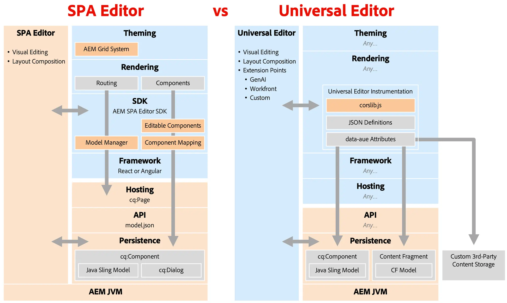

# Finalización del soporte para el editor de SPA {#spa-editor-deprecation}

Aunque el Editor SPA sigue siendo compatible con Adobe, conozca qué significa su desaprobación para el proyecto y qué opciones tiene para futuros proyectos.

## Resumen {#summary}

Adobe ha desaprobado el Editor SPA con la [versión 6.5.23 de AEM 6.5,](/help/release-notes/release-notes.md#spa-editor), lo que significa que no se realizarán más mejoras ni actualizaciones en sus SDK. Adobe recomienda usar el [Editor universal](/help/sites-developing/universal-editor/introduction.md) para cualquier proyecto nuevo sin encabezado a fin de aprovechar las últimas innovaciones de AEM.

## Detalles de obsolescencia {#details}

La desaprobación del Editor de SPA **no significa la eliminación inmediata**, y si tiene implementaciones existentes, **puede seguir usándolo siempre que satisfaga sus necesidades.** Sin embargo, tenga en cuenta las siguientes implicaciones de su desuso.

* En el futuro, Adobe solo solucionará los problemas de seguridad y las vulnerabilidades de seguridad de P1 y P2.
* No se realizarán más desarrollos, mejoras ni actualizaciones en sus SDK.

La desuso significa que los siguientes SDK están ahora inmovilizados de funciones.

* [Tipo de archivo del proyecto AEM](https://github.com/adobe/aem-project-archetype/)
* [Núcleo del proyecto de la SPA de AEM](https://github.com/adobe/aem-spa-project-core)
* [Administrador del modelo de página SPA de AEM](https://github.com/adobe/aem-spa-page-model-manager)
* [Asignación de componentes de la SPA de AEM](https://github.com/adobe/aem-spa-component-mapping)
* [Componentes editables de React de SPA de AEM](https://github.com/adobe/aem-react-editable-components)
   * [Componentes principales de AEM React](https://github.com/adobe/aem-react-core-wcm-components)
   * [Base de componentes principales de AEM React](https://github.com/adobe/aem-react-core-wcm-components-base)
   * [SPA de componentes principales de AEM React](https://github.com/adobe/aem-react-core-wcm-components-spa)
   * [Ejemplos de componentes principales de AEM React](https://github.com/adobe/aem-react-core-wcm-components-examples)
* [Componentes editables de AEM SPA Angular](https://github.com/adobe/aem-angular-editable-components)
   * [Componentes principales de AEM Angular](https://github.com/adobe/aem-angular-core-wcm-components)
   * [Base de componentes principales de AEM Angular](https://github.com/adobe/aem-angular-core-wcm-components-base)
   * [SPA de componentes principales de AEM Angular](https://github.com/adobe/aem-angular-core-wcm-components-spa)
   * [Ejemplos de componentes principales de AEM Angular](https://github.com/adobe/aem-angular-core-wcm-components-examples)
* [Componentes editables de AEM SPA Vue](https://github.com/mavicellc/aem-vue-editable-components)

## Alternativas al Editor de SPA {#alternatives}

El reemplazo más adecuado para el Editor SPA depende de las necesidades de sus proyectos.

* **[El editor universal](/help/sites-developing/universal-editor/introduction.md)** es el mejor reemplazo directo del editor de SPA.
   * El editor universal también es un editor visual y se diseñó específicamente para implementaciones disociadas, incorporando toda la experiencia de Adobe del editor de SPA.
   * El editor universal también se ha [publicado para AEM as a Cloud Service](https://experienceleague.adobe.com/es/docs/experience-manager-cloud-service/content/implementing/developing/universal-editor/introduction) y, por lo tanto, admite AMS y casos de uso locales, además de Cloud Services.
* **[El editor de fragmentos de contenido](/help/sites-developing/universal-editor/introduction.md)** es una alternativa para aquellos que prefieren un editor basado en formularios.
   * El Editor de fragmentos de contenido es más adecuado cuando el contenido está estructurado como fragmentos de contenido en lugar de como páginas.

La estructuración del contenido con fragmentos de contenido no excluye el uso del Editor universal como editor visual, y ambos editores se pueden utilizar juntos.

## Migración al editor universal {#migrate-ue}

El editor universal ofrece muchas ventajas, por lo que la migración a él es una excelente solución para nuevos proyectos.

* **Edición visual:** Al igual que para el Editor de SPA, los autores pueden editar contenido directamente dentro de la vista previa y ver al instante cómo sus cambios afectan la experiencia del visitante.
* **Revisión para el futuro:** La hoja de ruta de AEM da prioridad al Editor universal como editor visual. Su adopción garantiza el acceso a las últimas innovaciones y mejoras.
* **Integración más sencilla:** No se requiere SDK específico de AEM para usar el Editor universal, lo que reduce el bloqueo de pila tecnológica.
* **Traer su propia aplicación:** El editor universal admite cualquier marco web o arquitectura, lo que permite la adopción sin requerir una refactorización compleja.
* **Extensibilidad:** El editor universal se beneficia de un marco de trabajo de [extensión sólido,](https://experienceleague.adobe.com/es/docs/experience-manager-cloud-service/content/implementing/developing/universal-editor/extending) que incluye integraciones con GenAI, Workfront y más.

No hay una ruta de migración directa del Editor de SPA al Editor universal. Esto se debe a diferencias fundamentales entre las dos tecnologías.

* El editor universal no vuelve a introducir funciones como el editor de plantillas, el sistema de estilos o la cuadrícula interactiva.
   * Estos casos de uso ahora se pueden administrar de forma más eficaz con CSS y JS de front-end delgados en proyectos de Edge Delivery Services o sin encabezado.
* Dado que el editor universal es un editor como servicio, no puede permitir a los implementadores insertar CSS o JS en los cuadros de diálogo de componentes.
   * Esto evita la conversión automática de los cuadros de diálogo de componentes desde el Editor de páginas.
   * Esto afecta a muchas áreas de los cuadros de diálogo, como widgets personalizados, validación de campos, reglas de mostrar/ocultar y personalizaciones basadas en plantillas.

Teniendo en cuenta estas diferencias técnicas, la recomendación de Adobe es:

* Mantenga los sitios de SPA Editor tal como están, ya que la compatibilidad con continúa.
* Adopte el Editor universal para todos los nuevos desarrollos, incluidos nuevos sitios, secciones o páginas.

Tenga en cuenta que aunque no hay implementación directa de ciertas funciones del Editor de SPA en el Editor Universal, hay nuevas formas de resolver los mismos problemas usando la nueva flexibilidad del Editor Universal.

## Comparación del Editor de SPA y el Editor Universal {#spa-vs-ue}

El editor universal ofrece mucha más libertad a los implementadores de aplicaciones web, como se ilustra en este diagrama.

|  | Editor de SPA  | Editor universal |
|---|---|---|
| **Tema** | La aplicación debe implementar el diseño con la cuadrícula CSS de AEM. | La aplicación puede utilizar cualquier técnica CSS moderna para el diseño. |
| **Procesando** | La aplicación debe seguir la estructura de enrutamiento del Editor de SPA. | La aplicación se puede implementar libremente, sin reglas impuestas o patrones a seguir. |
| **SDK** | La implementación debe integrar estrechamente SDK. | En el nivel de creación, la aplicación solo carga `corlib.js` e indica al editor universal mediante anotaciones de HTML. |
| **Marco** | La aplicación debe utilizar una versión compatible de React o Angular. | La aplicación puede utilizar cualquier marco o arquitectura. |
| **Alojamiento** | La aplicación debe estar alojada en el dominio de AEM. | La aplicación se puede desacoplar completamente y alojar en cualquier lugar. |
| **API** | La aplicación debe recuperar contenido de la API `model.json`. | La aplicación puede utilizar cualquier API, incluidas las personalizadas. |
| **Persistencia** | El Editor SPA solo admite contenido de página para la edición visual. | El editor universal admite de forma nativa la edición visual de páginas y fragmentos de contenido. |
|  |  | El editor universal se puede ampliar para editar contenido externo con las mismas capacidades visuales. |
|  | Los desarrolladores deben implementar modelos Sling y `cq:Dialog` en AEM. | Los desarrolladores necesitan poca o ninguna experiencia de AEM y no necesitan escribir ningún Java. |
