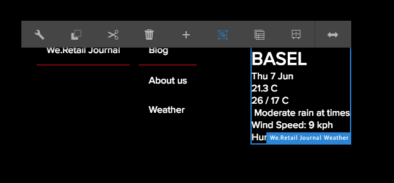

# Implementación de un componente de React para SPA{#implementing-a-react-component-for-spa}

Las aplicaciones de una sola página (SPA) pueden ofrecer experiencias atractivas para los usuarios de sitios web. SPA Los desarrolladores quieren poder crear sitios utilizando marcos de trabajo de y los autores quieren editar contenido dentro de Adobe Experience Manager AEM SPA () sin problemas para un sitio creado con marcos de trabajo de la.

SPA SPA AEM La función de creación de ofrece una solución completa para la asistencia de la creación de contenido en el ámbito de la. AEM SPA En este artículo se presenta un ejemplo de cómo adaptar un componente React simple y existente para trabajar con el Editor de.

>[!NOTE]
>
>SPA SPA El Editor de segmentos es la solución recomendada para los proyectos que requieren un procesamiento basado en el cliente basado en el marco de trabajo de la aplicación (por ejemplo, React o Angular) de la aplicación de la aplicación de la manera más sencilla posible.

## Introducción {#introduction}

AEM SPA SPA Gracias al contrato sencillo y ligero que requiere el usuario y que se establece entre el editor de la y el editor de la misma, es sencillo tomar una aplicación de JavaScript SPA AEM existente y adaptarla para su uso con un en la aplicación de la que ya se dispone en el editor de la misma, ya que es un asunto sencillo.

SPA Este artículo ilustra el ejemplo del componente meteorológico en la muestra de We.Retail Journal.

SPA AEM Antes de leer este artículo, debería estar familiarizado con la estructura [de una aplicación de para el recurso de la aplicación de la aplicación de la aplicación de la](/help/sites-developing/spa-getting-started-react.md).

>[!CAUTION]
>Este documento usa la [aplicación We.Retail Journal](https://github.com/adobe/aem-sample-we-retail-journal) únicamente con fines de demostración. No lo utilice para ningún trabajo de proyecto.
>
>Cualquier proyecto AEM debería utilizar el [Tipo de archivo del proyecto AEM](https://experienceleague.adobe.com/docs/experience-manager-core-components/using/developing/archetype/overview.html?lang=es), que admite proyectos de SPA que utilizan React o Angular y aprovecha el SDK de SPA.

## El componente Meteorológico {#the-weather-component}

El componente meteorológico se encuentra en la parte superior izquierda de la aplicación We.Retail Journal. Muestra el tiempo actual de una ubicación definida, extrayendo datos meteorológicos de forma dinámica.

### Uso del widget del tiempo {#using-the-weather-widget}


SPA SPA AEM Al crear contenido de la en el Editor de, el componente meteorológico aparece como cualquier otro componente de la, se completa con una barra de herramientas y se puede editar.



AEM La ciudad se puede actualizar en un cuadro de diálogo como cualquier otro componente de la.


El cambio se mantiene y el componente se actualiza automáticamente con nuevos datos meteorológicos.


### Implementación del componente meteorológico {#weather-component-implementation}

El componente meteorológico se basa en un componente React disponible públicamente, llamado [React Open Weather](https://www.npmjs.com/package/react-open-weather). SPA Se ha adaptado para que funcione como un componente dentro de la aplicación de ejemplo de We.Retail Journal.

Los siguientes son fragmentos de la documentación de NPM del uso del componente React Open Weather.

 

Revisando el código del componente meteorológico personalizado (`Weather.js`) en la aplicación We.Retail Journal:

* **Línea 16**: El widget React Open Weather se carga según sea necesario.
* AEM SPA **Línea 46**: La función `MapTo` relaciona este componente de React con un componente de correspondiente para que se pueda editar en el Editor de la.

* **Líneas 22-29**: se define `EditConfig`, comprobando si la ciudad se ha rellenado y definiendo el valor si está vacío.

* **Líneas 31-44**: El componente Meteorológico amplía la clase `Component` y proporciona los datos necesarios definidos en la documentación de uso de NPM para el componente React Open Weather y procesa el componente.

```javascript
/*~~~~~~~~~~~~~~~~~~~~~~~~~~~~~~~~~~~~~~~~~~~~~~~~~~~~~~~~~~~~~~~~~~~~~~~~~~~~~~
 ~ Copyright 2018 Adobe Systems Incorporated
 ~
 ~ Licensed under the Apache License, Version 2.0 (the "License");
 ~ you may not use this file except in compliance with the License.
 ~ You may obtain a copy of the License at
 ~
 ~     https://www.apache.org/licenses/LICENSE-2.0
 ~
 ~ Unless required by applicable law or agreed to in writing, software
 ~ distributed under the License is distributed on an "AS IS" BASIS,
 ~ WITHOUT WARRANTIES OR CONDITIONS OF ANY KIND, either express or implied.
 ~ See the License for the specific language governing permissions and
 ~ limitations under the License.
 ~~~~~~~~~~~~~~~~~~~~~~~~~~~~~~~~~~~~~~~~~~~~~~~~~~~~~~~~~~~~~~~~~~~~~~~~~~~~~*/
import React, {Component} from 'react';
import ReactWeather from 'react-open-weather';
import {MapTo} from '@adobe/aem-react-editable-components';

require('./Weather.css');

const WeatherEditConfig = {

    emptyLabel: 'Weather',

    isEmpty: function() {
        return !this.props || !this.props.cq_model || !this.props.cq_model.city || this.props.cq_model.city.trim().length < 1;
    }
};

class Weather extends Component {

    render() {
        let apiKey = "12345678901234567890";
        let city;

        if (this.props.cq_model) {
            city = this.props.cq_model.city;
            return <ReactWeather key={'react-weather' + Date.now()} forecast="today" apikey={apiKey} type="city" city={city} />
        }

        return null;
    }
}

MapTo('we-retail-journal/global/components/weather')(Weather, WeatherEditConfig);
```

SPA Aunque ya debe existir un componente back-end, el desarrollador front-end puede utilizar el componente React Open Weather en la interfaz de usuario de We.Retail Journal con poca codificación.

## Siguiente paso {#next-step}

SPA AEM SPA AEM Para obtener más información acerca del desarrollo de la para obtener más información, consulte el artículo [Desarrollo de la para el usuario ](/help/sites-developing/spa-architecture.md).
