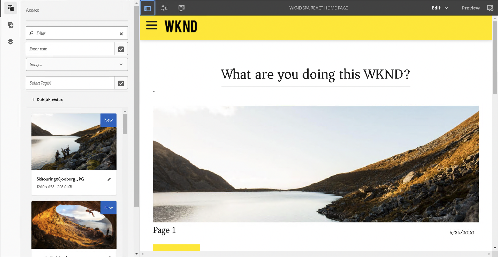
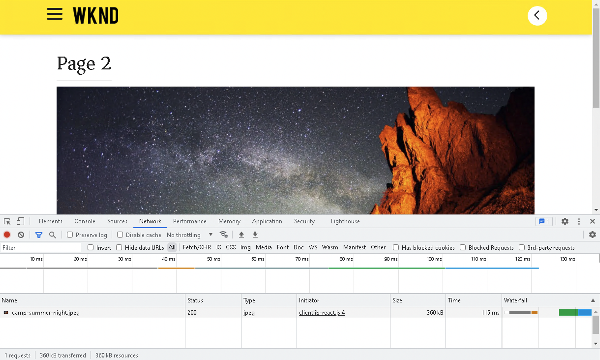

# Introducción y tutorial de SPA {#spa-introduction-and-walkthrough}

Las aplicaciones de una sola página (SPA) pueden ofrecer experiencias atractivas para los usuarios de sitios web. Los desarrolladores quieren poder generar sitios usando marcos de SPA y los autores quieren editar contenido dentro de AEM para un sitio generado usando dichos marcos.

El Editor de SPA ofrece una solución completa para admitir las SPA dentro de AEM. Este artículo presenta el uso de una aplicación SPA básica para la creación y muestra cómo se relaciona con el Editor de SPA de AEM subyacente.

>[!NOTE]
>
>SPA SPA El editor de segmentos es la solución recomendada para los proyectos que requieren un procesamiento basado en el marco de trabajo del cliente basado en el marco de trabajo de la aplicación (por ejemplo, React o Angular).

## Introducción {#introduction}

### Objetivo del artículo {#article-objective}

Este artículo presenta los conceptos básicos de las SPA antes de guiar al lector a través de un tutorial del editor de SPA utilizando una sencilla aplicación de SPA para demostrar la edición básica del contenido. A continuación, se profundiza en la construcción de la página y en cómo se relaciona la aplicación SPA con el Editor de SPA de AEM y cómo interactúa con ella.

La meta de esta introducción y tutorial es demostrar a un desarrollador AEM por qué los SPA son relevantes, cómo funcionan en general, cómo el editor de SPA gestiona las SPA y cómo es diferente de una aplicación AEM estándar.

## Requisitos  {#requirements}

El tutorial se basa en la funcionalidad AEM estándar y en la aplicación de proyecto WKND SPA de ejemplo. Para seguir con este tutorial, debe tener disponible lo siguiente.

* [AEM Versión 6.5.4 o posterior de](/help/release-notes/release-notes.md)
   * Debe tener derechos de administrador en el sistema.
* [La aplicación de proyecto WKND SPA de ejemplo está disponible en GitHub](https://github.com/adobe/aem-guides-wknd-spa)
   * Descargue la [Última versión de la aplicación React.](https://github.com/adobe/aem-guides-wknd-spa/releases) Recibirá un nombre similar al siguiente `wknd-spa-react.all.classic-X.Y.Z-SNAPSHOT.zip`.
   * Descargue la [últimas imágenes de muestra](https://github.com/adobe/aem-guides-wknd-spa/releases) para la aplicación. Recibirá un nombre similar al siguiente `wknd-spa-sample-images-X.Y.Z.zip`.
   * [Uso del administrador de paquetes](/help/sites-administering/package-manager.md) AEM para instalar los paquetes como lo haría con cualquier otro paquete en el que se haya realizado la instalación de un paquete en el espacio de trabajo de.
   * No es necesario instalar la aplicación mediante Maven para realizar este tutorial.

>[!CAUTION]
>
>Este documento usa el [Aplicación de proyecto de spa WKND](https://github.com/adobe/aem-guides-wknd-spa) únicamente con fines de demostración. No debe utilizarse para ningún trabajo de proyecto.
>
>AEM Cualquier proyecto de debería aprovechar la variable [AEM Arquetipo de proyecto de,](https://experienceleague.adobe.com/docs/experience-manager-core-components/using/developing/archetype/overview.html?lang=es) SPA que admite proyectos de mediante React o Angular SPA y aprovecha el SDK de la.

### ¿Qué es una SPA? {#what-is-a-spa}

Una aplicación de una sola página (SPA) difiere de una página convencional en que se procesa en el lado del cliente y principalmente está dirigida por JavaScript, y se basa en llamadas Ajax para cargar datos y actualizar la página de forma dinámica. La mayoría o todo el contenido se recupera una vez en una carga de una sola página con recursos adicionales cargados asincrónicamente según sea necesario en función de la interacción del usuario con la página.

Esto reduce la necesidad de actualizaciones de la página y presenta al usuario una experiencia que es fluida, rápida y se parece más a una experiencia nativa de la aplicación.

El Editor de SPA de AEM permite a los desarrolladores de front-end crear SPA que se pueden integrar en un sitio AEM, lo que permite a los autores de contenido editar el contenido SPA tan fácilmente como cualquier otro contenido de AEM.

### ¿Por qué una SPA? {#why-a-spa}

Al ser más rápido, fluido y más parecido a una aplicación nativa, una SPA se convierte en una experiencia muy atractiva no solo para el visitante de la página web, sino también para los especialistas en marketing y desarrolladores debido a la naturaleza de cómo funcionan las SPA.

**Visitantes**

* Los visitantes desean experiencias nativas cuando interactúan con el contenido.
* Hay datos claros de que cuanto más rápida sea una página, más probable será que se produzca una conversión.

**Especialistas en marketing**

* Los especialistas en marketing desean ofrecer experiencias ricas y nativas para atraer visitantes a fin de que participen plenamente en el contenido.
* La personalización puede hacer que estas experiencias sean aún más atractivas.

**Desarrolladores**

* Los desarrolladores quieren una separación clara de las preocupaciones entre el contenido y la presentación.
* La separación limpia hace que el sistema sea más extensible y permite el desarrollo independiente del front-end.

### ¿Cómo funciona una SPA? {#how-does-a-spa-work}

SPA SPA La idea principal detrás de una es que las llamadas y la dependencia de un servidor se reducen para minimizar los retrasos causados por las llamadas al servidor, de modo que el usuario se aproxime a la capacidad de respuesta de una aplicación nativa.

En una página web secuencial tradicional, solo se cargan los datos necesarios para la página inmediata. Esto significa que cuando el visitante se mueve a otra página, se llama al servidor para obtener los recursos adicionales. Pueden ser necesarias llamadas adicionales a medida que el visitante interactúa con los elementos de la página. Estas llamadas múltiples pueden dar una sensación de retardo o retraso, ya que la página tiene que estar al día con las solicitudes del visitante.

SPA Para obtener una experiencia más fluida, que se aproxime a lo que un visitante espera de las aplicaciones móviles nativas, un visitante carga todos los datos necesarios para el visitante en la primera carga. Aunque esto puede tardar un poco más al principio, elimina la necesidad de realizar llamadas al servidor adicionales.

Al procesar en el lado del cliente, los elementos de página reaccionan más rápido y las interacciones del visitante con la página son inmediatas. Se llama asincrónicamente a cualquier dato adicional que pueda ser necesario para maximizar la velocidad de la página.

>[!NOTE]
>
>SPA AEM Para obtener más información técnica sobre cómo trabajar en la de, consulte el artículo [SPA AEM Introducción a la administración de la](/help/sites-developing/spa-getting-started-react.md).
>
>SPA Para obtener más información sobre el diseño, la arquitectura y el flujo de trabajo técnico del Editor de, consulte el artículo [SPA Resumen del editor de](/help/sites-developing/spa-overview.md).

## Experiencia de edición de contenido con SPA {#content-editing-experience-with-spa}

SPA AEM SPA Cuando se crea una para aprovechar el Editor de contenido de la, el autor de contenido no nota ninguna diferencia al editar y crear contenido. La funcionalidad común de AEM está disponible y no se requieren cambios en el flujo de trabajo del autor.

1. Edite la aplicación WKND SPA Project en AEM.

   `http://<host>:<port>/editor.html/content/wknd-spa-react/us/en/home.html`

   

1. Seleccione un componente de encabezado y observe que la barra de herramientas aparece como para cualquier otro componente. Seleccione **Editar**.

   

1. Edite el contenido como de costumbre dentro de AEM y note que los cambios se mantienen.

   

   >[!NOTE]
   >
   >Consulte la [SPA Resumen del editor de](spa-overview.md#requirements-limitations) SPA para obtener más información sobre el editor de texto en contexto y el editor de texto en tiempo de ejecución, consulte la sección sobre el editor de texto en tiempo de ejecución.

1. Utilice el explorador de recursos para arrastrar y soltar una nueva imagen en un componente de imagen.

   

1. El cambio se mantendrá.

   

Se admiten herramientas de creación adicionales, como arrastrar y soltar componentes adicionales en la página, reorganizar componentes y modificar el diseño, como en cualquier aplicación que no sea de SPA.

>[!NOTE]
>
>El Editor de SPA no modifica el DOM de la aplicación. El propio SPA es responsable del DOM.
>
>Para ver cómo funciona esto, continúe con la siguiente sección de este artículo. [Aplicaciones de SPA y el Editor de SPA de AEM](#spa-apps-and-the-aem-spa-editor).

## Aplicaciones SPA y el Editor de SPA de AEM {#spa-apps-and-the-aem-spa-editor}

SPA SPA SPA AEM Experimentar cómo se comporta una aplicación para el usuario final y, a continuación, inspeccionar la página de ayuda a comprender mejor cómo funciona una aplicación de SAP con el Editor de.

### Uso de la aplicación SPA {#using-an-spa-application}

1. Cargue la aplicación Proyecto WKND SPA en el servidor de publicación o con la opción **Ver tal y como aparece publicado** del menú **Información de la página** en el editor de páginas.

   `http://<host>:<port>/content/wknd-spa-react/us/en/home.html`

   

   Tenga en cuenta la estructura de las páginas, incluida la navegación a páginas secundarias, el widget del tiempo y los artículos.

1. Vaya a una página secundaria usando el menú y vea que la página se carga inmediatamente sin necesidad de actualizar.

   

1. Abra las herramientas de desarrollador integradas del explorador y supervise la actividad de red a medida que navega por las páginas secundarias.

   

   Hay muy poco tráfico a medida que se mueve de página en página en la aplicación. La página no se vuelve a cargar y solo se solicitan las imágenes nuevas.

   El SPA administra el contenido y el enrutamiento por completo en el lado del cliente.

Por lo tanto, si la página no se vuelve a cargar al navegar por las páginas secundarias, ¿cómo se carga?

La siguiente sección, [SPA Carga de una aplicación de,](#loading-an-spa-application) SPA profundiza en la mecánica de cargar el contenido y cómo se puede cargar de manera sincrónica y asincrónica.

### Carga de una aplicación SPA {#loading-an-spa-application}

1. Si aún no se ha cargado, cargue la aplicación Proyectos WKND SPA en el servidor de publicación o utilizando la opción **Ver tal y como aparece publicado** del menú **Información de la página** en el editor de páginas.

   `http://<host>:<port>/content/wknd-spa-react/us/en/home.html`

   

1. Utilice la herramienta integrada de su navegador para ver la fuente de la página.
1. Tenga en cuenta que el contenido de la fuente es extremadamente limitado.

   * La página no tiene contenido dentro de su cuerpo. Se compone principalmente de hojas de estilo y una llamada a varios scripts como `clientlib-react.min.js`.
   * Estos scripts son los controladores principales de esta aplicación y son responsables de procesar todo el contenido.

1. Utilice las herramientas integradas de su explorador para inspeccionar la página. Consulte el contenido del DOM completamente cargado.

   

1. Cambie a la **Red** de las herramientas para desarrolladores y vuelva a cargar la página.

   Ignorando las solicitudes de imagen, note que los recursos principales cargados para la página son la página en sí, CSS, React Javascript, sus dependencias, así como los datos JSON de la página.

   

1. Cargue el `react.model.json` en una pestaña nueva.

   `http://<host>:<port>/content/wknd-spa-react/us/en/home.model.json`

   

   El Editor de SPA de AEM aprovecha [Servicios de contenido de AEM](/help/assets/content-fragments/content-fragments.md) para entregar todo el contenido de la página como un modelo JSON.

   Al implementar interfaces específicas, los modelos Sling proporcionan la información necesaria para la SPA. El envío de los datos JSON se delega hacia abajo en cada componente (de página, a párrafo, a componente, etc.).

   Cada componente elige lo que expone y cómo se procesa (del lado del servidor con HTL o del lado del cliente con React). Este artículo se centra en la renderización del lado del cliente con React.

1. El modelo también puede agrupar las páginas de forma que se carguen sincrónicamente, lo que reduce el número de recargas de página necesarias.

   En el ejemplo de la aplicación proyecto WKND SPA, las páginas `home`, `page-1`, `page-2` y `page-3` se cargan sincrónicamente, ya que los visitantes suelen visitar todas esas páginas.

   Este comportamiento no es obligatorio y es totalmente definible.

   

1. Para ver esta diferencia en el comportamiento, vuelva a cargar la página y borre la actividad de red de las herramientas para desarrolladores. Vaya a `page-1` en el menú de página y vea que la única actividad de red es una solicitud de imagen de `page-1`. `page-1` no necesita cargarse.

   

### Interacción con el Editor de SPA {#interaction-with-the-spa-editor}

Con la aplicación de proyecto WKND SPA de ejemplo, está claro cómo se comporta y se carga la aplicación cuando se publica, aprovechando los servicios de contenido para la entrega de contenido JSON, así como la carga asíncrona de recursos.

Además, para el autor del contenido, la creación de contenido mediante un editor de SPA es continua dentro de AEM.

En la siguiente sección analizaremos el contrato que permite al Editor de SPA relacionar componentes dentro del SPA con componentes de AEM y lograr esta experiencia de edición sin problemas.

1. Cargue la aplicación Proyecto WKND SPA en el editor y cambie a modo **Previsualización**.

   `http://<host>:<port>/editor.html/content/wknd-spa-react/us/en/home.html`

1. Con las herramientas de desarrollador incorporadas del explorador, inspeccione el contenido de la página. Usando la herramienta de selección, seleccione un componente editable en la página y vea los detalles del elemento.

   Tenga en cuenta que el componente tiene un nuevo atributo de datos `data-cq-data-path`.

   

   Por ejemplo

   `data-cq-data-path="/content/wknd-spa-react/us/en/home/jcr:content/root/responsivegrid/text`

   Esta ruta permite la recuperación y asociación del objeto de configuración de contexto de edición de cada componente.

   Este es el único atributo de marcado necesario para que el editor reconozca este componente como editable dentro del SPA. En función de este atributo, el Editor de SPA determinará qué configuración editable está asociada al componente, de modo que el marco, la barra de herramientas, etc. correctos. se carga.

   También se agregan algunos nombres de clase específicos para marcar marcadores de posición y para la funcionalidad de arrastrar y soltar.

   >[!NOTE]
   >
   >AEM Se trata de un cambio en el comportamiento con respecto a las páginas procesadas del lado del servidor en el que hay un error de procesamiento en el lado del `cq` insertado para cada componente editable.
   >
   >
   >SPA Este enfoque en la práctica elimina la necesidad de insertar elementos personalizados, ya que solo se basa en un atributo de datos adicional, lo que simplifica el marcado para el desarrollador de front-end.

## Pasos siguientes {#next-steps}

Ahora que comprende la experiencia de edición de SPA en AEM y cómo se relaciona un SPA con el Editor de SPA, profundice en la comprensión de cómo se crea una SPA.

* [SPA AEM Introducción a la administración de la](/help/sites-developing/spa-getting-started-react.md) SPA SPA AEM muestra cómo se crea una básica para trabajar con el Editor de la en la creación de informes de
* La [Información general del Editor de SPA](/help/sites-developing/spa-overview.md) profundiza en el modelo de comunicación entre AEM y el SPA.
* [Desarrollo de SPA para AEM](/help/sites-developing/spa-architecture.md) describe cómo involucrar a los desarrolladores de front-end para que desarrollen una SPA para AEM, así como cómo las SPA interactúan con la arquitectura de AEM.
