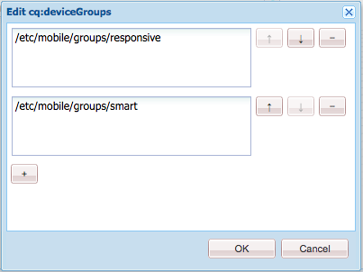

# Representación de plantilla adaptable{#adaptive-template-rendering}

La renderización de plantillas adaptables permite administrar una página con variaciones. Esta función, que en principio era útil para ofrecer varios resultados HTML para dispositivos móviles (p. ej., teléfonos móviles vs. smartphones), resulta útil cuando hay que entregar experiencias a varios dispositivos que necesitan un marcado o una salida HTML diferentes.

## Información general {#overview}

Las plantillas generalmente se crean en torno a una cuadrícula adaptable, y las páginas creadas en función de estas plantillas son totalmente adaptables, ajustándose automáticamente a la ventanilla del dispositivo cliente. Mediante la barra de herramientas Emulador del editor de páginas, los autores pueden dirigir los diseños a dispositivos específicos.

También es posible configurar plantillas para admitir el procesamiento adaptable. Cuando los grupos de dispositivos están correctamente configurados, la página se procesará con un selector diferente en la dirección URL al seleccionar un dispositivo en el modo emulador. Con un selector se puede llamar directamente a un procesamiento de página específico mediante la dirección URL.

Recuerde al configurar los grupos de dispositivos:

* Todos los dispositivos deben estar en al menos un grupo de dispositivos.
* Un dispositivo puede estar en varios grupos de dispositivos.
* Como los dispositivos pueden estar en varios grupos de dispositivos, se pueden combinar selectores.
* La combinación de selectores se evalúa de arriba a abajo ya que se mantienen en el repositorio.

>[!NOTE]
>
>El grupo de dispositivos **Dispositivos adaptables** nunca tendrá un selector porque se supone que los dispositivos que admiten el diseño interactivo no necesitan un diseño adaptable

## Configuración {#configuration}

Los selectores de renderización adaptables se pueden configurar para grupos de dispositivos existentes o para [grupos que haya creado usted mismo.](/help/sites-developing/mobile.md#device-groups)

Para este ejemplo, vamos a configurar el grupo de dispositivos **Smart Phone** existente para que tenga un selector de renderización adaptable como parte de la plantilla **Experience Page** dentro de We.Retail.

1. Edite el grupo de dispositivos que requiere un selector adaptable en `http://localhost:4502/miscadmin#/etc/mobile/groups`

   Establezca la opción **Deshabilitar emulador** y guarde.

   

1. El selector estará disponible para **Blackberry** y **iPhone 4** siempre que el grupo de dispositivos **Smart Phone** se añada a la plantilla y a las estructuras de página en los pasos siguientes.

   

1. Con CRX DE Lite, permita que el grupo de dispositivos se utilice en la plantilla añadiéndola a la propiedad de cadena de varios valores `cq:deviceGroups` en la estructura de la plantilla.

   `/conf/<your-site>/settings/wcm/templates/<your-template>/structure/jcr:content`

   Por ejemplo, si queremos agregar el grupo de dispositivos Smart Phone:

   `/conf/we-retail/settings/wcm/templates/experience-page/structure/jcr:content`

   

1. Con CRX DE Lite, permita que el grupo de dispositivos se utilice en su sitio agregándolo a la propiedad de cadena de varios valores `cq:deviceGroups` en la estructura de su sitio.

   `/content/<your-site>/jcr:content`

   Por ejemplo, si queremos permitir el grupo de dispositivos **Smart Phone**:

   `/content/we-retail/jcr:content`

   

Ahora, al usar el [emulador](/help/sites-authoring/responsive-layout.md#layout-definitions-device-emulation-and-breakpoints) en el editor de páginas (como cuando [modifica el diseño](/help/sites-authoring/responsive-layout.md)) y elegir un dispositivo del grupo de dispositivos configurado, la página se procesará con un selector como parte de la dirección URL.

En nuestro ejemplo, al editar una página basada en la plantilla **Experience Page** y elegir iPhone 4 en el emulador, la página se procesa incluyendo el selector como `arctic-surfing-in-lofoten.smart.html` en lugar de como `arctic-surfing-in-lofoten.html`

También se puede llamar a la página directamente mediante este selector.

