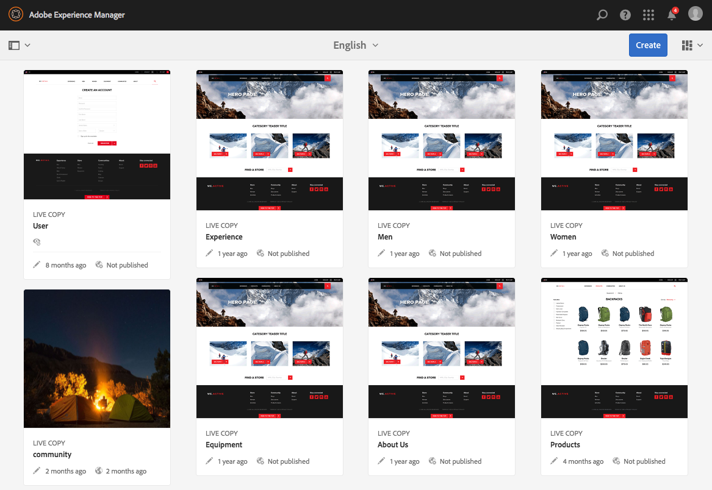

# Conceptos de la IU táctil AEM{#concepts-of-the-aem-touch-enabled-ui}

AEM cuenta con una IU táctil con [diseño interactivo](/help/sites-authoring/responsive-layout.md) para el entorno de creación, diseñada para funcionar tanto en dispositivos táctiles como de escritorio.

>[!NOTE]
>
>La IU táctil es la IU estándar para AEM. La IU clásica quedó obsoleta con AEM 6.4.

La IU táctil incluye:

* Encabezado de grupo que:
   * Muestra el logotipo
   * Proporciona un vínculo a la navegación global
   * Proporciona un vínculo a otras acciones genéricas; como Búsqueda, Ayuda, Soluciones de Marketing Cloud, Notificaciones y Configuración de usuario.
* El carril izquierdo (se muestra cuando es necesario y se puede ocultar), que puede mostrar:
   * Escala de tiempo
   * Referencias
   * Filtros
* El encabezado de navegación, que también distingue entre contexto y puede mostrar:
   * Indica la consola que está utilizando actualmente y/o la ubicación dentro de esa consola
   * Selección del carril izquierdo
   * Rutas de exploración
   * Acceso a acciones **Crear** apropiadas
   * selecciones de vista
* El área de contenido que:
   * Lista los elementos de contenido (ya sean páginas, recursos, anuncios de foros, etc.)
   * Se puede formatear como se solicita, por ejemplo columna, tarjeta o lista
   * Utiliza un diseño interactivo (el tamaño de la pantalla cambia automáticamente según el dispositivo o el tamaño de la ventana)
   * Utiliza desplazamiento infinito (no más paginación, todos los elementos se enumeran en una ventana)



>[!NOTE]
>
>Casi todas las funciones de AEM se han adaptado a la IU táctil. Sin embargo, en algunos casos, la funcionalidad volverá a la IU clásica. Consulte [Estado de la función de IU táctil](/help/release-notes/touch-ui-features-status.md) para obtener más información.

La IU táctil ha sido diseñada por Adobe para ofrecer coherencia en la experiencia del usuario en varios productos. Se basa en:

* **Coral UI**  (CUI) es una implementación del estilo visual del Adobe para la IU táctil. La interfaz de usuario de Coral proporciona todo lo que necesita su producto, proyecto o aplicación web para adoptar el estilo visual de la interfaz de usuario.
* **Los** componentes de la interfaz de usuario de Granite se crean con la interfaz de usuario de Coral.

Los principios básicos de la IU táctil son:

* Móvil primero (con escritorio en mente)
* Diseño adaptable
* Pantalla relevante para el contexto
* Reutilizable
* Incluir documentación de referencia incrustada
* Incluir pruebas incrustadas
* Diseño ascendente para garantizar que estos principios se apliquen a todos los elementos y componentes

Para obtener más información general sobre la estructura de IU táctil, consulte el artículo [Estructura de la IU táctil AEM](/help/sites-developing/touch-ui-structure.md).

## Pila de tecnología AEM {#aem-technology-stack}

AEM utiliza la plataforma Granite como base y la plataforma Granite incluye, entre otras cosas, el repositorio de contenido Java.


## Granite {#granite}

Granite es la pila web abierta del Adobe, que proporciona varios componentes, entre los que se incluyen:

* Un iniciador de aplicaciones
* Un marco de OSGi en el que se implementa todo
* Varios servicios de compendio OSGi para apoyar la creación de aplicaciones
* Un completo módulo de registro que proporciona varias API de registro
* Implementación del repositorio CRX de la especificación de API de JCR
* Apache Sling Web Framework
* Partes adicionales del producto CRX actual

>[!NOTE]
>
>Granite se ejecuta como un proyecto de desarrollo abierto dentro del Adobe: las contribuciones al código, los debates y las cuestiones se realizan desde toda la compañía.
>
>Sin embargo, Granite es **no** un proyecto de código abierto. Está fuertemente basado en varios proyectos de código abierto (Apache Sling, Felix, Jackrabbit y Lucene en particular), pero el Adobe traza una línea clara entre lo que es público y lo que es interno.

## Interfaz de usuario de granito {#granite-ui}

La plataforma de ingeniería Granite también proporciona un marco de interfaz de usuario básico. Los principales objetivos de este proceso son:

* Proporcionar utilidades de interfaz de usuario granulares
* Implemente los conceptos de la interfaz de usuario e ilustre las prácticas recomendadas (procesamiento de listas largas, filtrado de listas, CRUD de objetos, asistentes de CUD...).
* Proporcionar una interfaz de usuario de administración extensible y basada en complementos

Se ajustan a los requisitos:

* Respetar &quot;móvil primero&quot;
* Ser extensible
* Sea fácil de anular


GraniteUI.pdf

[Obtener ](assets/graniteui.pdf)
archivoLa interfaz de usuario granita:

* Utiliza la arquitectura RESTful de Sling
* Implementa bibliotecas de componentes para crear aplicaciones Web centradas en el contenido
* Proporciona utilidades de interfaz de usuario granulares
* Proporciona una interfaz de usuario estándar predeterminada
* Es extensible
* Está diseñado tanto para dispositivos móviles como de escritorio (respeta primero a los dispositivos móviles)
* Puede utilizarse en cualquier plataforma/producto/proyecto basado en Granite; eg AEM


* [Granite UI Foundation ](#granite-ui-foundation-components)
ComponentsEsta biblioteca de componentes básicos se puede utilizar o ampliar con otras bibliotecas.
* [Componentes de administración de la interfaz de usuario de Granite](#granite-ui-administration-components)

### Cliente frente a servidor {#client-side-vs-server-side}

La comunicación cliente-servidor en la interfaz de usuario de Granite consiste en hipertexto, no objetos, por lo que no es necesario que el cliente entienda la lógica empresarial

* El servidor enriquece el HTML con datos semánticos
* El cliente enriquece el hipertexto con hipermedios (interacción)


#### Cliente {#client-side}

Esto utiliza una extensión del vocabulario HTML, siempre que el autor pueda expresar su intención de crear una aplicación web interactiva. Este es un enfoque similar a los microformatos [WAI-ARIA](https://www.w3.org/TR/wai-aria/) y [a3/>.](https://microformats.org/)

Consiste principalmente en una colección de patrones de interacción (por ejemplo, el envío asíncrono de un formulario) que son interpretados por códigos JS y CSS, ejecutados en el lado del cliente. La función del cliente es mejorar el marcado (dado como la relación hipermedia del servidor) para la interactividad.

El cliente es independiente de cualquier tecnología de servidor. Siempre que el servidor proporcione el marcado adecuado, el cliente puede cumplir su función.

Actualmente, los códigos JS y CSS se entregan como Granite [clientlibs](/help/sites-developing/clientlibs.md) en la categoría:

`granite.ui.foundation and granite.ui.foundation.admin`

Se entregan como parte del paquete de contenido:

`granite.ui.content`

#### Servidor {#server-side}

Esto está formado por una colección de componentes sling que permiten al autor *componer* una aplicación web rápidamente. El desarrollador desarrolla componentes, el autor los ensambla para que sean una aplicación web. La función del servidor es proporcionar al cliente la asequibilidad de los hipermedios (marcado).

Actualmente, los componentes se encuentran en el repositorio Granite en:

`/libs/granite/ui/components/foundation`

Esto se entrega como parte del paquete de contenido:

`granite.ui.content`

### Diferencias con la IU clásica {#differences-with-the-classic-ui}

Las diferencias entre la interfaz de usuario de Granite y ExtJS (que se usa para la IU clásica) también son de interés:

<table>
 <tbody>
  <tr>
   <td><strong>ExtJS</strong></td>
   <td><strong>Interfaz de usuario de granito</strong></td>
  </tr>
  <tr>
   <td>Llamada a procedimiento remoto<br /> </td>
   <td>Transiciones de estado</td>
  </tr>
  <tr>
   <td>Objetos de transferencia de datos</td>
   <td>Hipermedia</td>
  </tr>
  <tr>
   <td>El cliente conoce los internales del servidor</td>
   <td>El cliente no conoce internamente</td>
  </tr>
  <tr>
   <td>"Cliente ligero"</td>
   <td>"Cliente ligero"</td>
  </tr>
  <tr>
   <td>Bibliotecas de clientes especializadas</td>
   <td>Bibliotecas de cliente universales</td>
  </tr>
 </tbody>
</table>

### Componentes principales de la interfaz de usuario de Granite {#granite-ui-foundation-components}

Los [componentes básicos de la interfaz de usuario de Granite](https://helpx.adobe.com/experience-manager/6-5/sites/developing/using/reference-materials/granite-ui/api/jcr_root/libs/granite/ui/index.html) proporcionan los componentes básicos necesarios para generar cualquier interfaz de usuario. Entre otros:

* Botón
* Hipervínculo
* Avatar del usuario

Los componentes de base se encuentran en:

`/libs/granite/ui/components/foundation`

Esta biblioteca contiene un componente de interfaz de usuario de Granite para cada elemento Coral. Un componente es contenido controlado, con su configuración en el repositorio. Esto permite componer una aplicación de interfaz de usuario Granite sin escribir a mano el código HTML.

Función:

* Modelo de componentes para elementos HTML
* Composición de componentes
* Pruebas automáticas de la unidad y funcionalidad

Implementación:

* Composición y configuración basadas en el repositorio
* Aprovechamiento de las instalaciones de pruebas proporcionadas por la plataforma Granite
* Plantilla JSP

Esta biblioteca de componentes de base puede ser utilizada o extendida por otras bibliotecas.

### Componentes de interfaz de usuario de ExtJS y Granite correspondientes {#extjs-and-corresponding-granite-ui-components}

Al actualizar el código de ExtJS para utilizar la interfaz de usuario de Granite, la siguiente lista proporciona información general sobre xtypes y tipos de nodos de ExtJS con sus tipos de recursos de la interfaz de usuario de Granite equivalentes.

| **ExtJS xtype** | **Tipo de recurso de la interfaz de usuario de Granite** |
|---|---|
| `button` | `granite/ui/components/foundation/form/button` |
| `checkbox` | `granite/ui/components/foundation/form/checkbox` |
| `componentstyles` | `cq/gui/components/authoring/dialog/componentstyles` |
| `cqinclude` | `granite/ui/components/foundation/include` |
| `datetime` | `granite/ui/components/foundation/form/datepicker` |
| `dialogfieldset` | `granite/ui/components/foundation/form/fieldset` |
| `hidden` | `granite/ui/components/foundation/form/hidden` |
| `html5smartfile, html5smartimage` | `granite/ui/components/foundation/form/fileupload` |
| `multifield` | `granite/ui/components/foundation/form/multifield` |
| `numberfield` | `granite/ui/components/foundation/form/numberfield` |
| `pathfield, paragraphreference` | `granite/ui/components/foundation/form/pathbrowser` |
| `selection` | `granite/ui/components/foundation/form/select` |
| `sizefield` | `cq/gui/components/authoring/dialog/sizefield` |
| `tags` | `granite/ui/components/foundation/form/autocomplete``cq/gui/components/common/datasources/tags` |
| `textarea` | `granite/ui/components/foundation/form/textarea` |
| `textfield` | `granite/ui/components/foundation/form/textfield` |

| **Tipo de nodo** | **Tipo de recurso de la interfaz de usuario de Granite** |
|---|---|
| `cq:WidgetCollection` | `granite/ui/components/foundation/container` |
| `cq:TabPanel` | `granite/ui/components/foundation/container``granite/ui/components/foundation/layouts/tabs` |
| `cq:panel` | `granite/ui/components/foundation/container` |

### Componentes de administración de la interfaz de usuario de Granite {#granite-ui-administration-components}

Los [componentes de administración de la interfaz de usuario de Granite](https://helpx.adobe.com/experience-manager/6-5/sites/developing/using/reference-materials/granite-ui/api/jcr_root/libs/granite/ui/index.html) se basan en los componentes de base para proporcionar componentes genéricos que cualquier aplicación de administración puede implementar. Entre ellos se incluyen:

* Barra de navegación global
* Carril (esqueleto)
* Panel de búsqueda

Función:

* Aspecto y funcionamiento unificado para aplicaciones de administración
* RAD para aplicaciones de administración

Implementación:

* Componentes predefinidos que utilizan los componentes de base
* Los componentes se pueden personalizar

## Interfaz de usuario de Coral {#coral-ui}

CoralUI.pdf

[Get ](assets/coralui.pdf)
FileCoral UI (CUI) es una implementación del estilo visual del Adobe para la IU táctil, que se ha diseñado para proporcionar coherencia en la experiencia del usuario en varios productos. La interfaz de usuario de Coral proporciona todo lo necesario para adoptar el estilo visual utilizado en el entorno de creación.

>[!CAUTION]
>
>La interfaz de usuario de Coral es una biblioteca de interfaz de usuario disponible para AEM clientes para crear aplicaciones e interfaces web dentro de los límites de su uso con licencia del producto.
>
>Solo se permite el uso de la interfaz de usuario de Coral:
>
>
>* Cuando se ha enviado y empaquetado con AEM.
>* Se utiliza para ampliar la IU existente del entorno de creación.
>* Adobe de material publicitario corporativo, anuncios y presentaciones.
>* La interfaz de usuario de las aplicaciones con marca Adobe (la fuente no debe estar fácilmente disponible para otros usos).
>* Con personalizaciones menores.

>
>
Se debe evitar el uso de la IU de Coral en:
>
>* Documentos y otros artículos no relacionados con el Adobe.
>* Entornos de creación de contenido (donde otros pueden generar los elementos anteriores).
>* Aplicaciones/componentes/páginas web que no están claramente conectadas a Adobe.

>


La interfaz de usuario de Coral es una colección de componentes para desarrollar aplicaciones web.


Diseñado para ser modular desde el inicio, cada módulo forma una capa distinta basada en su función principal. Aunque las capas se han diseñado para apoyarse mutuamente, también se pueden utilizar de forma independiente si es necesario. Esto permite implementar la experiencia de usuario de Coral en cualquier entorno compatible con HTML.

Con la interfaz de usuario de Coral no es obligatorio utilizar un modelo de desarrollo o una plataforma en particular. El objetivo principal de Coral es proporcionar un marcado HTML5 unificado y limpio, independiente del método real utilizado para emitir este marcado. Esto puede utilizarse para el procesamiento en el cliente o en el servidor, plantillas, JSP, PHP o incluso aplicaciones RIA de Flash de Adobe, por nombrar sólo algunas.

### Elementos HTML - La capa de marcado {#html-elements-the-markup-layer}

Los elementos HTML proporcionan una apariencia común para todos los elementos de la interfaz de usuario base (incluida la barra de navegación, el botón, el menú, el carril, etc.).

En el nivel más básico, un elemento HTML es una etiqueta HTML con un nombre de clase dedicado. Los elementos más complejos se pueden componer de varias etiquetas, anidadas entre sí (de forma específica).

La CSS se utiliza para proporcionar el aspecto real. Para que sea posible personalizar fácilmente el aspecto (por ejemplo, en el caso de la marca), los valores de estilo reales se declaran como variables que se expanden con el preprocesador [LESS](https://lesscss.org/) durante el tiempo de ejecución.

Función:

* Proporcionar elementos básicos de la interfaz de usuario con una apariencia común
* Proporcionar el sistema de cuadrícula predeterminado

Implementación:

* Etiquetas HTML con estilos inspirados en [bootstrap](https://twitter.github.com/bootstrap/)
* Las clases se definen en archivos LESS
* Los iconos se definen como sprites de fuente

Por ejemplo, el marcado:

```xml
<button class="btn btn-large btn-primary" type="button">Large button</button>
<button class="btn btn-large" type="button">Large button</button>
```

Se muestra como:


La apariencia se define en LESS, vinculada a un elemento por un nombre de clase dedicado (el siguiente extracto se ha abreviado en aras de la brevedad):

```xml
.btn {
    font-size: @baseFontSize;
    line-height: @baseLineHeight;
    .buttonBackground(@btnBackground,
                                @btnBackgroundHighlight,
                                @grayDark, 0 1px 1px rgba(255,255,255,.75));
```

Los valores reales se definen en un archivo de variable LESS (se ha abreviado el siguiente extracto en aras de la brevedad):

```xml
@btnBackgroundHighlight: darken(@white, 10%);
@btnPrimaryBackgroundHighlight: spin(@btnPrimaryBackground, 20%);
@baseFontSize: 17px;
@baseFontFamily: @sansFontFamily;
```

### Complementos de elementos {#element-plugins}

Muchos de los elementos HTML necesitarán mostrar algún tipo de comportamiento dinámico, como abrir y cerrar menús emergentes. Esta es la función de los complementos de elementos, que realizan estas tareas manipulando el DOM mediante JavaScript.

Un complemento es:

* Diseñado para funcionar con un elemento DOM específico. Por ejemplo, un complemento de cuadro de diálogo espera encontrar `DIV class=dialog`
* Genérico por naturaleza. Por ejemplo, un administrador de diseño proporciona el diseño para cualquier lista de elementos `DIV` o `LI`

El comportamiento del complemento se puede personalizar con parámetros, ya sea de la siguiente manera:

* Pasar los parámetros mediante una llamada de javascript
* Uso de atributos `data-*` dedicados asociados al marcado HTML

Aunque el desarrollador puede seleccionar el mejor método para cualquier complemento, la regla general es utilizar:

* `data-*` atributos para opciones relacionadas con el diseño HTML. Por ejemplo, para especificar el número de columnas
* Opciones/clases de API para la funcionalidad relacionada con los datos. Por ejemplo, construir la lista de elementos para mostrar

El mismo concepto se utiliza para implementar la validación del formulario. Para un elemento que desea validar, debe especificar el formulario de entrada requerido como un atributo `data-*` personalizado. Este atributo se utiliza luego como opción para un complemento de validación.

>[!NOTE]
>
>La validación de formularios nativos de HTML5 debe utilizarse siempre que sea posible y/o expandirse.

Función:

* Proporcionar comportamiento dinámico a los elementos HTML
* Proporcionar diseños personalizados no posibles con CSS pura
* Realizar validación del formulario
* Realizar manipulación DOM avanzada

Implementación:

* Complemento jQuery, vinculado a elementos DOM específicos
* Uso de atributos `data-*` para personalizar el comportamiento

Un extracto de marca de ejemplo (observe las opciones especificadas como atributos data-*):

```xml
<ul data-column-width="220" data-layout="card" class="cards">
  <li class="item">
    <div class="thumbnail">
      
      <div class="caption">
        <h4>Toolbar</h4>
          <p><small>toolbar</small><br></p>
      </div>
    </div>
  </li>
  <li class="item">
    <div class="thumbnail">
      
      <div class="caption">
        <h4>Toolbar</h4>
        <p><small>toolbar</small><br></p>
      </div>
    </div>
  </li>
```

La llamada al complemento jQuery:

```
$(‘.cards’).cardlayout ();
```

Esto se mostrará como:


El complemento `cardLayout` presenta los elementos `UL` adjuntos en función de sus alturas respectivas y teniendo en cuenta también la anchura del elemento principal.

### Widgets de elementos HTML {#html-elements-widgets}

Una utilidad combina uno o varios elementos básicos con un complemento de javascript para formar elementos de IU de &quot;nivel superior&quot;. Estos pueden implementar un comportamiento más complejo y también una apariencia más compleja que la que podría ofrecer un solo elemento. Algunos buenos ejemplos son los widgets de riel o de selector de etiquetas.

Una utilidad puede activar y escuchar eventos personalizados para cooperar con otras utilidades de la página. Algunos widgets son en realidad widgets de jQuery nativos que utilizan los elementos HTML de Coral.

Función:

* Implementar elementos de interfaz de usuario de nivel superior que muestren un comportamiento complejo
* Activación y gestión de eventos

Implementación:

* Complemento jQuery + marcado HTML
* Puede utilizar plantillas de cliente/servidor

Ejemplo de marcado:

```
<input type="text" name="tags" placeholder="Tags" class="tagManager"/>
```

La llamada al complemento jQuery (con opciones):

```
$(".tagManager").tagsManager({
        prefilled: ["Pisa", "Rome"] })
```

El complemento emite marcado HTML (este marcado utiliza elementos básicos, que pueden utilizar otros complementos internamente):

```
<span>Pisa</code>
<a title="Removing tag" tagidtoremove="0"
   id="myRemover_0" class="myTagRemover" href="#">x</a></code>

<span id="myTag_1" class="myTag"><span>Rome</code>
<a title="Removing tag" tagidtoremove="1"
   id="myRemover_1" class="myTagRemover" href="#">x</a></code>

<input type="text" data-original-title="" class="input-medium tagManager"
       placeholder="Tags" name="tags" data-provide="typeahead" data-items="6"
       autocomplete="off">
```

Esto se mostrará como:


### Biblioteca de utilidades {#utility-library}

Esta biblioteca es una colección de complementos de ayuda de javascript y/o funciones que son:

* UI independiente
* Sin embargo, es crucial para crear aplicaciones web con todas las funciones

Entre ellos se incluyen el manejo de XSS y el bus de evento.

Aunque los complementos y utilidades de elementos HTML pueden depender de la funcionalidad proporcionada por la biblioteca de utilidades, la biblioteca de utilidades no puede tener dependencia en los elementos ni en los propios widgets.

Función:

* Proporcionar funcionalidad común
* Implementación de bus de evento
* Plantillas de cliente
* XSS

Implementación:

* Complementos jQuery o módulos JavaScript compatibles con AMD
