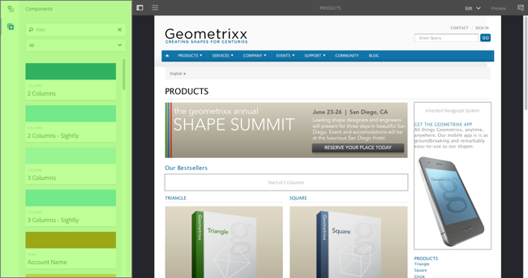

# Estructura de la IU táctil AEM{#structure-of-the-aem-touch-enabled-ui}

La IU táctil AEM tiene varios principios subyacentes y está formada por varios elementos clave:

## Consolas {#consoles}

### Diseño básico y cambio de tamaño {#basic-layout-and-resizing}

La interfaz de usuario se ocupa de los dispositivos móviles y de escritorio, pero en lugar de crear dos estilos, el Adobe ha decidido utilizar un estilo que funcione para todas las pantallas y dispositivos.

Todos los módulos utilizan el mismo diseño básico, en AEM esto puede verse como:

El diseño se ajusta a un estilo de diseño interactivo y se adapta al tamaño del dispositivo o ventana que se esté utilizando.

Por ejemplo, cuando la resolución es inferior a 1024 px (como en un dispositivo móvil), la pantalla se ajustará en consecuencia:

### Barra de encabezado {#header-bar}

La barra de encabezado muestra elementos globales que incluyen:

* el logotipo y el producto o solución específicos que está utilizando actualmente; para AEM esto también forma un vínculo a la navegación global
* Búsqueda  
* icono para acceder a los recursos de ayuda
* icono para acceder a otras soluciones
* un indicador (y acceso a) cualquier alerta o elemento de la Bandeja de entrada que le esté esperando
* el icono de usuario, junto con un vínculo a la administración de perfiles

### Barra de herramientas {#toolbar}

Esto es contextual para su ubicación y las herramientas de superficie relevantes para controlar la vista o los recursos en la página siguiente. La barra de herramientas es específica del producto, pero los elementos tienen algunas características comunes.

En cualquier ubicación, la barra de herramientas muestra las acciones disponibles actualmente:

También depende de si un recurso está seleccionado actualmente:

### Carril izquierdo {#left-rail}

El carril izquierdo se puede abrir u ocultar según sea necesario para mostrar:

* **Escala de tiempo**
* **Referencias**
* **Filtro**

El valor predeterminado es **Solo contenido** (carril oculto).

## Creación de páginas {#page-authoring}

Al crear páginas, las áreas estructurales son las siguientes.

### Marco de contenido {#content-frame}

El contenido de la página se representa en el marco de contenido. El marco de contenido es completamente independiente del editor para garantizar que no haya conflictos debido a CSS o javascript.

El marco de contenido se encuentra en la sección derecha de la ventana, debajo de la barra de herramientas.

### Marco de editor {#editor-frame}

El marco del editor obtiene las funciones de edición.

El marco del editor es un contenedor (abstracto) para todos los *elementos de creación de páginas*. Vive sobre el marco de contenido e incluye:

* barra de herramientas superior
* panel lateral
* todas las superposiciones
* cualquier otro elemento de creación de páginas; por ejemplo, la barra de herramientas de componentes

### Panel lateral {#side-panel}

Contiene dos fichas predeterminadas que le permiten seleccionar recursos y componentes; se pueden arrastrar desde aquí y soltar en la página.

El panel lateral está oculto de forma predeterminada. Cuando se selecciona, se muestra en el lado izquierdo o se desliza para cubrir toda la ventana (cuando el tamaño de la ventana es inferior a una anchura de 1024 px; como, por ejemplo, en un dispositivo móvil).

### Panel lateral - Recursos {#side-panel-assets}

En la ficha Recursos, puede seleccionar entre el rango de recursos. También puede filtrar por un término específico o seleccionar un grupo.

### Panel lateral - Grupos de recursos {#side-panel-asset-groups}

En la ficha Recurso hay una lista desplegable que puede utilizar para seleccionar los grupos de recursos específicos.

### Panel lateral - Componentes {#side-panel-components}

En la ficha Componentes puede seleccionar entre el rango de componentes. También puede filtrar por un término específico o seleccionar un grupo.

### Superposiciones {#overlays}

Estas superposiciones superponen el marco de contenido y las [capas](#layer) las utilizan para realizar la mecánica de cómo interactuar (de forma completamente transparente) con los componentes y su contenido.

Las superposiciones se encuentran en el marco del editor (con todos los demás elementos de creación de páginas), aunque en realidad superponen los componentes adecuados en el marco de contenido.

### Capa {#layer}

Una capa es un paquete de funcionalidad independiente que se puede activar para:

* proporcionar una vista diferente de la página
* le permite manipular una página o interactuar con ella

Las capas proporcionan una funcionalidad sofisticada para toda la página, en lugar de acciones específicas para un componente individual.

AEM viene con varias capas ya implementadas para la creación de páginas; por ejemplo, editar, previsualización o anotar.

>[!NOTE]
>
>Las capas son un concepto potente que afecta a la vista del usuario y a la interacción con el contenido de la página. Al desarrollar sus propias capas, debe asegurarse de que la capa se limpia al salir.

### Conmutador de capas {#layer-switcher}

El mezclador de capas le permite elegir la capa que desea utilizar. Cuando se cierra, indica la capa que se está utilizando.

El mezclador de capas está disponible como una lista desplegable desde la barra de herramientas (en la parte superior de la ventana, dentro del marco del editor).

### Barra de herramientas del componente {#component-toolbar}

Cada instancia de un componente mostrará su barra de herramientas cuando se haga clic en él (una vez o con un doble lento al hacer clic). La barra de herramientas contiene las acciones específicas (por ejemplo, copiar, pegar, abrir-editor) disponibles para la instancia de componente (editable) en la página.

Según el espacio disponible, las barras de herramientas del componente se colocan en la esquina superior o inferior derecha del componente correspondiente.

## Información adicional {#further-information}

Para obtener más información sobre los conceptos relacionados con la IU táctil, consulte el artículo [Conceptos de la IU táctil AEM](/help/sites-developing/touch-ui-concepts.md).

Para obtener más información técnica, consulte el [conjunto de documentación de JS](https://helpx.adobe.com/experience-manager/6-5/sites/developing/using/reference-materials/jsdoc/ui-touch/editor-core/index.html) para el editor de páginas táctil.

