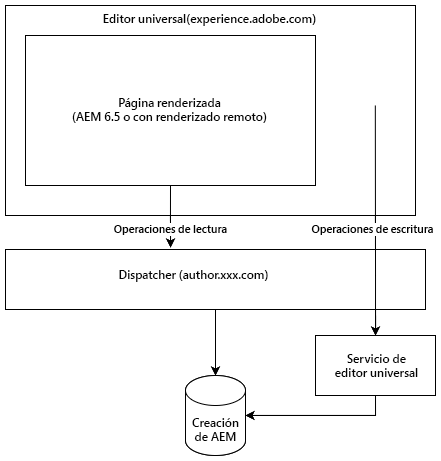

# Editor universal {#universal-editor}

Obtenga información acerca de la flexibilidad del editor universal y cómo puede ayudarle a potenciar sus experiencias sin encabezado con AEM 6.5.

## Información general {#overview}

El editor universal es un editor visual versátil que forma parte de Adobe Experience Manager Sites. Permite a los autores editar lo que se ve es lo que se obtiene (WYSIWYG) de cualquier experiencia sin encabezado.

* Los autores se benefician de la flexibilidad del editor universal, ya que admite la misma edición visual coherente para todas las formas de contenido sin encabezado de AEM.
* Los desarrolladores se benefician de la versatilidad del editor universal, ya que también admite el desacoplamiento real de la implementación. Permite a los desarrolladores utilizar prácticamente cualquier estructura o arquitectura de su elección, sin imponer restricciones SDK o tecnológicas.

Consulte la [documentación de AEM as a Cloud Service en el editor universal](https://experienceleague.adobe.com/es/docs/experience-manager-cloud-service/content/implementing/developing/universal-editor/introduction) para obtener más información.

## Arquitectura {#architecture}

El editor universal es un servicio que funciona junto con AEM para crear contenido sin encabezado.

* El editor universal está alojado en `https://experience.adobe.com/#/aem/editor/canvas` y puede editar páginas procesadas por AEM 6.5.
* El editor universal lee la página de AEM a través de Dispatcher desde la instancia de autor de AEM.
* El servicio de editor universal, que se ejecuta en el mismo host que Dispatcher, vuelve a escribir los cambios en la instancia de autor de AEM.



## Requisitos  {#requirements}

El editor universal es compatible con lo siguiente:

* AEM 6.5 (service pack 21 o 22 más un feature pack)
   * Se admiten tanto el alojamiento local como el alojamiento AMS.
* [AEM as a Cloud Service](https://experienceleague.adobe.com/es/docs/experience-manager-cloud-service/content/implementing/developing/universal-editor/introduction) (versión `2023.8.13099` o superior)

Este documento se centra en la compatibilidad con AEM 6.5 del editor universal.

## Configuración {#setup}

Para probar el editor universal, deberá hacer lo siguiente:

1. [Actualice y configure la instancia de creación de AEM.](#update-configure-aem)
1. [Configure un servicio de editor universal local.](#set-up-ue)
1. [Ajuste su Dispatcher para permitir el servicio de editor universal.](#update-dispatcher)

Una vez completada la configuración, puede [instrumentar sus aplicaciones para que utilicen el editor universal.](#instrumentation)

### Actualizar AEM {#update-aem}

Se requieren los Service Pack 21 o 22 y un paquete de funciones para AEM para utilizar el editor universal con AEM 6.5.

#### Aplicar el paquete de servicio más reciente {#latest}

Asegúrese de ejecutar al menos el Service Pack 21 o 22 para AEM 6.5. Puede descargar el Service Pack más reciente desde [Distribución de software.](https://experienceleague.adobe.com/docs/experience-cloud/software-distribution/home.html?lang=es)

#### Instalación del paquete de funciones del editor universal {#feature-pack}

Instale el paquete de funciones del editor universal **para AEM 6.5** [disponible en distribución de software.](https://experience.adobe.com/#/downloads/content/software-distribution/en/aem.html?package=/content/software-distribution/en/details.html/content/dam/aem/public/cq-6.5.21-universal-editor-1.0.0.zip)

Si ya está ejecutando el Service Pack 23 o superior, el paquete de funciones no es necesario.

### Configurar servicios {#configure-services}

El paquete de funciones instala una serie de paquetes nuevos para los que se necesita una configuración adicional.

#### Establezca el atributo SameSite para la cookie `login-token`. {#samesite-attribute}

1. Abra el Administrador de configuración.
   * `http://<host>:<port>/system/console/configMgr`
1. Busque **Controlador de autenticación de token de Adobe Granite** en la lista y haga clic en **Cambiar los valores de configuración**.
1. En el cuadro de diálogo, cambie el atributo **SameSite para el valor de la cookie del token de inicio de sesión** (`token.samesite.cookie.attr`) a `Partitioned`.
1. Haga clic en **Guardar**.

#### Quitar la opción X-Frame de encabezados `SAMEORIGIN`. {#sameorigin}

1. Abra el Administrador de configuración.
   * `http://<host>:<port>/system/console/configMgr`
1. Busque **Apache Sling Main Servlet** en la lista y haga clic en **Editar los valores de configuración**.
1. Elimine el valor `X-Frame-Options=SAMEORIGIN` del atributo **Encabezados de respuesta adicionales** (`sling.additional.response.headers`) si existe.
1. Haga clic en **Guardar**.

#### Configure el Controlador de autenticación del parámetro de consulta de Adobe Granite. {#query-parameter}

1. Abra el Administrador de configuración.
   * `http://<host>:<port>/system/console/configMgr`
1. Busque **Controlador de autenticación de parámetro de consulta de Adobe Granite** en la lista y haga clic en **Editar los valores de configuración**.
1. En el campo **Ruta** (`path`), agregue `/` para habilitar.
   * Un valor vacío deshabilita el controlador de autenticación.
1. Haga clic en **Guardar**.

#### Defina para qué rutas de contenido o `sling:resourceTypes` se abrirá el editor universal. {#paths}

1. Abra el Administrador de configuración.
   * `http://<host>:<port>/system/console/configMgr`
1. Busque **Servicio de URL del editor universal** en la lista y haga clic en **Editar los valores de configuración**.
1. Defina para qué rutas de contenido o `sling:resourceTypes` se abrirá el editor universal.
   * En el campo **Asignación de apertura de editor universal**, proporcione las rutas para las que se abre el editor universal.
   * En el campo **Sling:resourceTypes que abrirá el editor universal**, proporcione una lista de los recursos que el editor universal abrirá directamente.
1. Haga clic en **Guardar**.
1. Compruebe la configuración de su [externalizador](/help/sites-developing/externalizer.md) y asegúrese de que dispone al menos de los entornos local, de autor y de publicación establecidos como en el ejemplo siguiente.

   ```text
   "local $[env:AEM_EXTERNALIZER_LOCAL;default=http://localhost:4502]",
   "author $[env:AEM_EXTERNALIZER_AUTHOR;default=http://localhost:4502]",
   "publish $[env:AEM_EXTERNALIZER_PUBLISH;default=http://localhost:4503]"
   ```

Una vez completados estos pasos de configuración, AEM abrirá el Editor universal para páginas en el siguiente orden.

1. AEM comprobará las asignaciones de `Universal Editor Opening Mapping` y, si el contenido se encuentra en alguna de las rutas definidas, se abrirá el Editor universal para él.
1. Para el contenido que no se encuentra en las rutas definidas en `Universal Editor Opening Mapping`, AEM comprueba si el `resourceType` del contenido coincide con los definidos en **Sling:resourceTypes, que abrirá el editor universal**. Si el contenido coincide con uno de esos tipos, el editor universal se abre para él en `${author}${path}.html`.
1. De lo contrario, AEM abre el Editor de páginas.

Las siguientes variables están disponibles para definir las asignaciones en `Universal Editor Opening Mapping`.

* `path`: ruta de contenido del recurso a abrir
* `localhost`: entrada del externalizador para `localhost` sin esquema, p. ej. `localhost:4502`
* `author`: entrada de externalizador para el autor sin esquema, p. ej. `localhost:4502`
* `publish`: entrada de externalizador para publicación sin esquema, p. ej. `localhost:4503`
* `preview`: entrada del externalizador para vista previa sin esquema, p. ej. `localhost:4504`
* `env`: `prod`, `stage`, `dev` según los modos de ejecución de Sling definidos
* `token`: token de consulta necesario para `QueryTokenAuthenticationHandler`

Asignaciones de ejemplo:

* Abra todas las páginas por debajo de `/content/foo` en AEM Author:
   * `/content/foo:${author}${path}.html?login-token=${token}`
   * Esto resulta en abrir `https://localhost:4502/content/foo/x.html?login-token=<token>`
* Abra todas las páginas por debajo de `/content/bar` en un servidor NextJS remoto y proporcione todas las variables como información
   * `/content/bar:nextjs.server${path}?env=${env}&author=https://${author}&publish=https://${publish}&login-token=${token}`
   * Esto resulta en abrir `https://nextjs.server/content/bar/x?env=prod&author=https://localhost:4502&publish=https://localhost:4503&login-token=<token>`

### Configuración del servicio de editor universal {#set-up-ue}

Con AEM actualizado y configurado, puede configurar un servicio de editor universal local para su propio desarrollo y prueba locales.

1. Instale la versión de Node.js >=20.
1. Descargue y desempaquete el servicio de editor universal más reciente de [Distribución de software](https://experienceleague.adobe.com/en/docs/experience-cloud/software-distribution/home)
1. Configure el servicio de editor universal mediante variables de entorno o el archivo `.env`.
   * [Consulte la documentación del Editor universal de AEM as a Cloud Service para obtener más información.](https://experienceleague.adobe.com/en/docs/experience-manager-cloud-service/content/implementing/developing/universal-editor/local-dev#setting-up-service)
   * Tenga en cuenta que es posible que necesite utilizar la opción `UES_MAPPING` si se requiere una reescritura de IP interna.
1. Ejecutar `universal-editor-service.cjs`

### Actualización de Dispatcher {#update-dispatcher}

Con AEM configurado y un servicio de editor universal local en ejecución, deberá permitir un proxy inverso para el nuevo servicio [ en Dispatcher.](https://experienceleague.adobe.com/es/docs/experience-manager-dispatcher/using/dispatcher)

1. Ajuste el archivo vhost de la instancia de autor para incluir un proxy inverso.

   ```html
   <IfModule mod_proxy.c>
    ProxyPass "/universal-editor" "http://localhost:8080"
    ProxyPassReverse "/universal-editor" "http://localhost:8080"
   </IfModule>
   ```

   >[!NOTE]
   >
   >8080 es el puerto predeterminado. Si ha cambiado esto usando el parámetro `UES_PORT` en [su archivo `.env`,](https://experienceleague.adobe.com/en/docs/experience-manager-cloud-service/content/implementing/developing/universal-editor/local-dev#setting-up-service) debe ajustar el valor del puerto aquí en consecuencia.

1. Reinicie Apache.

## Instrumentar su aplicación {#instrumentation}

Con AEM actualizado y un servicio de editor universal local en ejecución, puede empezar a editar contenido sin encabezado mediante el editor universal.

Sin embargo, la aplicación debe estar instrumentada para aprovechar las ventajas del editor universal. Esto implica incluir metaetiquetas para instruir al editor sobre cómo y dónde conservar el contenido. Los detalles de esta instrumentación están disponibles en la [documentación del editor universal para AEM as a Cloud Service.](https://experienceleague.adobe.com/en/docs/experience-manager-cloud-service/content/implementing/developing/universal-editor/getting-started#instrument-page)

Tenga en cuenta que cuando se sigue la documentación del Editor universal con AEM as a Cloud Service, se aplican los siguientes cambios al utilizarlo con AEM 6.5.

* El protocolo de la metaetiqueta debe ser `aem65` en lugar de `aem`.

  ```html
  <meta name="urn:adobe:aue:system:aemconnection" content={`aem65:${getAuthorHost()}`}/>
  ```

* El punto final del servicio de editor universal debe anunciarse mediante una etiqueta meta.

  ```html
  <meta name="urn:adobe:aue:config:service" content={`${getAuthorHost()}/universal-editor`}/>
  ```

* En la sección `plugins` de la definición de componentes, se debe usar `aem65` en lugar de `aem`.

>[!TIP]
>
>Para obtener una guía completa para los desarrolladores que empiezan con el editor universal, consulte el documento [Información general del editor universal para desarrolladores de AEM](https://experienceleague.adobe.com/en/docs/experience-manager-cloud-service/content/implementing/developing/universal-editor/developer-overview) en la documentación de AEM as a Cloud Service, teniendo en cuenta los cambios necesarios para la compatibilidad con AEM 6.5 tal como se menciona en esta sección.

## Diferencias entre AEM 6.5 y AEM as a Cloud Service {#differences}

El editor universal de AEM 6.5 funciona como en AEM as a Cloud Service, incluida la interfaz de usuario y gran parte de la configuración. Sin embargo, hay diferencias que deben señalarse.

* El editor universal de 6.5 solo admite el caso de uso sin encabezado.
* La configuración del editor universal varía ligeramente para 6.5 ([como se describe](#setup) en el documento actual).
* El editor universal de 6.5 utiliza un selector de recursos y un selector de fragmentos de contenido diferentes a los de AEM as a Cloud Service.
