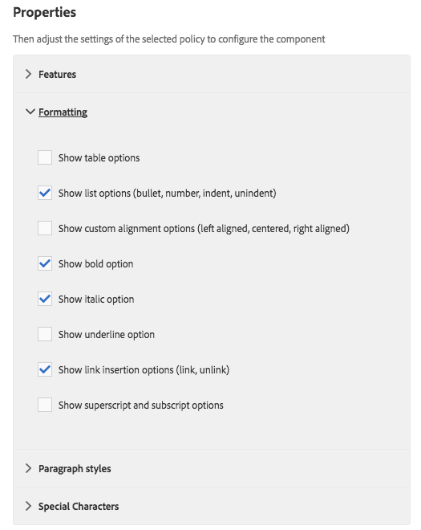

# Intentando los componentes principales en We.Retail{#trying-out-core-components-in-we-retail}

Los componentes principales son componentes modernos y flexibles, que ofrecen una fácil extensibilidad y permiten una sencilla integración en sus proyectos. Los componentes principales se han construido en torno a varios principios de diseño principales, como HTL, usabilidad lista para usar, configurabilidad, versiones y extensibilidad. We.Retail se ha creado con componentes principales.

## Intentándolo {#trying-it-out}

1. AEM inicio con el contenido de muestra de We.Retail y abra la [Consola de componentes](/help/sites-authoring/default-components-console.md).

   **Navegación global -> Herramientas -> Componentes**

1. Al abrir el carril en la consola Componentes, puede filtrar para un grupo de componentes determinado. Los componentes principales se pueden encontrar en

   * `.core-wcm`:: Los componentes principales estándar
   * `.core-wcm-form`:: Componentes principales de envío de formulario

   Choose `.core-wcm`.

   

1. Tenga en cuenta que todos los componentes principales se denominan **v1**, lo que refleja que esta es la primera versión de este componente principal. A partir de ahora, se lanzarán versiones regulares, que serán compatibles con la versión de AEM y permitirán una actualización sencilla para que pueda aprovechar las últimas funciones.
1. Haga clic en **Texto (v1)**.

   Observe que el **tipo de recurso** del componente es `/apps/core/wcm/components/text/v1/text`. Los componentes principales se encuentran en `/apps/core/wcm/components` y tienen versiones por componente.

   

1. Haga clic en la ficha **Documentación** para ver la documentación del desarrollador del componente.

   

1. Vuelva a la consola Componente. Filtre para el grupo **We.Retail** y seleccione el componente **Text**.
1. Observe que el **Tipo de recurso** señala a un componente como se espera en `/apps/weretail` pero el **Super tipo de recurso** señala al componente principal `/apps/core/wcm/components/text/v1/text`.

   

1. Haga clic en la ficha **Uso en directo** para ver en qué páginas se está utilizando este componente. Haga clic en la primera página **Gracias** para editar la página.

   

1. En la página de agradecimiento, seleccione el componente de texto y, en el menú de edición del componente, haga clic en el icono Cancelar herencia.

   [We.Retail tiene una estructura de sitio globalizada ](/help/sites-developing/we-retail-globalized-site-structure.md) donde el contenido se transfiere de los maestros de idiomas a las copias  [en vivo a través de un mecanismo llamado herencia](/help/sites-administering/msm.md). Por este motivo, se debe cancelar la herencia para permitir que el usuario edite manualmente el texto.

   

1. Confirme la cancelación haciendo clic en **Sí**.

   

1. Una vez que se cancela la herencia y se seleccionan los componentes de texto, hay muchas más opciones disponibles. Haga clic en** Editar**.

   

1. Ahora puede ver qué opciones de edición están disponibles para el componente de texto.

   

1. En el menú **Información de página** seleccione **Editar plantilla**.
1. En el Editor de plantillas de la página, haga clic en el icono **Política** del componente Texto en el **Contenedor de diseño** de la página.

   

1. Los componentes principales permiten que un autor de la plantilla configure qué propiedades están disponibles para los autores de la página. Estas funciones incluyen funciones como las fuentes de pegado permitidas, opciones de formato, estilos de párrafo disponibles, etc.

   Estos diálogos de diseño están disponibles para muchos componentes principales y funcionan de manera conjunta con el editor de plantillas. Una vez activados, estarán disponibles para el autor a través de los editores de componentes.

   

## Información adicional {#further-information}

Para obtener más información sobre los componentes principales, consulte el documento de creación [Componentes principales](https://docs.adobe.com/content/help/es-ES/experience-manager-core-components/using/introduction.html) para obtener una visión general de las capacidades de los componentes principales y el documento para desarrolladores [Desarrollo de componentes principales](https://helpx.adobe.com/experience-manager/core-components/using/developing.html) para obtener una descripción general técnica.

También puede que desee investigar más a fondo [plantillas editables](/help/sites-developing/we-retail-editable-templates.md). Consulte el documento de creación [Creación de plantillas de página](/help/sites-authoring/templates.md) o la página de documento para desarrolladores [Plantillas - Editables](/help/sites-developing/page-templates-editable.md) para obtener información detallada sobre las plantillas editables.
