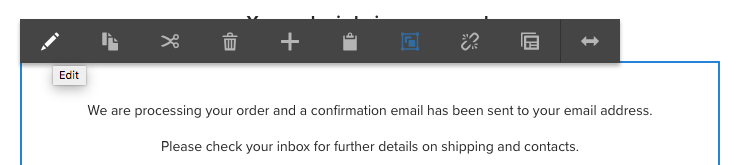

# Probar componentes principales en We.Retail{#trying-out-core-components-in-we-retail}

Los componentes principales son componentes modernos y flexibles, con fácil extensibilidad y que permiten una integración sencilla en sus proyectos. Los componentes principales se han creado en torno a varios principios de diseño principales, como HTL, usabilidad predeterminada, configurabilidad, versiones y extensibilidad. We.Retail se ha creado sobre componentes principales.

## Probándolo {#trying-it-out}

1. Comience AEM con el contenido de muestra de We.Retail y abra la [consola Componentes](/help/sites-authoring/default-components-console.md).

   **Navegación global -> Herramientas -> Componentes**

1. Al abrir el carril en la consola Componentes, puede filtrar para un grupo de componentes determinado. Los componentes principales se pueden encontrar en

   * `.core-wcm`: Los componentes principales estándar
   * `.core-wcm-form`: Componentes principales del envío de formularios

   Choose `.core-wcm`.

   

1. Tenga en cuenta que todos los componentes principales se denominan **v1**, lo que refleja que esta es la primera versión de este componente principal. En adelante se lanzarán versiones regulares, compatibles con la versión de AEM y que facilitan la actualización para que pueda aprovechar las últimas funciones.
1. Haga clic en **Texto (v1)**.

   Observe que el **Tipo de recurso** del componente es `/apps/core/wcm/components/text/v1/text`. Los componentes principales se encuentran en `/apps/core/wcm/components` y tienen versiones por componente.

   

1. Haga clic en la pestaña **Documentation** para ver la documentación para desarrolladores del componente.

   

1. Vuelva a la consola Componentes. Filtre para el grupo **We.Retail** y seleccione el componente **Text**.
1. Observe que **Resource Type** señala a un componente como se espera en `/apps/weretail` pero **Resource Super Type** apunta al componente principal `/apps/core/wcm/components/text/v1/text`.

   

1. Haga clic en la pestaña **Uso en directo** para ver en qué páginas se está utilizando este componente actualmente. Haga clic en la primera página **Gracias** para editar la página.

   

1. En la página de agradecimiento, seleccione el componente de texto y, en el menú de edición del componente, haga clic en el icono Cancelar herencia .

   [We.Retail tiene una ](/help/sites-developing/we-retail-globalized-site-structure.md) estructura de sitio globalizada en la que el contenido se transfiere de los maestros de idiomas a las  [Live Copies a través de un mecanismo llamado herencia](/help/sites-administering/msm.md). Por este motivo, la herencia debe cancelarse para permitir que un usuario edite manualmente el texto.

   

1. Confirme la cancelación haciendo clic en **Yes**.

   

1. Una vez cancelada la herencia y que seleccione los componentes de texto, hay muchas más opciones disponibles. Haga clic en** Editar**.

   

1. Ahora puede ver qué opciones de edición están disponibles para el componente de texto.

   

1. En el menú **Información de página**, seleccione **Editar plantilla**.
1. En el Editor de plantillas de la página, haga clic en el icono **Policy** del componente Texto en el **Contenedor de diseño** de la página.

   

1. Los componentes principales permiten a un autor de plantillas configurar qué propiedades están disponibles para los autores de la página. Estas incluyen funciones como fuentes de pegado permitidas, opciones de formato, estilos de párrafo disponibles, etc.

   Estos cuadros de diálogo de diseño están disponibles para muchos componentes principales y funcionan de la mano con el editor de plantillas. Una vez activados, estarán disponibles para el autor a través de los editores de componentes.

   

## Información adicional {#further-information}

Para obtener más información sobre los componentes principales, consulte el documento de creación [Componentes principales](https://docs.adobe.com/content/help/es-ES/experience-manager-core-components/using/introduction.html) para obtener una descripción general de las capacidades de los componentes principales y el documento para desarrolladores [Desarrollo de componentes principales](https://helpx.adobe.com/experience-manager/core-components/using/developing.html) para obtener una descripción general técnica.

También puede que desee investigar más a fondo [plantillas editables](/help/sites-developing/we-retail-editable-templates.md). Consulte el documento de creación [Creación de plantillas de página](/help/sites-authoring/templates.md) o el documento para desarrolladores Página [Plantillas: editables](/help/sites-developing/page-templates-editable.md) para obtener detalles completos sobre las plantillas editables.
