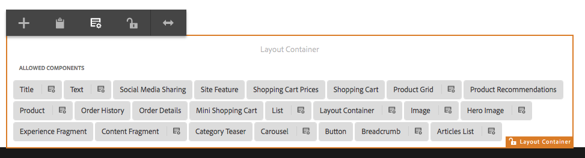

# Intentando plantillas editables en We.Retail{#trying-out-editable-templates-in-we-retail}

Con las plantillas editables, la creación y el mantenimiento de plantillas ya no es una tarea solo para desarrolladores. Ahora, un tipo de usuario avanzado, que se denomina autor de plantilla, puede crear plantillas. Los desarrolladores siguen necesitando configurar el entorno, crear bibliotecas de clientes y crear los componentes que se van a utilizar, pero una vez que estos conceptos básicos están establecidos, el autor de la plantilla tiene la flexibilidad de crear y configurar plantillas sin un proyecto de desarrollo.

Todas las páginas de We.Retail se basan en plantillas editables, lo que permite a los no desarrolladores adaptar y personalizar las plantillas.

## Intentándolo {#trying-it-out}

1. Edite la página Equipo de la ramificación maestra de idioma.

   http://localhost:4502/editor.html/content/we-retail/language-masters/en/equipment.html

1. Tenga en cuenta que el selector de modo ya no oferta un modo de diseño. Todas las páginas de We.Retail se basan en plantillas editables y para alterar el diseño de plantillas editables deben editarse en el editor de plantillas.
1. En el menú **Información de página** seleccione **Editar plantilla**.
1. Ahora está editando la plantilla Página principal.

   El modo de estructura de la página permite modificar la estructura de la plantilla. Esto incluye, por ejemplo, los componentes permitidos en el contenedor de diseño.

   

1. Configure las directivas del Contenedor Diseño para definir qué componentes se permiten en el contenedor.

   Las políticas equivalen a las configuraciones de diseño.

   

1. En el cuadro de diálogo de diseño del contenedor de diseño, puede

   * Seleccione una directiva existente o cree una nueva directiva para el contenedor
   * Seleccione los componentes permitidos en el contenedor
   * Definir los componentes predeterminados que se colocarán cuando se arrastre un recurso al contenedor

   

1. De nuevo en el editor de plantillas, puede editar la política del componente de texto dentro del contenedor de diseño.

   Esto le permite:

   * Seleccione una directiva existente o cree una nueva directiva para el contenedor
   * Defina las funciones disponibles para el autor de la página al utilizar este componente, como

      * Fuentes de pegado permitidas
      * Opciones de formato
      * Estilos de párrafo permitidos
      * Caracteres especiales permitidos

   Muchos componentes basados en los componentes principales permiten la configuración de opciones a nivel de componente mediante plantillas editables, lo que elimina la necesidad de personalización por parte de los desarrolladores.

   

1. De nuevo en el editor de plantillas, puede utilizar el selector de modo para cambiar al modo **Contenido inicial** para definir qué contenido se necesita en la página.

   **El** modo de diseño se puede utilizar como en una página normal para definir el diseño de la plantilla.

## Más información {#more-information}

Para obtener más información, consulte el documento de creación [Creación de plantillas de página](/help/sites-authoring/templates.md) o la página de documento para programadores [Plantillas - Editable](/help/sites-developing/page-templates-editable.md) para obtener detalles técnicos completos sobre las plantillas editables.

También es posible que desee investigar [componentes principales](/help/sites-developing/we-retail-core-components.md). Consulte el documento de creación [Componentes principales](https://docs.adobe.com/content/help/es-ES/experience-manager-core-components/using/introduction.html) para obtener una visión general de las capacidades de los componentes principales y el documento para desarrolladores [Desarrollo de componentes principales](https://helpx.adobe.com/experience-manager/core-components/using/developing.html) para obtener una descripción general técnica.

