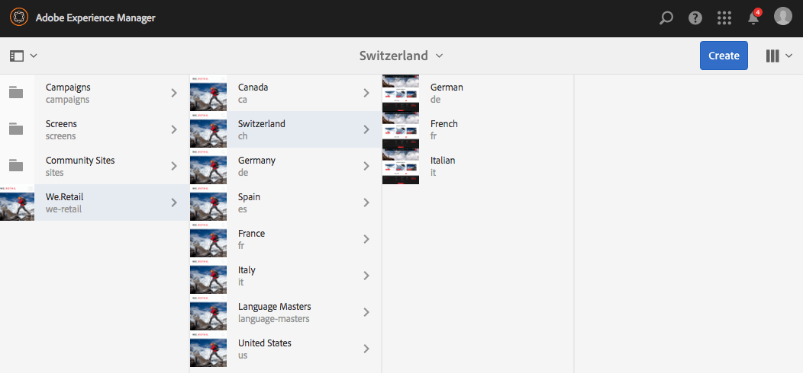
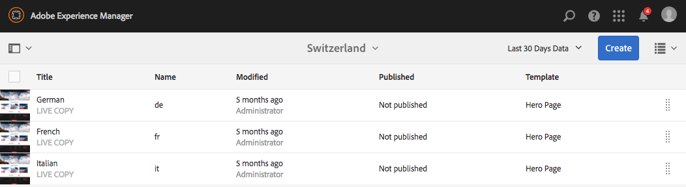
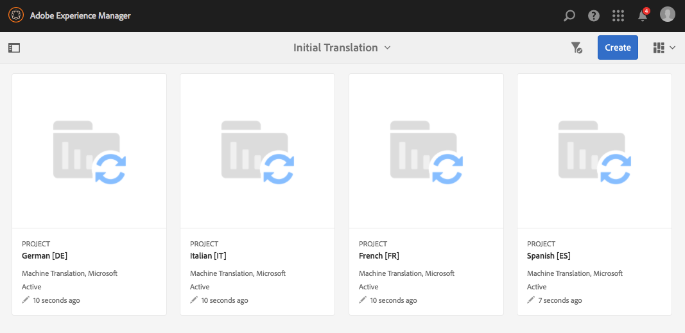
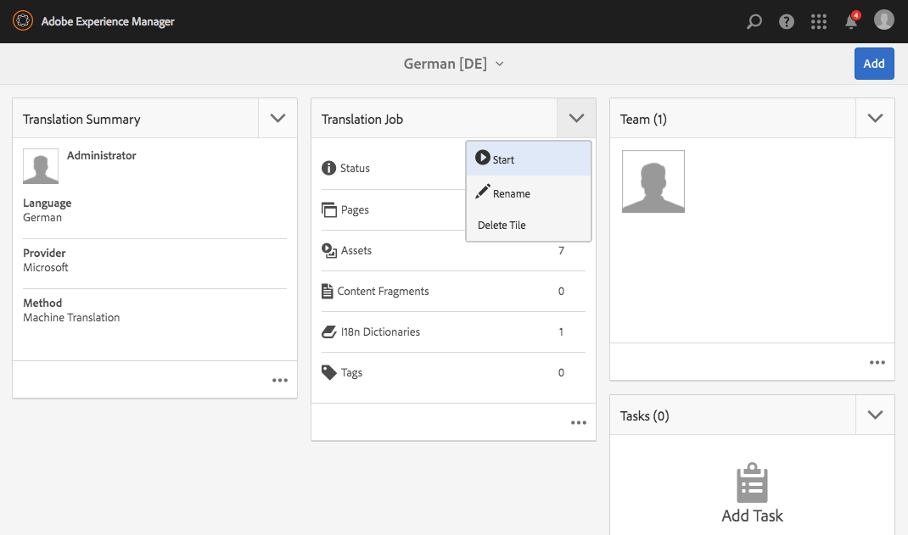
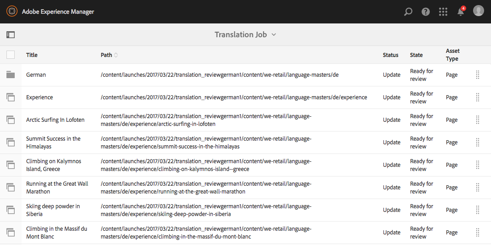

# Prueba de la estructura del sitio globalizado en We.Retail{#trying-out-the-globalized-site-structure-in-we-retail}

We.Retail se ha creado con una estructura de sitio globalizada que ofrece maestros de idiomas que pueden copiarse en directo en sitios web de países específicos. Todo está preparado para que pueda experimentar con esta estructura y las capacidades de traducción integradas.

## Intentándolo {#trying-it-out}

1. Abra la consola Sitios desde **Navegación global -> Sitios**.
1. Cambie a la vista de columna (si no está activa) y seleccione We.Retail. Observe la estructura de país de ejemplo con Suiza, los Estados Unidos, Francia, etc., junto con los Maestros de Lenguas.

   

1. Seleccione Suiza y vea las raíces lingüísticas de los idiomas de ese país. Tenga en cuenta que todavía no hay contenido debajo de estas raíces.

   

1. Cambie a la vista de lista y vea que las copias de idiomas de los países son todas copias en vivo.

   

1. Vuelva a la vista de columna y haga clic en el Maestro de idioma y vea las raíces del maestro de idioma con contenido. Tenga en cuenta que solo el inglés tiene contenido.

   We.Retail no incluye ningún contenido traducido, pero la estructura y configuración están establecidas para permitirle mostrar los servicios de traducción.

   

1. Con el maestro de idioma inglés seleccionado, abra el carril **References** en la consola Sitios y seleccione **Language Copies**.

   

1. Marque la casilla de verificación situada junto a la etiqueta **Language Copies** para seleccionar todas las copias de idioma. En la sección **Actualizar copias de idioma** del carril, seleccione la opción para **Crear un nuevo proyecto de traducción**. Proporcione un nombre para el proyecto y haga clic en **Actualizar**.

   

1. Se crea un proyecto para cada traducción de idioma. Vista en **Navegación -> Proyectos**.

   

1. Haga clic en Alemán para ver los detalles del proyecto de traducción. Tenga en cuenta que el estado es **Borrador**. Para inicio de la traducción con el servicio de traducción de Microsoft, haga clic en la chevron situada junto al encabezado **Trabajo de traducción** y seleccione **Inicio**.

   

1. Los inicios del proyecto de traducción. Haga clic en los puntos suspensivos en la parte inferior de la tarjeta denominada Trabajo de traducción para ver los detalles. El servicio de traducción ya ha traducido las páginas con el estado **Listo para revisión**.

   

1. Al seleccionar una de las páginas de la lista y luego **Previsualización en Sitios** en la barra de herramientas, se abre la página traducida en el editor de páginas.

   

>[!NOTE]
>
>Este procedimiento demostró la integración integrada con la traducción automática de Microsoft. Con el [AEM Translation Integration Framework](/help/sites-administering/translation.md), puede integrarse con muchos servicios de traducción estándar para orquestar la traducción de AEM.

## Información adicional {#further-information}

Para obtener más información, consulte el documento de creación [Traducción de contenido para sitios multilingües](/help/sites-administering/translation.md) para obtener detalles técnicos completos.
