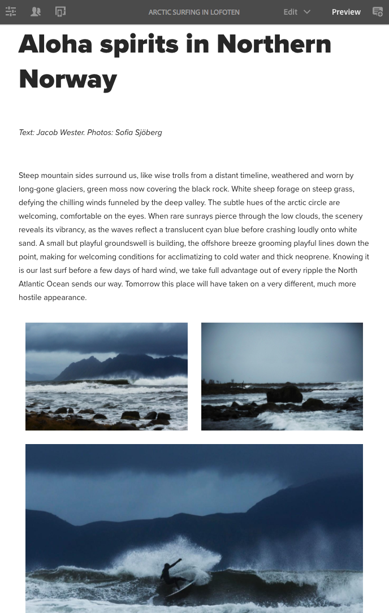

# Prueba del diseño interactivo en We.Retail{#trying-out-responsive-layout-in-we-retail}

Todas las páginas de We.Retail utilizan el componente Contenedor de diseño para implementar un diseño interactivo. El contenedor de diseño proporciona un sistema de párrafos que le permite colocar componentes en una cuadrícula adaptable. Esta cuadrícula puede reorganizar el diseño según el tamaño y el formato del dispositivo o la ventana. El componente se utiliza junto con el **Diseño** en el editor de páginas, lo que le permite crear y editar su diseño interactivo en función del dispositivo.

## Probando a cabo {#trying-it-out}

1. Edite la página Arctic Surfing en la sección Experiences de la rama maestra del idioma.

   http://localhost:4502/editor.html/content/we-retail/language-masters/en/experience/arctic-surfing-in-lofoten.html

1. Cambiar a **Previsualizar** para ver la página tal como se representaría para un visitante del sitio web. Desplácese hacia abajo hasta el contenido del artículo *Espíritus Aloha en Noruega del Norte*.

   

1. Cambie el tamaño de la ventana del explorador y observe cómo el diseño se adapta dinámicamente al cambio de tamaño.

   

1. Cambie al modo Diseño. La barra de herramientas del emulador se muestra automáticamente, lo que le permite planificar el diseño por dispositivo de destino.

   Al seleccionar un componente, se muestran las opciones flotantes y ocultas en el menú de edición junto con los controladores de tamaño del componente.

   

1. Al pulsar y arrastrar el controlador de cambio de tamaño del componente, se muestra automáticamente la cuadrícula de diseño para ayudarle con el cambio de tamaño.

   

## Información adicional {#further-information}

Para obtener más información, consulte el documento de creación [Diseño interactivo](/help/sites-authoring/responsive-layout.md) o el documento del administrador [Configuración del contenedor y el modo de diseño](/help/sites-administering/configuring-responsive-layout.md) para obtener información técnica completa.
