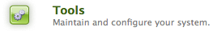
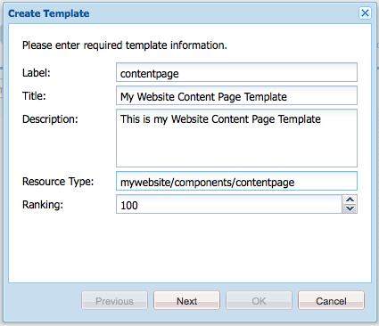

# Crear un sitio web con todas las funciones (JSP){#create-a-fully-featured-website-jsp}

>[!NOTE]
>
>En este artículo se describe cómo crear un sitio web con JSP y basado en la IU clásica. Adobe recomienda aprovechar las tecnologías de AEM más recientes para sus sitios web, tal como se describe en detalle en el artículo [Introducción al desarrollo de AEM Sites](/help/sites-developing/getting-started.md).

Este tutorial le permite crear un sitio web con todas las funciones con Adobe Experience Manager (AEM). El sitio web se basará en un sitio web genérico y estará dirigido principalmente a los desarrolladores web. Todo el desarrollo tendrá lugar dentro de un entorno de autor.

Este tutorial describe cómo:

1. Instale AEM.
1. CRXDE Lite de acceso (el entorno de desarrollo).
1. Configure la estructura del proyecto en CRXDE Lite.
1. Cree la plantilla, el componente y las secuencias de comandos que se utilizan como base para crear páginas de contenido.
1. Cree la página raíz del sitio web y, a continuación, las páginas de contenido.
1. Cree los siguientes componentes para utilizarlos en sus páginas:

   * Navegación superior
   * Lista de secundarios
   * Logotipo
   * Imagen
   * Imagen-Texto
   * Búsqueda  

1. Incluya varios componentes de base.

Después de realizar todos los pasos, las páginas tendrán el siguiente aspecto:


**Descargar el resultado final**

Para seguir el tutorial en lugar de realizar los ejercicios, descargue el sitio web-1.0.zip. Este archivo es un paquete de contenido AEM que contiene los resultados de este tutorial. Utilice [Administrador de paquetes](/help/sites-administering/package-manager.md) para instalar el paquete en la instancia de creación.

**NOTA:** Al instalar este paquete se sobrescribirán todos los recursos de la instancia de creación que haya creado con este tutorial.

Paquete de contenido del sitio web

[Obtener archivo](assets/website-1_0.zip)

## Instalación de Adobe Experience Manager {#installing-adobe-experience-manager}

Para instalar una instancia de AEM para desarrollar su sitio web, siga las instrucciones para configurar un [entorno de implementación con instancias de creación y publicación](/help/sites-deploying/deploy.md#author-and-publish-installs) o realice una [instalación genérica](/help/sites-deploying/deploy.md#default-local-install). La instalación genérica implica descargar el archivo JAR de inicio rápido AEM, colocar el archivo license.properties en el mismo directorio que el archivo JAR y hacer clic con el doble en el archivo JAR.

Después de instalar AEM, acceda al entorno de desarrollo de CRXDE Lite haciendo clic en el vínculo CRXDE Lite en la página de bienvenida:


>[!NOTE]
>
>La dirección URL de CRXDE Lite para una instancia de creación de AEM que se instala localmente mediante el puerto predeterminado es [https://localhost:4502/crx/de/](https://localhost:4502/crx/de/).

### Configuración de la estructura del proyecto en el CRXDE Lite {#setting-up-the-project-structure-in-crxde-lite}

Utilice CRXDE Lite para crear la estructura de la aplicación mywebsite en el repositorio:

1. En el árbol del lado izquierdo del CRXDE Lite, haga clic con el botón derecho en la carpeta **`/apps`** y haga clic en **Crear** > **Crear** **Carpeta**. En el cuadro de diálogo **Crear carpeta**, escriba `mywebsite` como nombre de la carpeta y haga clic en **Aceptar**.
1. Haga clic con el botón secundario en la carpeta **`/apps/mywebsite`** y haga clic en **Crear** > **Crear carpeta**. En el cuadro de diálogo **Crear carpeta**, escriba `components` como nombre de la carpeta y haga clic en **Aceptar**.
1. Haga clic con el botón secundario en la carpeta **`/apps/mywebsite`** y haga clic en **Crear** > **Crear carpeta**. En el cuadro de diálogo **Crear carpeta**, escriba `templates` como nombre de la carpeta y haga clic en **Aceptar**.

   La estructura en el árbol debería tener un aspecto similar al siguiente:

   

1. Haga clic en **Guardar todo**.

### Configuración del diseño {#setting-up-the-design}

En esta sección, se crea el diseño para la aplicación con la herramienta Designer. El diseño proporciona recursos de imágenes y CSS para el sitio web.

>[!NOTE]
>
>Haga clic en el siguiente vínculo para descargar mywebsite.zip. El archivo contiene los archivos static.css e image para el diseño.

Muestra de imágenes y archivos static.css

[Obtener archivo](assets/mywebsite.zip)

1. En la página de bienvenida de AEM, haga clic en **Herramientas**. ([https://localhost:4502/libs/cq/core/content/welcome.html](https://localhost:4502/libs/cq/core/content/welcome.html))

   

1. En el árbol de carpetas, seleccione la carpeta **Diseños** y haga clic en **Nuevo** > **Nueva página**. Escriba `mywebsite` como título y haga clic en **Crear**.

1. Si el elemento de mi sitio web no aparece en la tabla, actualice el árbol o la tabla.

1. [Mediante ](/help/sites-administering/webdav-access.md) WebDAVaccess a la dirección URL en https://localhost:4502, copie el  `static.css` archivo y la  `images` carpeta de ejemplo del archivo mywebsite.zip descargado en la  `/etc/designs/mywebsite` carpeta.

   

### Creación de la plantilla, el componente y la secuencia de comandos de Contentpage {#creating-the-contentpage-template-component-and-script}

En esta sección, se crea lo siguiente:

* Plantilla de página de contenido que se utilizará para crear páginas de contenido en el sitio web de ejemplo
* El componente contentpage que se utilizará para representar páginas de contenido
* La secuencia de comandos contentpage

#### Creación de la plantilla Contentpage {#creating-the-contentpage-template}

Cree una plantilla para utilizarla como base de las páginas web del sitio.

Una plantilla define el contenido predeterminado de una nueva página. Los sitios Web complejos pueden utilizar varias plantillas para crear los distintos tipos de páginas del sitio. En este ejercicio, todas las páginas se basan en una plantilla sencilla.

1. En el árbol de carpetas del CRXDE Lite, haga clic con el botón derecho `/apps/mywebsite/templates` y haga clic en **Crear** > **Crear plantilla**.

1. En el cuadro de diálogo Crear plantilla, escriba los siguientes valores y haga clic en **Siguiente**:

   * **Etiqueta**: contentpage
   * **Título**: Plantilla de página de contenido de mi sitio web
   * **Descripción**: Esta es mi plantilla de página de contenido del sitio Web
   * **Tipo de recurso:** mywebsite/components/contentpage

   Utilice el valor predeterminado para la propiedad Ranking.

   

   El tipo de recurso identifica el componente que procesa la página. En este caso, el componente `mywebsite/components/contentpage` representa todas las páginas creadas con la plantilla contentpage.

1. Para especificar las rutas de las páginas que pueden utilizar esta plantilla, haga clic en el botón más y escriba `/content(/.*)?` en el cuadro de texto que aparece. A continuación, haga clic en **Siguiente**.

   

   El valor de la propiedad path permitida es una expresión *regular.* Las páginas que tengan una ruta que coincida con la expresión pueden utilizar la plantilla. En este caso, la expresión normal coincide con la ruta de la carpeta **/content** y con todas las subpáginas.

   Cuando un autor crea una página debajo de /content, la plantilla **contentpage** aparece en una lista de plantillas disponibles para usar.

1. Haga clic en **Siguiente** en los paneles **Padres permitidos** y **Niños permitidos** y haga clic en **Aceptar**. En el CRXDE Lite, haga clic en **Guardar todo**.

   

#### Creación del componente Contentpage {#creating-the-contentpage-component}

Cree el *componente* que define el contenido y procesa las páginas que utilizan la plantilla contentpage. La ubicación del componente debe corresponder con el valor de la propiedad Tipo de recurso de la plantilla contentpage.

1. En el CRXDE Lite, haga clic con el botón derecho `/apps/mywebsite/components` y haga clic en **Crear** > **Componente**.
1. En el cuadro de diálogo **Crear componente**, escriba los siguientes valores de propiedad:

   * **Etiqueta**: contentpage
   * **Título**: Componente de la página de contenido de mi sitio Web
   * **Descripción**: Componente de la página Contenido de mi sitio Web

   

   La ubicación del nuevo componente es `/apps/mywebsite/components/contentpage`. Esta ruta corresponde al tipo de recurso de la plantilla contentpage (menos la parte inicial **`/apps/`** de la ruta).

   Esta correspondencia conecta la plantilla con el componente y es crítica para el correcto funcionamiento del sitio web.

1. Haga clic en **Siguiente** hasta que aparezca el panel Elementos secundarios permitidos del cuadro de diálogo y, a continuación, haga clic en **Aceptar**. En el CRXDE Lite, haga clic en **Guardar todo**.

   La estructura ahora tiene el siguiente aspecto:

   

#### Desarrollo del script de componente Contentpage {#developing-the-contentpage-component-script}

Añada código a la secuencia de comandos contentpage.jsp para definir el contenido de la página.

1. En CRXDE Lite, abra el archivo `contentpage.jsp` en `/apps/mywebsite/components/contentpage`. El archivo contiene el siguiente código de forma predeterminada:

   ```java
   <%--
   
     My Website Content Page Component component.
   
     This is My Website Content Page Component.
   
   --%><%
   %><%@include file="/libs/foundation/global.jsp"%><%
   %><%@page session="false" %><%
   %><%
       /* TODO add you code here */
   %>
   ```

1. Copie el siguiente código y péguelo en contentpage.jsp después del código predeterminado:

   ```java
   <%@ page language="java" contentType="text/html; charset=ISO-8859-1"
       pageEncoding="ISO-8859-1"%>
   <!DOCTYPE html PUBLIC "-//W3C//DTD HTML 4.01 Transitional//EN"
   "https://www.w3.org/TR/html4/loose.dtd">
   <html>
   <head>
   <meta http-equiv="Content-Type" content="text/html; charset=ISO-8859-1">
   <title>My title</title>
   </head>
   <body>
   <div>My body</div>
   </body>
   </html>
   ```

1. Haga clic en **Guardar todo** para guardar los cambios.

### Creación de la página del sitio Web y las páginas de contenido {#creating-your-website-page-and-content-pages}

En esta sección, se crean las páginas siguientes que utilizan la plantilla contentpage: Mi sitio web, inglés, productos, servicios y clientes.

1. En la página de bienvenida de AEM ([https://localhost:4502/libs/cq/core/content/welcome.html](https://localhost:4502/libs/cq/core/content/welcome.html)), haga clic en Sitios web.

   

1. En el árbol de carpetas, seleccione la carpeta **Sitios web** y haga clic en **Nuevo** > **Nueva página**.
1. En la ventana **Crear página**, escriba lo siguiente:

   * Título: `My Website`
   * Nombre: `mywebsite`
   * Seleccione el `My Website Content Page Template`

   

1. Haga clic en **Crear**. En el árbol de carpetas, seleccione la página **/Sitios web/Mi sitio web** y haga clic en **Nueva** > **Nueva página**.
1. En el cuadro de diálogo Crear página, introduzca los siguientes valores de propiedad y haga clic en Crear:

   * Título: Inglés
   * Nombre: en
   * Seleccionar la plantilla de la página de contenido de mi sitio Web

1. En el árbol de carpetas, seleccione la página **/Sitios web/Mi sitio web/inglés** y haga clic en **Nueva** **Nueva página**.
1. En el cuadro de diálogo **Crear página**, introduzca los siguientes valores de propiedad y haga clic en **Crear**:

   * Título: Productos
   * Seleccionar la plantilla de la página de contenido de mi sitio Web

1. En el árbol de carpetas, seleccione la página **/Sitios web/Mi sitio web/inglés** y haga clic en **Nueva** > **Nueva página**.
1. En el cuadro de diálogo **Crear página**, introduzca los siguientes valores de propiedad y haga clic en **Crear**:

   * Título: Servicios
   * Seleccionar la plantilla de la página de contenido de mi sitio Web

1. En el árbol de carpetas, seleccione la página **/Sitios web/Mi sitio web/inglés** y haga clic en **Nueva** > **Nueva página**.
1. En el cuadro de diálogo **Crear página**, introduzca los siguientes valores de propiedad y haga clic en **Crear**:

   * Título: Clientes
   * Seleccionar la plantilla de la página de contenido de mi sitio Web

   La estructura tiene el siguiente aspecto:

   

1. Para vincular las páginas al diseño de mi sitio web, en CRXDE Lite, seleccione el nodo `/content/mywebsite/en/jcr:content`. En la ficha Propiedades, escriba los siguientes valores para una nueva propiedad y, a continuación, haga clic en Añadir:

   * Nombre: cq:designPath
   * Tipo: Cadena
   * Valor: /etc/designs/mywebsite

   

1. En una nueva ficha o ventana del explorador Web, abra [https://localhost:4502/content/mywebsite/en/products.html](https://localhost:4502/content/mywebsite/en/products.html) para ver la página Productos:

   

### Mejora del script de página de contenido {#enhancing-the-contentpage-script}

En esta sección se describe cómo mejorar la secuencia de comandos de la página de contenido mediante los scripts del componente de base de AEM y escribiendo sus propios scripts.

La página **Productos** tendrá el siguiente aspecto:


#### Uso de los scripts de página base {#using-the-foundation-page-scripts}

En este ejercicio, se configura el componente de contenido de página para que su supertipo sea el componente de página de AEM. Dado que los componentes heredan las características de su supertipo, el contenido de la página hereda las secuencias de comandos y las propiedades del componente Página.

Por ejemplo, en el código JSP del componente, puede hacer referencia a las secuencias de comandos que proporciona el componente de supertipo como si se incluyeran en el componente.

1. En CRXDE Lite, agregue una propiedad al nodo `/apps/mywebsite/components/contentpage`.

   1. Seleccione el nodo `/apps/mywebsite/components/contentpage`.
   1. En la parte inferior de la ficha Propiedades, escriba los siguientes valores de propiedad y haga clic en Añadir:

      * **Nombre:** sling:resourceSuperType
      * **Tipo:** Cadena
      * **Valor:** foundation/components/page
   1. Haga clic en Guardar todo.


1. Abra el archivo `contentpage.jsp` en `/apps/mywebsite/components/contentpage` y reemplace el código existente por el siguiente código:

   ```xml
   <%@include file="/libs/foundation/global.jsp"%><%
   %><%@page session="false" contentType="text/html; charset=utf-8" %><%
   %><!DOCTYPE HTML PUBLIC "-//W3C//DTD HTML 4.01//EN" "https://www.w3.org/TR/html4/strict.dtd">
   <html>
   <cq:include script="head.jsp"/>
   <cq:include script="body.jsp"/>
   </html>
   ```

1. Guarde los cambios.
1. En el explorador, vuelva a cargar la página Productos. Tiene el siguiente aspecto:

   

   Abra el origen de la página para ver los elementos javascript y HTML que generaron los scripts head.jsp y body.jsp. El siguiente fragmento de secuencia de comandos abre la barra de tareas al abrir la página:

   ```java
   CQ.WCM.launchSidekick("/content/mywebsite/en/products",
               {propsDialog: "/libs/foundation/components/page/dialog",
                  locked: false locked: false
                });
   ```

#### Uso de sus propias secuencias de comandos {#using-your-own-scripts}

En esta sección se crean varias secuencias de comandos que generan una parte del cuerpo de la página. A continuación, cree el archivo body.jsp en el componente pagecontent para anular el body.jsp del componente Página AEM. En el archivo body.jsp, se incluyen las secuencias de comandos que generan las distintas partes del cuerpo de la página.

**Sugerencia:** Cuando un componente incluye un archivo con el mismo nombre y la misma ubicación relativa que un archivo del supertipo del componente, se le llama  *superposición*.

1. En CRXDE Lite, cree el archivo `left.jsp` en `/apps/mywebsite/components/contentpage`:

   1. Haga clic con el botón derecho en el nodo `/apps/mywebsite/components/contentpage` y seleccione **Crear **luego **Crear archivo**.

   1. En la ventana, escriba `left.jsp` como **Nombre** y haga clic en **Aceptar**.

1. Edite el archivo `left.jsp` para eliminar el contenido existente y reemplazarlo por el siguiente código:

   ```java
   <%@include file="/libs/foundation/global.jsp"%><%
   %><div class="left">
   <div>logo</div>
   <div>newslist</div>
   <div>search</div>
   </div>
   ```

1. Guarde los cambios.
1. En CRXDE Lite, cree el archivo `center.jsp` en `/apps/mywebsite/components/contentpage`:

   1. Haga clic con el botón derecho en el nodo `/apps/mywebsite/components/contentpage`, seleccione **Crear** y, a continuación, **Crear archivo**.

   1. En el cuadro de diálogo, escriba `center.jsp` como **Nombre** y haga clic en **Aceptar**.

1. Edite el archivo `center.jsp` para eliminar el contenido existente y reemplazarlo por el siguiente código:

   ```java
   <%@include file="/libs/foundation/global.jsp"%><%
   %><div class="center">
   <div>trail</div>
   <div>title</div>
   <div>parsys</div>
   </div>
   ```

1. Guarde los cambios.
1. En CRXDE Lite, cree el archivo `right.jsp` en `/apps/mywebsite/components/contentpage`:

   1. Haga clic con el botón derecho en el nodo `/apps/mywebsite/components/contentpage`, seleccione **Crear** y, a continuación, **Crear archivo**.

   1. En el cuadro de diálogo, escriba `right.jsp` como **Nombre** y haga clic en **Aceptar**.

1. Edite el archivo `right.jsp` para eliminar el contenido existente y reemplazarlo por el siguiente código:

   ```java
   <%@include file="/libs/foundation/global.jsp"%><%
   %><div class="right">
   <div>iparsys</div>
   </div>
   ```

1. Guarde los cambios.
1. En CRXDE Lite, cree el archivo `body.jsp` en `/apps/mywebsite/components/contentpage`:
1. Edite el archivo `body.jsp` para eliminar el contenido existente y reemplazarlo por el siguiente código:

   ```java
   <%@include file="/libs/foundation/global.jsp"%><%
   %><body>
   <div id="CQ">
   <div class="topnav">topnav</div>
   <div class="content">
   <cq:include script="left.jsp" />
   <cq:include script="center.jsp" />
   <cq:include script="right.jsp" />
   </div>
   <div class="footer">
   <div class="toolbar">toolbar</div>
   </div>
   </div>
   </body>
   ```

1. Guarde los cambios.
1. En el explorador, vuelva a cargar la página Productos. Tiene el siguiente aspecto:

   

### Creación del componente de navegación superior {#creating-the-top-navigation-component}

En esta sección, se crea un componente que muestra vínculos a todas las páginas de nivel superior del sitio web para facilitar la navegación. Este contenido de componente aparece en la parte superior de todas las páginas que se crean con la plantilla contentpage.

En la primera versión del componente de navegación superior (topnav), los elementos de navegación son únicamente vínculos de texto. En la segunda versión se implementa la topnav con vínculos de navegación de imágenes.

La navegación superior tendrá el siguiente aspecto:


#### Creación del componente de navegación superior {#creating-the-top-navigation-component-1}

1. En el CRXDE Lite, haga clic con el botón derecho `/apps/mywebsite/components`, seleccione **Crear** y, a continuación, **Crear componente**.
1. En la ventana **Crear componente**, introduzca lo siguiente:

   * **Etiqueta**: `topnav`

   * **Título**: `My Top Navigation Component`

   * **Descripción**: `This is My Top Navigation Component`

1. Haga clic en **Siguiente** hasta que llegue a la última ventana donde haga clic en **Aceptar**. Guarde los cambios.

#### Creación del script de navegación principal con vínculos de texto {#creating-the-top-navigation-script-with-textual-links}

Añada la secuencia de comandos de procesamiento a topnav para generar vínculos de texto a páginas secundarias:

1. En CRXDE Lite, abra el archivo `topnav.jsp` en `/apps/mywebsite/components/topnav`.
1. Reemplace el código que hay copiando y pegando el siguiente código:

   ```xml
   <%@include file="/libs/foundation/global.jsp"%><%
   %><%@ page import="java.util.Iterator,
           com.day.text.Text,
           com.day.cq.wcm.api.PageFilter, com.day.cq.wcm.api.Page" %><%
       /* get starting point of navigation */
       Page navRootPage = currentPage.getAbsoluteParent(2);
       if (navRootPage == null && currentPage != null) {
       navRootPage = currentPage;
       }
       if (navRootPage != null) {
           Iterator<Page> children = navRootPage.listChildren(new PageFilter(request));
           while (children.hasNext()) {
               Page child = children.next();
               %><a href="<%= child.getPath() %>.html"><%=child.getTitle() %></a><%
           }
       }
   %>
   ```

#### Inclusión de navegación principal en el componente Contentpage {#including-top-navigation-in-the-contentpage-component}

Para incluir topnav en el componente contentpage:

1. En CRXDE Lite, abra `body.jsp` en `/apps/mywebsite/components/contentpage`y reemplace:

   ```xml
   <div class="topnav">topnav</div>
   ```

   por:

   ```xml
   <cq:include path="topnav" resourceType="mywebsite/components/topnav" />
   ```

1. Guarde los cambios.
1. En el explorador, vuelva a cargar la página Productos. La navegación superior aparece de la siguiente manera:

   

#### Mejora de páginas con subtítulos {#enhancing-pages-with-subtitles}

El componente Página define propiedades que permiten proporcionar subtítulos para las páginas. Añada subtítulos que proporcionen información sobre el contenido de la página.

1. En el explorador, abra la página **Productos**.
1. En la ficha Barra de tareas **Página**, haga clic en **Propiedades de la página**.
1. En la ficha Básico del cuadro de diálogo, expanda **Más títulos y descripción,** y para la propiedad **Subtítulo**, escriba **lo que hacemos**. Haga clic en **Aceptar**.
1. Repita los pasos anteriores para agregar el subtítulo **acerca de nuestros servicios** a la página **Servicios**.
1. Repita los pasos anteriores para agregar el subtítulo **la confianza que ganamos** a la página **Clientes**.

   **Sugerencia:** En el CRXDE Lite, seleccione el nodo /content/mywebsite/en/products/jcr:content para ver que se agrega la propiedad subtitle.

#### Mejorar la navegación superior mediante vínculos de imagen {#enhance-top-navigation-by-using-image-links}

Mejore la secuencia de comandos de procesamiento del componente topnav para utilizar vínculos de imagen en lugar de hipertexto en los controles de navegación. La imagen incluye el título y el subtítulo del destinatario del vínculo.

Este ejercicio muestra [procesamiento de solicitud de Sling](/help/sites-developing/the-basics.md#sling-request-processing). La secuencia de comandos topnav.jsp se modifica para llamar a una secuencia de comandos que genere dinámicamente imágenes para utilizarlas en los vínculos de navegación de la página. En este ejercicio, Sling analiza la dirección URL de los archivos de origen de imagen para determinar la secuencia de comandos que se utilizará para procesar las imágenes.

Por ejemplo, el origen del vínculo de imagen a la página Productos podría ser https://localhost:4502/content/mywebsite/en/products.navimage.png. Sling analiza esta dirección URL para determinar el tipo de recurso y la secuencia de comandos que se va a utilizar para procesar el recurso:

1. Sling determina la ruta del recurso para que sea `/content/mwebysite/en/products.png.`
1. Sling coincide con esta ruta con el nodo `/content/mywebsite/en/products`.
1. Sling determina que el `sling:resourceType` de este nodo es `mywebsite/components/contentpage`.

1. Sling encuentra la secuencia de comandos de este componente que mejor se ajusta al selector de URL ( `navimage`) y a la extensión de nombre de archivo ( `png`).

En este ejercicio, Sling hace coincidir estas direcciones URL con el script /apps/mywebsite/components/contentpage/navimage.png.java que ha creado.

1. En CRXDE Lite, abra `topnav.jsp` en `/apps/mywebsite/components/topnav.`Localice el contenido del elemento de anclaje (línea 14):

   ```xml
   <%=child.getTitle() %>
   ```

1. Reemplace el contenido del anclaje con el siguiente código:

   ```xml
   " src="<%= child.getPath() %>.navimage.png">
   ```

1. Guarde los cambios.
1. Haga clic con el botón secundario en el nodo `/apps/mywebsite/components/contentpage` y haga clic en **Crear** > **Crear archivo**.
1. En la ventana **Crear archivo**, como **Nombre**, escriba `navimage.png.java`.

   La extensión de nombre de archivo .java indica a Sling que la compatibilidad con Java de Apache Sling Scripting debe utilizarse para compilar la secuencia de comandos y crear un servlet.

1. Copie el siguiente código en `navimage.png.java.`El código amplía la clase AbstractImageServlet:

   * [](https://helpx.adobe.com/experience-manager/6-5/sites/developing/using/reference-materials/javadoc/com/day/cq/wcm/commons/AbstractImageServlet.html) AbstractImageServletcrea un objeto ImageContext que almacena las propiedades del recurso actual.
   * La página principal del recurso se extrae del objeto ImageContext. A continuación, se obtienen el título y el subtítulo de la página.
   * [](https://helpx.adobe.com/experience-manager/6-5/sites/developing/using/reference-materials/javadoc/com/day/cq/commons/ImageHelper.html) ImageHelperis se utiliza para generar la imagen a partir del archivo navimage_bg.jpg del diseño del sitio, el título de la página y el subtítulo de la página.

   ```java
   package apps.mywebsite.components.contentpage;
   
   import java.awt.Color;
   import java.awt.Paint;
   import java.awt.geom.Rectangle2D;
   
   import java.io.IOException;
   import javax.jcr.RepositoryException;
   
   import com.day.cq.wcm.api.Page;
   import com.day.cq.wcm.api.PageManager;
   import com.day.cq.wcm.api.components.Component;
   import com.day.cq.wcm.api.designer.Designer;
   
   import com.day.cq.commons.SlingRepositoryException;
   import com.day.cq.wcm.commons.WCMUtils;
   import com.day.cq.wcm.commons.AbstractImageServlet;
   import com.day.cq.commons.ImageHelper;
   
   import com.day.image.Font;
   import com.day.image.Layer;
   
   import org.apache.sling.api.SlingHttpServletRequest;
   import org.apache.sling.api.SlingHttpServletResponse;
   import org.apache.sling.api.resource.Resource;
   import org.apache.sling.api.servlets.SlingSafeMethodsServlet;
   
   /**
     * Renders the navigation image
     */
   public class navimage_png extends AbstractImageServlet {
   
         protected Layer createLayer(ImageContext ctx)
                throws RepositoryException, IOException {
            PageManager pageManager = ctx.resolver.adaptTo(PageManager.class);
            Page currentPage = pageManager.getContainingPage(ctx.resource);
   
            /* constants for image appearance */
            int scale = 6;
            int paddingX = 24;
            int paddingY = 24;
            Color bgColor = new Color(0x004a565c, true);
   
            /* obtain the page title */
            String title = currentPage.getTitle();
            if (title == null) {
                title = currentPage.getName();
            }
   
            /* format the title text */
            title = title.toUpperCase();
            Paint titleColor = Color.WHITE;
            Font titleFont = new Font("Myriad Pro", 10 * scale, Font.BOLD);
            int titleBase = 10 * scale;
   
            /* obtain and format the page subtitle */
            String subtitle = currentPage.getProperties().get("subtitle", "");
            Paint subtitleColor = new Color(0xffa9afb1, true);
            Font subTitleFont = new Font("Tahoma", 7);
            int subTitleBase = 20;
   
            /* create a layer that contains the background image from the mywebsite design */
            Designer dg = ctx.resolver.adaptTo(Designer.class);
            String imgPath = new String(dg.getDesignPath(currentPage)+"/images/navimage_bg.jpg");
            Layer bg = ImageHelper.createLayer(ctx.resolver.resolve(imgPath));
   
            /* draw the title text (4 times bigger) */
            Rectangle2D titleExtent = titleFont.getTextExtent(0, 0, 0, 0, title, Font.ALIGN_LEFT, 0, 0);
            Rectangle2D subtitleExtent = subTitleFont.getTextExtent(0, 0, 0, 0, subtitle, Font.ALIGN_LEFT, 0, 0);
   
            /* ensure subtitleExtent is wide enough */
            if ( subtitle.length() > 0 ) {
                int titleWidth = (int)titleExtent.getWidth() / scale;
                if ( subtitleExtent.getWidth() > titleWidth && subtitleExtent.getWidth() + 2 * paddingX >
    bg.getWidth() ) {
                    int charWidth = (int)subtitleExtent.getWidth() / subtitle.length();
                    int maxWidth = (bg.getWidth() > titleWidth + 2  * paddingX ? bg.getWidth() - 2 * paddingX : titleWidth);
                    int len = (maxWidth - ( 2 * charWidth) ) / charWidth;
                    subtitle = subtitle.substring(0, len) + "...";
                    subtitleExtent = subTitleFont.getTextExtent(0, 0, 0, 0, subtitle, Font.ALIGN_LEFT, 0, 0);
                }
            }
            int width = Math.max((int) titleExtent.getWidth(), (int) subtitleExtent.getWidth());
           /* create the text layer */
            Layer text = new Layer(width, (int) titleExtent.getHeight() + 40, new Color(0x01ffffff, true));
            text.setPaint(titleColor);
            text.drawText(0, titleBase, 0, 0, title, titleFont, Font.ALIGN_LEFT | Font.ALIGN_BASE, 0, 0);
            text.resize(text.getWidth() / scale, text.getHeight() / scale);
            text.setX(0);
            text.setY(0);
   
            if (subtitle.length() > 0) {
                /* draw the subtitle normal sized */
                text.setPaint(subtitleColor);
                text.drawText(0, subTitleBase, 0, 0, subtitle, subTitleFont, Font.ALIGN_LEFT | Font.ALIGN_BASE, 0, 0);
            }
   
            /* merge the image and text layers */
            text.setY(paddingY);
            text.setX(paddingX);
            text.setBackgroundColor(bgColor);
   
            int bgWidth = bg.getWidth();
            if ( text.getWidth() + 2 * paddingX > bgWidth ) {
                bgWidth = text.getWidth() + 2 * paddingX;
                bg.resize(bgWidth, bg.getHeight());
            }
            bg.merge(text);
   
            return bg;
        }
    }
   ```

1. Guarde los cambios.
1. En el explorador, vuelva a cargar la página Productos. La navegación superior ahora aparece de la siguiente manera:

   

### Creación del componente secundario de Lista {#creating-the-list-children-component}

Cree el componente listchildren que genera una lista de vínculos de página que incluyen el título, la descripción y la fecha de las páginas (por ejemplo, las páginas de producto). Los vínculos destinatario las páginas secundarias de la página actual o de una página raíz especificada en el cuadro de diálogo del componente.


#### Creación de páginas de producto {#creating-product-pages}

Cree dos páginas situadas debajo de la página Productos. Para cada página, que describe dos productos específicos, se establece un título, una descripción y una fecha.

1. En el árbol de carpetas de la página Sitios web, seleccione el elemento Sitios web/Mi sitio web/Inglés/Productos y haga clic en Nuevo > Nueva página.
1. En el cuadro de diálogo, introduzca los siguientes valores de propiedad y haga clic en Crear:

   * Título: Producto 1.
   * Nombre: product1.
   * Seleccionar la plantilla de la página de contenido de mi sitio Web

1. Cree otra página debajo de Productos utilizando los siguientes valores de propiedad:

   * Título: Producto 2
   * Nombre: product2
   * Seleccionar la plantilla de la página de contenido de mi sitio Web

1. En CRXDE Lite, establezca una descripción y una fecha para la página Producto 1:

   1. Seleccione el nodo `/content/mywebsite/en/products/product1/jcr:content`.
   1. En la ficha **Propiedades**, introduzca los siguientes valores:

      * Nombre: `jcr:description`
      * Tipo: `String`
      * Value: `This is a description of the Product 1!.`
   1. Haga clic en **Agregar**.
   1. En la ficha **Propiedades**, cree otra propiedad con los siguientes valores:

      * Nombre: date
      * Tipo: Cadena
      * Valor: 14/02/2008
      * Haga clic en Agregar.
   1. Haga clic en Guardar todo.


1. En CRXDE Lite, establezca una descripción y una fecha para la página Producto 2:

   1. Seleccione el nodo /content/mywebsite/en/products/product2/jcr:content.
   1. En la ficha **Propiedades**, introduzca los siguientes valores:

      * Nombre: jcr:description
      * Tipo: Cadena
      * Valor: Esta es una descripción del Producto 2!.
   1. Haga clic en **Agregar**.
   1. En los mismos cuadros de texto, reemplace los valores anteriores por los siguientes valores:

      * Nombre: date
      * Tipo: Cadena
      * Valor: 11/05/2012
      * Haga clic en Agregar.
   1. Haga clic en Guardar todo.


#### Creación del componente secundario de Lista {#creating-the-list-children-component-1}

Para crear el componente listchildren:

1. En el CRXDE Lite, haga clic con el botón derecho `/apps/mywebsite/components`, seleccione **Crear** y, a continuación, **Crear componente**.
1. En el cuadro de diálogo, introduzca los siguientes valores de propiedad y haga clic en Siguiente:

   * Etiqueta: listchildren.
   * Título: Componente Mis Listchildren.
   * Descripción: Este es el componente Mis Listchildren.

1. Siga haciendo clic en Siguiente hasta que aparezca el panel Elementos secundarios permitidos y, a continuación, haga clic en Aceptar.

#### Creación del script secundario de Lista {#creating-the-list-children-script}

Desarrolle la secuencia de comandos para el componente listchildren.

1. En CRXDE Lite, abra el archivo `listchildren.jsp` en `/apps/mywebsite/components/listchildren`.
1. Reemplace el código predeterminado con el siguiente código:

   ```xml
   <%@include file="/libs/foundation/global.jsp"%><%
   %><%@ page import="java.util.Iterator,
            com.day.cq.wcm.api.PageFilter"%><%
        /* Create a new Page object using the path of the current page */
         String listroot = properties.get("listroot", currentPage.getPath());
        Page rootPage = pageManager.getPage(listroot);
        /* iterate through the child pages and gather properties */
        if (rootPage != null) {
            Iterator<Page> children = rootPage.listChildren(new PageFilter(request));
            while (children.hasNext()) {
                Page child = children.next();
                String title = child.getTitle() == null ? child.getName() : child.getTitle();
                String date = child.getProperties().get("date","");
                %><div class="item">
                <a href="<%= child.getPath() %>.html"><b><%= title %></b></a>
                <span><%= date %></code><br>
                <%= child.getProperties().get("jcr:description","") %><br>
                </div><%
            }
        }
    %>
   ```

1. Guarde los cambios.

#### Creación del cuadro de diálogo Lista secundaria {#creating-the-list-children-dialog}

Cree el cuadro de diálogo que se utiliza para configurar las propiedades del componente listchildren.

1. Cree el nodo de cuadro de diálogo en el componente listchildren:

   1. En CRXDE Lite, haga clic con el botón derecho en el nodo `/apps/mywebsite/components/listchildren`y haga clic en **Crear** > **Crear cuadro de diálogo**.

   1. En el cuadro de diálogo, introduzca los siguientes valores de propiedad y haga clic en Aceptar

      * **Etiqueta**: `dialog`

      * **Título**:  `Edit Component` y haga clic en  **Aceptar**.

   

   Con las siguientes propiedades:

   

1. Seleccione el nodo `/apps/mywebsite/components/listchildren/dialog/items/items/tab1`.
1. En la ficha Propiedades, cambie el valor de la propiedad **title** a `List Children`

   

1. Seleccione el nodo tab1 y haga clic en Crear > Crear nodo, introduzca los siguientes valores de propiedad y haga clic en Aceptar:

   * Nombre: elementos
   * Tipo: cq:WidgetCollection

   

1. Cree un nodo debajo del nodo items utilizando los siguientes valores de propiedad:

   * Nombre: listroot
   * Tipo: cq:Widget

   

1. Añada las propiedades del nodo listroot para configurarlo como un campo de texto. Cada fila de la tabla siguiente representa una propiedad. Cuando termine, haga clic en Guardar todo.

   | Nombre | Tipo | Value |
   |---|---|---|
   | fieldLabel | Cadena | Ruta de raíz de lista |
   | name | Cadena | ./listroot |
   | xtype | Cadena | textfield |

   

#### Inclusión de elementos secundarios de Lista en el componente de página de contenido {#including-list-children-in-the-contentpage-component}

Para incluir el componente listchildren en el componente contentpage, siga estos pasos:

1. En CRXDE Lite, abra el archivo `left.jsp` en `/apps/mywebsite/components/contentpage` y busque el siguiente código (línea 4):

   ```xml
   <div>newslist</div>
   ```

1. Reemplace ese código con el siguiente código:

   ```xml
   <cq:include path="newslist" resourceType="mywebsite/components/listchildren" />
   ```

1. Guarde los cambios.

#### Visualización de elementos secundarios de Lista en una página {#viewing-list-children-in-a-page}

Para ver el funcionamiento completo de este componente, puede realizar la vista de la página Productos:

* cuando la página principal (&quot;Ruta de la raíz de la lista&quot;) no está definida.
* cuando se define la página principal (&quot;Ruta de la raíz de la lista&quot;).

1. En el explorador, vuelva a cargar la página Productos. El componente listchildren aparece de la siguiente manera:

   

1. 

1. Como Ruta de la raíz de lista, introduzca: `/content/mywebsite/en`. Haga clic en Aceptar. El componente listchildren de la página ahora tiene el siguiente aspecto:

   

### Creación del componente Logotipo {#creating-the-logo-component}

Cree un componente que muestre el logotipo de la compañía y proporcione un vínculo a la página de inicio del sitio. El componente contiene un cuadro de diálogo de modo de diseño para que los valores de propiedad se almacenen en el diseño del sitio (/etc/designs/mywebsite):

* Los valores de propiedad se aplican a todas las instancias del componente que se agregan a las páginas que utilizan el diseño.
* Las propiedades se pueden configurar con cualquier instancia del componente que se encuentre en una página que utilice el diseño.

El cuadro de diálogo de modo de diseño contiene propiedades para configurar la imagen y la ruta del vínculo. El componente de logotipo se colocará en la parte superior izquierda de todas las páginas del sitio web.

Tendrá el siguiente aspecto:


>[!NOTE]
>
>Adobe Experience Manager proporciona un componente de logotipo con más funciones ( `/libs/foundation/components/logo`).

#### Creación del nodo del componente Logotipo {#creating-the-logo-component-node}

Para crear el componente de logotipo, siga los pasos:

1. En CRXDE Lite, haga clic con el botón derecho del ratón en /apps/mywebsite/components, seleccione **Crear** y, a continuación, **Crear componente**.
1. En el cuadro de diálogo Crear componente, introduzca los siguientes valores de propiedad y haga clic en Siguiente:

   * Etiqueta: `logo`.
   * Título: `My Logo Component`.
   * Descripción: `This is My Logo Component`.

1. Haga clic en Siguiente hasta que llegue al panel final del cuadro de diálogo y, a continuación, haga clic en **Aceptar**.

#### Creación del script de logotipo {#creating-the-logo-script}

En esta sección se describe cómo crear la secuencia de comandos para mostrar la imagen del logotipo con un vínculo a la página principal.

1. En CRXDE Lite, abra el archivo `logo.jsp` en `/apps/mywebsite/components/logo`.
1. El siguiente código crea el vínculo a la página de inicio del sitio y agrega una referencia a la imagen del logotipo. Copie el código a `logo.jsp`:

   ```xml
   <%@include file="/libs/foundation/global.jsp"%><%
   %><%@ page import="com.day.text.Text,
                      com.day.cq.wcm.foundation.Image,
                      com.day.cq.commons.Doctype" %><%
       /* obtain the path for home */
       long absParent = currentStyle.get("absParent", 2L);
       String home = Text.getAbsoluteParent(currentPage.getPath(), (int) absParent);
       /* obtain the image */
       Resource res = currentStyle.getDefiningResource("imageReference");
       if (res == null) {
           res = currentStyle.getDefiningResource("image");
       }
       /* if no image use text link, otherwise draw the image */
       %>
   <a href="<%= home %>.html"><%
       if (res == null) {
           %>Home<%
       } else {
           Image img = new Image(res);
           img.setItemName(Image.NN_FILE, "image");
           img.setItemName(Image.PN_REFERENCE, "imageReference");
           img.setSelector("img");
           img.setDoctype(Doctype.fromRequest(request));
           img.setAlt("Home");
           img.draw(out);
       }
       %></a>
   ```

1. Guarde los cambios.

#### Creación del cuadro de diálogo Diseño de logotipo {#creating-the-logo-design-dialog}

Cree el cuadro de diálogo para configurar el componente de logotipo en el modo Diseño. Los nodos de diálogo de modo de diseño deben tener el nombre `design_dialog`.

1. Cree el nodo de cuadro de diálogo en el componente de logotipo:

   1. Haga clic con el botón secundario en el nodo `/apps/mywebsite/components/logo` y haga clic en **Crear** > **Crear cuadro de diálogo**.

   1. Escriba los siguientes valores de propiedad y haga clic en Aceptar:

      * **Etiqueta:** `design_dialog`

      * **Título:** `Logo (Design)`

1. Haga clic con el botón derecho en el nodo tab1 de la rama design_dialog y haga clic en Eliminar. Haga clic en Guardar todo.
1. En el nodo `design_dialog/items/items`, cree un nuevo nodo denominado `img` de tipo `cq:Widget`. Añada las siguientes propiedades y haga clic en Guardar todo:

   | Nombre | Tipo | Valor |
   |---|---|---|
   | fileNameParameter | Cadena | ./imageName |
   | fileReferenceParameter | Cadena | ./imageReference |
   | name | Cadena | ./image |
   | el título | Cadena | Imagen |
   | xtype | Cadena | html5smartimage |

   

#### Creación de la secuencia de comandos de representación del logotipo {#creating-the-logo-render-script}

Cree una secuencia de comandos que recupere la imagen del logotipo y la escriba en la página.

1. Haga clic con el botón secundario en el nodo del componente del logotipo y, a continuación, haga clic en Crear > Crear archivo para crear el archivo de comandos denominado img.GET.java.
1. Abra el archivo, copie el código siguiente en el archivo y, a continuación, haga clic en Guardar todo:

```java
package apps.mywebsite.components.logo;

import java.io.IOException;
import java.io.InputStream;

import javax.jcr.RepositoryException;
import javax.jcr.Property;
import javax.servlet.http.HttpServletResponse;

import com.day.cq.wcm.foundation.Image;
import com.day.cq.wcm.commons.RequestHelper;
import com.day.cq.wcm.commons.WCMUtils;
import com.day.cq.wcm.commons.AbstractImageServlet;
import com.day.cq.commons.SlingRepositoryException;
import com.day.image.Layer;
import org.apache.commons.io.IOUtils;
import org.apache.sling.api.SlingHttpServletRequest;
import org.apache.sling.api.SlingHttpServletResponse;
import org.apache.sling.api.resource.Resource;
import org.apache.sling.api.resource.ValueMap;
import org.apache.sling.api.servlets.SlingSafeMethodsServlet;

/**
 * Renders an image
 */
public class img_GET extends AbstractImageServlet {

    protected Layer createLayer(ImageContext c)
            throws RepositoryException, IOException {
        /* don't create the layer yet. handle everything later */
        return null;
    }

    protected void writeLayer(SlingHttpServletRequest req,
                              SlingHttpServletResponse resp,
                              ImageContext c, Layer layer)
            throws IOException, RepositoryException {

        Image image = new Image(c.resource);
        image.setItemName(Image.NN_FILE, "image");
        image.setItemName(Image.PN_REFERENCE, "imageReference");
        if (!image.hasContent()) {
            resp.sendError(HttpServletResponse.SC_NOT_FOUND);
            return;
        }
        /* get pure layer */
        layer = image.getLayer(false, false, false);

        /* do not re-encode layer, just spool */
        Property data = image.getData();
        InputStream in = data.getStream();
        resp.setContentLength((int) data.getLength());
        String contentType = image.getMimeType();
        if (contentType.equals("application/octet-stream")) {
            contentType=c.requestImageType;
        }
        resp.setContentType(contentType);
        IOUtils.copy(in, resp.getOutputStream());
        in.close();

        resp.flushBuffer();
    }
}
```

#### Añadir el componente Logotipo en el componente Contentpage {#adding-the-logo-component-to-the-contentpage-component}

1. En CRXDE Lite, abra la `left.jsp` en `/apps/mywebsite/components/contentpage file` y busque la siguiente línea de código:

   ```xml
   <div>logo</div>
   ```

1. Reemplace ese código con la siguiente línea de código:

   ```xml
   <cq:include path="logo" resourceType="mywebsite/components/logo" />
   ```

1. Guarde los cambios.
1. En el explorador, vuelva a cargar la página Productos. El logotipo tiene el siguiente aspecto, aunque actualmente solo muestra el vínculo subyacente:

   

#### Configuración de la imagen de logotipo en una página {#setting-the-logo-image-in-a-page}

En esta sección se describe cómo establecer una imagen como logotipo mediante el cuadro de diálogo de modo de diseño.

1. Con la página Productos abierta en el navegador, haga clic en el botón Diseño en la parte inferior de la barra de tareas para entrar en el modo de diseño.

   

1. En la barra Diseño del logotipo, haga clic en Editar para utilizar el cuadro de diálogo y editar la configuración del componente del logotipo.
1. En el cuadro de diálogo, haga clic en el panel de la ficha Imagen, busque la imagen logo.png que ha extraído del archivo mywebsite.zip y haga clic en Aceptar.

   

1. Haga clic en el triángulo de la barra de título de la barra de tareas para volver al modo de edición.

   

1. En CRXDE Lite, vaya al nodo siguiente para ver los valores de propiedad almacenados:

   `/etc/designs/mywebsite/jcr:content/contentpage/logo`

### Inclusión del componente de ruta de exploración {#including-the-breadcrumb-component}

En esta sección, se incluye el componente de ruta de exploración, que es uno de los componentes de base.

1. En CRXDE Lite, vaya a `/apps/mywebsite/components/contentpage`, abra el archivo `center.jsp` y reemplace:

   ```java
   <div>trail</div>
   ```

   por:

   ```xml
   <cq:include path="trail" resourceType="foundation/components/breadcrumb" />
   ```

1. Guarde los cambios.
1. En el explorador, vuelva a cargar la página **Productos 1**. El componente de seguimiento presenta el siguiente aspecto:

   

### Inclusión del componente Título {#including-the-title-component}

En esta sección, se incluye el componente de título, que es uno de los componentes de base.

1. En CRXDE Lite, vaya a `/apps/mywebsite/components/contentpage`, abra el archivo `center.jsp` y reemplace:

   ```xml
   <div>title</div>
   ```

   por:

   ```xml
   <cq:include path="title" resourceType="foundation/components/title" />
   ```

1. Guarde los cambios.
1. En el explorador, vuelva a cargar la página Productos. El componente de título tiene el siguiente aspecto:

   

   **Nota**: Puede definir un título diferente y el tipo o tamaño en el modo de edición.

### Inclusión del componente de sistema de párrafos {#including-the-paragraph-system-component}

El sistema de párrafos (parsys) es una parte importante de un sitio web, ya que gestiona una lista de párrafos. Permite a los autores agregar componentes de párrafo a la página y proporciona estructura.

Añada el componente parsys (uno de los componentes de base) en el componente contentpage.

1. En CRXDE Lite, vaya a `/apps/mywebsite/components/contentpage`, abra el archivo `center.jsp` y busque la siguiente línea de código:

   ```xml
   <div>parsys</div>
   ```

1. Reemplace esa línea de código con el siguiente código y luego guarde los cambios:

   ```xml
   <cq:include path="par" resourceType="foundation/components/parsys" />
   ```

1. En el explorador, actualice la página Productos. Ahora tiene el componente parsys, que se ve de la siguiente manera:

   

### Creación del componente de imagen {#creating-the-image-component}

Cree un componente que muestre una imagen en el sistema de párrafos. Para ahorrar tiempo, el componente de imagen se crea como una copia del componente del logotipo con algunos cambios de propiedad.

>[!NOTE]
>
>Adobe Experience Manager proporciona un componente de imagen con más funciones ( `/libs/foundation/components/image`).

#### Creación del componente de imagen {#creating-the-image-component-1}

1. Haga clic con el botón derecho en el nodo `/apps/mywebsite/components/logo` y haga clic en Copiar.
1. Haga clic con el botón secundario en el nodo `/apps/mywebsite/components` y haga clic en Pegar.
1. Haga clic con el botón secundario en el nodo `Copy of logo`, haga clic en Cambiar nombre, elimine el texto existente y escriba `image`.

1. Seleccione el nodo de componente `image` y cambie los siguientes valores de propiedad:

   * `jcr:title:` Componente Mi imagen.
   * `jcr:description`:: Este es mi componente de imagen.

1. Añada una propiedad en el nodo `image` con los siguientes valores de propiedad:

   * Nombre: componentGroup
   * Tipo: Cadena
   * Valor: MyWebsite

1. Debajo del nodo `image`, cambie el nombre del nodo `design_dialog` a `dialog`.

1. Cambiar el nombre de `logo.jsp` a `image.jsp.`

1. Abra img.GET.java y cambie el paquete a `apps.mywebsite.components.image`.


#### Creación de la secuencia de comandos de imagen {#creating-the-image-script}

En esta sección se describe cómo crear el script de imagen.

1. Abra `/apps/mywebsite/components/image/` `image.jsp`
1. Reemplace el código existente con el siguiente código y, a continuación, guarde los cambios:

   ```xml
   <%@include file="/libs/foundation/global.jsp"%><%
   %><%@ page import="com.day.cq.commons.Doctype,
                       com.day.cq.wcm.foundation.Image,
                       com.day.cq.wcm.api.components.DropTarget,
                       com.day.cq.wcm.api.components.EditConfig,
                       com.day.cq.wcm.commons.WCMUtils" %><%
    /* global.jsp provides access to the current resource through the resource object */
           Image img = new Image(resource);
           img.setItemName(Image.NN_FILE, "image");
           img.setItemName(Image.PN_REFERENCE, "imageReference");
           img.setSelector("img");
           img.setDoctype(Doctype.fromRequest(request));
           img.setAlt("Home");
           img.draw(out); %>
   ```

1. Guarde los cambios.

#### Creación del nodo Image cq:editConfig {#creating-the-image-cq-editconfig-node}

El tipo de nodo `cq:editConfig` permite configurar determinados comportamientos de los componentes al editar sus propiedades.

En esta sección, se utiliza un nodo cq:editConfig para permitir arrastrar recursos desde Content Finder al componente de imagen.

1. En CRXDE Lite, en el nodo /apps/mywebsite/components/image, cree un nuevo nodo como se indica a continuación:

   * Nombre: cq:editConfig.
   * Tipo: cq:EditConfig.

1. En el nodo cq:editConfig, cree un nuevo nodo como se indica a continuación:

   * Nombre: cq:dropTargets.
   * Tipo: cq:DropTargetConfig.

1. En el nodo cq:dropTargets, cree un nuevo nodo de la siguiente manera:

   * Nombre: imagen.
   * Tipo: nt:no estructurado.

1. En CRXDE, establezca las propiedades de la siguiente manera:

| Nombre | Tipo | Valor |
|---|---|---|
| aceptar | Cadena | image/(gif | jpeg | png) |
| grupos | Cadena | media |
| propertyName | Cadena | ./imageReference |


#### Añadiendo el icono {#adding-the-icon}

En esta sección, agregue el icono para que aparezca junto al componente de imagen cuando aparezca en la barra de tareas:

1. En CRXDE Lite, haga clic con el botón derecho en el archivo `/libs/foundation/components/image/icon.png` y seleccione **Copiar.**
1. Haga clic con el botón secundario en el nodo `/apps/mywebsite/components/image` y haga clic en **Pegar**, luego haga clic en **Guardar todo**.

#### Uso del componente de imagen {#using-the-image-component}

En esta sección, vista la página **Productos** y agregará el componente de imagen al sistema de párrafos.

1. En el explorador, vuelva a cargar la página **Productos**.
1. En la barra de tareas, haga clic en el icono **modo de diseño**.
1. Haga clic en el botón Editar para editar el cuadro de diálogo de diseño de par.
1. En el cuadro de diálogo, se muestra una lista de **Componentes permitidos**; desplácese hasta **MyWebsite**, seleccione el **componente Mi imagen** y haga clic en **Aceptar.**
1. Regresar al modo de edición ****
1. Haga clic con el botón doble en el marco parsys (en **Arrastre los componentes o recursos aquí**). Los selectores **Insertar nuevo componente** y **barra de tareas** tienen el siguiente aspecto:

   

### Inclusión del componente de barra de herramientas {#including-the-toolbar-component}

En esta sección, se incluye el componente de barra de herramientas, que es uno de los componentes de base.

Tiene varias opciones, tanto en el modo de edición como en el modo de diseño.

1. En CRXDE Lite, vaya a `/apps/mywebsite/components/contentpage`, abra el archivo `body.jsp` y busque el siguiente código:

   ```java
   <div class="toolbar">toolbar</div>
   ```

1. Reemplace ese código con el siguiente código y luego guarde los cambios.

   ```java
   <cq:include path="toolbar" resourceType="foundation/components/toolbar"/>
   ```

1. En el árbol de carpetas de la página Sitios web de AEM, seleccione Sitios web/Mi sitio web/inglés y, a continuación, haga clic en Nuevo > Nueva página. Especifique los siguientes valores de propiedad y haga clic en Crear:

   * Título: Barra de herramientas
   * Seleccionar la plantilla de la página de contenido de mi sitio Web

1. En la lista de páginas, haga clic con el botón secundario en la página Barra de herramientas y haga clic en Propiedades. Seleccione Ocultar en navegación y haga clic en Aceptar.

   La opción Ocultar en navegación evita que la página aparezca en los componentes de navegación, como topnav y listchildren.

1. En Barra de herramientas, cree las páginas siguientes:

   * Contactos
   * Comentarios
   * Inicio de sesión
   * Búsqueda  

1. En el explorador, vuelva a cargar la página Productos. Tiene el siguiente aspecto:

   

### Creación del componente de búsqueda {#creating-the-search-component}

En esta sección, se crea el componente para buscar contenido en el sitio web. Este componente de búsqueda se puede colocar en el sistema de párrafos de cualquier página (por ejemplo, en una página de resultados de búsqueda especializada).

El cuadro de entrada de búsqueda tendrá el siguiente aspecto en la página **inglés**:


#### Creación del componente de búsqueda {#creating-the-search-component-1}

1. En el CRXDE Lite, haga clic con el botón derecho `/apps/mywebsite/components`, seleccione **Crear** y, a continuación, **Crear componente**.
1. Utilice el cuadro de diálogo para configurar el componente:

   1. En el primer panel, especifique los siguientes valores de propiedad:

      * Etiqueta: buscar
      * Título: Mi componente de búsqueda
      * Descripción: Este es mi componente de búsqueda
      * Grupo: MyWebsite
   1. Haga clic en Siguiente y, a continuación, haga clic de nuevo en Siguiente.
   1. En el panel Padres permitidos, haga clic en el botón + y escriba `*/parsys`.
   1. Haga clic en Siguiente y, a continuación, en Aceptar.


1. Haga clic en Guardar todo.
1. Copie los siguientes nodos y péguelos en el nodo de búsqueda/aplicaciones/mywebsite/components/search:

   * `/libs/foundation/components/search/dialog`
   * `` `/libs/foundation/components/search/i18n`

   * `/libs/foundation/components/search/icon.png`

1. Haga clic en Guardar todo.

#### Creación del script de búsqueda {#creating-the-search-script}

Esta sección describe cómo crear la secuencia de comandos de búsqueda:

1. Abra el archivo `/apps/mywebsite/components/search/search.jsp`.
1. Copie el siguiente código en `search.jsp`:

   ```java
   <%@ page import="com.day.cq.wcm.foundation.Search,com.day.cq.tagging.TagManager" %>
   <%@include file="/libs/foundation/global.jsp" %><%
   %><cq:setContentBundle/><%
       Search search = new Search(slingRequest);
   
       String searchIn = (String) properties.get("searchIn");
       String requestSearchPath = request.getParameter("path");
       if (searchIn != null) {
           /* only allow the "path" request parameter to be used if it
            is within the searchIn path configured */
           if (requestSearchPath != null && requestSearchPath.startsWith(searchIn)) {
               search.setSearchIn(requestSearchPath);
           } else {
               search.setSearchIn(searchIn);
           }
       } else if (requestSearchPath != null) {
           search.setSearchIn(requestSearchPath);
       }
   
       pageContext.setAttribute("search", search);
       TagManager tm = resourceResolver.adaptTo(TagManager.class);
   %><c:set var="trends" value="${search.trends}"/><%
   %><center>
     <form action="${currentPage.path}.html">
       <input size="41" maxlength="2048" name="q" value="${fn:escapeXml(search.query)}"/>
       <input value="<fmt:message key="searchButtonText"/>" type="submit" />
     </form>
   </center>
   <br/>
   <c:set var="result" value="${search.result}"/>
   <c:choose>
     <c:when test="${empty result && empty search.query}">
     </c:when>
     <c:when test="${empty result.hits}">
       <c:if test="${result.spellcheck != null}">
         <p><fmt:message key="spellcheckText"/> <a href="<c:url value="${currentPage.path}.html"><c:param name="q" value="${result.spellcheck}"/></c:url>"><b><c:out value="${result.spellcheck}"/></b></a></p>
       </c:if>
       <fmt:message key="noResultsText">
         <fmt:param value="${fn:escapeXml(search.query)}"/>
       </fmt:message>
     </c:when>
     <c:otherwise>
       <p class="searchmeta">Results ${result.startIndex + 1} - ${result.startIndex + fn:length(result.hits)} of ${result.totalMatches} for <b>${fn:escapeXml(search.query)}</b>. (${result.executionTime} seconds)</p>
      <br/>
   
     <div class="searchresults">
       <div class="results">
         <c:forEach var="hit" items="${result.hits}" varStatus="status">
           <div class="hit">
           <a href="${hit.URL}">${hit.title}</a>
           <div class="excerpt">${hit.excerpt}</div>
          <div class="hiturl"> ${hit.URL}<c:if test="${!empty hit.properties['cq:lastModified']}"> - <c:catch><fmt:formatDate value="${hit.properties['cq:lastModified'].time}" dateStyle="medium"/></c:catch></c:if> - <a href="${hit.similarURL}"><fmt:message key="similarPagesText"/></a>
           </div></div>
         </c:forEach>
       </div>
         <br/>
   
        <div class="searchRight">
             <c:if test="${fn:length(trends.queries) > 0}">
                 <p><fmt:message key="searchTrendsText"/></p>
                 <div class="searchTrends">
                     <c:forEach var="query" items="${trends.queries}">
                         <a href="<c:url value="${currentPage.path}.html"><c:param name="q" value="${query.query}"/></c:url>"><span style="font-size:${query.size}px"><c:out value="${query.query}"/></code></a>
                     </c:forEach>
                 </div>
             </c:if>
             <c:if test="${result.facets.languages.containsHit}">
                 <p>Languages</p>
                 <c:forEach var="bucket" items="${result.facets.languages.buckets}">
                     <c:set var="bucketValue" value="${bucket.value}"/>
                     <c:set var="label" value='<%= new java.util.Locale((String) pageContext.getAttribute("bucketValue")).getDisplayLanguage(request.getLocale()) %>'/>
                     <c:choose>
                         <c:when test="${param.language != null}">${label} (${bucket.count}) - <a href="<cq:requestURL><cq:removeParam name="language"/></cq:requestURL>">remove filter</a></c:when>
                         <c:otherwise><a title="filter results" href="<cq:requestURL><cq:addParam name="language" value="${bucket.value}"/></cq:requestURL>">${label} (${bucket.count})</a></c:otherwise>
                     </c:choose><br/>
                 </c:forEach>
             </c:if>
             <c:if test="${result.facets.tags.containsHit}">
                 <p>Tags</p>
                 <c:forEach var="bucket" items="${result.facets.tags.buckets}">
                     <c:set var="bucketValue" value="${bucket.value}"/>
                     <c:set var="tag" value="<%= tm.resolve((String) pageContext.getAttribute("bucketValue")) %>"/>
                     <c:if test="${tag != null}">
                         <c:set var="label" value="${tag.title}"/>
                         <c:choose>
                             <c:when test="<%= request.getParameter("tag") != null && java.util.Arrays.asList(request.getParameterValues("tag")).contains(pageContext.getAttribute("bucketValue")) %>">${label} (${bucket.count}) - <a href="<cq:requestURL><cq:removeParam name="tag" value="${bucket.value}"/></cq:requestURL>">remove filter</a></c:when>
                             <c:otherwise><a title="filter results" href="<cq:requestURL><cq:addParam name="tag" value="${bucket.value}"/></cq:requestURL>">${label} (${bucket.count})</a></c:otherwise>
                         </c:choose><br/>
                     </c:if>
                 </c:forEach>
             </c:if>
             <c:if test="${result.facets.mimeTypes.containsHit}">
                 <jsp:useBean id="fileTypes" class="com.day.cq.wcm.foundation.FileTypes"/>
                 <p>File types</p>
                 <c:forEach var="bucket" items="${result.facets.mimeTypes.buckets}">
                     <c:set var="bucketValue" value="${bucket.value}"/>
                     <c:set var="label" value="${fileTypes[bucket.value]}"/>
                     <c:choose>
                         <c:when test="<%= request.getParameter("mimeType") != null && java.util.Arrays.asList(request.getParameterValues("mimeType")).contains(pageContext.getAttribute("bucketValue")) %>">${label} (${bucket.count}) - <a href="<cq:requestURL><cq:removeParam name="mimeType" value="${bucket.value}"/></cq:requestURL>">remove filter</a></c:when>
                         <c:otherwise><a title="filter results" href="<cq:requestURL><cq:addParam name="mimeType" value="${bucket.value}"/></cq:requestURL>">${label} (${bucket.count})</a></c:otherwise>
                     </c:choose><br/>
                 </c:forEach>
             </c:if>
             <c:if test="${result.facets.lastModified.containsHit}">
                 <p>Last Modified</p>
                 <c:forEach var="bucket" items="${result.facets.lastModified.buckets}">
                     <c:choose>
                         <c:when test="${param.from == bucket.from && param.to == bucket.to}">${bucket.value} (${bucket.count}) - <a href="<cq:requestURL><cq:removeParam name="from"/><cq:removeParam name="to"/></cq:requestURL>">remove filter</a></c:when>
                         <c:otherwise><a title="filter results" href="<cq:requestURL><cq:removeParam name="from"/><cq:removeParam name="to"/><c:if test="${bucket.from != null}"><cq:addParam name="from" value="${bucket.from}"/></c:if><c:if test="${bucket.to != null}"><cq:addParam name="to" value="${bucket.to}"/></c:if></cq:requestURL>">${bucket.value} (${bucket.count})</a></c:otherwise>
                     </c:choose><br/>
                 </c:forEach>
             </c:if>
   
         <c:if test="${fn:length(search.relatedQueries) > 0}">
   
          <br/><br/><div class="related">
           <fmt:message key="relatedSearchesText"/>
           <c:forEach var="rq" items="${search.relatedQueries}">
               <a href="${currentPage.path}.html?q=${rq}"><c:out value="${rq}"/></a>
           </c:forEach></div>
         </c:if>
         </div>
   
         <c:if test="${fn:length(result.resultPages) > 1}">
           <div class="pagination">
               <fmt:message key="resultPagesText"/>
           <c:if test="${result.previousPage != null}">
             <a href="${result.previousPage.URL}"><fmt:message key="previousText"/></a>
           </c:if>
           <c:forEach var="page" items="${result.resultPages}">
             <c:choose>
               <c:when test="${page.currentPage}">${page.index + 1}</c:when>
               <c:otherwise>
                 <a href="${page.URL}">${page.index + 1}</a>
               </c:otherwise>
             </c:choose>
           </c:forEach>
           <c:if test="${result.nextPage != null}">
             <a href="${result.nextPage.URL}"><fmt:message key="nextText"/></a>
           </c:if>
           </div>
         </c:if>
         </div>
   
     </c:otherwise>
   </c:choose>
   ```

1. Guarde los cambios.

#### Inclusión de un cuadro de búsqueda en el componente Contentpage {#including-a-search-box-in-the-contentpage-component}

Para incluir un cuadro de entrada de búsqueda en la sección izquierda de la página de contenido, siga este procedimiento:

1. En CRXDE Lite, abra el archivo `left.jsp` en `/apps/mywebsite/components/contentpage` y busque el siguiente código (línea 2):

   ```xml
   %><div class="left">
   ```

1. Inserte el siguiente código **antes** de esa línea:

   ```java
   %><%@ page import="com.day.text.Text"%><%
   %><% String docroot = currentDesign.getPath();
   String home = Text.getAbsoluteParent(currentPage.getPath(), 2);%><%
   ```

1. Busque la siguiente línea de código:

   ```xml
   <div>search</div>
   ```

1. Reemplace ese código con el siguiente código y luego guarde los cambios.

   ```java
   <div class="form_1">
        <form class="geo" action="<%= home %>/toolbar/search.html" id="form" >
             <p>
                  <input class="geo" type="text" name="q"><br>
                  <a href="<%= home %>/toolbar/search.html" class="link_1">advanced search</a>
             </p>
        </form>
   </div>
   ```

1. En el explorador, vuelva a cargar la página Productos. El componente de búsqueda tiene el siguiente aspecto:

   

#### Inclusión del componente de búsqueda en la página de búsqueda {#including-the-search-component-in-the-search-page}

En esta sección, se agrega el componente de búsqueda al sistema de párrafos.

1. En el explorador, abra la página de búsqueda.
1. En la barra de tareas, haga clic en el icono de modo de diseño.
1. En el bloque Diseño de par (debajo del título de búsqueda), haga clic en Editar.
1. En el cuadro de diálogo, desplácese hacia abajo hasta el grupo **Mis sitios web**, seleccione **Mi componente de búsqueda** y haga clic en **Aceptar**.
1. En la barra de tareas, haga clic en el triángulo para volver al modo de edición.
1. Arrastre el componente Mi búsqueda desde la barra de tareas al marco parsys. Tiene el siguiente aspecto:

   

1. Vaya a la página Productos. Busque clientes en el cuadro de entrada y pulse Intro. Se le redirige a la página de búsqueda. Cambiar al modo de previsualización: la salida tiene un formato similar al siguiente:

   

### Inclusión del componente Iparsys {#including-the-iparsys-component}

En esta sección, se incluye el componente Sistema de párrafos de herencia (iparsys), que es uno de los componentes de base. Este componente permite crear una estructura de párrafos en una página principal y hacer que las páginas secundarias hereden los párrafos.

Para este componente, puede definir varios parámetros tanto en el modo de edición como en el modo de diseño.

1. En CRXDE Lite, vaya a `/apps/mywebsite/components/contentpage`, abra el archivo `right.jsp` y reemplace:

   ```java
   <div>iparsys</div>
   ```

   por:

   ```java
   <cq:include path="rightpar" resourceType="foundation/components/iparsys" />
   ```

1. Guarde los cambios.
1. En el explorador, vuelva a cargar la página** Productos**. La página completa tiene el siguiente aspecto:

   
