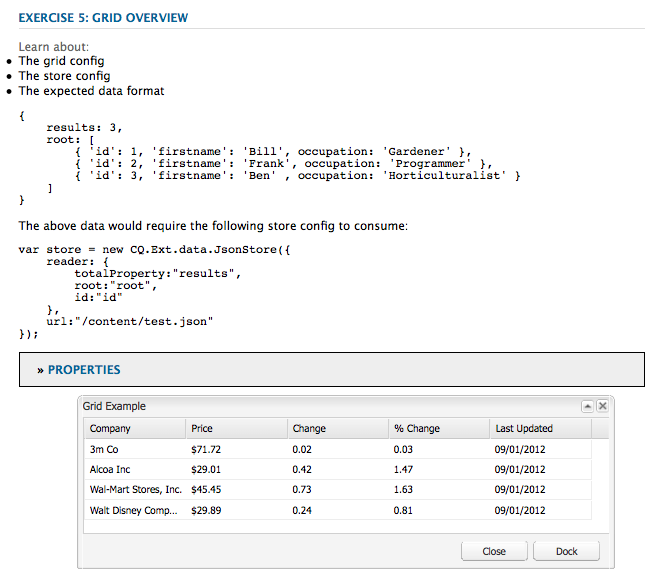

# Uso y ampliación de widgets (IU clásica){#using-and-extending-widgets-classic-ui}

>[!NOTE]
>
>AEM Esta página describe el uso de widgets dentro de la interfaz de usuario clásica, que quedó obsoleta en la versión 6.4 de la.
>
>El Adobe recomienda utilizar el moderno, [IU táctil](/help/sites-developing/touch-ui-concepts.md) basado en [IU de Coral](/help/sites-developing/touch-ui-concepts.md#coral-ui) y [Granite UI](/help/sites-developing/touch-ui-concepts.md#granite-ui-foundation-components).

La interfaz basada en web de Adobe Experience Manager AEM AJAX () utiliza la interfaz de usuario y otras tecnologías modernas de explorador para permitir que los autores puedan editar y dar formato WYSIWYG al contenido directamente en la página web.

AEM utiliza el [ExtJS](https://www.sencha.com/) La biblioteca de widgets de, que proporciona los elementos de interfaz de usuario altamente pulidos que funcionan en todos los exploradores más importantes y permiten la creación de experiencias de interfaz de usuario de nivel de escritorio.

AEM AEM AEM Estos widgets se incluyen dentro de los elementos y, además de ser utilizados por el propio, pueden ser utilizados por cualquier sitio web creado mediante el uso de la herramienta de creación de páginas de la página de la página de la página de la página de la página de la página de la página de la página de la página de la página de la página de la página de la página de.

AEM Para obtener una referencia completa de todos los widgets disponibles en la documentación de, consulte la sección sobre la configuración de los widgets en la documentación de [documentación de API de widget](https://developer.adobe.com/experience-manager/reference-materials/6-5/widgets-api/index.html) o el [lista de xtype existentes](/help/sites-developing/xtypes.md). Además, hay muchos ejemplos disponibles en el que se muestra cómo utilizar el marco de ExtJS [Sencha](https://examples.sencha.com/extjs/7.6.0/) , el propietario del marco de trabajo.

Esta página ofrece información sobre cómo utilizar y ampliar widgets. En primer lugar, describe cómo [incluir código del lado del cliente en una página](#including-the-client-sided-code-in-a-page). A continuación, se describen algunos componentes de muestra que se han creado para ilustrar algunos usos y extensiones básicos. Estos componentes están disponibles en el **Uso de widgets de ExtJS** paquete en **Package Share**.

El paquete incluye ejemplos de lo siguiente:

* [Cuadros de diálogo básicos](#basic-dialogs) se ha creado con widgets integrados.
* [Cuadros de diálogo dinámicos](#dynamic-dialogs) se ha creado con widgets listos para usar y lógica de JavaScript personalizada.
* Diálogos basados en [widgets personalizados](#custom-widgets).
* A [panel de árbol](#tree-overview) mostrar un árbol JCR bajo una ruta determinada.
* A [panel de cuadrícula](#grid-overview) visualización de datos en formato tabular.

>[!NOTE]
>
>La IU clásica de Adobe Experience Manager se basa en [ExtJS 3.4.0](https://extjs.cachefly.net/ext-3.4.0/docs/).

## Inclusión del código del lado del cliente en una página {#including-the-client-sided-code-in-a-page}

El JavaScript del lado del cliente y el código de la hoja de estilos deben colocarse en una biblioteca de cliente.

Para crear una biblioteca de cliente:

1. Cree un nodo a continuación `/apps/<project>` con las siguientes propiedades:

   * name=&quot;clientlib&quot;
   * jcr:mixinTypes=&quot;[mezcla:bloqueable]&quot;
   * jcr:primaryType=&quot;cq:ClientLibraryFolder&quot;
   * sling:resourceType=&quot;widgets/clientlib&quot;
   * categories=&quot;[&lt;category-name>]&quot;
   * dependencies=&quot;[cq.widgets]&quot;

   `Note: <category-name> is the name of the custom library (e.g. "cq.extjstraining") and is used to include the library on the page.`

1. Abajo `clientlib` cree el `css` y `js` carpetas (nt:folder).

1. Abajo `clientlib` cree el `css.txt` y `js.txt` archivos (nt:files). Estos archivos .txt enumeran los archivos que se incluyen en la biblioteca.

1. Editar `js.txt`: debe comenzar con &#39; `#base=js`&#39; seguido de la lista de los archivos agregados por el servicio de biblioteca del cliente de CQ, por ejemplo:

   ```
   #base=js
    components.js
    exercises.js
    CustomWidget.js
    CustomBrowseField.js
    InsertTextPlugin.js
   ```

1. Editar `css.txt`: debe comenzar con &#39; `#base=css`&#39; seguido de la lista de los archivos agregados por el servicio de biblioteca del cliente de CQ, por ejemplo:

   ```
   #base=css
    components.css
   ```

1. Debajo de `js` , coloque los archivos JavaScript que pertenecen a la biblioteca.

1. Debajo de `css` carpeta, coloque el `.css` archivos y los recursos utilizados por los archivos css (por ejemplo, `my_icon.png`).

>[!NOTE]
>
>El manejo de las hojas de estilo descritas anteriormente es opcional.

Para incluir la biblioteca de cliente en el jsp del componente de página:

* para incluir hojas de estilos y código JavaScript:
   `<ui:includeClientLib categories="<category-name1>, <category-name2>, ..."/>`
donde 
`<category-nameX>` es el nombre de la biblioteca del lado del cliente.

* para incluir solo código JavaScript:
   `<ui:includeClientLib js="<category-name>"/>`

Para obtener más información, consulte la descripción del [&lt;ui:includeclientlib>](/help/sites-developing/taglib.md#lt-ui-includeclientlib) etiqueta.

A veces, una biblioteca de cliente solo debe estar disponible en el modo de autor y debe excluirse en el modo de publicación. Se puede lograr de la siguiente manera:

```xml
    if (WCMMode.fromRequest(request) != WCMMode.DISABLED) {
        %><ui:includeClientLib categories="cq.collab.blog"/><%
    }
```

### Introducción a los ejemplos {#getting-started-with-the-samples}

Para seguir los tutoriales de esta página, instale el paquete **Uso de widgets de ExtJS** AEM en una instancia de local y cree una página de muestra en la que se incluyan los componentes. Para ello, haga lo siguiente:

1. AEM En su instancia de, descargue el paquete llamado **Uso de widgets de ExtJS (v01)** en Uso compartido de paquetes e instale el paquete. Esto crea el proyecto `extjstraining` abajo `/apps` en el repositorio.
1. Incluya la biblioteca de cliente que contiene los scripts (js) y la hoja de estilo (css) en la etiqueta head del jsp de la página Geometrixx. Va a incluir los componentes de ejemplo en una nueva página del **Geometrixx** rama: en **CRXDE Lite** abra el archivo `/apps/geometrixx/components/page/headlibs.jsp` y añada el `cq.extjstraining` categoría a la existente `<ui:includeClientLib>` como se indica a continuación:
   `%><ui:includeClientLib categories="apps.geometrixx-main, cq.extjstraining"/><%`
1. Cree una página en **Geometrixx** rama inferior `/content/geometrixx/en/products` y llámalo **Uso de widgets de ExtJS**.
1. Vaya en modo de diseño y añada todos los componentes del grupo llamado **Uso de widgets de ExtJS** al diseño del Geometrixx
1. Volver en modo de edición: los componentes del grupo **Uso de widgets de ExtJS** están disponibles en la barra de tareas.

>[!NOTE]
>
>Los ejemplos de esta página se basan en el contenido de muestra de la Geometrixx AEM, que ya no se envía con el que se ha sustituido por We.Retail. Consulte la [Implementación de referencia de We.Retail](/help/sites-developing/we-retail.md#we-retail-geometrixx) para obtener información sobre cómo descargar e instalar Geometrixx.

### Cuadros de diálogo básicos {#basic-dialogs}

Los cuadros de diálogo suelen utilizarse para editar contenido, pero también pueden mostrar información. Una manera fácil de ver un cuadro de diálogo completo es acceder a su representación en formato json. Para ello, dirija su explorador a:

`https://localhost:4502/<path-to-dialog>.-1.json`

El primer componente del **Uso de widgets de ExtJS** El grupo de la barra de tareas se llama **1. Conceptos básicos de diálogo** e incluye cuatro cuadros de diálogo básicos creados con widgets predeterminados y sin lógica personalizada de JavaScript. Los cuadros de diálogo se almacenan a continuación `/apps/extjstraining/components/dialogbasics`. Los cuadros de diálogo básicos son:

* el cuadro de diálogo Completo ( `full` : muestra una ventana con tres pestañas, cada una con dos campos de texto.
* el cuadro de diálogo Panel único( `singlepanel` nodo): muestra una ventana con una pestaña que tiene dos campos de texto.
* el cuadro de diálogo Varios paneles( `multipanel` ): su visualización es la misma que el cuadro de diálogo Completo, pero se crea de forma diferente.
* el cuadro de diálogo Diseño( `design` (nodo ): muestra una ventana con dos pestañas. La primera pestaña tiene un campo de texto, un menú desplegable y un área de texto contraíble. La segunda pestaña tiene un conjunto de campos con cuatro campos de texto y un conjunto de campos contraíbles con dos campos de texto.

Incluya el **1. Conceptos básicos de diálogo** en la página de muestra:

1. Añada el **1. Conceptos básicos de diálogo** a la página de muestra desde el **Uso de widgets de ExtJS** en la pestaña **Compañero**.
1. El componente muestra un título, texto y un **PROPIEDADES** vínculo. Al seleccionar el vínculo, se muestran las propiedades del párrafo almacenado en el repositorio. Vuelva a seleccionar el vínculo para ocultar las propiedades.

El componente se muestra de la siguiente manera:


#### Ejemplo 1: Cuadro de diálogo completo {#example-full-dialog}

El **Completo** muestra una ventana con tres pestañas, cada una con dos campos de texto. Es el cuadro de diálogo predeterminado de **Conceptos básicos de diálogo** componente. Sus características son:

* Se define mediante un nodo: node type = `cq:Dialog`, xtype = ` [dialog](/help/sites-developing/xtypes.md#dialog)`.
* Muestra tres pestañas (tipo de nodo = `cq:Panel`).
* Cada pestaña tiene dos campos de texto (tipo de nodo = `cq:Widget`, xtype = ` [textfield](/help/sites-developing/xtypes.md#textfield)`).
* Se define mediante el nodo:
   `/apps/extjstraining/components/dialogbasics/full`
* Se representa en formato JSON al solicitar:
   `https://localhost:4502/apps/extjstraining/components/dialogbasics/full.-1.json`

El cuadro de diálogo se muestra de la siguiente manera:


#### Ejemplo 2: Cuadro de diálogo de panel único {#example-single-panel-dialog}

El **Panel único** El cuadro de diálogo muestra una ventana con una pestaña que tiene dos campos de texto. Sus características son:

* Muestra una pestaña (tipo de nodo = `cq:Dialog`, xtype = ` [panel](/help/sites-developing/xtypes.md#panel)`)
* La pestaña tiene dos campos de texto (tipo de nodo = `cq:Widget`, xtype = ` [textfield](/help/sites-developing/xtypes.md#textfield)`)
* Se define mediante el nodo:
   `/apps/extjstraining/components/dialogbasics/singlepanel`
* Se representa en formato json al solicitar:
   `https://localhost:4502/apps/extjstraining/components/dialogbasics/singlepanel.-1.json`
* Una ventaja sobre el **Diálogo completo** es que se necesita menos configuración.
* Uso recomendado: para cuadros de diálogo sencillos que muestran información o solo tienen unos pocos campos.

Para usar el cuadro de diálogo Panel único:

1. Reemplace el cuadro de diálogo de **Conceptos básicos de diálogo** componente con el **Panel único** diálogo:
   1. Entrada **CRXDE Lite**, elimine el nodo: `/apps/extjstraining/components/dialogbasics/dialog`
   1. Clic **Guardar todo** para guardar los cambios.
   1. Copie el nodo: `/apps/extjstraining/components/dialogbasics/singlepanel`
   1. Pegue el nodo copiado a continuación: `/apps/extjstraining/components/dialogbasics`
   1. Seleccione el nodo: `/apps/extjstraining/components/dialogbasics/Copy of singlepanel`y cambiarle el nombre `dialog`.
1. Edite el componente: el cuadro de diálogo se muestra de la siguiente manera:


#### Ejemplo 3: Cuadro de diálogo de varios paneles {#example-multi-panel-dialog}

El **Panel múltiple** tiene la misma visualización que el cuadro de diálogo **Completo** diálogo, pero se crea de forma diferente. Sus características son:

* Se define mediante un nodo (tipo de nodo = `cq:Dialog`, xtype = ` [tabpanel](/help/sites-developing/xtypes.md#tabpanel)`).
* Muestra tres pestañas (tipo de nodo = `cq:Panel`).
* Cada pestaña tiene dos campos de texto (tipo de nodo = `cq:Widget`, xtype = ` [textfield](/help/sites-developing/xtypes.md#textfield)`).
* Se define mediante el nodo:
   `/apps/extjstraining/components/dialogbasics/multipanel`
* Se representa en formato json al solicitar:
   `https://localhost:4502/apps/extjstraining/components/dialogbasics/multipanel.-1.json`
* Una ventaja sobre el **Diálogo completo** es que tiene una estructura simplificada.
* Uso recomendado: para cuadros de diálogo de varias pestañas.

Para usar el cuadro de diálogo Varios paneles:

1. Reemplace el cuadro de diálogo de **Conceptos básicos de diálogo** componente con el **Panel múltiple** diálogo: siga los pasos descritos para la [Ejemplo 2: Cuadro de diálogo de panel único](#example-single-panel-dialog)
1. Edite el componente: el cuadro de diálogo se muestra de la siguiente manera:


#### Ejemplo 4: Cuadro de diálogo enriquecido {#example-rich-dialog}

El **Rico** muestra una ventana con dos pestañas. La primera pestaña tiene un campo de texto, un menú desplegable y un área de texto contraíble. La segunda pestaña tiene un conjunto de campos con cuatro campos de texto y un conjunto de campos contraíbles con dos campos de texto. Sus características son:

* Se define mediante un nodo (tipo de nodo = `cq:Dialog`, xtype = ` [dialog](/help/sites-developing/xtypes.md#dialog)`).
* Muestra dos pestañas (tipo de nodo = `cq:Panel`).
* La primera pestaña tiene un ` [dialogfieldset](/help/sites-developing/xtypes.md#dialogfieldset)` widget con un ` [textfield](/help/sites-developing/xtypes.md#textfield)` y una ` [selection](/help/sites-developing/xtypes.md#selection)` widget con tres opciones y un plegable ` [dialogfieldset](/help/sites-developing/xtypes.md#dialogfieldset)` con un ` [textarea](/help/sites-developing/xtypes.md#textarea)` widget.
* La segunda pestaña tiene un ` [dialogfieldset](/help/sites-developing/xtypes.md#dialogfieldset)` widget con cuatro ` [textfield](/help/sites-developing/xtypes.md#textfield)` widgets y un plegable `dialogfieldset` con dos ` [textfield](/help/sites-developing/xtypes.md#textfield)` widgets.
* Se define mediante el nodo:
   `/apps/extjstraining/components/dialogbasics/rich`
* Se representa en formato json al solicitar:
   `https://localhost:4502/apps/extjstraining/components/dialogbasics/rich.-1.json`

Para usar la variable **Rico** diálogo:

1. Reemplace el cuadro de diálogo de **Conceptos básicos de diálogo** componente con el **Rico** diálogo: siga los pasos descritos para la [Ejemplo 2: Cuadro de diálogo de panel único](#example-single-panel-dialog)
1. Edite el componente: el cuadro de diálogo se muestra de la siguiente manera:

 

### Cuadros de diálogo dinámicos {#dynamic-dialogs}

El segundo componente del **Uso de widgets de ExtJS** El grupo de la barra de tareas se llama **2. Cuadros de diálogo dinámicos** e incluye tres cuadros de diálogo dinámicos creados con widgets y **con lógica JavaScript personalizada**. Los cuadros de diálogo se almacenan a continuación `/apps/extjstraining/components/dynamicdialogs`. Los cuadros de diálogo dinámicos son:

* el cuadro de diálogo Cambiar fichas ( `switchtabs` (nodo ): muestra una ventana con dos pestañas. La primera pestaña tiene una selección de opción con tres opciones: cuando se selecciona una opción, se muestra una pestaña relacionada con la opción. La segunda pestaña tiene dos campos de texto.
* el cuadro de diálogo Arbitrario ( `arbitrary` nodo): muestra una ventana con una pestaña. La pestaña tiene un campo para soltar o cargar un recurso y un campo que muestra información sobre la página contenedora y sobre el recurso si se hace referencia a uno.
* el cuadro de diálogo Alternar campos ( `togglefield` nodo): muestra una ventana con una pestaña. La pestaña tiene una casilla de verificación: cuando se activa, se muestra un conjunto de campos con dos campos de texto.

Para incluir la variable **2. Cuadros de diálogo dinámicos** en la página de muestra:

1. Añada el **2. Cuadros de diálogo dinámicos** a la página de muestra desde el **Uso de widgets de ExtJS** en la pestaña **Compañero**.
1. El componente muestra un título, texto y un **PROPIEDADES** vínculo. Al seleccionar el vínculo, se muestran las propiedades del párrafo almacenado en el repositorio. Vuelva a seleccionar el vínculo para ocultar las propiedades.

El componente se muestra de la siguiente manera:


#### Ejemplo 1: Cuadro de diálogo Cambiar fichas {#example-switch-tabs-dialog}

El **Cambiar fichas** muestra una ventana con dos pestañas. La primera pestaña tiene una selección de opción con tres opciones: cuando se selecciona una opción, se muestra una pestaña relacionada con la opción. La segunda pestaña tiene dos campos de texto.

Sus principales características son:

* Se define mediante un nodo (tipo de nodo = `cq:Dialog`, xtype = ` [dialog](/help/sites-developing/xtypes.md#dialog)`).
* Muestra dos pestañas (tipo de nodo = `cq:Panel`): una pestaña de selección, la segunda pestaña depende de la selección en la primera pestaña (tres opciones).
* Tiene tres pestañas opcionales (tipo de nodo = `cq:Panel`), cada uno tiene dos campos de texto (tipo de nodo = `cq:Widget`, xtype = ` [textfield](/help/sites-developing/xtypes.md#textfield)`). Solo se muestra una pestaña opcional a la vez.
* Se define mediante `switchtabs` nodo en:
   `/apps/extjstraining/components/dynamicdialogs/switchtabs`
* Se representa en formato json al solicitar:
   `https://localhost:4502/apps/extjstraining/components/dynamicdialogs/switchtabs.-1.json`

La lógica se implementa mediante detectores de eventos y código JavaScript de la siguiente manera:

* El nodo de diálogo tiene un &quot; `beforeshow`&quot; oyente que oculta todas las pestañas opcionales antes de que se muestre el cuadro de diálogo:
   `beforeshow="function(dialog){Ejst.x2.manageTabs(dialog.items.get(0));}"`

   `dialog.items.get(0)` obtiene el `tabpanel` que contiene el panel de selección y los tres paneles opcionales.
* El `Ejst.x2` se define en la variable `exercises.js` archivo en:
   `/apps/extjstraining/clientlib/js/exercises.js`
* En el `Ejst.x2.manageTabs()` método, como valor de `index` es -1, todas las pestañas opcionales están ocultas (va del 1 al 3).
* La pestaña de selección tiene dos agentes de escucha: uno que muestra la pestaña seleccionada cuando se carga el cuadro de diálogo (&quot; `loadcontent`&quot; evento ) y uno que muestra la ficha seleccionada cuando se cambia la selección (&quot; `selectionchanged`&quot; (evento ):
   `loadcontent="function(field,rec,path){Ejst.x2.showTab(field);}"`

   `selectionchanged="function(field,value){Ejst.x2.showTab(field);}"`
* Para el `Ejst.x2.showTab()` método,
   `field.findParentByType('tabpanel')` obtiene el `tabpanel` que contiene todas las pestañas ( `field` representa el widget de selección)
   `field.getValue()` obtiene el valor de la selección, por ejemplo, tab2
   `Ejst.x2.manageTabs()` muestra la ficha seleccionada.
* Cada pestaña opcional tiene un oyente que oculta la pestaña en &quot; `render`&quot; evento:
   `render="function(tab){Ejst.x2.hideTab(tab);}"`
* Para el `Ejst.x2.hideTab()` método,
   `tabPanel` es el `tabpanel` que contiene todas las pestañas
   `index` es el índice de la pestaña opcional
   `tabPanel.hideTabStripItem(index)` oculta la pestaña

Se muestra de la siguiente manera:


#### Ejemplo 2: Diálogo arbitrario {#example-arbitrary-dialog}

A menudo, un cuadro de diálogo muestra el contenido del componente subyacente. El cuadro de diálogo descrito aquí, denominado **Arbitrario** , extrae contenido de un componente diferente.

El **Arbitrario** El cuadro de diálogo muestra una ventana con una pestaña. La pestaña tiene dos campos: uno para soltar o cargar un recurso y otro que muestra información sobre la página contenedora y sobre el recurso si se ha hecho referencia a uno.

Sus principales características son:

* Se define mediante un nodo (tipo de nodo = `cq:Dialog`, xtype = ` [dialog](/help/sites-developing/xtypes.md#dialog)`).
* Muestra uno `tabpanel` widget (tipo de nodo = `cq:Widget`, xtype = ` [tabpanel](/help/sites-developing/xtypes.md#tabpanel)`) con un panel (tipo de nodo = `cq:Panel`)
* El panel tiene un widget de archivo inteligente (tipo de nodo = `cq:Widget`, xtype = ` [smartfile](/help/sites-developing/xtypes.md#smartfile)`) y un widget ownerdraw (tipo de nodo = `cq:Widget`, xtype = ` [ownerdraw](/help/sites-developing/xtypes.md#ownerdraw)`)
* Se define mediante `arbitrary` nodo en:
   `/apps/extjstraining/components/dynamicdialogs/arbitrary`
* Se representa en formato json al solicitar:
   `https://localhost:4502/apps/extjstraining/components/dynamicdialogs/arbitrary.-1.json`

La lógica se implementa mediante detectores de eventos y código JavaScript de la siguiente manera:

* El `ownerdraw` el widget tiene un &quot; `loadcontent`&quot;Listener que muestra información sobre la página que contiene el componente. Es decir, el recurso al que hace referencia el widget smartfile cuando se carga el contenido:
   `loadcontent="function(field,rec,path){Ejst.x2.showInfo(field,rec,path);}"`

   `field` se configura con la variable `ownerdraw` objeto
   `path` se establece con la ruta de contenido del componente (por ejemplo, `/content/geometrixx/en/products/triangle/ui-tutorial/jcr:content/par/dynamicdialogs`)
* El `Ejst.x2` se define en la variable `exercises.js` archivo en:
   `/apps/extjstraining/clientlib/js/exercises.js`
* Para el `Ejst.x2.showInfo()` método,
   `pagePath` es la ruta de la página que contiene el componente;
   `pageInfo` representa las propiedades de la página en formato json;
   `reference` es la ruta del recurso al que se hace referencia;
   `metadata` representa los metadatos del recurso en formato json;
   `ownerdraw.getEl().update(html);` muestra el html creado en el diálogo

Para usar la variable **Arbitrario** diálogo:

1. Reemplace el cuadro de diálogo de **Diálogo dinámico** componente con el **Arbitrario** diálogo: siga los pasos descritos para la [Ejemplo 2: Cuadro de diálogo de panel único](#example-single-panel-dialog)
1. Edit the component: the dialog displays as follows:


#### Example 3: Toggle Fields Dialog {#example-toggle-fields-dialog}

El **Alternar campos** El cuadro de diálogo muestra una ventana con una pestaña. La pestaña tiene una casilla de verificación: cuando se activa, se muestra un conjunto de campos con dos campos de texto.

Sus principales características son:

* Se define mediante un nodo (tipo de nodo = `cq:Dialog`, xtype = ` [dialog](/help/sites-developing/xtypes.md#dialog)`).
* Muestra uno `tabpanel` widget (tipo de nodo = `cq:Widget`, xtype = ` [tabpanel](/help/sites-developing/xtypes.md#textpanel)`) con un panel (tipo de nodo = `cq:Panel`).
* El panel tiene un widget de selección/casilla de verificación (tipo de nodo = `cq:Widget`, xtype = ` [selection](/help/sites-developing/xtypes.md#selection)`, type = ` [checkbox](/help/sites-developing/xtypes.md#checkbox)`) y un widget de conjunto de campos de diálogo contraíble (tipo de nodo = `cq:Widget`, xtype = ` [dialogfieldset](/help/sites-developing/xtypes.md#dialogfieldset)`) que está oculto de forma predeterminada, con dos widgets de campo de texto (tipo de nodo = `cq:Widget`, xtype = ` [textfield](/help/sites-developing/xtypes.md#textfield)`).
* Se define mediante `togglefields` nodo en:
   `/apps/extjstraining/components/dynamicdialogs/togglefields`
* Se representa en formato json al solicitar:
   `https://localhost:4502/apps/extjstraining/components/dynamicdialogs/togglefields.-1.json`

La lógica se implementa mediante detectores de eventos y código JavaScript de la siguiente manera:

* la pestaña selección tiene dos agentes de escucha: uno que muestra el conjunto de campos de diálogo cuando se carga el contenido (&quot; `loadcontent`&quot;) y uno que muestra el conjunto de campos de diálogo cuando se cambia la selección (&quot; `selectionchanged`&quot; (evento ):
   `loadcontent="function(field,rec,path){Ejst.x2.toggleFieldSet(field);}"`

   `selectionchanged="function(field,value){Ejst.x2.toggleFieldSet(field);}"`
* El `Ejst.x2` se define en la variable `exercises.js` archivo en:
   `/apps/extjstraining/clientlib/js/exercises.js`
* Para el `Ejst.x2.toggleFieldSet()` método,
   `box` es el objeto selection;
   `panel` es el panel que contiene la selección y los widgets dialogfieldset;
   `fieldSet` es el objeto dialogfieldset;
   `show` es el valor de la selección (verdadero o falso); se basa en &#39; `show`&#39; el conjunto de campos de diálogo se muestra o no

Para usar la variable **Alternar campos** diálogo, haga lo siguiente:

1. Reemplace el cuadro de diálogo de **Diálogo dinámico** componente con el **Alternar campos** diálogo: siga los pasos descritos para la [Ejemplo 2: Cuadro de diálogo de panel único](#example-single-panel-dialog)
1. Edite el componente: el cuadro de diálogo se muestra de la siguiente manera:


### Widgets personalizados {#custom-widgets}

AEM Los widgets listos para usar enviados con deben cubrir la mayoría de los casos de uso de los que se dispone de forma predeterminada y con los que se envían los. Sin embargo, a veces puede ser necesario crear un widget personalizado para cubrir un requisito específico de un proyecto. Se pueden crear widgets personalizados ampliando los existentes. Para ayudarle a empezar con estas personalizaciones, la variable **`Using ExtJS Widgets`** incluye tres cuadros de diálogo que utilizan tres widgets personalizados diferentes:

* el cuadro de diálogo Varios campos ( `multifield` ) muestra una ventana con una pestaña. La pestaña tiene un widget de varios campos personalizado que tiene dos campos: un menú desplegable con dos opciones y un campo de texto. Ya que se basa en la configuración predeterminada `multifield` widget (que solo tiene un campo de texto), tiene todas las características de la `multifield` widget.
* el cuadro de diálogo Examinar árbol ( `treebrowse` nodo) muestra una ventana con una pestaña que contiene un widget de exploración de rutas: al hacer clic en la flecha, se abre una ventana en la que puede examinar una jerarquía y seleccionar un elemento. A continuación, la ruta del elemento se agrega al campo de ruta y se mantiene cuando se cierra el cuadro de diálogo.
* un cuadro de diálogo basado en el complemento Editor de texto enriquecido ( `rteplugin` ) que agrega un botón personalizado al Editor de texto enriquecido para insertar texto personalizado en el texto principal. Consiste en un `richtext` widget (RTE) y de una función personalizada que se añade mediante el mecanismo de complemento RTE.

Los widgets personalizados y el complemento se incluyen en el componente llamado **3. Widgets personalizados** de la **Uso de widgets de ExtJS** paquete. Para incluir este componente en la página de muestra:

1. Añada el **3. Widgets personalizados** a la página de muestra desde el **Uso de widgets de ExtJS** en la pestaña **Compañero**.
1. El componente muestra un título, texto y texto al hacer clic en el botón **PROPIEDADES** vínculo, las propiedades del párrafo almacenadas en el repositorio. Al volver a hacer clic en se ocultan las propiedades.
El componente se muestra de la siguiente manera:


#### Ejemplo 1: Widget multicampo personalizado {#example-custom-multifield-widget}

El **Multicampo personalizado** el cuadro de diálogo basado en widgets muestra una ventana con una pestaña. La pestaña tiene un widget de varios campos personalizado que, a diferencia del estándar que tiene un campo, tiene dos campos: un menú desplegable con dos opciones y un campo de texto.

El **Multicampo personalizado** Cuadro de diálogo basado en widgets:

* Se define mediante un nodo (tipo de nodo = `cq:Dialog`, xtype = ` [dialog](/help/sites-developing/xtypes.md#dialog)`).
* Muestra uno `tabpanel` widget (tipo de nodo = `cq:Widget`, xtype = ` [tabpanel](/help/sites-developing/xtypes.md#tabpanel)`) que contiene un panel (tipo de nodo = `cq:Widget`, xtype = ` [panel](/help/sites-developing/xtypes.md#panel)`).
* El panel tiene un `multifield` widget (tipo de nodo = `cq:Widget`, xtype = ` [multifield](/help/sites-developing/xtypes.md#multifield)`).
* El `multifield` el widget tiene un fieldconfig (tipo de nodo = `nt:unstructured`, xtype = `ejstcustom`, optionsProvider = `Ejst.x3.provideOptions`) que se basa en el xtype personalizado &#39; `ejstcustom`&#39;:
   * &#39; `fieldconfig`&#39; es una opción de configuración de ` [CQ.form.MultiField](https://developer.adobe.com/experience-manager/reference-materials/6-5/widgets-api/index.html?class=CQ.form.MultiField)` objeto.
   * &#39; `optionsProvider`&#39; es una configuración del `ejstcustom` widget. Se configura con la variable `Ejst.x3.provideOptions` método definido en el `exercises.js` a las:
      `/apps/extjstraining/clientlib/js/exercises.js`
y devuelve dos opciones.
* Se define mediante `multifield` nodo en:
   `/apps/extjstraining/components/customwidgets/multifield`
* Se representa en formato json al solicitar:
   `https://localhost:4502/apps/extjstraining/components/customwidgets/multifield.-1.json`

El personalizado `multifield` widget (xtype = `ejstcustom`):

* Es un objeto JavaScript llamado `Ejst.CustomWidget`
* Se define en la `CustomWidget.js` Archivo JavaScript en:
   `/apps/extjstraining/clientlib/js/CustomWidget.js`
* Amplía el ` [CQ.form.CompositeField](https://developer.adobe.com/experience-manager/reference-materials/6-5/widgets-api/index.html?class=CQ.form.CompositeField)` widget.
* Tiene tres campos: `hiddenField` (Campo De Texto), `allowField` (ComboBox) y `otherField` (Campo de texto)
* Invalidaciones `CQ.Ext.Component#initComponent` para añadir los tres campos:
   * `allowField` es un [CQ.form.Selection](https://developer.adobe.com/experience-manager/reference-materials/6-5/widgets-api/index.html?class=CQ.form.Selection) objeto de tipo &#39;select&#39;. optionsProvider es una configuración del objeto Selection que se crea una instancia con la configuración optionsProvider del CustomWidget definido en el cuadro de diálogo
   * `otherField` es un [CQ.Ext.form.TextField](https://developer.adobe.com/experience-manager/reference-materials/6-5/widgets-api/index.html?class=CQ.Ext.form.TextField) objeto
* `setValue``getValue``getRawValue`[](https://developer.adobe.com/experience-manager/reference-materials/6-5/widgets-api/index.html?class=CQ.form.CompositeField)
   `<allowField value>/<otherField value>, for example: 'Bla1/hello'`.
* `ejstcustom`
   `CQ.Ext.reg('ejstcustom', Ejst.CustomWidget);`

****


#### Ejemplo 2: Personalizado `Treebrowse` Widget {#example-custom-treebrowse-widget}

El personalizado **`Treebrowse`** el cuadro de diálogo basado en widgets muestra una ventana con una pestaña que contiene un widget de navegador de ruta personalizada. Al seleccionar la flecha, se abre una ventana en la que puede examinar una jerarquía y seleccionar un elemento. A continuación, la ruta del elemento se agrega al campo de ruta y se mantiene cuando se cierra el cuadro de diálogo.

El personalizado `treebrowse` diálogo:

* Se define mediante un nodo (tipo de nodo = `cq:Dialog`, xtype = ` [dialog](/help/sites-developing/xtypes.md#dialog)`).
* Muestra uno `tabpanel` widget (tipo de nodo = `cq:Widget`, xtype = ` [tabpanel](/help/sites-developing/xtypes.md#tabpanel)`) que contiene un panel (tipo de nodo = `cq:Widget`, xtype = ` [panel](/help/sites-developing/xtypes.md#panel)`).
* El panel tiene un widget personalizado (tipo de nodo = `cq:Widget`, xtype = `ejstbrowse`)
* Se define mediante `treebrowse` nodo en:
   `/apps/extjstraining/components/customwidgets/treebrowse`
* Se representa en formato json al solicitar:
   `https://localhost:4502/apps/extjstraining/components/customwidgets/treebrowse.-1.json`

El widget de exploración del árbol personalizado (xtype = `ejstbrowse`):

* Es un objeto JavaScript llamado `Ejst.CustomWidget`
* Se define en la `CustomBrowseField.js` Archivo JavaScript en:
   `/apps/extjstraining/clientlib/js/CustomBrowseField.js`
* Extiende ` [CQ.Ext.form.TriggerField](https://developer.adobe.com/experience-manager/reference-materials/6-5/widgets-api/index.html?class=CQ.Ext.form.TriggerField)`.
* Define una ventana de exploración llamada `browseWindow`.
* Invalidaciones ` [CQ.Ext.form.TriggerField](https://developer.adobe.com/experience-manager/reference-materials/6-5/widgets-api/index.html?class=CQ.Ext.form.TriggerField)#onTriggerClick` para mostrar la ventana examinar cuando se hace clic en la flecha.
* Define una [CQ.Ext.tree.TreePanel](https://developer.adobe.com/experience-manager/reference-materials/6-5/widgets-api/index.html?class=CQ.Ext.tree.TreePanel) objeto:
   * Obtiene sus datos llamando al servlet registrado en `/bin/wcm/siteadmin/tree.json`.
   * Su raíz es &quot; `apps/extjstraining`&quot;.
* Define una `window` objeto ( ` [CQ.Ext.Window](https://developer.adobe.com/experience-manager/reference-materials/6-5/widgets-api/index.html?class=CQ.Ext.Window)`):
   * Basado en el panel predefinido.
   * Tiene un **OK** botón que establece el valor del trazado seleccionado y oculta el panel.
* La ventana está anclada debajo de **Ruta** field.
* La ruta seleccionada se pasa del campo de exploración a la ventana de `show` evento.
* Se registra como &#39; `ejstbrowse`&#39; xtype:
   `CQ.Ext.reg('ejstbrowse', Ejst.CustomBrowseField);`

Para usar la variable **Exploración de árbol personalizada** Cuadro de diálogo basado en widgets:

1. Reemplace el cuadro de diálogo de **Widgets personalizados** componente con el **Exploración de árbol personalizada** diálogo: siga los pasos descritos para la [Ejemplo 2: Cuadro de diálogo de panel único](#example-single-panel-dialog)
1. Edite el componente: el cuadro de diálogo se muestra de la siguiente manera:


#### Ejemplo 3: Complemento Editor de texto enriquecido (RTE) {#example-rich-text-editor-rte-plug-in}

El **Complemento Editor de texto enriquecido (RTE)** El cuadro de diálogo basado en es un cuadro de diálogo basado en el Editor de texto enriquecido que tiene un botón personalizado para insertar texto personalizado entre corchetes. El texto personalizado se puede analizar mediante alguna lógica del lado del servidor (no implementada en este ejemplo), por ejemplo para agregar texto definido en la ruta determinada:

El **Complemento RTE** cuadro de diálogo basado:

* Se define mediante el nodo reteplugin en:
   `/apps/extjstraining/components/customwidgets/rteplugin`
* Se representa en formato json al solicitar:
   `https://localhost:4502/apps/extjstraining/components/customwidgets/rteplugin.-1.json`
* El `rtePlugins` el nodo tiene un nodo secundario `inserttext` (tipo de nodo = `nt:unstructured`), que recibe su nombre del complemento. Tiene una propiedad llamada `features` que define qué características del complemento están disponibles para RTE.

El complemento RTE:

* Es un objeto JavaScript llamado `Ejst.InsertTextPlugin`
* Se define en la `InsertTextPlugin.js` Archivo JavaScript en:
   `/apps/extjstraining/clientlib/js/InsertTextPlugin.js`
* Amplía el ` [CQ.form.rte.plugins.Plugin](https://developer.adobe.com/experience-manager/reference-materials/6-5/widgets-api/index.html?class=CQ.form.rte.plugins.Plugin)` objeto.
* Los siguientes métodos definen la variable ` [CQ.form.rte.plugins.Plugin](https://developer.adobe.com/experience-manager/reference-materials/6-5/widgets-api/index.html?class=CQ.form.rte.plugins.Plugin)` y se anulan en el complemento de implementación:
   * `getFeatures()` devuelve una matriz de todas las características que el complemento pone a disposición.
   * `initializeUI()` añade el nuevo botón a la barra de herramientas RTE.
   * `notifyPluginConfig()` muestra el título y el texto cuando se pasa el ratón por encima del botón.
   * `execute()` se llama cuando se hace clic en el botón y realiza la acción del complemento: muestra una ventana que se utiliza para definir el texto que se va a incluir.
* `insertText()` inserta un texto utilizando el objeto dialog correspondiente `Ejst.InsertTextPlugin.Dialog` (ver más adelante).
* `executeInsertText()` es invocado por `apply()` del cuadro de diálogo, que se activa cuando la variable **OK** Haga clic en el botón.
* Se registra como &#39; `inserttext`&#39; complemento:
   `CQ.form.rte.plugins.PluginRegistry.register("inserttext", Ejst.InsertTextPlugin);`
* el `Ejst.InsertTextPlugin.Dialog` define el cuadro de diálogo que se abre al hacer clic en el botón del complemento. El cuadro de diálogo consta de un panel, un formulario, un campo de texto y dos botones (**OK** y **Cancelar**).

Para usar la variable **Complemento Editor de texto enriquecido (RTE)** cuadro de diálogo basado:

1. Reemplace el cuadro de diálogo de **Widgets personalizados** componente con el **Complemento Editor de texto enriquecido (RTE)** cuadro de diálogo basado en: siga los pasos descritos para la [Ejemplo 2: Cuadro de diálogo de panel único](#example-single-panel-dialog)
1. Edite el componente.
1. Haga clic en el último icono de la derecha (el que tiene cuatro flechas). Introduzca una ruta y haga clic en **OK**: La ruta se muestra entre corchetes ([ ]).
1. Clic **OK** para cerrar el Editor de texto enriquecido.

El **Complemento Editor de texto enriquecido (RTE)** El cuadro de diálogo basado en se muestra de la siguiente manera:


>[!NOTE]
>
>*[]*

### Tree Overview {#tree-overview}

El producto listo para usar ` [CQ.Ext.tree.TreePanel](https://developer.adobe.com/experience-manager/reference-materials/6-5/widgets-api/index.html?class=CQ.Ext.tree.TreePanel)` proporciona una representación de la interfaz de usuario estructurada por árbol de los datos estructurados por árbol. El componente Información general de árbol incluido en **Uso de widgets de ExtJS** El paquete muestra cómo utilizar el `TreePanel` para mostrar un árbol JCR bajo una ruta determinada. La propia ventana se puede acoplar/desacoplar. En este ejemplo, la lógica de ventana está incrustada en el componente jsp entre &lt;script>&lt;/script> etiquetas.

Para incluir la variable **Resumen de árbol** a la página de muestra:

1. Añada el **4. Resumen de árbol** a la página de muestra desde el **Uso de widgets de ExtJS** en la pestaña **Compañero**.
1. El componente muestra:
   * un título, con texto
   * a **PROPIEDADES** vínculo: haga clic en para mostrar las propiedades del párrafo almacenado en el repositorio. Haga clic en de nuevo para ocultar las propiedades.
   * una ventana flotante con una representación en árbol del repositorio que se puede expandir.

El componente se muestra de la siguiente manera:


El componente Información general de árbol:

* Se define en:
   `/apps/extjstraining/components/treeoverview`

* El cuadro de diálogo le permite establecer el tamaño de la ventana y acoplarla o desacoplarla (consulte los detalles a continuación).

El componente jsp:

* Recupera las propiedades de anchura, altura y acoplamiento del repositorio.
* Muestra texto sobre el formato de datos de información general de árbol.
* Incrusta la lógica de ventana en el componente jsp entre las etiquetas JavaScript.
* Se define en:
   `apps/extjstraining/components/treeoverview/content.jsp`

El código JavaScript incrustado en el componente jsp:

* Define una `tree` al intentar recuperar una ventana de árbol de la página.
* Si la ventana que muestra el árbol no existe, `treePanel` ([CQ.Ext.tree.TreePanel](https://developer.adobe.com/experience-manager/reference-materials/6-5/widgets-api/index.html?class=CQ.Ext.tree.TreePanel)) se ha creado:
   * `treePanel` contiene los datos que se utilizan para crear la ventana.
   * Los datos se recuperan llamando al servlet registrado en:
      `/bin/wcm/siteadmin/tree.json`
* El `beforeload` El listener se asegura de que se ha cargado el nodo seleccionado.
* El `root` establece la ruta `apps/extjstraining` como raíz de árbol.
* `tree` ( ` [CQ.Ext.Window](https://developer.adobe.com/experience-manager/reference-materials/6-5/widgets-api/index.html?class=CQ.Ext.Window)`) se establece en función del valor predefinido `treePanel`, y se muestra con:
   `tree.show();`
* Si la ventana existe, se muestra en función de las propiedades de anchura, altura y acoplamiento recuperadas del repositorio.

El cuadro de diálogo de componentes:

* Muestra una pestaña con dos campos para establecer el tamaño (ancho y alto) de la ventana de información general del árbol y un campo para acoplar/desacoplar la ventana
* Se define mediante un nodo (tipo de nodo = `cq:Dialog`, xtype = ` [panel](/help/sites-developing/xtypes.md#panel)`).
* El panel tiene un widget de campo de tamaño (tipo de nodo = `cq:Widget`, xtype = ` [sizefield](/help/sites-developing/xtypes.md#sizefield)`) y un widget de selección (tipo de nodo = `cq:Widget`, xtype = ` [selection](/help/sites-developing/xtypes.md#selection)`, type = `radio`) con dos opciones (true/false)
* Se define mediante el nodo de diálogo en:
   `/apps/extjstraining/components/treeoverview/dialog`
* Se representa en formato json al solicitar:
   `https://localhost:4502/apps/extjstraining/components/treeoverview/dialog.-1.json`
* Se muestra de la siguiente manera:


### Resumen de cuadrícula {#grid-overview}

Un panel Cuadrícula representa los datos en un formato tabular de filas y columnas. Se compone de lo siguiente:

* Almacén: el modelo que contiene los registros de datos (filas).
* Modelo de columna : el diseño de la columna.
* Vista : encapsula la interfaz de usuario.
* Modelo de selección : el comportamiento de selección.

El componente Información general de cuadrícula incluido en **Uso de widgets de ExtJS** El paquete muestra cómo mostrar los datos en formato tabular:

* El ejemplo 1 utiliza datos estáticos.
* El ejemplo 2 utiliza datos recuperados del repositorio.

Para incluir el componente Información general de cuadrícula en la página de muestra:

1. Añada el **5. Resumen de cuadrícula** a la página de muestra desde el **Uso de widgets de ExtJS** en la pestaña **Compañero**.
1. El componente muestra:
   * un título con texto
   * a **PROPIEDADES** vínculo: haga clic en para mostrar las propiedades del párrafo almacenado en el repositorio. Haga clic en de nuevo para ocultar las propiedades.
   * ventana flotante que contiene datos en formato tabular.

El componente se muestra de la siguiente manera:



#### Ejemplo 1: Cuadrícula predeterminada {#example-default-grid}

En su versión predeterminada, la variable **Resumen de cuadrícula** El componente muestra una ventana con datos estáticos en formato tabular. En este ejemplo, la lógica está incrustada en el componente jsp de dos maneras:

* the generic logic is defined between &lt;script>&lt;/script> tags
* the specific logic is available in a separate .js file and is linked to in the jsp. This setup lets you switch between the two logic (static/dynamic) by commenting the desired &lt;script> tags.

El componente Información general de cuadrícula:

* Se define en:
   `/apps/extjstraining/components/gridoverview`
* El cuadro de diálogo permite establecer el tamaño de la ventana y acoplarla o desacoplarla.

El componente jsp:

* Recupera las propiedades de anchura, altura y acoplamiento del repositorio.
* Muestra texto como introducción al formato de datos de información general de cuadrícula.
* Hace referencia al código JavaScript que define el objeto GridPanel:
   `<script type="text/javascript" src="/apps/extjstraining/components/gridoverview/defaultgrid.js"></script>`

   `defaultgrid.js` define algunos datos estáticos como base para el objeto GridPanel.
* Incrusta código JavaScript entre etiquetas JavaScript que define el objeto Window que consume el objeto GridPanel.
* Se define en:
   `apps/extjstraining/components/gridoverview/content.jsp`

El código JavaScript incrustado en el componente jsp:

* Define el `grid` al intentar recuperar el componente ventana de la página:
   `var grid = CQ.Ext.getCmp("<%= node.getName() %>-grid");`
* If `grid` no existe, un [CQ.Ext.grid.GridPanel](https://developer.adobe.com/experience-manager/reference-materials/6-5/widgets-api/index.html?class=CQ.Ext.grid.GridPanel) objeto ( `gridPanel`) se define llamando a la función `getGridPanel()` (ver más abajo). Este método se define en `defaultgrid.js`.
* `grid` es un ` [CQ.Ext.Window](https://developer.adobe.com/experience-manager/reference-materials/6-5/widgets-api/index.html?class=CQ.Ext.Window)` basado en el GridPanel predefinido y se muestra: `grid.show();`
* If `grid` existe, se muestra en función de las propiedades de anchura, altura y acoplamiento recuperadas del repositorio.

El archivo JavaScript ( `defaultgrid.js`) al que se hace referencia en el componente jsp define el `getGridPanel()` método al que llama el script incrustado en JSP y devuelve un ` [CQ.Ext.grid.GridPanel](https://developer.adobe.com/experience-manager/reference-materials/6-5/widgets-api/index.html?class=CQ.Ext.grid.GridPanel)` basado en datos estáticos. La lógica es la siguiente:

* `myData` es una matriz de datos estáticos con el formato de una tabla de cinco columnas y cuatro filas.
* `store` es un `CQ.Ext.data.Store` objeto que consume `myData`.
* `store` se carga en la memoria:
   `store.load();`
* `gridPanel` es un ` [CQ.Ext.grid.GridPanel](https://developer.adobe.com/experience-manager/reference-materials/6-5/widgets-api/index.html?class=CQ.Ext.grid.GridPanel)` objeto que consume `store`:
   * las anchuras de columna siempre se redimensionan:
      `forceFit: true`
   * solo se puede seleccionar una fila a la vez:
      `singleSelect:true`

#### Ejemplo 2: Cuadrícula de búsqueda de referencia {#example-reference-search-grid}

Al instalar el paquete, la variable `content.jsp` de la **Resumen de cuadrícula** El componente muestra una cuadrícula basada en datos estáticos. Es posible modificar el componente para mostrar una cuadrícula con las siguientes características:

* Tiene tres columnas.
* Se basa en los datos recuperados del repositorio mediante una llamada a un servlet.
* Las celdas de la última columna se pueden editar. El valor se mantiene en un `test` propiedad debajo del nodo definido por la ruta mostrada en la primera columna.

Como se explica en la sección anterior, el objeto window obtiene su ` [CQ.Ext.grid.GridPanel](https://developer.adobe.com/experience-manager/reference-materials/6-5/widgets-api/index.html?class=CQ.Ext.grid.GridPanel)` llamando a la función `getGridPanel()` método definido en la variable `defaultgrid.js` archivo en `/apps/extjstraining/components/gridoverview/defaultgrid.js`. El componente **Información general de cuadrícula ** proporciona una implementación diferente para `getGridPanel()` método, definido en la variable `referencesearch.js` archivo en `/apps/extjstraining/components/gridoverview/referencesearch.js`. Al cambiar el archivo .js al que se hace referencia en el componente jsp, la cuadrícula se basa en los datos recuperados del repositorio.

Cambie el archivo .js al que se hace referencia en el componente jsp:

1. Entrada **CRXDE Lite**, en el `content.jsp` del componente, comente la línea que incluye el `defaultgrid.js` archivo, de modo que tenga el siguiente aspecto:
   `<!-- script type="text/javascript" src="/apps/extjstraining/components/gridoverview/defaultgrid.js"></script-->`
1. Elimine el comentario de la línea que incluye el `referencesearch.js` archivo, de modo que tenga el siguiente aspecto:
   `<script type="text/javascript" src="/apps/extjstraining/components/gridoverview/referencesearch.js"></script>`
1. Guarde los cambios.
1. Actualice la página de muestra.

El componente se muestra de la siguiente manera:


El código JavaScript al que se hace referencia en el componente jsp ( `referencesearch.js`) define el `getGridPanel()` método llamado desde el componente jsp y devuelve un ` [CQ.Ext.grid.GridPanel](https://developer.adobe.com/experience-manager/reference-materials/6-5/widgets-api/index.html?class=CQ.Ext.grid.GridPanel)` basado en datos que se recuperan dinámicamente del repositorio. La lógica de `referencesearch.js` define algunos datos dinámicos como base para GridPanel:

* `reader` es un ` [CQ.Ext.data.JsonReader](https://developer.adobe.com/experience-manager/reference-materials/6-5/widgets-api/index.html?class=CQ.Ext.data.JsonReader)`que lee la respuesta del servlet en formato json para tres columnas.
* `cm` es un ` [CQ.Ext.grid.ColumnModel](https://developer.adobe.com/experience-manager/reference-materials/6-5/widgets-api/index.html?class=CQ.Ext.grid.ColumnModel)` objeto para tres columnas.
Las celdas de la columna &quot;Prueba&quot; se pueden editar tal como se definen con un editor:
   `editor: new [CQ.Ext.form.TextField](https://developer.adobe.com/experience-manager/reference-materials/6-5/widgets-api/index.html?class=CQ.Ext.form.TextField)({})`
* las columnas se pueden ordenar:
   `cm.defaultSortable = true;`
* `store` es un ` [CQ.Ext.data.GroupingStore](https://developer.adobe.com/experience-manager/reference-materials/6-5/widgets-api/index.html?class=CQ.Ext.data.GroupingStore)` objeto:
   * obtiene sus datos llamando al servlet registrado en &quot; `/bin/querybuilder.json`&quot; con algunos parámetros utilizados para filtrar la consulta
   * se basa en `reader`, definido de antemano
   * la tabla se ordena según &#39;**jcr:ruta**&#39; en orden ascendente
* `gridPanel` es un ` [CQ.Ext.grid.EditorGridPanel](https://developer.adobe.com/experience-manager/reference-materials/6-5/widgets-api/index.html?class=CQ.Ext.grid.EditorGridPanel)` objeto que se puede editar:
   * se basa en el valor predefinido `store` y en el modelo de columna `cm`
   * solo se puede seleccionar una fila a la vez:
      `sm: new [CQ.Ext.grid.RowSelectionModel](https://developer.adobe.com/experience-manager/reference-materials/6-5/widgets-api/index.html?class=CQ.Ext.grid.RowSelectionModel)({singleSelect:true})`
   * el `afteredit` El oyente se asegura de que después de una celda en la **Prueba** Se ha editado la columna &quot;:
      * la propiedad &#39; `test`&#39; del nodo en la ruta definida por el &quot;**jcr:ruta** La columna &quot; se configura en el repositorio con el valor de la celda
      * si el POST se ejecuta correctamente, el valor se agrega al `store` objeto; de lo contrario, se rechaza
