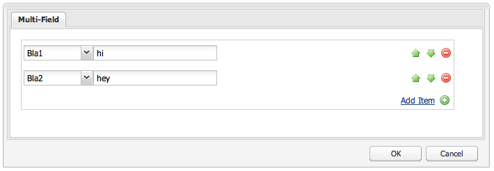

# Uso y ampliación de utilidades (IU clásica){#using-and-extending-widgets-classic-ui}

>[!NOTE]
>
>En esta página se describe el uso de las utilidades en la IU clásica, que se dejó de utilizar en AEM 6.4.
>
>Adobe recomienda aprovechar la moderna [IU táctil](/help/sites-developing/touch-ui-concepts.md) basada en [IU de Coral](/help/sites-developing/touch-ui-concepts.md#coral-ui) y [IU de Granite](/help/sites-developing/touch-ui-concepts.md#granite-ui-foundation-components).

La interfaz basada en la web de Adobe Experience Manager utiliza AJAX y otras tecnologías modernas del navegador para permitir a los autores editar y dar formato al contenido WYSIWYG directamente en la página web.

Adobe Experience Manager (AEM) utiliza la biblioteca de widgets [ExtJS](https://www.sencha.com/), que proporciona los elementos de interfaz de usuario muy refinados que funcionan en todos los exploradores más importantes y permiten la creación de experiencias de interfaz de usuario de escritorio.

Estos widgets están incluidos en AEM y, además de ser utilizados por AEM mismo, pueden ser utilizados por cualquier sitio web creado con AEM.

Para obtener una referencia completa de todos los widgets disponibles en AEM, puede consultar la [documentación de API de utilidad](https://helpx.adobe.com/experience-manager/6-5/sites/developing/using/reference-materials/widgets-api/index.html) o la [lista de xtypes](/help/sites-developing/xtypes.md) existentes. Además, hay muchos ejemplos que muestran cómo utilizar el marco de trabajo de ExtJS disponibles en el sitio [Sencha](https://www.sencha.com/products/extjs/examples/), el propietario del marco de trabajo.

Esta página proporciona algunas perspectivas sobre cómo utilizar y ampliar utilidades. En primer lugar, se describe cómo [incluir código de cliente en una página](#including-the-client-sided-code-in-a-page). A continuación, se describen algunos componentes de muestra que se han creado para ilustrar el uso básico y la extensión. Estos componentes están disponibles en el paquete **Uso de utilidades de ExtJS** en **Uso compartido de paquetes**.

El paquete incluye ejemplos de:

* [Los ](#basic-dialogs) diálogos básicos se crean con utilidades integradas.
* [Diálogos dinámicos ](#dynamic-dialogs) creados con utilidades integradas y lógica personalizada de javascript.
* Cuadros de diálogo basados en [utilidades personalizadas](#custom-widgets).
* Un [panel de árbol](#tree-overview) que muestra un árbol JCR debajo de una ruta determinada.
* Un [panel de cuadrícula](#grid-overview) que muestra los datos en formato de tabla.

>[!NOTE]
>
>La IU clásica de Adobe Experience Manager se basa en [ExtJS 3.4.0](https://extjs.cachefly.net/ext-3.4.0/docs/).

## Inclusión del código de cliente en una página {#including-the-client-sided-code-in-a-page}

El código de javascript y hoja de estilo del lado del cliente debe colocarse en una biblioteca de cliente.

Para crear una biblioteca de cliente:

1. Cree un nodo debajo de `/apps/<project>` con las siguientes propiedades:

   * name=&quot;clientlib&quot;
   * jcr:mixinTypes=&quot;[mix:lockable]&quot;
   * jcr:parentType=&quot;cq:ClientLibraryFolder&quot;
   * sling:resourceType=&quot;widgets/clientlib&quot;
   * categorías=&quot;[&lt;nombre-categoría>]&quot;
   * dependencias=&quot;[cq.widgets]&quot;

   `Note: <category-name> is the name of the custom library (e.g. "cq.extjstraining") and is used to include the library on the page.`

1. A continuación `clientlib` cree las carpetas `css` y `js` (nt:folder).

1. A continuación `clientlib` cree los archivos `css.txt` y `js.txt` (nt:files). Estos archivos .txt lista los archivos incluidos en la biblioteca.

1. Editar `js.txt`: necesita tener inicios con &#39; `#base=js`&#39; seguido de la lista de los archivos que agregará el servicio de biblioteca del cliente de CQ, por ejemplo:

   ```
   #base=js
    components.js
    exercises.js
    CustomWidget.js
    CustomBrowseField.js
    InsertTextPlugin.js
   ```

1. Editar `css.txt`: necesita tener inicios con &#39; `#base=css`&#39; seguido de la lista de los archivos que agregará el servicio de biblioteca del cliente de CQ, por ejemplo:

   ```
   #base=css
    components.css
   ```

1. Debajo de la carpeta `js`, coloque los archivos javascript que pertenecen a la biblioteca.

1. Debajo de la carpeta `css`, coloque los archivos `.css` y los recursos utilizados por los archivos css (p. ej. `my_icon.png`).

>[!NOTE]
>
>El manejo de hojas de estilo descrito anteriormente es opcional.

Para incluir la biblioteca del cliente en el jsp del componente de página:

* para incluir tanto el código de javascript como las hojas de estilo:
   `<ui:includeClientLib categories="<category-name1>, <category-name2>, ..."/>`
donde 
`<category-nameX>` es el nombre de la biblioteca del lado del cliente.

* para incluir únicamente código javascript:
   `<ui:includeClientLib js="<category-name>"/>`

Para obtener más información, consulte la descripción de la etiqueta [&lt;ui:includeClientLib>](/help/sites-developing/taglib.md#lt-ui-includeclientlib).

En algunos casos, una biblioteca de cliente solo debería estar disponible en modo de autor y excluirse en modo de publicación. Puede lograrse de la siguiente manera:

```xml
    if (WCMMode.fromRequest(request) != WCMMode.DISABLED) {
        %><ui:includeClientLib categories="cq.collab.blog"/><%
    }
```

### Introducción a los ejemplos {#getting-started-with-the-samples}

Para seguir los tutoriales de esta página, instale el paquete denominado **Uso de utilidades de ExtJS** en una instancia de AEM local y cree una página de muestra en la que se incluirán los componentes. Para ello:

1. En la instancia de AEM, descargue el paquete denominado **Uso de utilidades de ExtJS (v01)** desde Package Share e instale el paquete. Crea el proyecto `extjstraining` debajo de `/apps` en el repositorio.
1. Incluya la biblioteca de cliente que contiene las secuencias de comandos (js) y la hoja de estilo (css) en la etiqueta head de la página jsp de geometrixx, ya que incluirá los componentes de muestra en una nueva página de la rama **Geometrixx**:
en **CRXDE Lite** abra el archivo `/apps/geometrixx/components/page/headlibs.jsp` y agregue la categoría `cq.extjstraining` a la etiqueta `<ui:includeClientLib>` existente de la siguiente manera:
   `%><ui:includeClientLib categories="apps.geometrixx-main, cq.extjstraining"/><%`
1. Cree una nueva página en la rama **Geometrixx** debajo de `/content/geometrixx/en/products` y llámala **Usando utilidades de ExtJS**.
1. Vaya al modo de diseño y agregue todos los componentes del grupo llamados **Uso de utilidades de ExtJS** al diseño de Geometrixx
1. Volver al modo de edición: los componentes del grupo **Uso de utilidades de ExtJS** están disponibles en la barra de tareas.

>[!NOTE]
>
>Los ejemplos de esta página se basan en el contenido de muestra de Geometrixx, que ya no se envía con AEM, tras haber sido reemplazado por We.Retail. Consulte la Implementación de referencia de documento [We.Retail](/help/sites-developing/we-retail.md#we-retail-geometrixx) para ver cómo descargar e instalar Geometrixx.

### Diálogos básicos {#basic-dialogs}

Los diálogos se utilizan generalmente para editar contenido, pero también pueden mostrar información. Una manera fácil de vista de un diálogo completo es acceder a su representación en formato json. Para ello, señale el explorador a:

`https://localhost:4502/<path-to-dialog>.-1.json`

El primer componente del grupo **Uso de utilidades de ExtJS** en la barra de tareas se denomina **1. Conceptos básicos del cuadro de diálogo** e incluye cuatro cuadros de diálogo básicos creados con utilidades integradas y sin lógica personalizada de javascript. Los cuadros de diálogo se almacenan por debajo de `/apps/extjstraining/components/dialogbasics`. Los diálogos básicos son:

* el cuadro de diálogo completo ( `full` nodo): muestra una ventana con 3 fichas, cada una con 2 campos de texto.
* el cuadro de diálogo Panel único ( `singlepanel` nodo): muestra una ventana con una ficha que tiene 2 campos de texto.
* el cuadro de diálogo Panel múltiple ( `multipanel` nodo): su visualización es la misma que el cuadro de diálogo Completo, pero se crea de forma diferente.
* el cuadro de diálogo Diseño ( `design` nodo): muestra una ventana con 2 fichas. La primera ficha tiene un campo de texto, un menú desplegable y un área de texto contraíble. La segunda ficha tiene un conjunto de campos con 4 campos de texto y un campo contraíble con 2 campos de texto.

Incluya el **1. Conceptos básicos del cuadro de diálogo** en la página de muestra:

1. Añada el **1. Conocimientos básicos del cuadro de diálogo** a la página de muestra desde la ficha **Uso de utilidades de ExtJS** en la **barra de tareas**.
1. El componente muestra un título, texto y un vínculo **PROPERTIES**: haga clic en el vínculo para mostrar las propiedades del párrafo almacenado en el repositorio. Vuelva a hacer clic en el vínculo para ocultar las propiedades.

El componente muestra lo siguiente:


#### Ejemplo 1: Diálogo completo {#example-full-dialog}

El cuadro de diálogo **Completa** muestra una ventana con tres fichas, cada una con dos campos de texto. Es el cuadro de diálogo predeterminado del componente **Conceptos básicos del cuadro de diálogo**. Sus características son:

* Está definido por un nodo: tipo de nodo = `cq:Dialog`, xtype = ` [dialog](/help/sites-developing/xtypes.md#dialog)`.
* Muestra 3 fichas (tipo de nodo = `cq:Panel`).
* Cada ficha tiene 2 campos de texto (tipo de nodo = `cq:Widget`, xtype = ` [textfield](/help/sites-developing/xtypes.md#textfield)`).
* Está definido por el nodo:
   `/apps/extjstraining/components/dialogbasics/full`
* Se procesa en formato JSON al solicitar:
   `https://localhost:4502/apps/extjstraining/components/dialogbasics/full.-1.json`

El cuadro de diálogo muestra lo siguiente:


#### Ejemplo 2: Cuadro de diálogo de un solo panel {#example-single-panel-dialog}

El cuadro de diálogo **Panel único** muestra una ventana con una ficha que tiene dos campos de texto. Sus características son:

* Muestra 1 ficha (tipo de nodo = `cq:Dialog`, xtype = ` [panel](/help/sites-developing/xtypes.md#panel)`)
* La ficha tiene 2 campos de texto (tipo de nodo = `cq:Widget`, xtype = ` [textfield](/help/sites-developing/xtypes.md#textfield)`)
* Está definido por el nodo:
   `/apps/extjstraining/components/dialogbasics/singlepanel`
* Se procesa en formato json al solicitar:
   `https://localhost:4502/apps/extjstraining/components/dialogbasics/singlepanel.-1.json`
* Una ventaja sobre el **Diálogo completo** es que se necesita menos configuración.
* Uso recomendado: para los diálogos simples que muestran información o solo tienen unos pocos campos.

Para utilizar el cuadro de diálogo Panel único:

1. Sustituya el cuadro de diálogo del componente **Conceptos básicos del cuadro de diálogo** por el cuadro de diálogo **Panel único**:
   1. En **CRXDE Lite**, elimine el nodo: `/apps/extjstraining/components/dialogbasics/dialog`
   1. Haga clic en **Guardar todo** para guardar los cambios.
   1. Copie el nodo: `/apps/extjstraining/components/dialogbasics/singlepanel`
   1. Pegue el nodo copiado a continuación: `/apps/extjstraining/components/dialogbasics`
   1. Seleccione el nodo: `/apps/extjstraining/components/dialogbasics/Copy of singlepanel`y cambie su nombre `dialog`.
1. Edite el componente: el cuadro de diálogo muestra lo siguiente:


#### Ejemplo 3: Cuadro de diálogo de varios paneles {#example-multi-panel-dialog}

El cuadro de diálogo **Multi Panel** tiene la misma visualización que el cuadro de diálogo **Completo** pero se crea de forma diferente. Sus características son:

* Está definido por un nodo (tipo de nodo = `cq:Dialog`, xtype = ` [tabpanel](/help/sites-developing/xtypes.md#tabpanel)`).
* Muestra 3 fichas (tipo de nodo = `cq:Panel`).
* Cada ficha tiene 2 campos de texto (tipo de nodo = `cq:Widget`, xtype = ` [textfield](/help/sites-developing/xtypes.md#textfield)`).
* Está definido por el nodo:
   `/apps/extjstraining/components/dialogbasics/multipanel`
* Se procesa en formato json al solicitar:
   `https://localhost:4502/apps/extjstraining/components/dialogbasics/multipanel.-1.json`
* Una ventaja sobre el **Diálogo completo** es que tiene una estructura simplificada.
* Uso recomendado: para cuadros de diálogo con varias fichas.

Para utilizar el cuadro de diálogo Panel múltiple:

1. Reemplace el cuadro de diálogo del componente **Conceptos básicos del cuadro de diálogo** por el cuadro de diálogo **Panel múltiple**:
siga los pasos descritos para el [Ejemplo 2: Cuadro de diálogo de un solo panel](#example-single-panel-dialog)
1. Edite el componente: el cuadro de diálogo muestra lo siguiente:


#### Ejemplo 4: Diálogo enriquecido {#example-rich-dialog}

El cuadro de diálogo **Rich** muestra una ventana con dos fichas. La primera ficha tiene un campo de texto, un menú desplegable y un área de texto contraíble. La segunda ficha tiene un conjunto de campos con cuatro campos de texto y un campo que se puede contraer con dos campos de texto. Sus características son:

* Está definido por un nodo (tipo de nodo = `cq:Dialog`, xtype = ` [dialog](/help/sites-developing/xtypes.md#dialog)`).
* Muestra 2 fichas (tipo de nodo = `cq:Panel`).
* La primera ficha tiene un widget ` [dialogfieldset](/help/sites-developing/xtypes.md#dialogfieldset)` con un widget ` [textfield](/help/sites-developing/xtypes.md#textfield)` y un widget ` [selection](/help/sites-developing/xtypes.md#selection)` con 3 opciones, y un widget ` [dialogfieldset](/help/sites-developing/xtypes.md#dialogfieldset)` contraíble con un widget ` [textarea](/help/sites-developing/xtypes.md#textarea)`.
* La segunda ficha tiene una utilidad ` [dialogfieldset](/help/sites-developing/xtypes.md#dialogfieldset)` con 4 ` [textfield](/help/sites-developing/xtypes.md#textfield)` utilidades y una `dialogfieldset` contraíble con 2 ` [textfield](/help/sites-developing/xtypes.md#textfield)` utilidades.
* Está definido por el nodo:
   `/apps/extjstraining/components/dialogbasics/rich`
* Se procesa en formato json al solicitar:
   `https://localhost:4502/apps/extjstraining/components/dialogbasics/rich.-1.json`

Para utilizar el cuadro de diálogo **Rich**:

1. Sustituya el cuadro de diálogo del componente **Conceptos básicos del cuadro de diálogo** por el cuadro de diálogo **Enriquecido**:
siga los pasos descritos para el [Ejemplo 2: Cuadro de diálogo de un solo panel](#example-single-panel-dialog)
1. Edite el componente: el cuadro de diálogo muestra lo siguiente:

 

### Diálogos dinámicos {#dynamic-dialogs}

El segundo componente del grupo **Uso de utilidades de ExtJS** en la barra de tareas se denomina **2. Dynamic Dialogs** e incluye tres cuadros de diálogo dinámicos creados con utilidades integradas y **con lógica personalizada de javascript**. Los cuadros de diálogo se almacenan por debajo de `/apps/extjstraining/components/dynamicdialogs`. Los diálogos dinámicos son:

* el cuadro de diálogo Cambiar fichas ( `switchtabs` nodo): muestra una ventana con dos fichas. La primera ficha tiene una selección de radio con tres opciones: cuando se selecciona una opción, se muestra una ficha relacionada con la opción. La segunda ficha tiene dos campos de texto.
* el cuadro de diálogo arbitrario ( `arbitrary` nodo): muestra una ventana con una ficha. La ficha tiene un campo para soltar o cargar un recurso y un campo que muestra información sobre la página que lo contiene y sobre el recurso si se hace referencia a uno.
* el cuadro de diálogo Alternar campos ( `togglefield` nodo): muestra una ventana con una ficha. La ficha tiene una casilla de verificación: cuando está marcado, se muestra un conjunto de campos con dos campos de texto.

Para incluir el **2. Dynamic Dialogs** en la página de muestra:

1. Añada el **2. Diálogos dinámicos** en la página de muestra de la ficha **Uso de utilidades de ExtJS** en la **barra de tareas**.
1. El componente muestra un título, texto y un vínculo **PROPERTIES**: haga clic para mostrar las propiedades del párrafo almacenado en el repositorio. Haga clic de nuevo para ocultar las propiedades.

El componente muestra lo siguiente:


#### Ejemplo 1: Cuadro de diálogo Cambiar fichas {#example-switch-tabs-dialog}

El cuadro de diálogo **Cambiar fichas** muestra una ventana con dos fichas. La primera ficha tiene una selección de radio con tres opciones: cuando se selecciona una opción, se muestra una ficha relacionada con la opción. La segunda ficha tiene dos campos de texto.

Sus principales características son:

* Está definido por un nodo (tipo de nodo = `cq:Dialog`, xtype = ` [dialog](/help/sites-developing/xtypes.md#dialog)`).
* Muestra 2 fichas (tipo de nodo = `cq:Panel`): 1 ficha de selección, la segunda ficha depende de la selección de la primera ficha (3 opciones).
* Tiene 3 fichas opcionales (tipo de nodo = `cq:Panel`), cada una tiene 2 campos de texto (tipo de nodo = `cq:Widget`, xtype = ` [textfield](/help/sites-developing/xtypes.md#textfield)`). Solo se muestra una ficha opcional a la vez.
* Está definido por el nodo `switchtabs` en:
   `/apps/extjstraining/components/dynamicdialogs/switchtabs`
* Se procesa en formato json al solicitar:
   `https://localhost:4502/apps/extjstraining/components/dynamicdialogs/switchtabs.-1.json`

La lógica se implementa a través de los oyentes de evento y el código javascript de la siguiente manera:

* El nodo de cuadro de diálogo tiene un detector &quot; `beforeshow`&quot; que oculta todas las fichas opcionales antes de que se muestre el cuadro de diálogo:
   `beforeshow="function(dialog){Ejst.x2.manageTabs(dialog.items.get(0));}"`

   `dialog.items.get(0)` obtiene el panel de tabla que contiene el panel de selección y los 3 paneles opcionales.
* El objeto `Ejst.x2` se define en el archivo `exercises.js` en:
   `/apps/extjstraining/clientlib/js/exercises.js`
* En el método `Ejst.x2.manageTabs()`, como el valor de `index` es -1, todas las fichas opcionales están ocultas (i va de 1 a 3).
* La ficha de selección tiene 2 oyentes: una que muestra la ficha seleccionada cuando se carga el cuadro de diálogo (&quot; evento `loadcontent`&quot;) y otra que muestra la ficha seleccionada cuando se cambia la selección (&quot; evento `selectionchanged`&quot;):
   `loadcontent="function(field,rec,path){Ejst.x2.showTab(field);}"`

   `selectionchanged="function(field,value){Ejst.x2.showTab(field);}"`
* En el método `Ejst.x2.showTab()`:
   `field.findParentByType('tabpanel')` obtiene el panel de tabla que contiene todas las fichas ( `field` representa el widget de selección)
   `field.getValue()` obtiene el valor de la selección, por ejemplo: tab2
   `Ejst.x2.manageTabs()` muestra la ficha seleccionada.
* Cada ficha opcional tiene un detector que oculta la ficha en el evento &quot; `render`&quot;:
   `render="function(tab){Ejst.x2.hideTab(tab);}"`
* En el método `Ejst.x2.hideTab()`:
   `tabPanel` es el panel de fichas que contiene todas las fichas
   `index` es el índice de la ficha opcional
   `tabPanel.hideTabStripItem(index)` oculta la ficha

Muestra lo siguiente:


#### Ejemplo 2: Diálogo arbitrario {#example-arbitrary-dialog}

Muy a menudo, un cuadro de diálogo muestra el contenido del componente subyacente. El cuadro de diálogo descrito aquí, llamado **cuadro de diálogo arbitrario**, extrae contenido de un componente diferente.

El cuadro de diálogo **Arbitrario** muestra una ventana con una ficha. La ficha tiene dos campos: una para soltar o cargar un recurso y otra que muestre información sobre la página contenedora y sobre el recurso si se ha hecho referencia a uno.

Sus principales características son:

* Está definido por un nodo (tipo de nodo = `cq:Dialog`, xtype = ` [dialog](/help/sites-developing/xtypes.md#dialog)`).
* Muestra 1 widget de panel de tabla (tipo de nodo = `cq:Widget`, xtype = ` [tabpanel](/help/sites-developing/xtypes.md#tabpanel)`) con 1 panel (tipo de nodo = `cq:Panel`)
* El panel tiene un widget de archivo inteligente (tipo de nodo = `cq:Widget`, xtype = ` [smartfile](/help/sites-developing/xtypes.md#smartfile)`) y un widget de dibujo de propietario (tipo de nodo = `cq:Widget`, xtype = ` [ownerdraw](/help/sites-developing/xtypes.md#ownerdraw)`)
* Está definido por el nodo `arbitrary` en:
   `/apps/extjstraining/components/dynamicdialogs/arbitrary`
* Se procesa en formato json al solicitar:
   `https://localhost:4502/apps/extjstraining/components/dynamicdialogs/arbitrary.-1.json`

La lógica se implementa a través de los oyentes de evento y el código javascript de la siguiente manera:

* La utilidad de dibujo de propietario tiene un detector &quot; `loadcontent`&quot; que muestra información sobre la página que contiene el componente y el recurso al que hace referencia la utilidad smartfile cuando se carga el contenido:
   `loadcontent="function(field,rec,path){Ejst.x2.showInfo(field,rec,path);}"`

   `field` se establece con el objeto de dibujo del propietario
   `path` se configura con la ruta de contenido del componente (p. ej.: /content/geometrixx/es/products/triangle/ui-tutorial/jcr:content/par/dynamicdialogs)
* El objeto `Ejst.x2` se define en el archivo `exercises.js` en:
   `/apps/extjstraining/clientlib/js/exercises.js`
* En el método `Ejst.x2.showInfo()`:
   `pagePath` es la ruta de la página que contiene el componente
   `pageInfo` representa las propiedades de página en formato json
   `reference` es la ruta del recurso al que se hace referencia
   `metadata` representa los metadatos del recurso en formato json
   `ownerdraw.getEl().update(html);` muestra el HTML creado en el cuadro de diálogo

Para utilizar el cuadro de diálogo **Arbitrario**:

1. Reemplace el cuadro de diálogo del componente **Diálogo dinámico** por el cuadro de diálogo **Arbitrario**:
siga los pasos descritos para el [Ejemplo 2: Cuadro de diálogo de un solo panel](#example-single-panel-dialog)
1. Edite el componente: el cuadro de diálogo muestra lo siguiente:


#### Ejemplo 3: Cuadro de diálogo Alternar campos {#example-toggle-fields-dialog}

El cuadro de diálogo **Alternar campos** muestra una ventana con una ficha. La ficha tiene una casilla de verificación: cuando está marcado, se muestra un conjunto de campos con dos campos de texto.

Sus principales características son:

* Está definido por un nodo (tipo de nodo = `cq:Dialog`, xtype = ` [dialog](/help/sites-developing/xtypes.md#dialog)`).
* Muestra 1 widget de panel de fichas (tipo de nodo = `cq:Widget`, xtype = ` [tabpanel](/help/sites-developing/xtypes.md#textpanel)`) con 1 panel (tipo de nodo = `cq:Panel`).
* El panel tiene un widget de selección/casilla de verificación (tipo de nodo = `cq:Widget`, xtype = ` [selection](/help/sites-developing/xtypes.md#selection)`, tipo = ` [checkbox](/help/sites-developing/xtypes.md#checkbox)`) y un widget de conjunto de cuadros de diálogo contraíble (tipo de nodo = `cq:Widget`, xtype = ` [dialogfieldset](/help/sites-developing/xtypes.md#dialogfieldset)`) que está oculto de forma predeterminada, con 2 utilidades de campo de texto (tipo de nodo = `cq:Widget`, xtype = ` [textfield](/help/sites-developing/xtypes.md#textfield)`).
* Está definido por el nodo `togglefields` en:
   `/apps/extjstraining/components/dynamicdialogs/togglefields`
* Se procesa en formato json al solicitar:
   `https://localhost:4502/apps/extjstraining/components/dynamicdialogs/togglefields.-1.json`

La lógica se implementa a través de los oyentes de evento y el código javascript de la siguiente manera:

* la ficha de selección tiene 2 oyentes: uno que muestra el conjunto de campos de diálogos cuando se carga el contenido (&quot; evento `loadcontent`&quot;) y uno que muestra el conjunto de campos de diálogos cuando se cambia la selección (&quot; evento `selectionchanged`&quot;):
   `loadcontent="function(field,rec,path){Ejst.x2.toggleFieldSet(field);}"`

   `selectionchanged="function(field,value){Ejst.x2.toggleFieldSet(field);}"`
* El objeto `Ejst.x2` se define en el archivo `exercises.js` en:
   `/apps/extjstraining/clientlib/js/exercises.js`
* En el método `Ejst.x2.toggleFieldSet()`:
   `box` es el objeto de selección
   `panel` es el panel que contiene la selección y los widgets de conjunto de cuadros de diálogo
   `fieldSet` es el objeto dialogfield
   `show` es el valor de la selección (true o false) basada en &#39;  `show`&#39; el conjunto de campos de diálogo se muestra o no

Para utilizar el cuadro de diálogo **Alternar campos**:

1. Reemplace el cuadro de diálogo del componente **Diálogo dinámico** por el cuadro de diálogo **Alternar campos**:
siga los pasos descritos para el [Ejemplo 2: Cuadro de diálogo de un solo panel](#example-single-panel-dialog)
1. Edite el componente: el cuadro de diálogo muestra lo siguiente:


### Widgets personalizados {#custom-widgets}

Los widgets listos para usar que se envían con AEM deben cubrir la mayoría de los casos de uso. Sin embargo, a veces puede ser necesario crear una utilidad personalizada para cubrir un requisito específico del proyecto. Los widgets personalizados se pueden crear ampliando los existentes. Para ayudarle a comenzar con esta personalización, el paquete **Uso de utilidades de ExtJS** incluye tres cuadros de diálogo que utilizan tres utilidades personalizadas diferentes:

* el cuadro de diálogo Campo múltiple ( `multifield` nodo) muestra una ventana con una ficha. La ficha tiene un widget de varios campos personalizado que tiene dos campos: un menú desplegable con dos opciones y un campo de texto. Como se basa en la utilidad lista para usar `multifield` (que sólo tiene un campo de texto), tiene todas las características de la utilidad `multifield`.
* el cuadro de diálogo Examinar árbol ( `treebrowse` nodo) muestra una ventana con una ficha que contiene un widget de exploración de ruta: al hacer clic en la flecha, se abre una ventana en la que puede examinar una jerarquía y seleccionar un elemento. La ruta del elemento se agrega al campo de ruta y se mantiene cuando se cierra el cuadro de diálogo.
* un cuadro de diálogo basado en el complemento Editor de texto enriquecido ( `rteplugin` nodo) que agrega un botón personalizado al Editor de texto enriquecido para insertar texto personalizado en el texto principal. Consiste en una utilidad `richtext` (RTE) y en una función personalizada que se agrega a través del mecanismo de complemento RTE.

Los widgets personalizados y el complemento se incluyen en el componente llamado **3. Widgets personalizados** del paquete **Uso de utilidades de ExtJS**. Para incluir este componente en la página de muestra:

1. Añada el **3. Widgets personalizados** para la página de muestra desde la ficha **Uso de utilidades de ExtJS** en la **barra de tareas**.
1. El componente muestra un título, texto y, al hacer clic en el vínculo **PROPERTIES**, las propiedades del párrafo almacenado en el repositorio. Al volver a hacer clic se ocultan las propiedades.
El componente muestra lo siguiente:


#### Ejemplo 1: Utilidad multicampo personalizada {#example-custom-multifield-widget}

El cuadro de diálogo basado en la utilidad **Campo múltiple personalizado** muestra una ventana con una ficha. La ficha tiene un widget de varios campos personalizado que, a diferencia del estándar que tiene un campo, tiene dos campos: un menú desplegable con dos opciones y un campo de texto.

El cuadro de diálogo basado en la utilidad **Campo múltiple personalizado**:

* Está definido por un nodo (tipo de nodo = `cq:Dialog`, xtype = ` [dialog](/help/sites-developing/xtypes.md#dialog)`).
* Muestra 1 widget de panel de fichas (tipo de nodo = `cq:Widget`, xtype = ` [tabpanel](/help/sites-developing/xtypes.md#tabpanel)`) que contiene un panel (tipo de nodo = `cq:Widget`, xtype = ` [panel](/help/sites-developing/xtypes.md#panel)`).
* El panel tiene una utilidad `multifield` (tipo de nodo = `cq:Widget`, xtype = ` [multifield](/help/sites-developing/xtypes.md#multifield)`).
* La utilidad `multifield` tiene una configuración de campo (tipo de nodo = `nt:unstructured`, xtype = `ejstcustom`, optionsProvider = `Ejst.x3.provideOptions`) basada en el xtype personalizado &#39; `ejstcustom`&#39;:
   * &#39; `fieldconfig`&#39; es una opción de configuración del objeto ` [CQ.form.MultiField](https://helpx.adobe.com/experience-manager/6-5/sites/developing/using/reference-materials/widgets-api/index.html?class=CQ.form.MultiField)`.
   * &#39; `optionsProvider`&#39; es una configuración del widget `ejstcustom`. Se configura con el método `Ejst.x3.provideOptions` que se define en `exercises.js` en:
      `/apps/extjstraining/clientlib/js/exercises.js`
y devuelve 2 opciones.
* Está definido por el nodo `multifield` en:
   `/apps/extjstraining/components/customwidgets/multifield`
* Se procesa en formato json al solicitar:
   `https://localhost:4502/apps/extjstraining/components/customwidgets/multifield.-1.json`

El widget de campo múltiple personalizado (xtype = `ejstcustom`):

* Es un objeto javascript denominado `Ejst.CustomWidget`.
* Se define en el archivo javascript `CustomWidget.js` en:
   `/apps/extjstraining/clientlib/js/CustomWidget.js`
* Extiende la utilidad ` [CQ.form.CompositeField](https://helpx.adobe.com/experience-manager/6-5/sites/developing/using/reference-materials/widgets-api/index.html?class=CQ.form.CompositeField)`.
* Tiene 3 campos: `hiddenField` (Campo de texto), `allowField` (ComboBox) y `otherField` (Campo de texto)
* Anula `CQ.Ext.Component#initComponent` para agregar los 3 campos:
   * `allowField` es un objeto  [CQ.form.](https://helpx.adobe.com/experience-manager/6-5/sites/developing/using/reference-materials/widgets-api/index.html?class=CQ.form.Selection) Selection de tipo &#39;select&#39;. optionsProvider es una configuración del objeto Selection a la que se crea una instancia con la configuración optionsProvider del objeto CustomWidget definido en el cuadro de diálogo
   * `otherField` es un objeto  [CQ.Ext.form.](https://helpx.adobe.com/experience-manager/6-5/sites/developing/using/reference-materials/widgets-api/index.html?class=CQ.Ext.form.TextField) TextField
* Sobrescribe los métodos `setValue`, `getValue` y `getRawValue` de [CQ.form.CompositeField](https://helpx.adobe.com/experience-manager/6-5/sites/developing/using/reference-materials/widgets-api/index.html?class=CQ.form.CompositeField) para establecer y recuperar el valor de CustomWidget con el formato:
   `<allowField value>/<otherField value>, e.g.: 'Bla1/hello'`.
* Se registra como xtype &#39; `ejstcustom`&#39;:
   `CQ.Ext.reg('ejstcustom', Ejst.CustomWidget);`

El cuadro de diálogo basado en la utilidad **Campo múltiple personalizado** muestra lo siguiente:



#### Ejemplo 2: Utilidad Treebrowse personalizada {#example-custom-treebrowse-widget}

El cuadro de diálogo personalizado basado en la utilidad **Treebrowse** muestra una ventana con una ficha que contiene una utilidad de exploración de ruta personalizada: al hacer clic en la flecha, se abre una ventana en la que puede examinar una jerarquía y seleccionar un elemento. La ruta del elemento se agrega al campo de ruta y se mantiene cuando se cierra el cuadro de diálogo.

Cuadro de diálogo de la ventana de árbol personalizada:

* Está definido por un nodo (tipo de nodo = `cq:Dialog`, xtype = ` [dialog](/help/sites-developing/xtypes.md#dialog)`).
* Muestra 1 widget de panel de fichas (tipo de nodo = `cq:Widget`, xtype = ` [tabpanel](/help/sites-developing/xtypes.md#tabpanel)`) que contiene un panel (tipo de nodo = `cq:Widget`, xtype = ` [panel](/help/sites-developing/xtypes.md#panel)`).
* El panel tiene una utilidad personalizada (tipo de nodo = `cq:Widget`, xtype = `ejstbrowse`)
* Está definido por el nodo `treebrowse` en:
   `/apps/extjstraining/components/customwidgets/treebrowse`
* Se procesa en formato json al solicitar:
   `https://localhost:4502/apps/extjstraining/components/customwidgets/treebrowse.-1.json`

La utilidad de exploración de árbol personalizada (xtype = `ejstbrowse`):

* Es un objeto javascript denominado `Ejst.CustomWidget`.
* Se define en el archivo javascript `CustomBrowseField.js` en:
   `/apps/extjstraining/clientlib/js/CustomBrowseField.js`
* Extiende ` [CQ.Ext.form.TriggerField](https://helpx.adobe.com/experience-manager/6-5/sites/developing/using/reference-materials/widgets-api/index.html?class=CQ.Ext.form.TriggerField)`.
* Define una ventana de exploración llamada `browseWindow`.
* Sobrescribe ` [CQ.Ext.form.TriggerField](https://helpx.adobe.com/experience-manager/6-5/sites/developing/using/reference-materials/widgets-api/index.html?class=CQ.Ext.form.TriggerField)#onTriggerClick` para mostrar la ventana de exploración cuando se hace clic en la flecha.
* Define un objeto [CQ.Ext.tree.TreePanel](https://helpx.adobe.com/experience-manager/6-5/sites/developing/using/reference-materials/widgets-api/index.html?class=CQ.Ext.tree.TreePanel):
   * Obtiene sus datos llamando al servlet registrado en `/bin/wcm/siteadmin/tree.json`.
   * Su raíz es &quot; `apps/extjstraining`&quot;.
* Define un objeto `window` ( ` [CQ.Ext.Window](https://helpx.adobe.com/experience-manager/6-5/sites/developing/using/reference-materials/widgets-api/index.html?class=CQ.Ext.Window)`):
   * Basado en el panel predefinido.
   * Tiene un botón **Aceptar** que establece el valor de la ruta seleccionada y oculta el panel.
* La ventana está anclada debajo del campo **Ruta**.
* La ruta seleccionada se pasa del campo Examinar a la ventana en el evento `show`.
* Se registra como xtype &#39; `ejstbrowse`&#39;:
   `CQ.Ext.reg('ejstbrowse', Ejst.CustomBrowseField);`

Para utilizar el cuadro de diálogo basado en la utilidad **Examinar personalizado**:

1. Reemplace el cuadro de diálogo del componente **Utilidades personalizadas** por el cuadro de diálogo **Exploración personalizada**:
siga los pasos descritos para el [Ejemplo 2: Cuadro de diálogo de un solo panel](#example-single-panel-dialog)
1. Edite el componente: el cuadro de diálogo muestra lo siguiente:


#### Ejemplo 3: Complemento Editor de texto enriquecido (RTE) {#example-rich-text-editor-rte-plug-in}

El cuadro de diálogo basado en **Editor de texto enriquecido (RTE)** es un cuadro de diálogo basado en editor de texto enriquecido que tiene un botón personalizado para insertar texto personalizado entre corchetes. El texto personalizado se puede analizar con alguna lógica del lado del servidor (no implementada en este ejemplo), por ejemplo para agregar texto definido en la ruta dada:

Cuadro de diálogo basado en **RTE plugin**:

* Está definido por el nodo replugin en:
   `/apps/extjstraining/components/customwidgets/rteplugin`
* Se procesa en formato json al solicitar:
   `https://localhost:4502/apps/extjstraining/components/customwidgets/rteplugin.-1.json`
* El nodo `rtePlugins` tiene un nodo secundario `inserttext` (tipo de nodo = `nt:unstructured`) que recibe el nombre del complemento. Tiene una propiedad denominada `features`, que define qué características del complemento están disponibles para RTE.

El complemento RTE:

* Es un objeto javascript denominado `Ejst.InsertTextPlugin`.
* Se define en el archivo javascript `InsertTextPlugin.js` en:
   `/apps/extjstraining/clientlib/js/InsertTextPlugin.js`
* Extiende el objeto ` [CQ.form.rte.plugins.Plugin](https://helpx.adobe.com/experience-manager/6-5/sites/developing/using/reference-materials/widgets-api/index.html?class=CQ.form.rte.plugins.Plugin)`.
* Los siguientes métodos definen el objeto ` [CQ.form.rte.plugins.Plugin](https://helpx.adobe.com/experience-manager/6-5/sites/developing/using/reference-materials/widgets-api/index.html?class=CQ.form.rte.plugins.Plugin)` y se reemplazan en el complemento de implementación:
   * `getFeatures()` devuelve una matriz de todas las funciones que el complemento pone a disposición.
   * `initializeUI()` agrega el nuevo botón a la barra de herramientas RTE.
   * `notifyPluginConfig()` muestra el título y el texto cuando se sitúa el botón al pasar el ratón por encima.
   * `execute()` se llama cuando se hace clic en el botón y realiza la acción del complemento: muestra una ventana que se utiliza para definir el texto que se va a incluir.
* `insertText()` inserta un texto utilizando el objeto de cuadro de diálogo correspondiente  `Ejst.InsertTextPlugin.Dialog` (consulte más adelante).
* `executeInsertText()` se activa mediante el  `apply()` método del cuadro de diálogo, que se activa cuando se hace clic en el  **** botón Aceptar.
* Se registra como complemento &#39; `inserttext`&#39;:
   `CQ.form.rte.plugins.PluginRegistry.register("inserttext", Ejst.InsertTextPlugin);`
* el objeto `Ejst.InsertTextPlugin.Dialog` define el cuadro de diálogo que se abre cuando se hace clic en el botón del complemento. El cuadro de diálogo consta de un panel, un formulario, un campo de texto y 2 botones (**Aceptar** y **Cancelar**).

Para utilizar el cuadro de diálogo basado en el complemento **editor de texto enriquecido (RTE)**:

1. Reemplace el cuadro de diálogo del componente **Widgets personalizados** por el cuadro de diálogo basado en el complemento **editor de texto enriquecido (RTE)**:
siga los pasos descritos para el [Ejemplo 2: Cuadro de diálogo de un solo panel](#example-single-panel-dialog)
1. Edite el componente .
1. Haga clic en el último icono de la derecha (el que tiene cuatro flechas). Introduzca una ruta y haga clic en **Aceptar**:
La ruta se muestra entre corchetes ([) ]).
1. Haga clic en **Aceptar** para cerrar el Editor de texto enriquecido.

El cuadro de diálogo basado en el complemento **Editor de texto enriquecido (RTE)** muestra lo siguiente:


>[!NOTE]
>
>Este ejemplo solo muestra cómo implementar la parte de la lógica del lado del cliente: los marcadores de posición (*[texto]*) deben analizarse explícitamente en el servidor (por ejemplo, en el JSP del componente).

### Información general de árbol {#tree-overview}

El objeto predeterminado ` [CQ.Ext.tree.TreePanel](https://helpx.adobe.com/experience-manager/6-5/sites/developing/using/reference-materials/widgets-api/index.html?class=CQ.Ext.tree.TreePanel)` proporciona una representación de interfaz de usuario estructurada en árbol de datos estructurados en árbol. El componente Información general de árbol incluido en el paquete **Uso de utilidades de ExtJS** muestra cómo utilizar el objeto `TreePanel` para mostrar un árbol JCR debajo de una ruta determinada. La ventana misma puede acoplarse o desacoplarse. En este ejemplo, la lógica de ventana está incrustada en el jsp del componente entre etiquetas &lt;script>&lt;/script>.

Para incluir el componente **Información general de árbol** en la página de muestra:

1. Añada el **4. Tree Overview** componente a la página de muestra desde la ficha **Using ExtJS Widgets** en la **barra de tareas**.
1. El componente muestra:
   * un título, con texto
   * un vínculo **PROPERTIES**: haga clic para mostrar las propiedades del párrafo almacenado en el repositorio. Haga clic de nuevo para ocultar las propiedades.
   * una ventana flotante con una representación de árbol del repositorio, que se puede expandir.

El componente muestra lo siguiente:


El componente Información general de árbol:

* Se define en:
   `/apps/extjstraining/components/treeoverview`

* Su cuadro de diálogo permite establecer el tamaño de la ventana y acoplar/desacoplar la ventana (ver los detalles a continuación).

El jsp del componente:

* Recupera las propiedades de ancho, alto y acoplado del repositorio.
* Muestra texto sobre el formato de datos de información general de árbol.
* Incrusta la lógica de la ventana en el jsp del componente entre etiquetas de javascript.
* Se define en:
   `apps/extjstraining/components/treeoverview/content.jsp`

Código de javascript incrustado en el jsp del componente:

* Define un objeto `tree` al intentar recuperar una ventana de árbol de la página.
* Si la ventana que muestra el árbol no existe, se crea `treePanel` ([CQ.Ext.tree.TreePanel](https://helpx.adobe.com/experience-manager/6-5/sites/developing/using/reference-materials/widgets-api/index.html?class=CQ.Ext.tree.TreePanel)):
   * `treePanel` contiene los datos que se utilizan para crear la ventana.
   * Los datos se recuperan llamando al servlet registrado en:
      `/bin/wcm/siteadmin/tree.json`
* El detector `beforeload` se asegura de que se cargue el nodo en el que se hizo clic.
* El objeto `root` establece la ruta `apps/extjstraining` como la raíz del árbol.
* `tree` (  ` [CQ.Ext.Window](https://helpx.adobe.com/experience-manager/6-5/sites/developing/using/reference-materials/widgets-api/index.html?class=CQ.Ext.Window)`) se establece en función del valor predefinido  `treePanel`, y se muestra con:
   `tree.show();`
* Si la ventana ya existe, se muestra en función de la anchura, la altura y las propiedades acopladas recuperadas del repositorio.

Cuadro de diálogo del componente:

* Muestra 1 ficha con 2 campos para definir el tamaño (anchura y altura) de la ventana de información general de árbol y 1 campo para acoplar/desacoplar la ventana
* Está definido por un nodo (tipo de nodo = `cq:Dialog`, xtype = ` [panel](/help/sites-developing/xtypes.md#panel)`).
* El panel tiene un widget sizefield (tipo de nodo = `cq:Widget`, xtype = ` [sizefield](/help/sites-developing/xtypes.md#sizefield)`) y un widget de selección (tipo de nodo = `cq:Widget`, xtype = ` [selection](/help/sites-developing/xtypes.md#selection)`, tipo = `radio`) con 2 opciones (true/false)
* Está definido por el nodo de cuadro de diálogo en:
   `/apps/extjstraining/components/treeoverview/dialog`
* Se procesa en formato json al solicitar:
   `https://localhost:4502/apps/extjstraining/components/treeoverview/dialog.-1.json`
* Muestra lo siguiente:


### Información general de cuadrícula {#grid-overview}

Un panel de cuadrícula representa los datos en un formato de tabla de filas y columnas. Se compone de lo siguiente:

* Tienda: el modelo que contiene los registros de datos (filas).
* Modelo de columna: la composición de la columna.
* Vista: encapsula la interfaz de usuario.
* Modelo de selección: el comportamiento de selección.

El componente Información general de cuadrícula incluido en el paquete **Uso de utilidades de ExcelJS** muestra cómo mostrar los datos en formato de tabla:

* El ejemplo 1 utiliza datos estáticos.
* El ejemplo 2 utiliza datos recuperados del repositorio.

Para incluir el componente Información general de cuadrícula en la página de muestra:

1. Añada el **5. Información general de cuadrícula** en la página de muestra de la ficha **Uso de utilidades de ExcelJS** en la **barra de tareas**.
1. El componente muestra:
   * un título con texto
   * un vínculo **PROPERTIES**: haga clic para mostrar las propiedades del párrafo almacenado en el repositorio. Haga clic de nuevo para ocultar las propiedades.
   * ventana flotante que contiene datos en formato de tabla.

El componente muestra lo siguiente:


#### Ejemplo 1: Cuadrícula predeterminada {#example-default-grid}

En su versión lista para usar, el componente **Información general de cuadrícula** muestra una ventana con datos estáticos en formato de tabla. En este ejemplo, la lógica se incrusta en el jsp del componente de dos formas:

* la lógica genérica se define entre las etiquetas &lt;script>&lt;/script>
* la lógica específica está disponible en un archivo .js independiente y está vinculada en el archivo jsp. Esta configuración permite cambiar fácilmente entre las dos lógicas (estática/dinámica) mediante el comentario de las etiquetas &lt;script> deseadas.

El componente Información general de cuadrícula:

* Se define en:
   `/apps/extjstraining/components/gridoverview`
* Su cuadro de diálogo permite definir el tamaño de la ventana y acoplar/desacoplar la ventana.

El jsp del componente:

* Recupera las propiedades de ancho, alto y acoplado del repositorio.
* Muestra texto como introducción al formato de datos de información general de la cuadrícula.
* Hace referencia al código javascript que define el objeto GridPanel:
   `<script type="text/javascript" src="/apps/extjstraining/components/gridoverview/defaultgrid.js"></script>`

   `defaultgrid.js` define algunos datos estáticos como una base para el objeto GridPanel.
* Incrusta código javascript entre etiquetas javascript que define el objeto Window que consume el objeto GridPanel.
* Se define en:
   `apps/extjstraining/components/gridoverview/content.jsp`

Código de javascript incrustado en el jsp del componente:

* Define el objeto `grid` intentando recuperar el componente de ventana de la página:
   `var grid = CQ.Ext.getCmp("<%= node.getName() %>-grid");`
* Si `grid` no existe, se define un objeto [CQ.Ext.grid.GridPanel](https://helpx.adobe.com/experience-manager/6-5/sites/developing/using/reference-materials/widgets-api/index.html?class=CQ.Ext.grid.GridPanel) ( `gridPanel`) llamando al método `getGridPanel()` (ver más adelante). Este método se define en `defaultgrid.js`.
* `grid` es un  ` [CQ.Ext.Window](https://helpx.adobe.com/experience-manager/6-5/sites/developing/using/reference-materials/widgets-api/index.html?class=CQ.Ext.Window)` objeto, basado en el GridPanel predefinido, y se muestra:  `grid.show();`
* Si `grid` ya existe, se muestra en función de las propiedades de ancho, alto y acoplado recuperadas del repositorio.

El archivo javascript ( `defaultgrid.js`) al que se hace referencia en el jsp del componente define el método `getGridPanel()` al que llama la secuencia de comandos incrustada en el JSP y devuelve un objeto ` [CQ.Ext.grid.GridPanel](https://helpx.adobe.com/experience-manager/6-5/sites/developing/using/reference-materials/widgets-api/index.html?class=CQ.Ext.grid.GridPanel)`, basado en datos estáticos. La lógica es la siguiente:

* `myData` es una matriz de datos estáticos formateada como una tabla de 5 columnas y 4 filas.
* `store` es un  `CQ.Ext.data.Store` objeto que consume  `myData`.
* `store` se carga en la memoria:
   `store.load();`
* `gridPanel` es un  ` [CQ.Ext.grid.GridPanel](https://helpx.adobe.com/experience-manager/6-5/sites/developing/using/reference-materials/widgets-api/index.html?class=CQ.Ext.grid.GridPanel)` objeto que consume  `store`:
   * los anchos de columna se vuelven a asignar en todo momento:
      `forceFit: true`
   * solo se puede seleccionar una fila a la vez:
      `singleSelect:true`

#### Ejemplo 2: Cuadrícula de búsqueda de referencia {#example-reference-search-grid}

Al instalar el paquete, el `content.jsp` componente **Información general de cuadrícula** muestra una cuadrícula basada en datos estáticos. Es posible modificar el componente para mostrar una cuadrícula con las características siguientes:

* Tiene tres columnas.
* Se basa en los datos recuperados del repositorio llamando a un servlet.
* Se pueden editar las celdas de la última columna. El valor se mantiene en una propiedad `test` debajo del nodo definido por la ruta que se muestra en la primera columna.

Como se explica en la sección anterior, el objeto window obtiene su objeto ` [CQ.Ext.grid.GridPanel](https://helpx.adobe.com/experience-manager/6-5/sites/developing/using/reference-materials/widgets-api/index.html?class=CQ.Ext.grid.GridPanel)` llamando al método `getGridPanel()` definido en el archivo `defaultgrid.js` en `/apps/extjstraining/components/gridoverview/defaultgrid.js`. El componente **Grid Overview **proporciona una implementación diferente para el método `getGridPanel()`, definido en el archivo `referencesearch.js` en `/apps/extjstraining/components/gridoverview/referencesearch.js`. Al cambiar el archivo .js al que se hace referencia en el archivo jsp del componente, la cuadrícula se basará en los datos recuperados del repositorio.

Cambie el archivo .js al que se hace referencia en el archivo jsp del componente:

1. En **CRXDE Lite**, en el archivo `content.jsp` del componente, haga un comentario sobre la línea que incluye el archivo `defaultgrid.js`, de modo que tenga el siguiente aspecto:
   `<!-- script type="text/javascript" src="/apps/extjstraining/components/gridoverview/defaultgrid.js"></script-->`
1. Quite el comentario de la línea que incluye el archivo `referencesearch.js`, de modo que tenga el siguiente aspecto:
   `<script type="text/javascript" src="/apps/extjstraining/components/gridoverview/referencesearch.js"></script>`
1. Guarde los cambios.
1. Actualice la página de muestra.

El componente muestra lo siguiente:


El código javascript al que se hace referencia en el componente jsp ( `referencesearch.js`) define el método `getGridPanel()` al que se llama desde el componente jsp y devuelve un objeto ` [CQ.Ext.grid.GridPanel](https://helpx.adobe.com/experience-manager/6-5/sites/developing/using/reference-materials/widgets-api/index.html?class=CQ.Ext.grid.GridPanel)`, basado en datos que se recuperan dinámicamente del repositorio. La lógica de `referencesearch.js` define algunos datos dinámicos como una base para GridPanel:

* `reader` es un  ` [CQ.Ext.data.JsonReader](https://helpx.adobe.com/experience-manager/6-5/sites/developing/using/reference-materials/widgets-api/index.html?class=CQ.Ext.data.JsonReader)`objeto que lee la respuesta del servlet en formato json para 3 columnas.
* `cm` es un  ` [CQ.Ext.grid.ColumnModel](https://helpx.adobe.com/experience-manager/6-5/sites/developing/using/reference-materials/widgets-api/index.html?class=CQ.Ext.grid.ColumnModel)` objeto para 3 columnas.
Las celdas de la columna &quot;Prueba&quot; se pueden editar tal como se definen con un editor:
   `editor: new [CQ.Ext.form.TextField](https://helpx.adobe.com/experience-manager/6-5/sites/developing/using/reference-materials/widgets-api/index.html?class=CQ.Ext.form.TextField)({})`
* las columnas se pueden ordenar:
   `cm.defaultSortable = true;`
* `store` es un  ` [CQ.Ext.data.GroupingStore](https://helpx.adobe.com/experience-manager/6-5/sites/developing/using/reference-materials/widgets-api/index.html?class=CQ.Ext.data.GroupingStore)` objeto:
   * obtiene sus datos llamando al servlet registrado en &quot; `/bin/querybuilder.json`&quot; con algunos parámetros utilizados para filtrar la consulta
   * se basa en `reader`, definida de antemano
   * la tabla se ordena según la columna &#39;**jcr:path**&#39; en orden ascendente
* `gridPanel` es un  ` [CQ.Ext.grid.EditorGridPanel](https://helpx.adobe.com/experience-manager/6-5/sites/developing/using/reference-materials/widgets-api/index.html?class=CQ.Ext.grid.EditorGridPanel)` objeto que se puede editar:
   * se basa en el `store` predefinido y en el modelo de columna `cm`
   * solo se puede seleccionar una fila a la vez:
      `sm: new [CQ.Ext.grid.RowSelectionModel](https://helpx.adobe.com/experience-manager/6-5/sites/developing/using/reference-materials/widgets-api/index.html?class=CQ.Ext.grid.RowSelectionModel)({singleSelect:true})`
   * el detector `afteredit` se asegura de que después de editar una celda de la columna &quot;**Test**&quot; se ha editado:
      * la propiedad &#39; `test`&#39; del nodo en la ruta definida por la columna &quot;**jcr:path**&quot; se establece en el repositorio con el valor de la celda
      * si el POST se realiza correctamente, el valor se agrega al objeto `store`; de lo contrario, se rechaza
