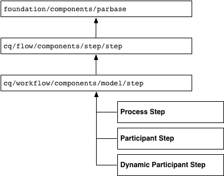
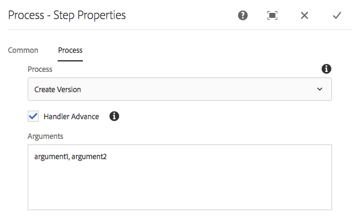
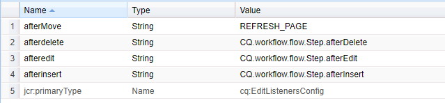
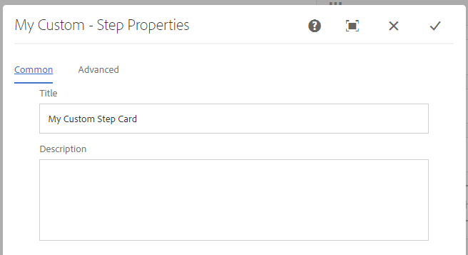

# Ampliación de la funcionalidad del flujo de trabajo{#extending-workflow-functionality}

En este tema se describe cómo desarrollar componentes de paso personalizados para los flujos de trabajo y, a continuación, cómo interactuar mediante programación con los flujos de trabajo.

La creación de un paso de flujo de trabajo personalizado implica las siguientes actividades:

* Desarrollar el componente de paso del flujo de trabajo.
* Implementar la funcionalidad de pasos como un servicio OSGi o una secuencia de comandos ECMA.

También puede [interactuar con los flujos de trabajo desde sus programas y secuencias de comandos](/help/sites-developing/workflows-program-interaction.md).

## Componentes de la etapa de flujo de trabajo: conceptos básicos {#workflow-step-components-the-basics}

Un componente de paso de flujo de trabajo define el aspecto y el comportamiento del paso al crear modelos de flujo de trabajo:

* La categoría y el nombre del paso en la barra de tareas del flujo de trabajo.
* El aspecto del paso en los modelos de flujo de trabajo.
* Cuadro de diálogo de edición para configurar las propiedades de los componentes.
* El servicio o la secuencia de comandos que se ejecutan en tiempo de ejecución.

Al igual que con [todos los componentes](/help/sites-developing/components.md), los componentes de paso de flujo de trabajo heredan del componente especificado para la `sling:resourceSuperType` propiedad. El diagrama siguiente muestra la jerarquía de `cq:component` nodos que forman la base de todos los componentes de paso del flujo de trabajo. El diagrama también incluye los componentes Etapa **de** proceso, Etapa **de** participante y Etapa **de participante** dinámica, ya que estos son los puntos de partida más comunes (y básicos) para desarrollar componentes de paso personalizados.



>[!CAUTION]
>
>No ***debe*** cambiar nada en la `/libs` ruta.
>
>Esto se debe a que el contenido de `/libs` se sobrescribe la próxima vez que actualice la instancia (y es posible que se sobrescriba al aplicar una revisión o un paquete de funciones).
>
>El método recomendado para la configuración y otros cambios es:
>
>1. Volver a crear el elemento requerido (es decir, tal como existe en `/libs` la sección `/apps`
>2. Realice los cambios en `/apps`


El `/libs/cq/workflow/components/model/step` componente es el antecesor común más cercano de la etapa **de** proceso, la etapa **de** participante y la etapa **de participante** dinámica, todos los cuales heredan los siguientes elementos:

* `step.jsp`

   La `step.jsp` secuencia de comandos procesa el título del componente de paso cuando se agrega a un modelo.

   

* [cq:dialog](/help/sites-developing/developing-components.md#creating-and-configuring-a-dialog)

   Cuadro de diálogo con las fichas siguientes:

   * **Frecuentes**: para editar el título y la descripción.
   * **Avanzado**: para editar las propiedades de notificación de correo electrónico.
    

   >[!NOTE]
   >
   >Cuando las fichas del cuadro de diálogo de edición de un componente de paso no coinciden con este aspecto predeterminado, el componente de paso tiene secuencias de comandos, propiedades de nodo o fichas de diálogo definidas que anulan estas fichas heredadas.

### Secuencias de comandos de ECMA {#ecma-scripts}

Los siguientes objetos están disponibles (según el tipo de paso) en las secuencias de comandos de ECMA:

* [WorkItem](https://helpx.adobe.com/experience-manager/6-5/sites/developing/using/reference-materials/javadoc/com/day/cq/workflow/exec/WorkItem.html) workItem
* [WorkflowSession](https://helpx.adobe.com/experience-manager/6-5/sites/developing/using/reference-materials/javadoc/com/day/cq/workflow/WorkflowSession.html) workflowSession
* [WorkflowData](https://helpx.adobe.com/experience-manager/6-5/sites/developing/using/reference-materials/javadoc/com/day/cq/workflow/exec/WorkflowData.html) workflowData
* `args`:: con los argumentos de proceso.

* `sling`:: para acceder a otros servicios de osgi.
* `jcrSession`

### MetaDataMaps {#metadatamaps}

Puede utilizar los metadatos del flujo de trabajo para conservar la información necesaria durante toda la duración del flujo de trabajo. Un requisito común de los pasos del flujo de trabajo es mantener los datos para usarlos en el futuro en el flujo de trabajo o recuperar los datos persistentes.

Existen tres tipos de objetos MetaDataMap: para `Workflow`objetos `WorkflowData` y `WorkItem` . Todos tienen el mismo propósito: almacenar metadatos.

Un elemento de trabajo tiene su propio MetaDataMap que solo se puede usar mientras se esté ejecutando ese elemento de trabajo (p. ej., step).

Los mapas de metadatos `Workflow` y `WorkflowData` se comparten en todo el flujo de trabajo. En estos casos, se recomienda utilizar únicamente el mapa de `WorkflowData` metadatos.

## Creación de componentes de paso de flujo de trabajo personalizados {#creating-custom-workflow-step-components}

Los componentes de paso de flujo de trabajo se pueden [crear del mismo modo que cualquier otro componente](/help/sites-developing/components.md).

Para heredar de uno de los componentes de paso base (existentes), agregue la siguiente propiedad al `cq:Component` nodo:

* Nombre: `sling:resourceSuperType`
* Tipo: `String`
* Valor: Una de las siguientes rutas que se resuelve en un componente base:

   * `cq/workflow/components/model/process`
   * `cq/workflow/components/model/participant`
   * `cq/workflow/components/model/dynamic_participant`

### Especificación del título y la descripción predeterminados para instancias de paso {#specifying-the-default-title-and-description-for-step-instances}

Utilice el procedimiento siguiente para especificar los valores predeterminados de los campos **Título** y **Descripción** de la ficha **Común** .

>[!NOTE]
>
>Los valores de campo aparecen en la instancia de paso cuando se cumplen los dos requisitos siguientes:
>
>* El cuadro de diálogo de edición del paso almacena el título y la descripción en las siguientes ubicaciones: >
>* `./jcr:title`
>* `./jcr:description` ubicaciones
>
>  
Este requisito se cumple cuando el cuadro de diálogo de edición utiliza la ficha Común que implementa el `/libs/cq/flow/components/step/step` componente.
>
>* El componente step o un antecesor del componente no anula la `step.jsp` secuencia de comandos que implementa el `/libs/cq/flow/components/step/step` componente.


1. Debajo del `cq:Component` nodo, agregue el nodo siguiente:

   * Nombre: `cq:editConfig`
   * Tipo: `cq:EditConfig`
   >[!NOTE]
   >
   >Para obtener más información sobre el nodo cq:editConfig, consulte [Configuración del comportamiento de edición de un componente](/help/sites-developing/developing-components.md#configuring-the-edit-behavior).

1. Debajo del `cq:EditConfig` nodo, agregue el nodo siguiente:

   * Nombre: `cq:formParameters`
   * Tipo: `nt:unstructured`

1. Agregue `String` propiedades de los siguientes nombres al `cq:formParameters` nodo:

   * `jcr:title`:: El valor rellena el campo **Título** de la ficha **Común** .
   * `jcr:description`:: El valor rellena el campo **Descripción** de la ficha **Común** .

### Guardar valores de propiedades en metadatos de flujo de trabajo {#saving-property-values-in-workflow-metadata}

>[!NOTE]
>
>Consulte [Persistencia y acceso a datos](#persisting-and-accessing-data). En concreto, para obtener información sobre el acceso al valor de propiedad en tiempo de ejecución, consulte [Acceso a los valores de propiedad de cuadro de diálogo en tiempo de ejecución](#accessing-dialog-property-values-at-runtime).

La propiedad name de `cq:Widget` los elementos especifica el nodo JCR que almacena el valor del widget. Cuando los widgets del cuadro de diálogo de componentes de paso de flujo de trabajo almacenan valores por debajo del `./metaData` nodo, el valor se agrega al flujo de trabajo `MetaDataMap`.

Por ejemplo, un campo de texto de un cuadro de diálogo es un `cq:Widget` nodo que tiene las siguientes propiedades:

| Nombre | Tipo | Value |
|---|---|---|
| `xtype` | `String` | `textarea` |
| `name` | `String` | `./metaData/subject` |
| `fieldLabel` | `String` | `Email Subject` |

El valor especificado en este campo de texto se agrega al objeto de la instancia de flujo de trabajo ` [MetaDataMap](#metadatamaps)` y se asocia a la `subject` clave.

>[!NOTE]
>
>Cuando la clave está `PROCESS_ARGS`disponible, el valor está fácilmente disponible en implementaciones de secuencias de comandos de ECMA a través de la `args` variable. En este caso, el valor de la propiedad name es `./metaData/PROCESS_ARGS.`

### Anulación de la implementación del paso {#overriding-the-step-implementation}

Cada componente de paso base permite a los desarrolladores de modelos de flujo de trabajo configurar las siguientes funciones clave en tiempo de diseño:

* Paso de proceso: El servicio o la secuencia de comandos ECMA que se va a ejecutar en tiempo de ejecución.
* Etapa del participante: ID del usuario al que se ha asignado el elemento de trabajo generado.
* Paso de participante dinámico: El servicio o la secuencia de comandos ECMA que selecciona el ID del usuario asignado al elemento de trabajo.

Para enfocar el componente para utilizarlo en un escenario de flujo de trabajo específico, configure la función clave en el diseño y elimine la posibilidad de que los desarrolladores de modelos la cambien.

1. Debajo del nodo cq:component, agregue el nodo siguiente:

   * Nombre: `cq:editConfig`
   * Tipo: `cq:EditConfig`
   Para obtener más información sobre el nodo cq:editConfig, consulte [Configuración del comportamiento de edición de un componente](/help/sites-developing/developing-components.md#configuring-the-edit-behavior).

1. Debajo del nodo cq:EditConfig, agregue el nodo siguiente:

   * Nombre: `cq:formParameters`
   * Tipo: `nt:unstructured`

1. Agregue una `String` propiedad al `cq:formParameters` nodo. El supertipo de componente determina el nombre de la propiedad:

   * Etapa del proceso: `PROCESS`
   * Etapa de participante: `PARTICIPANT`
   * Etapa de participante dinámica: `DYNAMIC_PARTICIPANT`

1. Especifique el valor de la propiedad:

   * `PROCESS`:: Ruta de acceso a la secuencia de comandos ECMA o al PID del servicio que implementa el comportamiento del paso.
   * `PARTICIPANT`:: ID del usuario al que se ha asignado el elemento de trabajo.
   * `DYNAMIC_PARTICIPANT`:: Ruta de acceso a la secuencia de comandos ECMA o al PID del servicio que selecciona al usuario para asignar el elemento de trabajo.

1. Para eliminar la capacidad de los desarrolladores de modelos de cambiar los valores de propiedad, anule el cuadro de diálogo del supertipo de componente.

### Adición de formularios y cuadros de diálogo a los pasos de los participantes {#adding-forms-and-dialogs-to-participant-steps}

Personalice el componente de paso del participante para proporcionar funciones que se encuentran en los componentes Paso [del participante en el](/help/sites-developing/workflows-step-ref.md#form-participant-step) formulario y Paso [del participante en el](/help/sites-developing/workflows-step-ref.md#dialog-participant-step) cuadro de diálogo:

* Presente un formulario al usuario cuando abra el elemento de trabajo generado.
* Presente un cuadro de diálogo personalizado al usuario cuando complete el elemento de trabajo generado.

Realice el siguiente procedimiento en el nuevo componente (consulte [Creación de componentes](#creating-custom-workflow-step-components)personalizados de paso de flujo de trabajo):

1. Debajo del `cq:Component` nodo, agregue el nodo siguiente:

   * Nombre: `cq:editConfig`
   * Tipo: `cq:EditConfig`
   Para obtener más información sobre el nodo cq:editConfig, consulte [Configuración del comportamiento de edición de un componente](/help/sites-developing/components-basics.md#edit-behavior).

1. Debajo del nodo cq:EditConfig, agregue el nodo siguiente:

   * Nombre: `cq:formParameters`
   * Tipo: `nt:unstructured`

1. Para presentar un formulario cuando el usuario abre el elemento de trabajo, agregue la siguiente propiedad al `cq:formParameters` nodo:

   * Nombre: `FORM_PATH`
   * Tipo: `String`
   * Valor: Ruta que se resuelve en el formulario

1. Para presentar un cuadro de diálogo personalizado cuando el usuario completa el elemento de trabajo, agregue la siguiente propiedad al `cq:formParameters` nodo

   * Nombre: `DIALOG_PATH`
   * Tipo: `String`
   * Valor: Ruta que se resuelve en el cuadro de diálogo

### Configuración del comportamiento del tiempo de ejecución de los pasos del flujo de trabajo {#configuring-the-workflow-step-runtime-behavior}

Debajo del `cq:Component` nodo, agregue un `cq:EditConfig` nodo. Debajo, agregue un `nt:unstructured` nodo (debe llamarse `cq:formParameters`) y a ese nodo agregue las siguientes propiedades:

* Nombre: `PROCESS_AUTO_ADVANCE`

   * Tipo: `Boolean`
   * Value:

      * cuando se configura en `true` el flujo de trabajo, se ejecutará ese paso y continuará; es el valor predeterminado y también se recomienda
      * cuándo `false`, el flujo de trabajo se ejecutará y se detendrá; esto requiere un manejo adicional, por lo que `true` se recomienda

* Nombre: `DO_NOTIFY`

   * Tipo: `Boolean`
   * Valor: indica si se deben enviar notificaciones por correo electrónico para los pasos de participación del usuario (y supone que el servidor de correo está correctamente configurado)

## Persistencia y acceso a datos {#persisting-and-accessing-data}

### Datos persistentes para pasos posteriores del flujo de trabajo {#persisting-data-for-subsequent-workflow-steps}

Puede utilizar metadatos de flujo de trabajo para conservar la información necesaria durante toda la vida del flujo de trabajo y entre pasos. Un requisito común de los pasos del flujo de trabajo es mantener los datos para su uso futuro o recuperar los datos persistentes de pasos anteriores.

Los metadatos del flujo de trabajo se almacenan en un [`MetaDataMap`](#metadatamaps) objeto. La API de Java proporciona el [`Workflow.getWorkflowData`](https://helpx.adobe.com/experience-manager/6-5/sites/developing/using/reference-materials/javadoc/com/adobe/granite/workflow/exec/Workflow.html) método para devolver un [`WorkflowData`](https://helpx.adobe.com/experience-manager/6-5/sites/developing/using/reference-materials/javadoc/com/adobe/granite/workflow/exec/WorkflowData.html) objeto que proporciona el `MetaDataMap` objeto adecuado. Este `WorkflowData` `MetaDataMap` objeto está disponible para el servicio OSGi o la secuencia de comandos ECMA de un componente de paso.

#### Java {#java}

El método execute de la `WorkflowProcess` implementación se pasa al `WorkItem` objeto. Utilice este objeto para obtener el `WorkflowData` objeto de la instancia de flujo de trabajo actual. En el siguiente ejemplo se agrega un elemento al `MetaDataMap` objeto de flujo de trabajo y, a continuación, se registra cada elemento. El elemento (&quot;mykey&quot;, &quot;My Step Value&quot;) está disponible para los pasos subsiguientes del flujo de trabajo.

```java
public void execute(WorkItem item, WorkflowSession session, MetaDataMap args) throws WorkflowException {

    MetaDataMap wfd = item.getWorkflow().getWorkflowData().getMetaDataMap();

    wfd.put("mykey", "My Step Value");

    Set<String> keyset = wfd.keySet();
    Iterator<String> i = keyset.iterator();
    while (i.hasNext()){
     Object key = i.next();
     log.info("The workflow medata includes key {} and value {}",key.toString(),wfd.get(key).toString());
    }
}
```

#### Script de ECMA {#ecma-script}

La `graniteWorkItem` variable es la representación de secuencia de comandos ECMA del objeto `WorkItem` Java actual. Por lo tanto, puede utilizar la `graniteWorkItem` variable para obtener los metadatos del flujo de trabajo. Se puede utilizar la siguiente secuencia de comandos ECMA para implementar un paso **de** `MetaDataMap` proceso para agregar un elemento al objeto de flujo de trabajo y, a continuación, registrar cada elemento. Estos elementos estarán disponibles para los pasos posteriores del flujo de trabajo.

>[!NOTE]
>
>La `metaData` variable que está disponible inmediatamente para la secuencia de comandos de paso son los metadatos del paso. Los metadatos del paso son diferentes de los metadatos del flujo de trabajo.

```
var currentDateInMillis = new Date().getTime();

graniteWorkItem.getWorkflowData().getMetaDataMap().put("hardcodedKey","theKey");

graniteWorkItem.getWorkflowData().getMetaDataMap().put("currentDateInMillisKey",currentDateInMillis);

var iterator = graniteWorkItem.getWorkflowData().getMetaDataMap().keySet().iterator();
while (iterator.hasNext()){
    var key = iterator.next();
    log.info("Workflow metadata key, value = " + key.toString() + ", " + graniteWorkItem.getWorkflowData().getMetaDataMap().get(key));
}
```

### Acceso a los valores de propiedad de cuadro de diálogo en tiempo de ejecución {#accessing-dialog-property-values-at-runtime}

El `MetaDataMap` objeto de las instancias de flujo de trabajo resulta útil para almacenar y recuperar datos durante toda la duración del flujo de trabajo. Para implementaciones de componentes de paso de flujo de trabajo, el método `MetaDataMap` es especialmente útil para recuperar valores de propiedades de componente en tiempo de ejecución.

>[!NOTE]
>
>Para obtener información sobre la configuración del cuadro de diálogo de componentes para almacenar propiedades como metadatos de flujo de trabajo, consulte [Guardar valores de propiedades en metadatos](#saving-property-values-in-workflow-metadata)de flujo de trabajo.

El flujo de trabajo `MetaDataMap` está disponible para implementaciones de procesos de secuencias de comandos de Java y ECMA:

* En implementaciones de Java de la interfaz WorkflowProcess, el `args` parámetro es el `MetaDataMap` objeto del flujo de trabajo.

* En implementaciones de secuencias de comandos de ECMA, el valor está disponible mediante las `args` variables y `metadata` .

### Ejemplo: Recuperación de los argumentos del componente Paso de proceso {#example-retrieving-the-arguments-of-the-process-step-component}

El cuadro de diálogo de edición del componente Paso **del** proceso incluye la propiedad **Argumentos** . El valor de la propiedad **Arguments** se almacena en los metadatos del flujo de trabajo y se asocia a la `PROCESS_ARGS` clave.

En el diagrama siguiente, el valor de la propiedad **Arguments** es `argument1, argument2`:



#### Java {#java-1}

El siguiente código Java es el `execute` método para una `WorkflowProcess` implementación. El método registra el valor en el `args` que está asociado con la `MetaDataMap` `PROCESS_ARGS` clave.

```java
public void execute(WorkItem item, WorkflowSession session, MetaDataMap args) throws WorkflowException {
     if (args.containsKey("PROCESS_ARGS")){
      log.info("workflow metadata for key PROCESS_ARGS and value {}",args.get("PROCESS_ARGS","string").toString());
     }
    }
```

Cuando se ejecuta un paso de proceso que utiliza esta implementación de Java, el registro contiene la siguiente entrada:

```xml
16.02.2018 12:07:39.566 *INFO* [JobHandler: /var/workflow/instances/server0/2018-02-16/model_855140139900189:/content/we-retail/de] com.adobe.example.workflow.impl.process.LogArguments workflow metadata for key PROCESS_ARGS and value argument1, argument2
```

#### Script de ECMA {#ecma-script-1}

Se utiliza la siguiente secuencia de comandos ECMA como proceso para el paso **del** proceso. Registra el número de argumentos y los valores del argumento:

```
var iterator = graniteWorkItem.getWorkflowData().getMetaDataMap().keySet().iterator();
while (iterator.hasNext()){
    var key = iterator.next();
    log.info("Workflow metadata key, value = " + key.toString() + ", " + graniteWorkItem.getWorkflowData().getMetaDataMap().get(key));
}
log.info("hardcodedKey "+ graniteWorkItem.getWorkflowData().getMetaDataMap().get("hardcodedKey"));
log.info("currentDateInMillisKey "+ graniteWorkItem.getWorkflowData().getMetaDataMap().get("currentDateInMillisKey"));
```

>[!NOTE]
>
>En esta sección se describe cómo trabajar con argumentos para los pasos del proceso. La información también se aplica a los usuarios que seleccionan participantes de forma dinámica.

>[!NOTE]
>Para ver otro ejemplo de almacenamiento de propiedades de componente en metadatos de flujo de trabajo, consulte Ejemplo: Crear un paso de flujo de trabajo de registro. Este ejemplo incluye un cuadro de diálogo que asocia el valor de los metadatos con una clave distinta de PROCESS_ARGS.

### Secuencias de comandos y argumentos de proceso {#scripts-and-process-arguments}

Dentro de una secuencia de comandos para un componente Paso **de** proceso, los argumentos están disponibles a través del `args` objeto.

Al crear un componente de paso personalizado, el objeto `metaData` está disponible en una secuencia de comandos. Este objeto está limitado a un solo argumento de cadena.

## Desarrollo de implementaciones de pasos de proceso {#developing-process-step-implementations}

Cuando se inician los pasos del proceso durante el proceso de un flujo de trabajo, los pasos envían una solicitud a un servicio OSGi o ejecutan una secuencia de comandos ECMA. Desarrolle el servicio o la secuencia de comandos ECMA que realiza las acciones que requiere su flujo de trabajo.

>[!NOTE]
>
>Para obtener información sobre la asociación del componente Paso de proceso con el servicio o la secuencia de comandos, consulte Paso [de](/help/sites-developing/workflows-step-ref.md#process-step) proceso o [Anulación de la implementación](#overriding-the-step-implementation)de paso.

### Implementación de un paso de proceso con una clase Java {#implementing-a-process-step-with-a-java-class}

Para definir un paso de proceso como un componente de servicio OSGI (paquete Java):

1. Cree el paquete e impleméntelo en el contenedor OSGI. Consulte la documentación sobre la creación de un paquete con [CRXDE Lite](/help/sites-developing/developing-with-crxde-lite.md) o [Eclipse](/help/sites-developing/howto-projects-eclipse.md).

   >[!NOTE]
   >
   >El componente OSGI debe implementar la `WorkflowProcess` interfaz con su `execute()` método. Consulte el código de ejemplo siguiente.

   >[!NOTE]
   >
   >El nombre del paquete debe agregarse a la `<*Private-Package*>` sección de la `maven-bundle-plugin` configuración.

1. Agregue la propiedad SCR `process.label` y establezca el valor según sus necesidades. Será el nombre en el que se mostrará el paso del proceso al utilizar el componente genérico Paso **del** proceso. Consulte el ejemplo siguiente.
1. En el editor **Modelos** , agregue el paso del proceso al flujo de trabajo mediante el componente genérico Paso **del** proceso.
1. En el cuadro de diálogo de edición (del paso **del** proceso), vaya a la ficha **Proceso** y seleccione la implementación del proceso.
1. Si utiliza argumentos en el código, establezca los argumentos **de proceso**. Por ejemplo: false.
1. Guarde los cambios, tanto para el paso como para el modelo de flujo de trabajo (esquina superior izquierda del editor de modelos).

Los métodos java, respectivamente, las clases que implementan el método Java ejecutable están registrados como servicios OSGI, lo que permite agregar métodos en cualquier momento durante el tiempo de ejecución.

El siguiente componente OSGI agrega la propiedad `approved` al nodo de contenido de la página cuando la carga útil es una página:

```java
package com.adobe.example.workflow.impl.process;

import com.adobe.granite.workflow.WorkflowException;
import com.adobe.granite.workflow.WorkflowSession;
import com.adobe.granite.workflow.exec.WorkItem;
import com.adobe.granite.workflow.exec.WorkflowData;
import com.adobe.granite.workflow.exec.WorkflowProcess;
import com.adobe.granite.workflow.metadata.MetaDataMap;

import org.apache.felix.scr.annotations.Component;
import org.apache.felix.scr.annotations.Property;
import org.apache.felix.scr.annotations.Service;

import org.osgi.framework.Constants;

import javax.jcr.Node;
import javax.jcr.RepositoryException;
import javax.jcr.Session;

/**
 * Sample workflow process that sets an <code>approve</code> property to the payload based on the process argument value.
 */
@Component
@Service
public class MyProcess implements WorkflowProcess {

 @Property(value = "An example workflow process implementation.")
 static final String DESCRIPTION = Constants.SERVICE_DESCRIPTION;
 @Property(value = "Adobe")
 static final String VENDOR = Constants.SERVICE_VENDOR;
 @Property(value = "My Sample Workflow Process")
 static final String LABEL="process.label";

 private static final String TYPE_JCR_PATH = "JCR_PATH";

 public void execute(WorkItem item, WorkflowSession session, MetaDataMap args) throws WorkflowException {
  WorkflowData workflowData = item.getWorkflowData();
  if (workflowData.getPayloadType().equals(TYPE_JCR_PATH)) {
   String path = workflowData.getPayload().toString() + "/jcr:content";
   try {
    Session jcrSession = session.adaptTo(Session.class);
    Node node = (Node) jcrSession.getItem(path);
    if (node != null) {
     node.setProperty("approved", readArgument(args));
     jcrSession.save();
    }
   } catch (RepositoryException e) {
    throw new WorkflowException(e.getMessage(), e);
   }
  }
 }

 private boolean readArgument(MetaDataMap args) {
  String argument = args.get("PROCESS_ARGS", "false");
  return argument.equalsIgnoreCase("true");
 }
}
```

>[!NOTE]
>
>Si el proceso falla tres veces seguidas, se coloca un elemento en la Bandeja de entrada del administrador del flujo de trabajo.

### Uso de ECMAScript {#using-ecmascript}

Las secuencias de comandos de ECMA permiten a los desarrolladores de secuencias de comandos implementar los pasos del proceso. Las secuencias de comandos se encuentran en el repositorio JCR y se ejecutan desde allí.

La siguiente tabla enumera las variables que están disponibles inmediatamente para procesar secuencias de comandos, lo que proporciona acceso a los objetos de la API de Java del flujo de trabajo.

| Clase Java | Nombre de variable de secuencia de comandos | Descripción |
|---|---|---|
| `com.adobe.granite.workflow.exec.WorkItem` | `graniteWorkItem` | La instancia de paso actual. |
| `com.adobe.granite.workflow.WorkflowSession` | `graniteWorkflowSession` | Sesión de flujo de trabajo de la instancia de paso actual. |
| `String[]` (contiene argumentos de proceso) | `args` | Los argumentos del paso. |
| `com.adobe.granite.workflow.metadata.MetaDataMap` | `metaData` | Los metadatos de la instancia de paso actual. |
| `org.apache.sling.scripting.core.impl.InternalScriptHelper` | `sling` | Proporciona acceso al entorno de tiempo de ejecución de Sling. |

La siguiente secuencia de comandos de ejemplo muestra cómo acceder al nodo JCR que representa la carga útil del flujo de trabajo. La `graniteWorkflowSession` variable se adapta a una variable de sesión JCR, que se utiliza para obtener el nodo de la ruta de carga útil.

```
var workflowData = graniteWorkItem.getWorkflowData();
if (workflowData.getPayloadType() == "JCR_PATH") {
    var path = workflowData.getPayload().toString();
    var jcrsession = graniteWorkflowSession.adaptTo(Packages.javax.jcr.Session);
    var node = jcrsession.getNode(path);
    if (node.hasProperty("approved")){
     node.setProperty("approved", args[0] == "true" ? true : false);
     node.save();
 }
}
```

La siguiente secuencia de comandos comprueba si la carga útil es una imagen ( `.png` archivo), crea una imagen en blanco y negro a partir de ella y la guarda como nodo del mismo nivel.

```
var workflowData = graniteWorkItem.getWorkflowData();
if (workflowData.getPayloadType() == "JCR_PATH") {
    var path = workflowData.getPayload().toString();
    var jcrsession = graniteWorkflowSession.adaptTo(Packages.javax.jcr.Session);
    var node = jcrsession.getRootNode().getNode(path.substring(1));
     if (node.isNodeType("nt:file") && node.getProperty("jcr:content/jcr:mimeType").getString().indexOf("image/") == 0) {
        var is = node.getProperty("jcr:content/jcr:data").getStream();
        var layer = new Packages.com.day.image.Layer(is);
        layer.grayscale();
                var parent = node.getParent();
                var gn = parent.addNode("grey" + node.getName(), "nt:file");
        var content = gn.addNode("jcr:content", "nt:resource");
                content.setProperty("jcr:mimeType","image/png");
                var cal = Packages.java.util.Calendar.getInstance();
                content.setProperty("jcr:lastModified",cal);
                var f = Packages.java.io.File.createTempFile("test",".png");
        var tout = new Packages.java.io.FileOutputStream(f);
        layer.write("image/png", 1.0, tout);
        var fis = new Packages.java.io.FileInputStream(f);
                content.setProperty("jcr:data", fis);
                parent.save();
        tout.close();
        fis.close();
        is.close();
        f.deleteOnExit();
    }
}
```

Para utilizar la secuencia de comandos:

1. Cree la secuencia de comandos (por ejemplo, con CRXDE Lite) y guárdela en el repositorio siguiente `/apps/myapp/workflow/scripts`
1. Para especificar un título que identifique la secuencia de comandos en el cuadro de diálogo de edición Paso **del** proceso, agregue las siguientes propiedades al `jcr:content` nodo de la secuencia de comandos:

   | Nombre | Tipo | Value |
   |---|---|---|
   | `jcr:mixinTypes` | `Name[]` | `mix:title` |
   | `jcr:title` | `String` | Nombre que aparecerá en el cuadro de diálogo de edición. |

1. Edite la instancia de **paso** de proceso y especifique la secuencia de comandos que se va a utilizar.

## Desarrollo de los usuarios participantes {#developing-participant-choosers}

Puede desarrollar los usuarios que seleccionen participantes para los componentes de la etapa **de participante** dinámica.

Cuando se inicia un componente de paso **de participante** dinámico durante un flujo de trabajo, el paso debe determinar el participante al que se puede asignar el elemento de trabajo generado. Para ello, realice el paso siguiente:

* envía una solicitud a un servicio OSGi
* ejecuta una secuencia de comandos ECMA para seleccionar al participante

Puede desarrollar un servicio o una secuencia de comandos ECMA que seleccione el participante según los requisitos de su flujo de trabajo.

>[!NOTE]
>
>Para obtener información sobre cómo asociar el componente de pasos **de participante** dinámico con el servicio o la secuencia de comandos, consulte Paso [de participante](/help/sites-developing/workflows-step-ref.md#dynamic-participant-step) dinámico o [Anulación de la implementación](#persisting-and-accessing-data)de paso.

### Desarrollo de un selector de participantes con una clase de Java {#developing-a-participant-chooser-using-a-java-class}

Para definir un paso de participante como un componente de servicio OSGI (clase Java):

1. El componente OSGI debe implementar la `ParticipantStepChooser` interfaz con su `getParticipant()` método. Consulte el código de ejemplo siguiente.

   Cree el paquete e impleméntelo en el contenedor OSGI.

1. Agregue la propiedad SCR `chooser.label` y establezca el valor según sea necesario. Este será el nombre en el que aparece el selector de participantes, mediante el componente Paso **de participante** dinámico. Consulte el ejemplo:

   ```java
   package com.adobe.example.workflow.impl.process;
   
   import com.adobe.granite.workflow.WorkflowException;
   import com.adobe.granite.workflow.WorkflowSession;
   import com.adobe.granite.workflow.exec.ParticipantStepChooser;
   import com.adobe.granite.workflow.exec.WorkItem;
   import com.adobe.granite.workflow.exec.WorkflowData;
   import com.adobe.granite.workflow.metadata.MetaDataMap;
   
   import org.apache.felix.scr.annotations.Component;
   import org.apache.felix.scr.annotations.Property;
   import org.apache.felix.scr.annotations.Service;
   
   import org.osgi.framework.Constants;
   
   /**
    * Sample dynamic participant step that determines the participant based on a path given as argument.
    */
   @Component
   @Service
   
   public class MyDynamicParticipant implements ParticipantStepChooser {
   
    @Property(value = "An example implementation of a dynamic participant chooser.")
    static final String DESCRIPTION = Constants.SERVICE_DESCRIPTION;
       @Property(value = "Adobe")
       static final String VENDOR = Constants.SERVICE_VENDOR;
       @Property(value = "Dynamic Participant Chooser Process")
       static final String LABEL=ParticipantStepChooser.SERVICE_PROPERTY_LABEL;
   
       private static final String TYPE_JCR_PATH = "JCR_PATH";
   
       public String getParticipant(WorkItem workItem, WorkflowSession workflowSession, MetaDataMap args) throws WorkflowException {
           WorkflowData workflowData = workItem.getWorkflowData();
           if (workflowData.getPayloadType().equals(TYPE_JCR_PATH)) {
               String path = workflowData.getPayload().toString();
               String pathFromArgument = args.get("PROCESS_ARGS", String.class);
               if (pathFromArgument != null && path.startsWith(pathFromArgument)) {
                   return "admin";
               }
           }
           return "administrators";
       }
   }
   ```

1. En el editor **Modelos** , agregue el paso de participante dinámico al flujo de trabajo mediante el componente genérico Paso **de participante** dinámico.
1. En el cuadro de diálogo de edición, seleccione la ficha Selector de **participantes** y seleccione la implementación del selector.
1. Si utiliza argumentos en el código, establezca los argumentos **de proceso**. Para este ejemplo: `/content/we-retail/de`.
1. Guarde los cambios, tanto para el paso como para el modelo de flujo de trabajo.

### Desarrollo de un selector de participantes mediante una secuencia de comandos de ECMA {#developing-a-participant-chooser-using-an-ecma-script}

Puede crear una secuencia de comandos ECMA que seleccione el usuario al que se ha asignado el elemento de trabajo que genera el paso **del** participante. La secuencia de comandos debe incluir una función denominada `getParticipant` que no requiera argumentos y devuelve un `String` ID que contenga el de un usuario o grupo.

Las secuencias de comandos se encuentran en el repositorio JCR y se ejecutan desde allí.

En la tabla siguiente se enumeran las variables que proporcionan acceso inmediato a los objetos Java del flujo de trabajo en las secuencias de comandos.

| Clase Java | Nombre de variable de secuencia de comandos |
|---|---|
| `com.adobe.granite.workflow.exec.WorkItem` | `graniteWorkItem` |
| `com.adobe.granite.workflow.WorkflowSession` | `graniteWorkflowSession` |
| `String[]` (contiene argumentos de proceso) | `args` |
| `com.adobe.granite.workflow.metadata.MetaDataMap` | `metaData` |
| `org.apache.sling.scripting.core.impl.InternalScriptHelper` | `sling` |

```
function getParticipant() {
    var workflowData = graniteWorkItem.getWorkflowData();
    if (workflowData.getPayloadType() == "JCR_PATH") {
        var path = workflowData.getPayload().toString();
        if (path.indexOf("/content/we-retail/de") == 0) {
            return "admin";
        } else {
            return "administrators";
        }
    }
}
```

1. Cree la secuencia de comandos (por ejemplo, con CRXDE Lite) y guárdela en el repositorio siguiente `/apps/myapp/workflow/scripts`
1. Para especificar un título que identifique la secuencia de comandos en el cuadro de diálogo de edición Paso **del** proceso, agregue las siguientes propiedades al `jcr:content` nodo de la secuencia de comandos:

   | Nombre | Tipo | Value |
   |---|---|---|
   | `jcr:mixinTypes` | `Name[]` | `mix:title` |
   | `jcr:title` | `String` | Nombre que aparecerá en el cuadro de diálogo de edición. |

1. Edite la instancia de paso [de participante](/help/sites-developing/workflows-step-ref.md#dynamic-participant-step) dinámico y especifique la secuencia de comandos que se va a utilizar.

## Gestión de paquetes de flujo de trabajo {#handling-workflow-packages}

[Los paquetes](/help/sites-authoring/workflows-applying.md#specifying-workflow-details-in-the-create-workflow-wizard) de flujo de trabajo se pueden pasar a un flujo de trabajo para su procesamiento. Los paquetes de flujo de trabajo contienen referencias a recursos como páginas y recursos.

>[!NOTE]
>
>Los siguientes pasos del proceso de flujo de trabajo aceptan paquetes de flujo de trabajo para la activación de página masiva:
>
>* [`com.day.cq.wcm.workflow.process.ActivatePageProcess`](https://helpx.adobe.com/experience-manager/6-5/sites/developing/using/reference-materials/javadoc/com/day/cq/wcm/workflow/process/ActivatePageProcess.html)
>* [`com.day.cq.wcm.workflow.process.DeactivatePageProcess`](https://helpx.adobe.com/experience-manager/6-5/sites/developing/using/reference-materials/javadoc/com/day/cq/wcm/workflow/process/DeactivatePageProcess.html)
>


Puede desarrollar pasos de flujo de trabajo que obtengan los recursos del paquete y los procesen. Los siguientes miembros del `com.day.cq.workflow.collection` paquete proporcionan acceso a los paquetes de flujo de trabajo:

* `ResourceCollection`:: Clase de paquete de workflow.
* `ResourceCollectionUtil`:: Se utiliza para recuperar objetos ResourceCollection.
* `ResourceCollectionManager`:: Crea y recupera colecciones. Una implementación se implementa como un servicio OSGi.

En el siguiente ejemplo, la clase Java muestra cómo obtener los recursos del paquete:

```java
package com.adobe.example;

import java.util.ArrayList;
import java.util.List;

import com.day.cq.workflow.WorkflowException;
import com.day.cq.workflow.WorkflowSession;
import com.day.cq.workflow.collection.ResourceCollection;
import com.day.cq.workflow.collection.ResourceCollectionManager;
import com.day.cq.workflow.collection.ResourceCollectionUtil;
import com.day.cq.workflow.exec.WorkItem;
import com.day.cq.workflow.exec.WorkflowData;
import com.day.cq.workflow.exec.WorkflowProcess;
import com.day.cq.workflow.metadata.MetaDataMap;

import org.apache.felix.scr.annotations.Component;
import org.apache.felix.scr.annotations.Property;
import org.apache.felix.scr.annotations.Service;
import org.apache.felix.scr.annotations.Reference;
import org.osgi.framework.Constants;

import org.slf4j.Logger;
import org.slf4j.LoggerFactory;

import javax.jcr.Node;
import javax.jcr.PathNotFoundException;
import javax.jcr.RepositoryException;
import javax.jcr.Session;

@Component
@Service
public class LaunchBulkActivate implements WorkflowProcess {

 private static final Logger log = LoggerFactory.getLogger(LaunchBulkActivate.class);

 @Property(value="Bulk Activate for Launches")
  static final String PROCESS_NAME ="process.label";
 @Property(value="A sample workflow process step to support Launches bulk activation of pages")
 static final String SERVICE_DESCRIPTION = Constants.SERVICE_DESCRIPTION;

 @Reference
 private ResourceCollectionManager rcManager;
public void execute(WorkItem workItem, WorkflowSession workflowSession) throws Exception {
    Session session = workflowSession.getSession();
    WorkflowData data = workItem.getWorkflowData();
    String path = null;
    String type = data.getPayloadType();
    if (type.equals(TYPE_JCR_PATH) && data.getPayload() != null) {
        String payloadData = (String) data.getPayload();
        if (session.itemExists(payloadData)) {
            path = payloadData;
        }
    } else if (data.getPayload() != null && type.equals(TYPE_JCR_UUID)) {
        Node node = session.getNodeByUUID((String) data.getPayload());
        path = node.getPath();
    }

    // CUSTOMIZED CODE IF REQUIRED....

    if (path != null) {
        // check for resource collection
        ResourceCollection rcCollection = ResourceCollectionUtil.getResourceCollection((Node)session.getItem(path), rcManager);
        // get list of paths to replicate (no resource collection: size == 1
        // otherwise size >= 1
        List<String> paths = getPaths(path, rcCollection);
        for (String aPath: paths) {

            // CUSTOMIZED CODE....

        }
    } else {
        log.warn("Cannot process because path is null for this " + "workitem: " + workItem.toString());
    }
}

/**
 * helper
 */
private List<String> getPaths(String path, ResourceCollection rcCollection) {
    List<String> paths = new ArrayList<String>();
    if (rcCollection == null) {
        paths.add(path);
    } else {
        log.debug("ResourceCollection detected " + rcCollection.getPath());
        // this is a resource collection. the collection itself is not
        // replicated. only its members
        try {
            List<Node> members = rcCollection.list(new String[]{"cq:Page", "dam:Asset"});
            for (Node member: members) {
                String mPath = member.getPath();
                paths.add(mPath);
            }
        } catch(RepositoryException re) {
            log.error("Cannot build path list out of the resource collection " + rcCollection.getPath());
        }
    }
    return paths;
}
}
```

## Ejemplo: Creación de un paso personalizado {#example-creating-a-custom-step}

Una forma sencilla de empezar a crear su propio paso personalizado consiste en copiar un paso existente de:

`/libs/cq/workflow/components/model`

### Creación del paso básico {#creating-the-basic-step}

1. Volver a crear la ruta en /apps; por ejemplo:

   `/apps/cq/workflow/components/model`

   Las nuevas carpetas son del tipo `nt:folder`:

   ```xml
   - apps
     - cq
       - workflow (nt:folder)
         - components (nt:folder)
           - model (nt:folder)
   ```

   >[!NOTE]
   >
   >Este paso no se aplica al editor clásico del modelo de IU.

1. A continuación, coloque el paso copiado en la carpeta /apps; por ejemplo:

   `/apps/cq/workflow/components/model/myCustomStep`

   Este es el resultado de nuestro ejemplo de paso personalizado:

   

   >[!CAUTION]
   >
   >Como en la IU estándar, solo el título y no los detalles se muestran en la tarjeta, no `details.jsp` es necesario, como era para el editor de IU clásico.

1. Aplique las siguientes propiedades al nodo:

   `/apps/cq/workflow/components/model/myCustomStep`

   **Propiedades de interés:**

   * `sling:resourceSuperType`

      Debe heredar de un paso existente.

      En este ejemplo heredamos del paso base en `cq/workflow/components/model/step`, pero puede usar otros tipos de supertipos como `participant`, `process`, etc.

   * `jcr:title`

      Es el título que se muestra cuando el componente aparece en la lista del navegador de pasos (panel izquierdo del editor de modelos de flujo de trabajo).

   * `cq:icon`

      Se utiliza para especificar un icono [](https://helpx.adobe.com/experience-manager/6-5/sites/developing/using/reference-materials/coral-ui/coralui3/Coral.Icon.html) Coral para el paso.

   * `componentGroup`

      Debe ser uno de los siguientes:

      * Flujo de trabajo de colaboración
      * Flujo de trabajo DAM
      * Flujo de trabajo de formularios
      * Proyectos
      * Flujo de trabajo de WCM
      * Flujo de trabajo
   

1. Ahora puede abrir un modelo de flujo de trabajo para editarlo. En el navegador de pasos puede filtrar para ver **Mi paso** personalizado:

   

   Al arrastrar **Mi paso** personalizado al modelo se muestra la tarjeta:

   

   Si no se `cq:icon` ha definido ningún icono para el paso, se procesa un icono predeterminado con las dos primeras letras del título. Por ejemplo:

   

#### Definición del cuadro de diálogo Configurar paso {#defining-the-step-configure-dialog}

Después de [crear el paso](#creating-the-basic-step)básico, defina el paso del cuadro de diálogo **Configurar** de la siguiente manera:

1. Configure las propiedades del nodo de la `cq:editConfig` siguiente manera:

   **Propiedades de interés:**

   * `cq:inherit`

      Cuando se establece en `true`, el componente de paso heredará propiedades del paso especificado en `sling:resourceSuperType`.

   * `cq:disableTargeting`

      Establezca la configuración según sea necesario.
   

1. Configure las propiedades del nodo de la `cq:formsParameter` siguiente manera:

   **Propiedades de interés:**

   * `jcr:title`

      Define el título predeterminado en la tarjeta de paso del mapa del modelo y en el campo **Título** del cuadro de diálogo de configuración **Mi personalizado - Propiedades** del paso.

   * También puede definir sus propias propiedades personalizadas.
   

1. Configure las propiedades en el nodo `cq:listeners`.

   El `cq:listener` nodo y sus propiedades le permiten establecer controladores de eventos que reaccionan a los eventos en el editor de modelos de interfaz de usuario táctil; como arrastrar un paso a una página de modelo o editar las propiedades de un paso.

   **Propiedades de interés:**

   * `afterMove: REFRESH_PAGE`
   * `afterdelete: CQ.workflow.flow.Step.afterDelete`
   * `afteredit: CQ.workflow.flow.Step.afterEdit`
   * `afterinsert: CQ.workflow.flow.Step.afterInsert`
   Esta configuración es esencial para el correcto funcionamiento del editor. En la mayoría de los casos, esta configuración no debe modificarse.

   Sin embargo, si se establece `cq:inherit` en true (en el `cq:editConfig` nodo, véase más arriba), se puede heredar esta configuración sin necesidad de incluirla explícitamente en la definición del paso. Si no hay ninguna herencia, deberá agregar este nodo con las siguientes propiedades y valores.

   En este ejemplo, la herencia se ha activado para que podamos eliminar el `cq:listeners` nodo y el paso seguirá funcionando correctamente.

   

1. Ahora puede agregar una instancia del paso a un modelo de flujo de trabajo. Cuando **configure** el paso, verá el cuadro de diálogo:

    

#### Ejemplo de marcado utilizado en este ejemplo {#sample-markup-used-in-this-example}

El marcado de un paso personalizado se representa en el nodo raíz `.content.xml` del componente. El ejemplo `.content.xml` utilizado para este ejemplo:

`/apps/cq/workflow/components/model/myCustomStep/.content.xml`

```xml
<?xml version="1.0" encoding="UTF-8"?>
<jcr:root xmlns:sling="https://sling.apache.org/jcr/sling/1.0" xmlns:cq="https://www.day.com/jcr/cq/1.0" xmlns:jcr="https://www.jcp.org/jcr/1.0"
    cq:icon="bell"
    jcr:primaryType="cq:Component"
    jcr:title="My Custom Step"
    sling:resourceSuperType="cq/workflow/components/model/process"
    allowedParents="[*/parsys]"
    componentGroup="Workflow"/>
```

El `_cq_editConfig.xml` ejemplo utilizado en este ejemplo:

```xml
<?xml version="1.0" encoding="UTF-8"?>
<jcr:root xmlns:cq="https://www.day.com/jcr/cq/1.0" xmlns:jcr="https://www.jcp.org/jcr/1.0" xmlns:nt="https://www.jcp.org/jcr/nt/1.0"
    cq:disableTargeting="{Boolean}true"
    cq:inherit="{Boolean}true"
    jcr:primaryType="cq:EditConfig">
    <cq:formParameters
        jcr:primaryType="nt:unstructured"
        jcr:title="My Custom Step Card"
        SAMPLE_PROPERY="sample value"/>
    <cq:listeners
        jcr:primaryType="cq:EditListenersConfig"
        afterdelete="CQ.workflow.flow.Step.afterDelete"
        afteredit="CQ.workflow.flow.Step.afterEdit"
        afterinsert="CQ.workflow.flow.Step.afterInsert"
        afterMove="REFRESH_PAGE"/>
</jcr:root>
```

El `_cq_dialog/.content.xml` ejemplo utilizado en este ejemplo:

```xml
<?xml version="1.0" encoding="UTF-8"?>
<jcr:root xmlns:sling="https://sling.apache.org/jcr/sling/1.0" xmlns:cq="https://www.day.com/jcr/cq/1.0" xmlns:jcr="https://www.jcp.org/jcr/1.0" xmlns:nt="https://www.jcp.org/jcr/nt/1.0"
    jcr:primaryType="nt:unstructured"
    jcr:title="My Custom - Step Properties"
    sling:resourceType="cq/gui/components/authoring/dialog">
    <content
        jcr:primaryType="nt:unstructured"
        sling:resourceType="granite/ui/components/coral/foundation/tabs">
        <items jcr:primaryType="nt:unstructured">
            <common
                cq:hideOnEdit="true"
                jcr:primaryType="nt:unstructured"
                jcr:title="Common"
                sling:resourceType="granite/ui/components/coral/foundation/fixedcolumns"/>
            <process
                cq:hideOnEdit="true"
                jcr:primaryType="nt:unstructured"
                jcr:title="Process"
                sling:resourceType="granite/ui/components/coral/foundation/fixedcolumns"/>
            <mycommon
                jcr:primaryType="nt:unstructured"
                jcr:title="Common"
                sling:resourceType="granite/ui/components/coral/foundation/fixedcolumns">
                <items jcr:primaryType="nt:unstructured">
                    <columns
                        jcr:primaryType="nt:unstructured"
                        sling:resourceType="granite/ui/components/coral/foundation/container">
                        <items jcr:primaryType="nt:unstructured">
                            <title
                                jcr:primaryType="nt:unstructured"
                                sling:resourceType="granite/ui/components/coral/foundation/form/textfield"
                                fieldLabel="Title"
                                name="./jcr:title"/>
                            <description
                                jcr:primaryType="nt:unstructured"
                                sling:resourceType="granite/ui/components/coral/foundation/form/textarea"
                                fieldLabel="Description"
                                name="./jcr:description"/>
                        </items>
                    </columns>
                </items>
            </mycommon>
            <advanced
                jcr:primaryType="nt:unstructured"
                jcr:title="Advanced"
                sling:resourceType="granite/ui/components/coral/foundation/fixedcolumns">
                <items jcr:primaryType="nt:unstructured">
                    <columns
                        jcr:primaryType="nt:unstructured"
                        sling:resourceType="granite/ui/components/coral/foundation/container">
                        <items jcr:primaryType="nt:unstructured">
                            <email
                                jcr:primaryType="nt:unstructured"
                                sling:resourceType="granite/ui/components/coral/foundation/form/checkbox"
                                fieldDescription="Notify user via email."
                                fieldLabel="Email"
                                name="./metaData/PROCESS_AUTO_ADVANCE"
                                text="Notify user via email."
                                value="true"/>
                        </items>
                    </columns>
                </items>
            </advanced>
        </items>
    </content>
</jcr:root>
```

>[!NOTE]
>
>Observe los nodos comunes y de proceso en la definición del cuadro de diálogo. Se heredan del paso de proceso que utilizamos como supertipo para nuestro paso personalizado:
>
>`sling:resourceSuperType : cq/workflow/components/model/process`

>[!NOTE]
>
>Los cuadros de diálogo del editor de modelos de IU clásica seguirán funcionando con el editor de IU estándar con capacidad táctil.
>
>Aunque AEM dispone de una herramienta de conversión [de](/help/sites-developing/dialog-conversion.md) cuadro de diálogo si desea actualizar los cuadros de diálogo de paso de la IU clásica a los cuadros de diálogo de la IU estándar. Después de la conversión, todavía hay algunas mejoras manuales que se pueden realizar en el cuadro de diálogo en determinados casos.
>
>* En los casos en que un cuadro de diálogo actualizado esté vacío, puede consultar los cuadros de diálogo en los `/libs` que tengan una funcionalidad similar a la de ejemplos de cómo proporcionar una solución. Por ejemplo:
   >
   >
* `/libs/cq/workflow/components/model`
>* `/libs/cq/workflow/components/workflow`
>* `/libs/dam/components`
>* `/libs/wcm/workflow/components/autoassign`
>* `/libs/cq/projects`
>
>  
No debe modificar nada en `/libs`, simplemente úselo como ejemplos. Si desea aprovechar cualquiera de los pasos existentes, cópielos `/apps` y modifíquelos allí.
