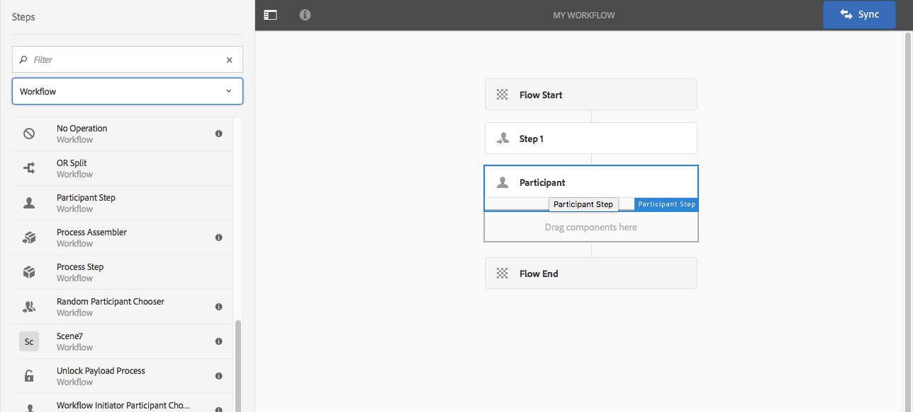

# Creación de modelos de flujo de trabajo{#creating-workflow-models}

>[!CAUTION]
>
>Para obtener información sobre el uso de la IU clásica, consulte la documentación [de](https://helpx.adobe.com/experience-manager/6-3/help/sites-developing/workflows-models.html) AEM 6.3.

Puede crear un modelo [de](/help/sites-developing/workflows.md#model) flujo de trabajo para definir la serie de pasos ejecutados cuando un usuario inicia el flujo de trabajo. También puede definir propiedades de modelo, como si el flujo de trabajo es transitorio o utiliza varios recursos.

Cuando un usuario inicia un flujo de trabajo, se inicia una instancia; este es el modelo de tiempo de ejecución correspondiente, creado al [sincronizar](#sync-your-workflow-generate-a-runtime-model) los cambios.

## Creación de un nuevo flujo de trabajo {#creating-a-new-workflow}

Cuando se crea un nuevo modelo de flujo de trabajo, éste contiene:

* Los pasos, Inicio **** de flujo y Fin **de**flujo.
Representan el principio y el final del flujo de trabajo. Estos pasos son obligatorios y no se pueden editar ni eliminar.
* Ejemplo de paso **Participante** denominado **Paso 1**.
Este paso está configurado para asignar un elemento de trabajo al iniciador del flujo de trabajo. Edite o elimine este paso, y agregue los pasos necesarios.

Para crear un nuevo flujo de trabajo con el editor:

1. Abra la consola **Modelos** de flujo de trabajo; mediante **Herramientas**, **Flujo de trabajo**, **Modelos** o, por ejemplo: [https://localhost:4502/aem/workflow](https://localhost:4502/aem/workflow)
1. Select **Create**, then **Create Model**.
1. Aparece el cuadro de diálogo **Agregar modelo** de flujo de trabajo. Introduzca el **Título** y el **Nombre** (opcional) antes de seleccionar **Finalizado**.
1. El nuevo modelo se muestra en la consola Modelos **de** flujo de trabajo.
1. Seleccione el nuevo flujo de trabajo y, a continuación, utilice [**Editar **para abrirlo y configurarlo](#editinganexistingworkflow):   

>[!NOTE]
>
>Si crea modelos mediante programación (mediante un paquete crx), también puede crear una subcarpeta dentro de:
>
>`/var/workflow/models`
>
>Por ejemplo, `/var/workflow/models/prototypes`
>
>Esta carpeta se puede utilizar para [administrar el acceso a los modelos de esa carpeta](/help/sites-administering/workflows-managing.md#create-a-subfolder-in-var-workflow-models-and-apply-the-acl-to-that).

## Edición de un flujo de trabajo {#editing-a-workflow}

Puede editar cualquier modelo de flujo de trabajo existente para:

* [definir pasos](#addingasteptoamodel-) y sus [parámetros](#configuring-a-workflow-step)
* configurar las propiedades del flujo de trabajo, incluidas [las etapas](#configuring-workflow-stages-that-show-workflow-progress), [si el flujo de trabajo es transitorio](#creatingatransientworkflow-) o [utiliza varios recursos](#configuring-a-workflow-for-multi-resource-support)

Editar un flujo de trabajo [**predeterminado y/o preexistente **(predeterminado)](#editing-a-default-or-legacy-workflow-for-the-first-time)tiene un paso adicional para garantizar que se realiza una copia[](/help/sites-developing/workflows-best-practices.md#locations-workflow-models)segura antes de realizar los cambios.

Cuando se completen las actualizaciones del flujo de trabajo, debe utilizar **Sincronizar** para **generar un modelo** de tiempo de ejecución. Consulte [Sincronizar el flujo de trabajo](#sync-your-workflow-generate-a-runtime-model) para obtener más información.

### Sincronizar el flujo de trabajo - Generar un modelo de tiempo de ejecución {#sync-your-workflow-generate-a-runtime-model}

**La sincronización** (derecha en la barra de herramientas del editor) genera un modelo [de](/help/sites-developing/workflows.md#runtime-model)tiempo de ejecución. El modelo de tiempo de ejecución es el modelo que se utiliza realmente cuando un usuario inicia un flujo de trabajo. Si no **sincroniza** los cambios, los cambios no estarán disponibles en tiempo de ejecución.

Cuando usted (o cualquier otro usuario) realice cambios en el flujo de trabajo, debe utilizar la **sincronización** para generar un modelo de tiempo de ejecución, incluso cuando los diálogos individuales (por ejemplo, para pasos) tengan sus propias opciones de guardado.

Cuando los cambios se sincronizan con el modelo de tiempo de ejecución (guardado), se muestra **Sincronizado** en su lugar.

Algunos pasos tienen campos obligatorios y/o validación integrada. Cuando no se cumplan estas condiciones, se mostrará un error al intentar **sincronizar** el modelo. Por ejemplo, cuando no se ha definido ningún participante para un paso de **participante** :


### Edición de un flujo de trabajo predeterminado o heredado por primera vez {#editing-a-default-or-legacy-workflow-for-the-first-time}

Al abrir un modelo [](/help/sites-developing/workflows.md#workflow-types) Predeterminado y/o Heredado para la edición:

* El navegador Pasos no está disponible (lado izquierdo).
* Hay una acción **Editar** disponible en la barra de herramientas (lado derecho).
* Inicialmente, el modelo y sus propiedades se presentan en modo de sólo lectura como:
   * Los flujos de trabajo predeterminados se encuentran en `/libs`
   * Los flujos de trabajo heredados se encuentran en `/etc`Seleccionar **edición** y:
* llevar una copia del flujo de trabajo a `/conf`
* hacer que el navegador de pasos esté disponible
* permitir que realice cambios

>[!NOTE]
>
>Consulte [Ubicaciones de modelos](/help/sites-developing/workflows-best-practices.md#locations-workflow-models) de flujo de trabajo para obtener más información.


### Adición de un paso a un modelo {#adding-a-step-to-a-model}

Deberá agregar pasos al modelo para representar la actividad que se va a realizar: cada paso realiza una actividad específica. Hay una selección de componentes de paso disponibles en una instancia de AEM estándar.

Cuando edita un modelo, los pasos disponibles aparecen en los distintos grupos del navegador **** Pasos. Por ejemplo:


>[!NOTE]
>
>Para obtener información sobre los componentes de paso principales instalados con AEM, consulte Referencia [de pasos](/help/sites-developing/workflows-step-ref.md)de flujo de trabajo.

Para agregar pasos al modelo de flujo de trabajo:

1. Abra un modelo de flujo de trabajo existente para editarlo. En la consola **Modelo** de flujos de trabajo, seleccione el modelo requerido y, a continuación, **Editar**.
1. Abra el navegador Pasos; con **Alternar panel** lateral, en el extremo izquierdo de la barra de herramientas superior. Aquí puede hacer lo siguiente:

   * **Filtre** para pasos específicos.
   * Utilice el selector desplegable para limitar la selección a un grupo específico de pasos.
   * Seleccione el icono Mostrar descripción  para mostrar más detalles sobre el paso adecuado.
   

1. Arrastre los pasos correspondientes a la ubicación requerida en el modelo.

   Por ejemplo, un paso **de participante**.

   Una vez agregado al flujo, puede [configurar el paso](#configuring-a-workflow-step).

   

1. Agregue tantos pasos u otras actualizaciones como sea necesario.

   En tiempo de ejecución, los pasos se ejecutan en el orden en que aparecen en el modelo. Después de agregar componentes de paso, puede arrastrarlos a otra ubicación del modelo.

   También puede copiar, cortar, pegar, agrupar o eliminar los pasos existentes; como con el editor de [páginas.](/help/sites-authoring/editing-content.md)

   Los pasos divididos también se pueden contraer o expandir con la opción de la barra de herramientas: 

1. Confirme los cambios con la **sincronización** (barra de herramientas del editor) para generar el modelo de tiempo de ejecución.

   Consulte [Sincronizar el flujo de trabajo](#sync-your-workflow-generate-a-runtime-model) para obtener más información.

### Configuración de un paso de workflow {#configuring-a-workflow-step}

Puede **configurar** y personalizar el comportamiento de un paso de flujo de trabajo mediante los cuadros de diálogo Propiedades del **paso** .

1. Para abrir el cuadro de diálogo Propiedades **del** paso para realizar un paso:

   * Toque o haga clic en el *paso* del modelo de flujo de trabajo y seleccione **Configurar** en la barra de herramientas de componentes.

   * Haga doble clic en el paso.
   >[!NOTE]
   >
   >Para obtener información sobre los componentes de paso principales instalados con AEM, consulte Referencia [de pasos](/help/sites-developing/workflows-step-ref.md)de flujo de trabajo.

1. Configure las propiedades **de** paso según sea necesario; las propiedades disponibles dependen del tipo de paso; también puede haber varias fichas disponibles. Por ejemplo, el paso **de** participante predeterminado, presente en un nuevo flujo de trabajo como `Step 1`:

   

1. Confirme sus actualizaciones con la marca.
1. Confirme los cambios con la **sincronización** (barra de herramientas del editor) para generar el modelo de tiempo de ejecución.

   Consulte [Sincronizar el flujo de trabajo](#sync-your-workflow-generate-a-runtime-model) para obtener más información.

### Creación de un flujo de trabajo transitorio {#creating-a-transient-workflow}

Puede crear un modelo de flujo de trabajo [transitorio](/help/sites-developing/workflows.md#transient-workflows) al crear un modelo nuevo o editando uno existente:

1. Abra el modelo de flujo de trabajo para [editarlo](#editinganexistingworkflow).
1. Seleccione Propiedades **del modelo** de workflow en la barra de herramientas.
1. En el cuadro de diálogo, active Flujo de trabajo **transitorio** (o desactive si es necesario):

   

1. Confirme el cambio con **Guardar y cerrar**; seguido de **Sincronizar** (barra de herramientas del editor) para generar el modelo de tiempo de ejecución.

   Consulte [Sincronizar el flujo de trabajo](#sync-your-workflow-generate-a-runtime-model) para obtener más información.

>[!NOTE]
>
>Al ejecutar un flujo de trabajo en modo [transitorio](/help/sites-developing/workflows.md#transient-workflows) , AEM no almacena ningún historial de flujo de trabajo. Por lo tanto, [Línea de tiempo](/help/sites-authoring/basic-handling.md#timeline) no muestra información relacionada con ese flujo de trabajo. [](/help/sites-authoring/basic-handling.md#timeline)

## Hacer que los modelos de flujo de trabajo estén disponibles en la IU táctil {#classic2touchui}

Si hay un modelo de flujo de trabajo en la IU clásica, pero falta en el menú emergente de selección en el carril **[!UICONTROL Línea de tiempo]** de la IU táctil, siga la configuración para que esté disponible. Los siguientes pasos ilustran el uso del modelo de flujo de trabajo llamado **[!UICONTROL Solicitud de activación]**.

1. Confirme que el modelo no está disponible en la IU táctil. Acceda a un recurso mediante `/assets.html/content/dam` la ruta. Seleccione un recurso. Abra **[!UICONTROL Línea de tiempo]** en el carril izquierdo. Haga clic en **[!UICONTROL Iniciar flujo de trabajo]** y confirme que el modelo de **[!UICONTROL solicitud de activación]** no está presente en la lista emergente.

1. Vaya a **[!UICONTROL Herramientas > General > Etiquetado]**. Seleccione **[!UICONTROL Flujo de trabajo]**.

1. Seleccione **[!UICONTROL Crear > Crear etiqueta]**. Defina **[!UICONTROL Título]** como `DAM` y **[!UICONTROL Nombre]** como `dam`. Seleccione **[!UICONTROL Enviar]**.
   

1. Vaya a **[!UICONTROL Herramientas > Flujo de trabajo > Modelos]**. Seleccione **[!UICONTROL Solicitud de activación]** y, a continuación, seleccione **[!UICONTROL Editar]**.

1. Seleccione **[!UICONTROL Editar]**, abra el menú Información **[!UICONTROL de]** página y, desde allí, seleccione **[!UICONTROL Abrir propiedades]** y vaya a la ficha **[!UICONTROL Básico]** (si no está abierto).

1. Agregar `Workflow : DAM` al campo **[!UICONTROL Etiquetas]** . Confirme la selección con la marca de verificación (visto).

1. Confirme la adición de la etiqueta con **[!UICONTROL Guardar y cerrar]**.
   

1. Complete el proceso con la **[!UICONTROL sincronización]**. El flujo de trabajo ya está disponible en la IU táctil.

### Configuración de un flujo de trabajo para compatibilidad con varios recursos {#configuring-a-workflow-for-multi-resource-support}

Puede configurar un modelo de flujo de trabajo para la compatibilidad [](/help/sites-developing/workflows.md#multi-resource-support) con varios recursos al crear un modelo nuevo o al editar uno existente:

1. Abra el modelo de flujo de trabajo para [editarlo](#editinganexistingworkflow).
1. Seleccione Propiedades **del modelo** de workflow en la barra de herramientas.

1. En el cuadro de diálogo, active **Multi Resource Support** (o desactive si es necesario):

   

1. Confirme el cambio con **Guardar y cerrar**; seguido de **Sincronizar** (barra de herramientas del editor) para generar el modelo de tiempo de ejecución.

   Consulte [Sincronizar el flujo de trabajo](#sync-your-workflow-generate-a-runtime-model) para obtener más información.

### Configuración de las etapas del flujo de trabajo (que muestran el progreso del flujo de trabajo) {#configuring-workflow-stages-that-show-workflow-progress}

[Las fases](/help/sites-developing/workflows.md#workflow-stages) de flujo de trabajo ayudan a visualizar el progreso de un flujo de trabajo al administrar tareas.

>[!CAUTION]
>
>Si las etapas del flujo de trabajo están definidas en Propiedades **de** página, pero no se utilizan en ninguno de los pasos del flujo de trabajo, la barra de progreso no mostrará ningún progreso (independientemente del paso actual del flujo de trabajo).

Las etapas que estarán disponibles se definen en los modelos de flujo de trabajo; los modelos de flujo de trabajo existentes se pueden actualizar para incluir definiciones de etapas. Puede definir cualquier número de etapas para el modelo de flujo de trabajo.

Para definir **las fases** del flujo de trabajo:

1. Abra el modelo de flujo de trabajo para editarlo.
1. Seleccione Propiedades **del modelo** de workflow en la barra de herramientas. A continuación, abra la ficha **Etapas** .
1. Agregue (y coloque) las **etapas** requeridas. Puede definir cualquier número de etapas para el modelo de flujo de trabajo.

   Por ejemplo:

   

1. Haga clic en **Guardar y cerrar** para guardar las propiedades.
1. Asigne una etapa a cada uno de los pasos del modelo de flujo de trabajo. Por ejemplo:

   

   Se puede asignar un escenario a más de un paso. Por ejemplo:

   | **Etapa** | **Escenario** |
   |---|---|
   | Etapa 1 | Crear |
   | Etapa 2 | Crear |
   | Etapa 3 | Crítica |
   | Etapa 4 | Aprobar |
   | Etapa 5 | Aprobar |
   | Etapa 6 | Completar |

1. Confirme los cambios con la **sincronización** (barra de herramientas del editor) para generar el modelo de tiempo de ejecución.

   Consulte [Sincronizar el flujo de trabajo](#sync-your-workflow-generate-a-runtime-model) para obtener más información.

## Exportación de un modelo de workflow en un paquete {#exporting-a-workflow-model-in-a-package}

Para exportar un modelo de flujo de trabajo en un paquete:

1. Cree un nuevo paquete mediante el Administrador de [paquetes](/help/sites-administering/package-manager.md#package-manager):

   1. Vaya al Administrador de paquetes mediante **Herramientas**, **Implementación** y **Paquetes**.

   1. Haga clic en **Crear paquete**.
   1. Especifique el nombre del **paquete** y cualquier otro detalle según sea necesario.
   1. Haga clic en **Aceptar**.

1. Haga clic en **Editar** en la barra de herramientas del nuevo paquete.

1. Open the **Filters** tab.

1. Seleccione **Agregar filtro** y especifique la ruta del *diseño* del modelo de flujo de trabajo:

   `/conf/global/settings/workflow/models/<*your-model-name*>`

   Haga clic en **Finalizado**.

1. Seleccione **Agregar filtro** y especifique la ruta del modelo de flujo de trabajo de *tiempo de ejecución* :

   `/var/workflow/models/<*your-model-name*>`

   Haga clic en **Finalizado**.

1. Agregue filtros adicionales para cualquier secuencia de comandos personalizada que utilice el modelo.
1. Haga clic en **Guardar** para confirmar las definiciones del filtro.
1. Seleccione **Generar** en la barra de herramientas de la definición del paquete.
1. Seleccione **Descargar** en la barra de herramientas del paquete.

## Uso de flujos de trabajo para procesar envíos de formularios {#using-workflows-to-process-form-submissions}

Puede configurar un formulario para que lo procese el flujo de trabajo seleccionado. Cuando los usuarios envían el formulario, se crea una nueva instancia de flujo de trabajo con los datos del envío del formulario como carga útil.

Para configurar el flujo de trabajo que se utilizará con el formulario:

1. Cree una nueva página y ábrala para editarla.
1. Add a **Form** component to the page.
1. **Configure** el componente Inicio **de** formulario que aparece en la página.
1. Utilice **Iniciar flujo de trabajo** para seleccionar el flujo de trabajo deseado de entre los disponibles:

   

1. Confirme la nueva configuración del formulario con la marca de verificación.

## Comprobación de flujos de trabajo {#testing-workflows}

Es una buena práctica, al probar un flujo de trabajo, utilizar diversos tipos de carga útil; incluir tipos distintos de los tipos para los que se ha desarrollado. Por ejemplo, si desea que el flujo de trabajo se ocupe de los recursos, pruébelo configurando una página como carga útil y asegúrese de que no arroja errores.

Por ejemplo, pruebe el nuevo flujo de trabajo de la siguiente manera:

1. [Inicie el modelo](/help/sites-administering/workflows-starting.md) de flujo de trabajo desde la consola.
1. Defina la **carga útil** y confirme.

1. Realice las acciones necesarias para que el flujo de trabajo continúe.
1. Monitoree los archivos de registro mientras se ejecuta el flujo de trabajo.

También puede configurar AEM para que muestre los mensajes **DEBUG** en los archivos de registro. Consulte [Registro](/help/sites-deploying/configure-logging.md) para obtener más información y, cuando termine el desarrollo, vuelva a establecer el nivel **** de registro en **Información**.

## Ejemplos {#examples}

### Ejemplo: Creación de un flujo de trabajo (simple) para aceptar o rechazar una solicitud de publicación {#example-creating-a-simple-workflow-to-accept-or-reject-a-request-for-publication}

Para ilustrar algunas de las posibilidades de crear un flujo de trabajo, en el siguiente ejemplo se crea una variación del `Publish Example` flujo de trabajo.

1. [Cree un nuevo modelo](#creating-a-new-workflow)de flujo de trabajo.

   El nuevo flujo de trabajo contendrá:

   * **Inicio de flujo**
   * `Step 1`
   * **Fin de flujo**

1. Eliminar `Step 1` (ya que es un tipo de paso incorrecto para este ejemplo):

   * Haga clic en el paso y seleccione **Eliminar** en la barra de herramientas de componentes. Confirme la acción.

1. En la selección de **Flujo de trabajo** del navegador de pasos, arrastre un Paso **de** participante al flujo de trabajo y colóquelo entre Inicio **de** flujo y Fin **de** flujo.
1. Para abrir el cuadro de diálogo de propiedades:

   * Haga clic en el paso del participante y seleccione **Configurar** en la barra de herramientas de componentes.
   * Haga doble clic en el paso del participante.

1. En la ficha **Común** , introduzca `Validate Content` tanto el **Título** como la **Descripción**.
1. Abra la ficha **Usuario/Grupo** :

   * Activate **Notify user via email**.
   * Seleccione `Administrator` ( `admin`) para el campo **Usuario/Grupo** .
   >[!NOTE]
   >
   >Para que se envíen correos electrónicos, es necesario configurar [el servicio](/help/sites-administering/notification.md)de correo y los detalles de la cuenta de usuario.

1. Confirme las actualizaciones con la marca de verificación.

   Volverá a la descripción general del modelo de flujo de trabajo, donde se cambiará el nombre del paso del participante a `Validate Content`.

1. Arrastre una división **** O al flujo de trabajo y colóquelo entre `Validate Content` y **Flujo final**.
1. Abra la configuración **Dividir** O.
1. Configurar:

   * **Frecuentes**: especifique el nombre dividido.
   * **Rama 1**: seleccione Ruta **** predeterminada.

   * **Rama 2**: asegúrese de que la ruta **** predeterminada no está seleccionada.

1. Confirme sus actualizaciones en el **OR Split**.
1. Arrastre un paso **de** participante a la rama izquierda, abra las propiedades, especifique los valores siguientes y confirme los cambios:

   * **Título**: `Reject Publish Request`

   * **Usuario/Grupo**: por ejemplo, `projects-administrators`

   * **Notificar al usuario por correo electrónico**: Active esta opción para que el usuario reciba una notificación por correo electrónico.

1. Arrastre un paso **de** proceso a la rama derecha, abra las propiedades, especifique los valores siguientes y confirme los cambios:

   * **Título**: `Publish Page as Requested`

   * **Proceso**: seleccione `Activate Page`. Este proceso publica la página seleccionada en las instancias del editor.

1. Haga clic en **Sincronizar** (barra de herramientas del editor) para generar el modelo de tiempo de ejecución.

   Consulte [Sincronizar el flujo de trabajo](#sync-your-workflow-generate-a-runtime-model) para obtener más información.

   El nuevo modelo de flujo de trabajo tendrá este aspecto:

   

1. Aplique este flujo de trabajo a la página para que cuando el usuario pase a **Completar** el paso **Validar contenido** , pueda seleccionar si desea **publicar la página como solicitada** o **rechazar la solicitud** de publicación.

   

### Ejemplo: Definición de una regla para una división O utilizando una secuencia de comandos ECMA {#defineruleecmascript}

**O bien, los pasos de división** permiten introducir rutas de procesamiento condicionales en el flujo de trabajo.

Para definir una regla O, siga este procedimiento:

1. Cree dos secuencias de comandos y guárdelas en el repositorio, por ejemplo en:

   `/apps/myapp/workflow/scripts`

   >[!NOTE]
   >
   >Las secuencias de comandos deben tener una [función `check()`](#function-check) que devuelva un valor booleano.

1. Edite el flujo de trabajo y añada la división **** O al modelo.
1. Edite las propiedades de la **rama 1** de la división **O**:

   * Defina esto como la Ruta **** predeterminada estableciendo el **Valor** en `true`.

   * Como **regla**, establezca la ruta de acceso a la secuencia de comandos. Por ejemplo:
      `/apps/myapp/workflow/scripts/myscript1.ecma`
   >[!NOTE]
   >
   >Si es necesario, puede cambiar el orden de ramificación.

1. Edite las propiedades de la **rama 2** de la división **O**.

   * Como **Regla**, establezca la ruta de acceso a la otra secuencia de comandos. Por ejemplo:
      `/apps/myapp/workflow/scripts/myscript2.ecma`

1. Configure las propiedades de los pasos individuales de cada rama. Asegúrese de que el **usuario/grupo** está establecido.
1. Haga clic en **Sincronizar** (barra de herramientas del editor) para mantener los cambios en el modelo de tiempo de ejecución.

   Consulte [Sincronizar el flujo de trabajo](#sync-your-workflow-generate-a-runtime-model) para obtener más información.

#### Function Check() {#function-check}

>[!NOTE]
>
>Consulte [Uso de ECMAScript](/help/sites-developing/workflows-customizing-extending.md#using-ecmascript).

La siguiente secuencia de comandos de ejemplo devuelve `true` si el nodo está `JCR_PATH` ubicado en `/content/we-retail/us/en`:

```
function check() {
    if (workflowData.getPayloadType() == "JCR_PATH") {
      var path = workflowData.getPayload().toString();
      var node = jcrSession.getItem(path);

      if (node.getPath().indexOf("/content/we-retail/us/en") >= 0) {
       return true;
      } else {
       return false;
      }
     } else {
      return false;
     }
}
```

### Ejemplo: Solicitud de activación personalizada {#example-customized-request-for-activation}

Puede personalizar cualquiera de los flujos de trabajo integrados. Para tener un comportamiento personalizado, superponga los detalles del flujo de trabajo adecuado.

Por ejemplo, **Solicitud de activación**. Este flujo de trabajo se utiliza para publicar páginas dentro de **sitios** y se activa automáticamente cuando un autor de contenido no tiene los derechos de replicación adecuados. Consulte [Personalización de la creación de páginas: personalización del flujo de trabajo](/help/sites-developing/customizing-page-authoring-touch.md#customizing-the-request-for-activation-workflow) de solicitud de activación para obtener más información.
