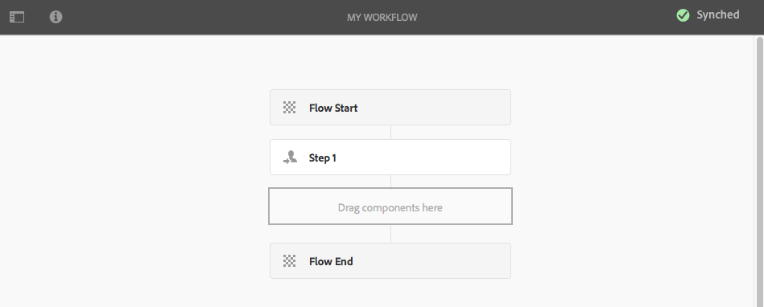

# Creación de modelos de flujo de trabajo{#creating-workflow-models}

>[!CAUTION]
>
>AEM Para usar la IU clásica, consulte la [documentación de.3](https://helpx.adobe.com/experience-manager/6-3/help/sites-developing/workflows-models.html) como referencia.

Usted crea un [modelo de flujo de trabajo](/help/sites-developing/workflows.md#model) para definir la serie de pasos que se ejecutan cuando un usuario inicia el flujo de trabajo. También puede definir propiedades del modelo, como, por ejemplo, si el flujo de trabajo es transitorio o utiliza varios recursos. 

Cuando un usuario inicia un flujo de trabajo, se inicia una instancia; este es el modelo de tiempo de ejecución correspondiente, creado al [sincronizar](#sync-your-workflow-generate-a-runtime-model) los cambios.

## Creación de un nuevo flujo de trabajo {#creating-a-new-workflow}

La primera vez que cree un modelo del flujo de trabajo, contendrá:

* Los pasos **Inicio de flujo** y **Fin de flujo**.
Representan el principio y el final del flujo de trabajo. Estos pasos son obligatorios y no se pueden editar ni eliminar.
* Un ejemplo de **participante** paso denominado **Paso 1**.
Este paso está configurado para asignar un elemento de trabajo al iniciador del flujo de trabajo. Edite o elimine este paso y agregue los pasos necesarios.

Para crear un flujo de trabajo con el editor:

1. Abra la consola **Modelos de flujo de trabajo**; a través de **Herramientas**, **Flujo de trabajo**, **Modelos** o, por ejemplo: [https://localhost:4502/aem/workflow](https://localhost:4502/aem/workflow)
1. Seleccione **Crear** y luego **Crear modelo**.
1. Aparecerá el cuadro de diálogo **Agregar modelo de flujo de trabajo**. Escriba **Title** y **Name** (opcional) antes de seleccionar **Listo**.
1. El nuevo modelo aparece en la consola **Modelos de flujo de trabajo**.
1. Seleccione el nuevo flujo de trabajo y luego use [**Editar** para abrirlo y configurarlo](#editinganexistingworkflow):
   

>[!NOTE]
>
>Si crea modelos mediante programación (mediante un paquete crx), también puede crear una subcarpeta dentro de:
>
>`/var/workflow/models`
>
>Por ejemplo, `/var/workflow/models/prototypes`
>
>Esta carpeta se puede usar para [administrar el acceso a los modelos de esa carpeta](/help/sites-administering/workflows-managing.md#create-a-subfolder-in-var-workflow-models-and-apply-the-acl-to-that).

## Edición de un flujo de trabajo {#editing-a-workflow}

Puede editar cualquier modelo de flujo de trabajo existente para:

* [definir pasos](#addingasteptoamodel-) y sus [parámetros](#configuring-a-workflow-step)
* configure las propiedades del flujo de trabajo, incluidas las [fases](#configuring-workflow-stages-that-show-workflow-progress), [si el flujo de trabajo es transitorio](#creatingatransientworkflow-) o [utiliza varios recursos](#configuring-a-workflow-for-multi-resource-support)

Editar un flujo de trabajo [**predeterminado o heredado** (predeterminado)](#editing-a-default-or-legacy-workflow-for-the-first-time) tiene un paso adicional para garantizar que se realice una [copia segura](/help/sites-developing/workflows-best-practices.md#locations-workflow-models) antes de realizar los cambios.

Cuando se hayan completado las actualizaciones del flujo de trabajo, debe usar **Sync** para **generar un modelo en tiempo de ejecución**. Consulte [Sincronizar el flujo de trabajo](#sync-your-workflow-generate-a-runtime-model) para obtener más información.

### Sincronizar el flujo de trabajo: generar un modelo de tiempo de ejecución {#sync-your-workflow-generate-a-runtime-model}

**Sync** (derecho en la barra de herramientas del editor) genera un [modelo de tiempo de ejecución](/help/sites-developing/workflows.md#runtime-model). El modelo de tiempo de ejecución es el modelo que se utiliza realmente cuando un usuario inicia un flujo de trabajo. Si no **sincroniza** los cambios, no estarán disponibles durante la ejecución.

Cuando usted (o cualquier otro usuario) realice cambios en el flujo de trabajo, debe utilizar **Sync** para generar un modelo de tiempo de ejecución, incluso cuando los cuadros de diálogo individuales (por ejemplo, para los pasos) tengan sus propias opciones de guardado.

Cuando los cambios se sincronizan con el modelo de tiempo de ejecución (guardado), se muestra **Sincronizado** en su lugar.

Algunos pasos tienen campos obligatorios o validación integrada. Cuando no se cumplen estas condiciones, se muestra un error al intentar **sincronizar** el modelo. Por ejemplo, cuando no se ha definido ningún participante para un paso de **Participante**:


### Edición de un flujo de trabajo predeterminado o heredado por primera vez {#editing-a-default-or-legacy-workflow-for-the-first-time}

Cuando abra un [modelo predeterminado o heredado](/help/sites-developing/workflows.md#workflow-types) para editarlo:

* El navegador de pasos no está disponible (lado izquierdo).
* Hay una acción **Edit** disponible en la barra de herramientas (lado derecho).
* Inicialmente, el modelo y sus propiedades se presentan en modo de solo lectura como:
   * Los flujos de trabajo predeterminados están en `/libs`
   * Los flujos de trabajo heredados están en `/etc`
Si selecciona **Editar**:
* tomar una copia del flujo de trabajo en `/conf`
* Hacer que el explorador de Pasos esté disponible
* permite realizar cambios

>[!NOTE]
>
>Consulte [Ubicaciones de modelos de flujo de trabajo](/help/sites-developing/workflows-best-practices.md#locations-workflow-models) para obtener más información.


### Adición de un paso a un modelo {#adding-a-step-to-a-model}

Agregue pasos al modelo para representar la actividad que desea realizar: cada paso realiza una actividad específica. AEM Hay una selección de componentes de paso disponibles en una instancia de estándar.

Cuando edita un modelo, los pasos disponibles aparecen en los distintos grupos del explorador de **Pasos**. Por ejemplo:


>[!NOTE]
>
>AEM Para obtener información acerca de los componentes de paso principales instalados con el, vea [Pasos de flujo de trabajo de referencia](/help/sites-developing/workflows-step-ref.md).

Para agregar pasos al modelo de flujo de trabajo:

1. Abra un modelo de flujo de trabajo existente para editarlo. En la consola **Modelo de flujos de trabajo**, seleccione el modelo requerido y, a continuación, **Editar**.
1. Abra el explorador de pasos con **Alternar panel lateral**, en el extremo izquierdo de la barra de herramientas superior. Aquí puede hacer lo siguiente:

   * **Filtrar** por pasos específicos.
   * Utilice el selector desplegable para limitar la selección a un grupo específico de pasos.
   * Seleccione el icono Mostrar descripción  para mostrar más detalles acerca del paso apropiado.

   

1. Arrastre los pasos adecuados a la ubicación requerida en el modelo.

   Por ejemplo, un **paso de participante**.

   Una vez agregado al flujo, puede [configurar el paso](#configuring-a-workflow-step).

   

1. Añada tantos pasos u otras actualizaciones como sea necesario.

   En tiempo de ejecución, los pasos se ejecutan en el orden en que aparecen en el modelo. Después de añadir componentes de paso, puede arrastrarlos a una ubicación diferente en el modelo.

   También puede copiar, cortar, pegar, agrupar o eliminar pasos existentes; como con el [editor de páginas.](/help/sites-authoring/editing-content.md)

   Los pasos de división también se pueden contraer o expandir mediante la opción de la barra de herramientas: 

1. Confirme los cambios con **Sync** (barra de herramientas del editor) para generar el modelo de tiempo de ejecución.

   Consulte [Sincronizar el flujo de trabajo](#sync-your-workflow-generate-a-runtime-model) para obtener más información.

### Configuración de un paso de flujo de trabajo {#configuring-a-workflow-step}

Puede **Configurar** y personalizar el comportamiento de un paso del flujo de trabajo mediante los cuadros de diálogo de **Propiedades del paso**.

1. Para abrir el cuadro de diálogo **Propiedades del paso** para un paso, haga lo siguiente:

   * Haga clic en el paso* * del modelo de flujo de trabajo y seleccione **Configurar** en la barra de herramientas de componentes.

   * Haga doble clic en el paso.

   >[!NOTE]
   >
   >AEM Para obtener información acerca de los componentes de paso principales instalados con el, vea [Pasos de flujo de trabajo de referencia](/help/sites-developing/workflows-step-ref.md).

1. Configure las **Propiedades del paso** según sea necesario; las propiedades disponibles dependen del tipo de paso; también puede haber varias pestañas disponibles. Por ejemplo, el **Paso de participante** predeterminado, presente en un nuevo flujo de trabajo como `Step 1`:

   

1. Confirme las actualizaciones con la marca de verificación.
1. Confirme los cambios con **Sync** (barra de herramientas del editor) para generar el modelo de tiempo de ejecución.

   Consulte [Sincronizar el flujo de trabajo](#sync-your-workflow-generate-a-runtime-model) para obtener más información.

### Creación de un flujo de trabajo transitorio {#creating-a-transient-workflow}

Puede crear un modelo de flujo de trabajo [Transient](/help/sites-developing/workflows.md#transient-workflows) al crear un modelo o al editar uno existente:

1. Abra el modelo de flujo de trabajo para [editar](#editinganexistingworkflow).
1. Seleccione **Propiedades del modelo de flujo de trabajo** en la barra de herramientas.
1. En el cuadro de diálogo, active **Flujo de trabajo transitorio** (o desactívelo si es necesario):

   

1. Confirme el cambio con **Guardar y cerrar**; seguido de **Sincronizar** (barra de herramientas del editor) para generar el modelo de tiempo de ejecución.

   Consulte [Sincronizar el flujo de trabajo](#sync-your-workflow-generate-a-runtime-model) para obtener más información.

>[!NOTE]
>
>AEM Cuando se ejecuta un flujo de trabajo en modo [transitorio](/help/sites-developing/workflows.md#transient-workflows), el modo no almacena ningún historial de flujo de trabajo. Por lo tanto, [Cronología](/help/sites-authoring/basic-handling.md#timeline) no muestra ninguna información relacionada con ese flujo de trabajo.

## Hacer que los modelos de flujo de trabajo estén disponibles en la IU táctil {#classic2touchui}

Si un modelo de flujo de trabajo está presente en la IU clásica pero no aparece en el menú emergente de selección del carril **[!UICONTROL Cronología]** de la IU táctil, siga la configuración para que esté disponible. Los pasos siguientes ilustran el uso del modelo de flujo de trabajo denominado **[!UICONTROL Solicitud de activación]**.

1. Confirme que el modelo no esté disponible en la IU táctil. Obtener acceso a un recurso mediante la ruta de acceso `/assets.html/content/dam`. Seleccione un recurso. Abra **[!UICONTROL Cronología]** en el carril izquierdo. Haga clic en **[!UICONTROL Iniciar flujo de trabajo]** y confirme que el modelo **[!UICONTROL Solicitud de activación]** no está presente en la lista emergente.

1. Navegue por **[!UICONTROL Herramientas > General > Etiquetado]**. Seleccione **[!UICONTROL Flujo de trabajo]**.

1. Seleccione **[!UICONTROL Crear > Crear etiqueta]**. Establezca **[!UICONTROL Title]** como `DAM` y **[!UICONTROL Name]** como `dam`. Seleccione **[!UICONTROL Enviar]**.
   

1. Vaya a **[!UICONTROL Herramientas > Flujo de trabajo > Modelos]**. Seleccione **[!UICONTROL Solicitud de activación]** y luego seleccione **[!UICONTROL Editar]**.

1. Seleccione **[!UICONTROL Editar]**, abra el menú **[!UICONTROL Información de la página]** y, desde allí, seleccione **[!UICONTROL Abrir propiedades]** y vaya a la pestaña **[!UICONTROL Básico]** (si no está ya abierta).

1. Agregar `Workflow : DAM` al campo **[!UICONTROL Etiquetas]**. Confirme la selección con la marca de verificación.

1. Confirme la adición de la etiqueta con **[!UICONTROL Guardar y cerrar]**.
   

1. Completa el proceso con **[!UICONTROL Sync]**. El flujo de trabajo ahora está disponible en la interfaz de usuario táctil.

### Configuración de un flujo de trabajo para la compatibilidad con varios recursos {#configuring-a-workflow-for-multi-resource-support}

Puede configurar un modelo de flujo de trabajo para [Compatibilidad con varios recursos](/help/sites-developing/workflows.md#multi-resource-support) al crear un modelo o al editar uno existente:

1. Abra el modelo de flujo de trabajo para [editar](#editinganexistingworkflow).
1. Seleccione **Propiedades del modelo de flujo de trabajo** en la barra de herramientas.

1. En el cuadro de diálogo, active **Compatibilidad con varios recursos** (o desactívela si es necesario):

   

1. Confirme el cambio con **Guardar y cerrar**; seguido de **Sincronizar** (barra de herramientas del editor) para generar el modelo de tiempo de ejecución.

   Consulte [Sincronizar el flujo de trabajo](#sync-your-workflow-generate-a-runtime-model) para obtener más información.

### Configuración de fases del flujo de trabajo (que muestran el progreso del flujo de trabajo) {#configuring-workflow-stages-that-show-workflow-progress}

[Fases del flujo de trabajo](/help/sites-developing/workflows.md#workflow-stages) ayudan a visualizar el progreso de un flujo de trabajo al administrar tareas.

>[!CAUTION]
>
>Si las fases del flujo de trabajo están definidas en **Propiedades de página**, pero no se utilizan para ninguno de los pasos del flujo de trabajo, la barra de progreso no mostrará ningún progreso (independientemente del paso del flujo de trabajo actual).

Las fases que van a estar disponibles se definen en los modelos de flujo de trabajo; los modelos de flujo de trabajo existentes se pueden actualizar para incluir definiciones de fases. Puede definir cualquier número de fases para el modelo de flujo de trabajo.

Para definir **Stages** para su flujo de trabajo:

1. Abra el modelo de flujo de trabajo para editarlo.
1. Seleccione **Propiedades del modelo de flujo de trabajo** en la barra de herramientas. A continuación, abra la ficha **Fases**.
1. Agregue (y coloque) sus **etapas** requeridas. Puede definir cualquier número de fases para el modelo de flujo de trabajo.

   Por ejemplo:

   

1. Haga clic en **Guardar y cerrar** para guardar las propiedades.
1. Asigne una fase a cada uno de los pasos del modelo de flujo de trabajo. Por ejemplo:

   

   Se puede asignar una fase a más de un paso. Por ejemplo:

   | **Paso** | **Fase** |
   |---|---|
   | Etapa 1 | Crear |
   | Etapa 2 | Crear |
   | Etapa 3 | Revisión |
   | Etapa 4 | Aprobar |
   | Etapa 5 | Aprobar |
   | Etapa 6 | Completado |

1. Confirme los cambios con **Sync** (barra de herramientas del editor) para generar el modelo de tiempo de ejecución.

   Consulte [Sincronizar el flujo de trabajo](#sync-your-workflow-generate-a-runtime-model) para obtener más información.

## Exportación de un modelo de flujo de trabajo en un paquete {#exporting-a-workflow-model-in-a-package}

Para exportar un modelo de flujo de trabajo en un paquete:

1. Cree un paquete con el [Administrador de paquetes](/help/sites-administering/package-manager.md#package-manager):

   1. Vaya al Administrador de paquetes mediante **Herramientas**, **Implementación**, **Paquetes**.

   1. Haga clic en **Crear paquete**.
   1. Especifique **Nombre del paquete** y cualquier otro detalle según sea necesario.
   1. Haga clic en **OK**.

1. Haga clic en **Editar** en la barra de herramientas del nuevo paquete.

1. Abra la ficha **Filtros**.

1. Seleccione **Agregar filtro** y especifique la ruta del modelo de flujo de trabajo *diseño*:

   `/conf/global/settings/workflow/models/<*your-model-name*>`

   Haga clic en **Listo**.

1. Seleccione **Agregar filtro** y especifique la ruta de su modelo de flujo de trabajo *runtime*:

   `/var/workflow/models/<*your-model-name*>`

   Haga clic en **Listo**.

1. Añada filtros adicionales para cualquier script personalizado que utilice el modelo.
1. Haga clic en **Guardar** para confirmar las definiciones del filtro.
1. Seleccione **Build** en la barra de herramientas de su definición de paquete.
1. Seleccione **Descargar** en la barra de herramientas de paquetes.

## Usar flujos de trabajo para procesar envíos de formularios {#using-workflows-to-process-form-submissions}

Puede configurar un formulario para que el flujo de trabajo seleccionado lo procese. Cuando los usuarios envían el formulario, se crea una nueva instancia de flujo de trabajo con los datos del envío del formulario como carga útil.

Para configurar el flujo de trabajo que se utilizará con el formulario:

1. Cree una página y ábrala para editarla.
1. Agregue un componente **Form** a la página.
1. **Configurar** el componente **Inicio de formulario** que apareció en la página.
1. Use **Iniciar flujo de trabajo** para seleccionar el flujo de trabajo deseado entre los que están disponibles:

   

1. Confirme la nueva configuración del formulario con la marca de verificación.

## Prueba de flujos de trabajo {#testing-workflows}

Se recomienda probar un flujo de trabajo para utilizar una variedad de tipos de carga útil, incluidos tipos que son diferentes al tipo para el que se ha desarrollado. Por ejemplo, si desea que el flujo de trabajo gestione Assets, pruébelo configurando una página como carga útil y asegúrese de que no genere errores.

Por ejemplo, pruebe el nuevo flujo de trabajo de la siguiente manera:

1. [Inicie su modelo de flujo de trabajo](/help/sites-administering/workflows-starting.md) desde la consola.
1. Defina **Payload** y confirme.

1. Realice las acciones necesarias para que el flujo de trabajo continúe.
1. Supervise los archivos de registro mientras se ejecuta el flujo de trabajo.

AEM También puede configurar la visualización de mensajes de **DEBUG** en los archivos de registro mediante la configuración de la configuración de la configuración. Consulte [Registro](/help/sites-deploying/configure-logging.md) para obtener más información y, cuando finalice el desarrollo, vuelva a establecer el **Nivel de registro** en **Información**.

## Ejemplos {#examples}

### Ejemplo: Creación de un flujo de trabajo (simple) para aceptar o rechazar una solicitud de publicación {#example-creating-a-simple-workflow-to-accept-or-reject-a-request-for-publication}

Para ilustrar algunas de las posibilidades de creación de un flujo de trabajo, en el siguiente ejemplo se crea una variación del flujo de trabajo `Publish Example`.

1. [Crear un modelo de flujo de trabajo](#creating-a-new-workflow).

   El nuevo flujo de trabajo contendrá:

   * **Inicio de flujo**
   * `Step 1`
   * **Fin de flujo**

1. Eliminar `Step 1` (ya que es el tipo de paso incorrecto para este ejemplo):

   * Haga clic en el paso y seleccione **Eliminar** de la barra de herramientas de componentes. Confirme la acción.

1. Desde la selección **Flujo de trabajo** del explorador de pasos, arrastre un **Paso de participante** al flujo de trabajo y colóquelo entre **Inicio de flujo** y **Fin de flujo**.
1. Para abrir el cuadro de diálogo de propiedades:

   * Haga clic en el paso de participante y seleccione **Configurar** en la barra de herramientas de componentes.
   * Haga doble clic en la etapa de participante.

1. En la ficha **Común**, escriba `Validate Content` tanto para el **Título** como para la **Descripción**.
1. Abra la ficha **Usuario/grupo**:

   * Activar **Notificar al usuario por correo electrónico**.
   * Seleccione `Administrator` (`admin`) para el campo **Usuario/Grupo**.

   >[!NOTE]
   >
   >Para enviar mensajes de correo electrónico, [es necesario configurar el servicio de correo electrónico y los detalles de la cuenta de usuario](/help/sites-administering/notification.md).

1. Confirme las actualizaciones con la marca.

   Volverá a la descripción general del modelo de flujo de trabajo, donde se habrá cambiado el nombre del paso del participante a `Validate Content`.

1. Arrastre un **Or Split** al flujo de trabajo y colóquelo entre `Validate Content` y **Flow End**.
1. Abra **Or Split** para la configuración.
1. Configuración de:

   * **Común**: especifique el nombre de la división.
   * **Rama 1**: seleccione **Ruta predeterminada**.

   * **Rama 2**: asegúrese de que la **Ruta predeterminada** no esté seleccionada.

1. Confirme sus actualizaciones a **OR Split**.
1. Arrastre un **Paso de participante** a la rama izquierda, abra las propiedades, especifique los siguientes valores y confirme los cambios:

   * **Título**: `Reject Publish Request`

   * **Usuario/Grupo**: por ejemplo, `projects-administrators`

   * **Notificar al usuario por correo electrónico**: actívelo para que se le notifique por correo electrónico.

1. Arrastre un **Paso de proceso** a la rama derecha, abra las propiedades, especifique los siguientes valores y confirme los cambios:

   * **Título**: `Publish Page as Requested`

   * **Proceso**: seleccione `Activate Page`. Este proceso publica la página seleccionada en las instancias de editor.

1. Haga clic en **Sincronizar** (barra de herramientas del editor) para generar el modelo de tiempo de ejecución.

   Consulte [Sincronizar el flujo de trabajo](#sync-your-workflow-generate-a-runtime-model) para obtener más información.

   El nuevo modelo de flujo de trabajo tendrá este aspecto:

   

1. Aplique este flujo de trabajo a su página de modo que cuando el usuario pase a **Completar** el paso de **Validar contenido**, pueda seleccionar si desea **Publish Page as Requested** o **Rechazar solicitud de Publish**.

   

### Ejemplo: Definición de una regla para una división O mediante un script ECMA {#defineruleecmascript}

Los pasos de **OR Split** le permiten introducir rutas de procesamiento condicionales en su flujo de trabajo.

Para definir una regla OR, siga este procedimiento:

1. Cree dos scripts y guárdelos en el repositorio, por ejemplo, en:

   `/apps/myapp/workflow/scripts`

   >[!NOTE]
   >
   >Los scripts deben tener una función [ `check()`](#function-check) que devuelva un valor booleano.

1. Edite el flujo de trabajo y agregue **OR Split** al modelo.
1. Edite las propiedades de **Rama 1** de **OR Split**:

   * Defina esto como **Ruta predeterminada** al establecer **Value** en `true`.

   * Como **regla**, establezca la ruta en el script. Por ejemplo:

     `/apps/myapp/workflow/scripts/myscript1.ecma`

   >[!NOTE]
   >
   >Si es necesario, puede cambiar el orden de las sucursales.

1. Edite las propiedades de **la rama 2** de **OR Split**.

   * Como **regla**, establezca la ruta en el otro script. Por ejemplo:

     `/apps/myapp/workflow/scripts/myscript2.ecma`

1. Establezca las propiedades de los pasos individuales en cada rama. Asegúrese de que **Usuario/Grupo** esté configurado.
1. Haga clic en **Sincronizar** (barra de herramientas del editor) para mantener los cambios en el modelo de tiempo de ejecución.

   Consulte [Sincronizar el flujo de trabajo](#sync-your-workflow-generate-a-runtime-model) para obtener más información.

#### Comprobación de funciones () {#function-check}

>[!NOTE]
>
>Consulte [Uso de ECMAScript](/help/sites-developing/workflows-customizing-extending.md#using-ecmascript).

El siguiente script de ejemplo devuelve `true` si el nodo es un `JCR_PATH` ubicado en `/content/we-retail/us/en`:

```
function check() {
    if (workflowData.getPayloadType() == "JCR_PATH") {
      var path = workflowData.getPayload().toString();
      var node = jcrSession.getItem(path);

      if (node.getPath().indexOf("/content/we-retail/us/en") >= 0) {
       return true;
      } else {
       return false;
      }
     } else {
      return false;
     }
}
```

### Ejemplo: Solicitud de activación personalizada {#example-customized-request-for-activation}

Puede personalizar cualquiera de los flujos de trabajo predeterminados. Para tener un comportamiento personalizado, debe superponer los detalles del flujo de trabajo adecuado.

Por ejemplo, **Solicitud de activación**. Este flujo de trabajo se usa para publicar páginas en **Sitios** y se activa automáticamente cuando un autor de contenido no tiene los derechos de replicación adecuados. Consulte [Personalización de la creación de páginas - Personalización del flujo de trabajo de la solicitud de activación](/help/sites-developing/customizing-page-authoring-touch.md#customizing-the-request-for-activation-workflow) para obtener más información.
