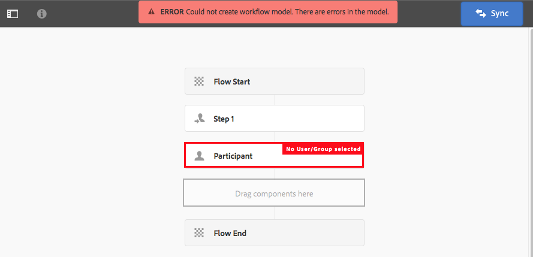

# Creación de modelos de flujo de trabajo{#creating-workflow-models}

>[!CAUTION]
>
>Para utilizar la IU clásica, consulte la [AEM documentación 6.3](https://helpx.adobe.com/experience-manager/6-3/help/sites-developing/workflows-models.html) para obtener referencia.

Puede crear un [modelo de flujo de trabajo](/help/sites-developing/workflows.md#model) para definir la serie de pasos ejecutados cuando un usuario inicia el flujo de trabajo. También puede definir propiedades del modelo, como si el flujo de trabajo es transitorio o utiliza varios recursos.

Cuando un usuario inicia un flujo de trabajo, se inicia una instancia; este es el modelo de tiempo de ejecución correspondiente, creado cuando [sincroniza](#sync-your-workflow-generate-a-runtime-model) los cambios.

## Creación de un nuevo flujo de trabajo {#creating-a-new-workflow}

La primera vez que se crea un nuevo modelo de flujo de trabajo contiene:

* Los pasos **Inicio de flujo** y **Fin de flujo**.
Representan el principio y el final del flujo de trabajo. Estos pasos son obligatorios y no se pueden editar ni eliminar.
* Un ejemplo de paso **Participant** denominado **Paso 1**.
Este paso está configurado para asignar un elemento de trabajo al iniciador del flujo de trabajo. Edite o elimine este paso y añada los pasos necesarios.

Para crear un nuevo flujo de trabajo con el editor:

1. Abra la consola **Workflow Models**; a través de **Tools**, **Workflow**, **Models** o, por ejemplo: [https://localhost:4502/aem/workflow](https://localhost:4502/aem/workflow)
1. Seleccione **Crear** y, a continuación, **Crear modelo**.
1. Aparece el cuadro de diálogo **Agregar modelo de flujo de trabajo**. Introduzca **Title** y **Name** (opcional) antes de seleccionar **Done**.
1. El nuevo modelo se muestra en la consola **Workflow Models**.
1. Seleccione el nuevo flujo de trabajo y, a continuación, utilice [**Edit** para abrirlo en la configuración](#editinganexistingworkflow):
   

>[!NOTE]
>
>Si crea modelos mediante programación (utilizando un paquete crx), también puede crear una subcarpeta dentro de:
>
>`/var/workflow/models`
>
>Por ejemplo, `/var/workflow/models/prototypes`
>
>Esta carpeta se puede utilizar para [administrar el acceso a los modelos de esa carpeta](/help/sites-administering/workflows-managing.md#create-a-subfolder-in-var-workflow-models-and-apply-the-acl-to-that).

## Edición de un flujo de trabajo {#editing-a-workflow}

Puede editar cualquier modelo de flujo de trabajo existente para:

* [definir ](#addingasteptoamodel-) pasos y sus  [parámetros](#configuring-a-workflow-step)
* configurar las propiedades del flujo de trabajo, incluidas [stage](#configuring-workflow-stages-that-show-workflow-progress), [si el flujo de trabajo es transitorio](#creatingatransientworkflow-) o [utiliza varios recursos](#configuring-a-workflow-for-multi-resource-support)

La edición de un flujo de trabajo [**Predeterminado y/o Heredado** (predeterminado)](#editing-a-default-or-legacy-workflow-for-the-first-time) tiene un paso adicional, para asegurarse de que se realiza una [copia segura](/help/sites-developing/workflows-best-practices.md#locations-workflow-models) antes de realizar los cambios.

Cuando se hayan completado las actualizaciones del flujo de trabajo, debe utilizar **Sync** para **Generate a Runtime Model**. Consulte [Sincronizar el flujo de trabajo](#sync-your-workflow-generate-a-runtime-model) para obtener más información.

### Sincronizar el flujo de trabajo: generar un modelo de tiempo de ejecución {#sync-your-workflow-generate-a-runtime-model}

**La sincronización**  (derecha en la barra de herramientas del editor) genera un modelo [ de ](/help/sites-developing/workflows.md#runtime-model)tiempo de ejecución. El modelo de tiempo de ejecución es el modelo que se utiliza realmente cuando un usuario inicia un flujo de trabajo. Si no **Sync** realiza los cambios, estos no estarán disponibles durante la ejecución.

Cuando usted (o cualquier otro usuario) realice cambios en el flujo de trabajo, debe utilizar **Sync** para generar un modelo de tiempo de ejecución, incluso cuando los cuadros de diálogo individuales (por ejemplo, para los pasos) tengan sus propias opciones de guardado.

Cuando los cambios se sincronizan con el modelo de tiempo de ejecución (guardado), se muestra **Sincronizado** en su lugar.

Algunos pasos tienen campos obligatorios o una validación integrada. Cuando no se cumplan estas condiciones, se mostrará un error cuando intente **sincronizar** el modelo. Por ejemplo, cuando no se ha definido ningún participante para un paso **Participante**:



### Edición de un flujo de trabajo predeterminado o heredado por primera vez {#editing-a-default-or-legacy-workflow-for-the-first-time}

Cuando abra un [modelo predeterminado o heredado](/help/sites-developing/workflows.md#workflow-types) para editarlo:

* El navegador Pasos no está disponible (lado izquierdo).
* Hay una acción **Edit** disponible en la barra de herramientas (lado derecho).
* Inicialmente, el modelo y sus propiedades se presentan en modo de solo lectura como:
   * Los flujos de trabajo predeterminados se encuentran en `/libs`
   * Los flujos de trabajo heredados se encuentran en `/etc`
Selección 
**** Editará:
* tomar una copia del flujo de trabajo en `/conf`
* hacer que el navegador Pasos esté disponible
* permite realizar cambios

>[!NOTE]
>
>Consulte [Ubicaciones de modelos de flujo de trabajo](/help/sites-developing/workflows-best-practices.md#locations-workflow-models) para obtener más información.


### Adición de un paso a un modelo {#adding-a-step-to-a-model}

Deberá añadir pasos al modelo para representar la actividad que se va a realizar: cada paso realiza una actividad específica. Hay una selección de componentes de paso disponibles en una instancia de AEM estándar.

Cuando edita un modelo, los pasos disponibles aparecen en los distintos grupos del explorador **Pasos**. Por ejemplo:


>[!NOTE]
>
>Para obtener información sobre los componentes de paso principales instalados con AEM, consulte [Referencia de pasos de flujo de trabajo](/help/sites-developing/workflows-step-ref.md).

Para añadir pasos al modelo de flujo de trabajo:

1. Abra un modelo de flujo de trabajo existente para editarlo. En la consola **Workflows Model**, seleccione el modelo requerido y, a continuación, **Edit**.
1. Abra el explorador Pasos . utilizando **Alternar panel lateral**, en el extremo izquierdo de la barra de herramientas superior. Aquí puede hacer lo siguiente:

   * **** Filtro para pasos específicos.
   * Utilice el selector desplegable para limitar la selección a un grupo específico de pasos.
   * Seleccione el icono Mostrar descripción  para mostrar más detalles sobre el paso adecuado.

   

1. Arrastre los pasos correspondientes a la ubicación requerida en el modelo.

   Por ejemplo, una **etapa de participante**.

   Una vez añadido al flujo, puede [configurar el paso](#configuring-a-workflow-step).

   

1. Agregue tantos pasos u otras actualizaciones como sea necesario.

   En tiempo de ejecución, los pasos se ejecutan en el orden en que aparecen en el modelo. Después de agregar componentes de paso, puede arrastrarlos a una ubicación diferente del modelo.

   También puede copiar, cortar, pegar, agrupar o eliminar pasos existentes; como con el [editor de páginas.](/help/sites-authoring/editing-content.md)

   Los pasos divididos también se pueden contraer o expandir con la opción de la barra de herramientas: 

1. Confirme los cambios con **Sync** (barra de herramientas del editor) para generar el modelo de tiempo de ejecución.

   Consulte [Sincronizar el flujo de trabajo](#sync-your-workflow-generate-a-runtime-model) para obtener más información.

### Configuración de un paso de flujo de trabajo {#configuring-a-workflow-step}

Puede **Configurar** y personalizar el comportamiento de un paso de flujo de trabajo mediante los cuadros de diálogo **Propiedades del paso**.

1. Para abrir el cuadro de diálogo **Propiedades del paso** para realizar un paso:

   * Pulse o haga clic en el* *paso del modelo de flujo de trabajo y seleccione **Configurar** en la barra de herramientas de componentes.

   * Haga doble clic en el paso .
   >[!NOTE]
   >
   >Para obtener información sobre los componentes de paso principales instalados con AEM, consulte [Referencia de pasos de flujo de trabajo](/help/sites-developing/workflows-step-ref.md).

1. Configure las **Propiedades del paso** según sea necesario; las propiedades disponibles dependen del tipo de paso; también pueden haber varias pestañas disponibles. Por ejemplo, el **Paso del participante** predeterminado, presente en un nuevo flujo de trabajo como `Step 1`:

   

1. Confirme sus actualizaciones con el visto.
1. Confirme los cambios con **Sync** (barra de herramientas del editor) para generar el modelo de tiempo de ejecución.

   Consulte [Sincronizar el flujo de trabajo](#sync-your-workflow-generate-a-runtime-model) para obtener más información.

### Creación de un flujo de trabajo transitorio {#creating-a-transient-workflow}

Puede crear un modelo de flujo de trabajo [Transient](/help/sites-developing/workflows.md#transient-workflows) al crear un nuevo modelo o al editar uno existente:

1. Abra el modelo de flujo de trabajo para [editar](#editinganexistingworkflow).
1. Seleccione **Workflow Model Properties** en la barra de herramientas.
1. En el cuadro de diálogo, active **Flujo de trabajo transitorio** (o desactive si es necesario):

   

1. Confirme el cambio con **Guardar y cerrar**; seguido de **Sync** (barra de herramientas del editor) para generar el modelo de tiempo de ejecución.

   Consulte [Sincronizar el flujo de trabajo](#sync-your-workflow-generate-a-runtime-model) para obtener más información.

>[!NOTE]
>
>Cuando se ejecuta un flujo de trabajo en modo [transitorio](/help/sites-developing/workflows.md#transient-workflows) , AEM no almacena ningún historial de flujo de trabajo. Por lo tanto, [Timeline](/help/sites-authoring/basic-handling.md#timeline) no muestra ninguna información relacionada con ese flujo de trabajo.

## Hacer que los modelos de flujo de trabajo estén disponibles en la interfaz de usuario táctil {#classic2touchui}

Si hay un modelo de flujo de trabajo en la IU clásica, pero falta en el menú emergente de selección en el carril **[!UICONTROL Línea de tiempo]** de la IU táctil, siga la configuración para que esté disponible. Los siguientes pasos ilustran el uso del modelo de flujo de trabajo llamado **[!UICONTROL Solicitud de activación]**.

1. Confirme que el modelo no está disponible en la IU táctil. Acceda a un recurso mediante la ruta `/assets.html/content/dam`. Seleccione un recurso. Abra **[!UICONTROL Línea de tiempo]** en el carril izquierdo. Haga clic en **[!UICONTROL Iniciar flujo de trabajo]** y confirme que el modelo **[!UICONTROL Solicitud de activación]** no está presente en la lista emergente.

1. Vaya a **[!UICONTROL Tools > General > Tagging]**. Seleccione **[!UICONTROL Workflow]**.

1. Seleccione **[!UICONTROL Crear > Crear etiqueta]**. Establezca **[!UICONTROL Título]** como `DAM` y **[!UICONTROL Nombre]** como `dam`. Seleccione **[!UICONTROL Enviar]**.
   

1. Vaya a **[!UICONTROL Tools > Workflow > Models]**. Seleccione **[!UICONTROL Solicitud de activación]** y, a continuación, seleccione **[!UICONTROL Editar]**.

1. Seleccione **[!UICONTROL Editar]**, abra el menú **[!UICONTROL Información de página]** y, desde allí, seleccione **[!UICONTROL Abrir propiedades]** y vaya a la pestaña **[!UICONTROL Básico]** (si no está abierta).

1. Agregue `Workflow : DAM` al campo **[!UICONTROL Etiquetas]**. Confirme la selección con la marca de verificación (visto).

1. Confirme la adición de la etiqueta con **[!UICONTROL Guardar y cerrar]**.
   

1. Complete el proceso con **[!UICONTROL Sync]**. El flujo de trabajo ya está disponible en la IU táctil.

### Configuración de un flujo de trabajo para compatibilidad con varios recursos {#configuring-a-workflow-for-multi-resource-support}

Puede configurar un modelo de flujo de trabajo para [Compatibilidad con varios recursos](/help/sites-developing/workflows.md#multi-resource-support) al crear un nuevo modelo o al editar uno existente:

1. Abra el modelo de flujo de trabajo para [editar](#editinganexistingworkflow).
1. Seleccione **Workflow Model Properties** en la barra de herramientas.

1. En el cuadro de diálogo, active **Compatibilidad con varios recursos** (o desactive si es necesario):

   

1. Confirme el cambio con **Guardar y cerrar**; seguido de **Sync** (barra de herramientas del editor) para generar el modelo de tiempo de ejecución.

   Consulte [Sincronizar el flujo de trabajo](#sync-your-workflow-generate-a-runtime-model) para obtener más información.

### Configuración de etapas de flujo de trabajo (que muestran el progreso del flujo de trabajo) {#configuring-workflow-stages-that-show-workflow-progress}

[Los ](/help/sites-developing/workflows.md#workflow-stages) pasos de flujo de trabajo ayudan a visualizar el progreso de un flujo de trabajo al administrar tareas.

>[!CAUTION]
>
>Si las etapas del flujo de trabajo se definen en **Propiedades de página**, pero no se utilizan para ninguno de los pasos del flujo de trabajo, la barra de progreso no mostrará ningún progreso (independientemente del paso actual del flujo de trabajo).

Las etapas que estarán disponibles se definen en los modelos de flujo de trabajo; los modelos de flujo de trabajo existentes se pueden actualizar para incluir definiciones de escenario. Puede definir cualquier número de etapas para el modelo de flujo de trabajo.

Para definir **Stages** para el flujo de trabajo:

1. Abra el modelo de flujo de trabajo para editarlo.
1. Seleccione **Workflow Model Properties** en la barra de herramientas. A continuación, abra la pestaña **Stages**.
1. Añada (y coloque) los **Stages** necesarios. Puede definir cualquier número de etapas para el modelo de flujo de trabajo.

   Por ejemplo:

   

1. Haga clic en **Guardar y cerrar** para guardar las propiedades.
1. Asigne un escenario a cada uno de los pasos del modelo de flujo de trabajo. Por ejemplo:

   

   Se puede asignar un escenario a más de un paso. Por ejemplo:

   | **Etapa** | **Escenario** |
   |---|---|
   | Etapa 1 | Crear |
   | Etapa 2 | Crear |
   | Etapa 3 | Crítica |
   | Etapa 4 | Aprobar |
   | Etapa 5 | Aprobar |
   | Etapa 6 | Completar |

1. Confirme los cambios con **Sync** (barra de herramientas del editor) para generar el modelo de tiempo de ejecución.

   Consulte [Sincronizar el flujo de trabajo](#sync-your-workflow-generate-a-runtime-model) para obtener más información.

## Exportación de un modelo de flujo de trabajo en un paquete {#exporting-a-workflow-model-in-a-package}

Para exportar un modelo de flujo de trabajo en un paquete:

1. Cree un nuevo paquete utilizando el [Administrador de paquetes](/help/sites-administering/package-manager.md#package-manager):

   1. Vaya al Administrador de paquetes a través de **Tools**, **Deployment**, **Packages**.

   1. Haga clic en **Crear paquete**.
   1. Especifique el **Nombre del paquete** y cualquier otro detalle según sea necesario.
   1. Haga clic en **Aceptar**.

1. Haga clic en **Edit** en la barra de herramientas del nuevo paquete.

1. Abra la pestaña **Filters**.

1. Seleccione **Add Filter** y especifique la ruta del modelo de flujo de trabajo *design*:

   `/conf/global/settings/workflow/models/<*your-model-name*>`

   Haga clic en **Listo**.

1. Seleccione **Add Filter** y especifique la ruta de su modelo de flujo de trabajo *runtime*:

   `/var/workflow/models/<*your-model-name*>`

   Haga clic en **Listo**.

1. Añada filtros adicionales para cualquier secuencia de comandos personalizada que utilice el modelo.
1. Haga clic en **Save** para confirmar las definiciones del filtro.
1. Seleccione **Build** en la barra de herramientas de la definición del paquete.
1. Seleccione **Download** en la barra de herramientas del paquete.

## Uso de flujos de trabajo para procesar envíos de formularios {#using-workflows-to-process-form-submissions}

Puede configurar un formulario para que lo procese el flujo de trabajo seleccionado. Cuando los usuarios envían el formulario, se crea una nueva instancia de flujo de trabajo con los datos del envío del formulario como carga útil.

Para configurar el flujo de trabajo que se utilizará con el formulario:

1. Cree una nueva página y ábrala para editarla.
1. Agregue un componente **Formulario** a la página.
1. **** Configure el componente  **Inicio de** formulario que aparece en la página.
1. Utilice **Iniciar flujo de trabajo** para seleccionar el flujo de trabajo deseado de los disponibles:

   

1. Confirme la nueva configuración de formulario con la marca de verificación.

## Flujos de trabajo de prueba {#testing-workflows}

Es una buena práctica a la hora de probar un flujo de trabajo utilizar una variedad de tipos de carga útil; incluyendo tipos diferentes de los para los que se ha desarrollado. Por ejemplo, si tiene intención de que el flujo de trabajo trate con Assets, pruébelo configurando una página como carga útil y asegúrese de que no arroja errores.

Por ejemplo, pruebe el nuevo flujo de trabajo de la siguiente manera:

1. [Inicie el ](/help/sites-administering/workflows-starting.md) modelo de flujo de trabajo desde la consola.
1. Defina la **Carga útil** y confirme.

1. Realice las acciones necesarias para que se ejecute el flujo de trabajo.
1. Monitorice los archivos de registro mientras se ejecuta el flujo de trabajo.

También puede configurar AEM para que muestre los mensajes **DEBUG** en los archivos de registro. Consulte [Inicio de sesión](/help/sites-deploying/configure-logging.md) para obtener más información y, cuando finalice el desarrollo, establezca el **Nivel de registro** de nuevo en **Información**.

## Ejemplos {#examples}

### Ejemplo: Creación de un flujo de trabajo (simple) para aceptar o rechazar una solicitud de publicación {#example-creating-a-simple-workflow-to-accept-or-reject-a-request-for-publication}

Para ilustrar algunas de las posibilidades de creación de un flujo de trabajo, el siguiente ejemplo crea una variación del flujo de trabajo `Publish Example`.

1. [Cree un nuevo modelo](#creating-a-new-workflow) de flujo de trabajo.

   El nuevo flujo de trabajo contiene:

   * **Inicio de flujo**
   * `Step 1`
   * **Fin de flujo**

1. Eliminar `Step 1` (ya que es el tipo de paso incorrecto para este ejemplo):

   * Haga clic en el paso y seleccione **Delete** en la barra de herramientas de componentes. Confirme la acción.

1. En la selección **Workflow** del explorador de pasos, arrastre un **Participant Step** al flujo de trabajo y colóquelo entre **Flow Start** y **Flow End**.
1. Para abrir el cuadro de diálogo de propiedades:

   * Haga clic en el paso del participante y seleccione **Configurar** en la barra de herramientas de componentes.
   * Haga doble clic en el paso del participante.

1. En la pestaña **Common** introduzca `Validate Content` tanto para el **Title** como para la **Description**.
1. Abra la pestaña **Usuario/Grupo**:

   * Activar **Notificar al usuario por correo electrónico**.
   * Seleccione `Administrator` ( `admin`) para el campo **Usuario/Grupo**.

   >[!NOTE]
   >
   >Para que se envíen correos electrónicos, [es necesario configurar el servicio de correo y los detalles de la cuenta de usuario](/help/sites-administering/notification.md).

1. Confirme las actualizaciones con la marca de verificación.

   Se le devolverá a la descripción general del modelo de flujo de trabajo, donde se habrá cambiado el nombre del paso del participante a `Validate Content`.

1. Arrastre un **Or Split** al flujo de trabajo y colóquelo entre `Validate Content` y **Flow End**.
1. Abra **Or Split** para la configuración.
1. Configuración:

   * **Frecuentes**: especifique el nombre dividido.
   * **Rama 1**: seleccione Ruta  **predeterminada**.

   * **Rama 2**: asegúrese de que  **no** está seleccionado Rutas predeterminadas.

1. Confirme las actualizaciones de **OR Split**.
1. Arrastre un **Paso del participante** a la rama izquierda, abra las propiedades, especifique los valores siguientes y confirme los cambios:

   * **Título**: `Reject Publish Request`

   * **Usuario/Grupo**: por ejemplo,  `projects-administrators`

   * **Notificar al usuario por correo electrónico**: Active esta opción para que el usuario reciba una notificación por correo electrónico.

1. Arrastre un **paso de proceso** a la rama derecha, abra las propiedades, especifique los valores siguientes y confirme los cambios:

   * **Título**: `Publish Page as Requested`

   * **Proceso**: seleccione  `Activate Page`. Este proceso publica la página seleccionada en las instancias del editor.

1. Haga clic en **Sync** (barra de herramientas del editor) para generar el modelo de tiempo de ejecución.

   Consulte [Sincronizar el flujo de trabajo](#sync-your-workflow-generate-a-runtime-model) para obtener más información.

   El nuevo modelo de flujo de trabajo tendrá el siguiente aspecto:

   

1. Aplique este flujo de trabajo a su página, de modo que cuando el usuario pase a **Completar** el paso **Validar contenido**, pueda seleccionar si desea **Publicar página como se solicitó** o **Rechazar solicitud de publicación**.

   

### Ejemplo: Definición de una regla para una división OR mediante una secuencia de comandos ECMA {#defineruleecmascript}

**O** los pasos de división permiten introducir rutas de procesamiento condicionales en el flujo de trabajo.

Para definir una regla OR, siga estos pasos:

1. Cree dos secuencias de comandos y guárdelas en el repositorio, por ejemplo, en:

   `/apps/myapp/workflow/scripts`

   >[!NOTE]
   >
   >Las secuencias de comandos deben tener una [función `check()`](#function-check) que devuelva un valor booleano.

1. Edite el flujo de trabajo y añada **OR Split** al modelo.
1. Edite las propiedades de **Branch 1** de **OR Split**:

   * Defina esto como la **Ruta predeterminada** estableciendo el **Valor** en `true`.

   * Como **Rule**, establezca la ruta en la secuencia de comandos. Por ejemplo:
      `/apps/myapp/workflow/scripts/myscript1.ecma`
   >[!NOTE]
   >
   >Si es necesario, puede cambiar el orden de las ramas.

1. Edite las propiedades de **Branch 2** de **OR Split**.

   * Como **Rule**, establezca la ruta en la otra secuencia de comandos. Por ejemplo:
      `/apps/myapp/workflow/scripts/myscript2.ecma`

1. Defina las propiedades de los pasos individuales de cada rama. Asegúrese de que **User/Group** está configurado.
1. Haga clic en **Sync** (barra de herramientas del editor) para mantener los cambios en el modelo de tiempo de ejecución.

   Consulte [Sincronizar el flujo de trabajo](#sync-your-workflow-generate-a-runtime-model) para obtener más información.

#### Función Check() {#function-check}

>[!NOTE]
>
>Consulte [Uso de ECMAScript](/help/sites-developing/workflows-customizing-extending.md#using-ecmascript).

El siguiente script de ejemplo devuelve `true` si el nodo es `JCR_PATH` ubicado en `/content/we-retail/us/en`:

```
function check() {
    if (workflowData.getPayloadType() == "JCR_PATH") {
      var path = workflowData.getPayload().toString();
      var node = jcrSession.getItem(path);

      if (node.getPath().indexOf("/content/we-retail/us/en") >= 0) {
       return true;
      } else {
       return false;
      }
     } else {
      return false;
     }
}
```

### Ejemplo: Solicitud de activación personalizada {#example-customized-request-for-activation}

Puede personalizar cualquiera de los flujos de trabajo predeterminados. Para tener un comportamiento personalizado, superponga los detalles del flujo de trabajo adecuado.

Por ejemplo, **Solicitud de activación**. Este flujo de trabajo se utiliza para publicar páginas dentro de **Sites** y se activa automáticamente cuando un autor de contenido no tiene los derechos de replicación adecuados. Consulte [Personalización de la creación de páginas: personalización del flujo de trabajo de solicitud de activación](/help/sites-developing/customizing-page-authoring-touch.md#customizing-the-request-for-activation-workflow) para obtener más información.
