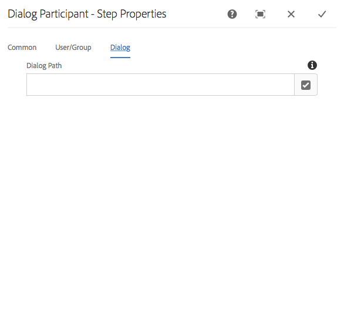

# Referencia de pasos de flujo de trabajo {#workflow-step-reference}

Los modelos de flujo de trabajo constan de una serie de pasos de varios tipos. Según el tipo, estos pasos se pueden configurar y ampliar con parámetros y secuencias de comandos para proporcionar la funcionalidad y el control que necesite.

>[!NOTE]
>
>Esta sección cubre los pasos estándar del flujo de trabajo.
>
>Para ver los pasos específicos del módulo, consulte también:
>
>* [Referencia de pasos del flujo de trabajo de AEM Forms](/help/forms/using/aem-forms-workflow-step-reference.md)
>* [Processing Assets Using Media Handlers and Workflows](/help/assets/media-handlers.md)

>


## Propiedades de la etapa {#step-properties}

Cada componente de paso tiene un cuadro de diálogo **Propiedades del paso** que le permite definir y editar las propiedades requeridas.

### Propiedades de los pasos: pestaña común {#step-properties-common-tab}

Hay disponible una combinación de las siguientes propiedades para la mayoría de los componentes de paso del flujo de trabajo, en la pestaña **Common** del cuadro de diálogo de propiedades:

* ****
TítuloTítulo del paso.

* ****
DescripciónDescripción del paso.

* **Fase del flujo de trabajo**

   Selector desplegable para aplicar un [Stage](/help/sites-developing/workflows.md#workflow-stages) al paso.

* **Tiempo de espera**

   El periodo después del cual se &quot;agotó el tiempo de espera&quot; para el paso.
Puede seleccionar entre: **Desactivado**, **Inmediato**, **1h**, **6h**, **12h**, **24h**.

* **Controlador de tiempo de espera**

   El controlador que controlará el flujo de trabajo cuando se agote el tiempo de espera del paso; por ejemplo:
   `Auto Advancer`

* **Avance de controlador**

   Seleccione esta opción para avanzar automáticamente el flujo de trabajo al paso siguiente después de la ejecución. Si no se selecciona, la secuencia de comandos de implementación debe gestionar el progreso del flujo de trabajo.

### Propiedades de los pasos: ficha Usuario/Grupo {#step-properties-user-group-tab}

Las siguientes propiedades están disponibles para muchos componentes de paso del flujo de trabajo, en la pestaña **Usuario/Grupo** del cuadro de diálogo de propiedades:

* **Notificar al usuario a través del correo electrónico**

   * Puede notificar a los participantes enviándoles un correo electrónico cuando el flujo de trabajo llega al paso.
   * Si está habilitado, se enviará un correo electrónico al usuario definido por la propiedad **User/Group** o a cada miembro del grupo si se define un grupo.

* **Usuario/grupo**

   * Un cuadro de selección desplegable le permite desplazarse y seleccionar un usuario o grupo.
   * Si asigna el paso a un usuario específico, solo este usuario puede realizar una acción en el paso.
   * Si asigna el paso a un grupo completo, cuando el flujo de trabajo alcance este paso, todos los usuarios de este grupo tendrán la acción en su **Bandeja de entrada del flujo de trabajo**.
   * Consulte [Participación en flujos de trabajo](/help/sites-authoring/workflows-participating.md) para obtener más información.

## División AND {#and-split}

La **AND Split** crea una división en el flujo de trabajo, tras la cual ambas ramas estarán activas. Los pasos del flujo de trabajo se agregan a cada rama según sea necesario. Este paso le permite introducir varias rutas de procesamiento en el flujo de trabajo. Por ejemplo, puede permitir que ciertos pasos de revisión se produzcan en paralelo, lo que ahorra tiempo.


### División AND: Configuración {#and-split-configuration}

Para configurar la división:

* Edite las **AND Split Properties**:

   * **Nombre** dividido: asignar un nombre con fines explicativos
   * Seleccione el número de ramas necesarias; 2, 3, 4 o 5.

* Añada los pasos del flujo de trabajo a las ramas según sea necesario.

   

## Paso de contenedor {#container-step}

Un paso de contenedor inicia otro modelo de flujo de trabajo que se ejecuta como flujo de trabajo secundario.

Este contenedor puede permitirle reutilizar modelos de flujo de trabajo para implementar secuencias comunes de pasos. Por ejemplo, se puede utilizar un modelo de flujo de trabajo de traducción en varios flujos de trabajo de edición.


### Paso del contenedor: Configuración {#container-step-configuration}

Para configurar el paso, edite y utilice las siguientes pestañas:

* [Común](#step-properties-common-tab)
* **Contenedor**

   * **Subflujo de trabajo**: Seleccione el flujo de trabajo que desea iniciar.

## Ir a la etapa {#goto-step}

El **Goto Step** permite especificar el siguiente paso que se ejecutará en el modelo de flujo de trabajo. Puede especificar una definición de regla, un script externo o un script ECMA como expresión de enrutamiento para evaluar el siguiente paso del modelo de flujo de trabajo.

* Si la condición especificada tiene el valor &quot;True&quot;, el **Goto Step** se completa y el motor de flujo de trabajo ejecuta el paso especificado.
* Si la condición especificada no tiene el valor &quot;True&quot;, el **Goto Step** se completa y la lógica de enrutamiento normal determina el siguiente paso que se va a ejecutar.

El **Goto Step** permite implementar estructuras de enrutamiento avanzadas en los modelos de flujo de trabajo. Por ejemplo, para implementar un bucle, el **Goto Step** puede definirse para ejecutar un paso anterior en el flujo de trabajo, con la expresión de enrutamiento evaluando una condición de bucle.

### Ir al paso: Configuración {#goto-step-configuration}

Para configurar el paso, edite y utilice las siguientes pestañas:

* [Común](#step-properties-common-tab)
* **Proceso**

   * **Paso** de objetivo: Seleccione el paso que se ejecutará después de evaluar la condición para la expresión de enrutamiento.
   * **Expresión** de enrutamiento: Seleccione Definición de regla, Script externo o un script ECMA que determine si se ejecutará el paso de  **destino**.

      * **Definición de regla:** utilice el  [editor de ](/help/forms/using/variable-in-aem-workflows.md#use-expression-editor) expresiones para definir la regla.
      * **Secuencia de comandos externa:**  la ruta de acceso de la secuencia de comandos externa.
      * **Script** de ECMA: Secuencia de comandos que determina si se ejecutará el paso  **Ir a**.

#### Simulación de un bucle for {#simulating-a-for-loop}

Para simular un bucle for es necesario mantener un recuento del número de iteraciones de bucle que se han producido:

* El recuento representa normalmente un índice de elementos en los que se actúa en el flujo de trabajo.
* El recuento se evalúa como criterios de salida del bucle.

Por ejemplo, para implementar un flujo de trabajo que realice una acción en varios nodos JCR, puede utilizar un contador de bucle como índice para los nodos. Para mantener el recuento, almacene un valor `integer` en el mapa de datos de la instancia de flujo de trabajo. Utilice la secuencia de comandos del **Goto Step** para incrementar el recuento y comparar el recuento con los criterios de salida.

```
function check(){
   var count=0;
   var keyname="loopcount"
   try{
      if (workflowData.getMetaDataMap().containsKey(keyname)){
        log.info("goto script: found loopcount key");
        count= parseInt(workflowData.getMetaDataMap().get(keyname))+1;
      }

     workflowData.getMetaDataMap().put(keyname,count);

     }catch(err) {
         log.info(err.message);
         return false;
    }
   if (parseInt(count) <7){
       return true;
   } else {
      return false;
   }
}
```

### Simulación de un bucle for mediante la definición de regla {#simulateforloop}

También puede simular un bucle for utilizando la Definición de regla como expresión de enrutamiento. [Cree una variable  **** ](/help/forms/using/variable-in-aem-workflows.md#create-a-variable) contable de tipo de datos Long. Utilice **Expression** como modo de asignación en el paso **[Set Variable](/help/sites-developing/using-variables-in-aem-workflows.md#set-a-variable)** para establecer el valor de la variable **count** en **count + 1** en cada ejecución del paso **Set Variable**.


En el **Goto Step**, utilice **Set Variable** como **Target Step** y **count &lt; 5** como expresión de enrutamiento.


El paso **Set Variable** se ejecuta incrementando repetidamente el valor de la variable **count** en 1 en cada ejecución hasta que el valor alcance 5.

## División OR {#or-split}

La **OR Split** crea una división en el flujo de trabajo, tras la cual solo se activará una rama. Este paso le permite introducir rutas de procesamiento condicionales en el flujo de trabajo. Los pasos del flujo de trabajo se agregan a cada rama según sea necesario.

>[!NOTE]
>
>Para obtener más información sobre la creación de una división OR, consulte: [https://helpx.adobe.com/experience-manager/using/aem64_workflow_servlet.html](https://helpx.adobe.com/experience-manager/using/aem64_workflow_servlet.html)


### OR Split - Configuración {#or-split-configuration}

Para configurar la división:

* Edite las **OR Split Properties**:

   * **Común**

      * Especifique el nombre dividido.
   * **Ramas (*x)***

      * **Agregar rama:** agregue más ramas al paso.
      * **Seleccione Expresión** de enrutamiento: Seleccione la expresión de enrutamiento para evaluar la rama activa. Los valores posibles incluyen: Definición de regla, Script externo y secuencia de comandos ECMA.
      * **Haga clic para agregar expresión**: Agregue expresión para evaluar la rama activa si selecciona  **Definición de** regla como expresión de enrutamiento.
      * **Ruta de script**: Ruta a un archivo que contiene la secuencia de comandos para evaluar la rama activa si selecciona  **Secuencias de** comandos externas en la expresión de enrutamiento.
      * **Script**: Añada la secuencia de comandos en el cuadro para evaluar la rama activa si selecciona  **ECMA** Scripts en la expresión de enrutamiento.
      * **Ruta** predeterminada: La rama predeterminada se sigue en el caso de varias ramas. Solo se puede especificar una rama como la predeterminada.

   >[!NOTE]
   >
   >    * Una rama se evalúa a la vez según la expresión de enrutamiento.
   >    * Las ramas se evalúan de arriba a abajo.
   >    * Se ejecuta la primera secuencia de comandos que evalúa como verdadera.
   >    * Si ninguna rama se evalúa como verdadera, el flujo de trabajo no avanza.


   >[!NOTE]
   >
   >Consulte [Definición de una regla para una división OR](/help/sites-developing/workflows-models.md#defineruleecmascript).

* Añada los pasos del flujo de trabajo a las ramas según sea necesario.

## Pasos y opciones del participante {#participant-steps-and-choosers}

### Etapa de participante {#participant-step}

Un **paso de participante** le permite asignar la propiedad de una acción en particular. El flujo de trabajo solo se realizará cuando el usuario haya reconocido manualmente el paso. Se utiliza cuando desea que alguien realice una acción en el flujo de trabajo; por ejemplo, un paso de revisión.

Aunque no está directamente relacionada, se debe tener en cuenta la autorización del usuario al asignar una acción; el usuario debe tener acceso a la página que es la carga útil del flujo de trabajo.

#### Paso del participante: Configuración {#participant-step-configuration}

Para configurar el paso, edite y utilice las siguientes pestañas:

* [Común](#step-properties-common-tab)
* [Usuario/grupo](#step-properties-user-group-tab)

>[!NOTE]
>
>El iniciador del flujo de trabajo siempre recibe una notificación cuando:
>
>* El flujo de trabajo se ha completado (finalizado).
>* El flujo de trabajo se interrumpe (termina).

>


>[!NOTE]
>
>Es necesario configurar algunas propiedades para habilitar las notificaciones por correo electrónico. También puede personalizar la plantilla de correo electrónico o añadir una plantilla de correo electrónico para un nuevo idioma. Consulte [Configuración de notificaciones por correo electrónico](/help/sites-administering/notification.md#configuringemailnotification) para configurar las notificaciones por correo electrónico en AEM.

### Etapa de participante de cuadro de diálogo {#dialog-participant-step}

Utilice un **paso del participante del cuadro de diálogo** para recopilar información del usuario al que se ha asignado el elemento de trabajo. Este paso es útil para recopilar pequeñas cantidades de datos que se utilizan más adelante en el flujo de trabajo.

Al completar el paso, el cuadro de diálogo **Completar elemento de trabajo** contiene los campos que se definen en el cuadro de diálogo. Los datos recopilados en los campos se almacenan en los nodos de la carga útil del flujo de trabajo. Los pasos subsiguientes del flujo de trabajo pueden leer el valor del repositorio.

Para configurar el paso, especifique el grupo o usuario al que desea asignar el elemento de trabajo y la ruta al cuadro de diálogo.

#### Etapa del participante del cuadro de diálogo: configuración {#dialog-participant-step-configuration}

Para configurar el paso, edite y utilice las siguientes pestañas:

* [Común](#step-properties-common-tab)
* [Usuario/grupo](#step-properties-user-group-tab)
* **Cuadro de diálogo**

   * **Ruta** de diálogo: Ruta al nodo de diálogo del  [cuadro de diálogo que cree](#dialog-participant-step-creating-a-dialog).

#### Etapa de participante del cuadro de diálogo: creación de un cuadro de diálogo {#dialog-participant-step-creating-a-dialog}

Para crear un cuadro de diálogo, debe crear el cuadro de diálogo:

* Decida dónde se almacenarán los datos resultantes [en la carga útil](#dialog-participant-step-storing-data-in-the-payload).
* [Definir el cuadro de diálogo; esto incluye la definición de los campos utilizados para recopilar (y guardar) los datos](#dialog-participant-step-dialog-definition).

#### Paso de participante del cuadro de diálogo: Almacenamiento de datos en la carga útil {#dialog-participant-step-storing-data-in-the-payload}

Puede almacenar datos de widget en la carga útil del flujo de trabajo o en los metadatos del elemento de trabajo. El formato de la propiedad `name` del nodo del widget determina dónde se almacenan los datos.

* **Almacenar datos con la carga útil**

   * Para almacenar datos de widget como propiedad de la carga útil del flujo de trabajo, utilice el siguiente formato para el valor de la propiedad name del nodo de widget:
      `./jcr:content/nodename`

   * Los datos se almacenan en la propiedad `nodename` del nodo de carga útil. Si el nodo no contiene esa propiedad, se crea la propiedad .
   * Cuando se almacena con la carga útil, los usos subsiguientes del cuadro de diálogo con la misma carga útil sobrescriben el valor de la propiedad .

* **Almacenar datos con el elemento de trabajo**

   * Para almacenar datos de widget como propiedad de los metadatos del elemento de trabajo, utilice el siguiente formato para el valor de la propiedad name :
      `nodename`

   * Los datos se almacenan en la propiedad `nodename` del elemento de trabajo `metadata`. Los datos se conservan si el cuadro de diálogo se utiliza posteriormente con la misma carga útil.

#### Etapa del participante del cuadro de diálogo: definición del cuadro de diálogo {#dialog-participant-step-dialog-definition}

1. **Estructura del cuadro de diálogo**

   Los cuadros de diálogo Pasos de los participantes son similares a los cuadros de diálogo que crea para crear componentes. Se almacenan en:

   `/apps/myapp/workflow/dialogs`

   Los cuadros de diálogo para la IU táctil estándar tienen la siguiente estructura de nodos:

   ```xml
   newComponent (cq:Component)
     |- cq:dialog (nt:unstructured)
       |- content
         |- layout
           |- items
             |- column
               |- items
                 |- component0
                 |- component1
                 |- ...
   ```

   >[!NOTE]
   >
   >Para obtener más información, consulte [Creación y configuración de un cuadro de diálogo](/help/sites-developing/developing-components.md#creating-and-configuring-a-dialog).

1. **Propiedad Dialog Path**

   El **paso del participante del cuadro de diálogo** tiene la propiedad **Ruta de diálogo** (junto con las propiedades de un [paso del participante](#participant-step)). El valor de la propiedad **Dialog Path** es la ruta al nodo `dialog` del cuadro de diálogo.

   Por ejemplo, el cuadro de diálogo está contenido en un componente denominado `EmailWatch` que se almacena en el nodo :

   `/apps/myapp/workflows/dialogs`

   Para la IU táctil se utiliza el siguiente valor para la propiedad **Dialog Path**:

   `/apps/myapp/workflow/dialogs/EmailWatch/cq:dialog`

   

1. **Ejemplo de definición de cuadro de diálogo**

   El siguiente fragmento de código XML representa un cuadro de diálogo que almacena un valor `String` en el nodo `watchEmail` del contenido de carga útil. El nodo de título representa el componente [TextField](https://helpx.adobe.com/experience-manager/6-5/sites/developing/using/reference-materials/granite-ui/api/jcr_root/libs/granite/ui/components/coral/foundation/form/textfield/index.html):

   ```xml
   jcr:primaryType="nt:unstructured"
       jcr:title="Watcher Email Address Dialog"
       sling:resourceType="cq/gui/components/authoring/dialog">
       <content jcr:primaryType="nt:unstructured"
           sling:resourceType="granite/ui/components/foundation/container">
           <layout jcr:primaryType="nt:unstructured"
               margin="false"
               sling:resourceType="granite/ui/components/foundation/layouts/fixedcolumns"
           />
           <items jcr:primaryType="nt:unstructured">
               <column jcr:primaryType="nt:unstructured"
                   sling:resourceType="granite/ui/components/foundation/container">
                   <items jcr:primaryType="nt:unstructured">
                       <title jcr:primaryType="nt:unstructured"
                           fieldLabel="Notification Email Address"
                           name="./jcr:content/watchEmails"
                           sling:resourceType="granite/ui/components/foundation/form/textfield"
                       />
                   </items>
               </column>
           </items>
       </content>
   </cq:dialog>
   ```

   Este ejemplo dará como resultado, en el caso de la IU táctil, un cuadro de diálogo como:

   

### Etapa de participante dinámica {#dynamic-participant-step}

El componente **Paso de participante dinámico** es similar a **[Paso de participante](#participant-step)** con la diferencia de que el participante se selecciona automáticamente en tiempo de ejecución.

Para configurar el paso, seleccione un **Selector de participantes** que identifique al participante al que asignar el elemento de trabajo, junto con un cuadro de diálogo.

#### Etapa de participante dinámica: configuración {#dynamic-participant-step-configuration}

Para configurar el paso, edite y utilice las siguientes pestañas:

* [Común](#step-properties-common-tab)
* **Selector de participantes**

   * **Selector de participantes**: El nombre del selector de  [participantes que cree](#developingtheparticipantchooser).
   * **Argumentos**: Cualquier argumento necesario.
   * **Correo electrónico**: Si se debe enviar una notificación por correo electrónico al usuario.

* **Cuadro de diálogo**

   * **Ruta** de diálogo: La ruta al nodo de diálogo del  [cuadro de diálogo que cree (como con el paso  **Participante en el cuadro de diálogo**)](#dialog-participant-step-creating-a-dialog).

#### Etapa de participante dinámica: desarrollo del selector de participantes {#dynamic-participant-step-developing-the-participant-chooser}

Usted crea el selector de participantes. Por lo tanto, puede utilizar cualquier lógica o criterio de selección. Por ejemplo, el selector de participantes puede seleccionar el usuario (dentro de un grupo) que tenga la menor cantidad de elementos de trabajo. Puede crear cualquier número de usuarios que desee utilizar con distintas instancias del componente **Paso de participante dinámico** en los modelos de flujo de trabajo.

Cree un servicio OSGi o un ECMAScript que seleccione un usuario al que asignar el elemento de trabajo.

* **ECMAscript**

   Las secuencias de comandos deben incluir una función denominada getParticipant que devuelva un ID de usuario como valor `String`. Almacene los scripts personalizados en, por ejemplo, la carpeta `/apps/myapp/workflow/scripts` o una subcarpeta.

   Se incluye un script de ejemplo en una instancia de AEM estándar:

   `/libs/workflow/scripts/initiator-participant-chooser.ecma`

   >[!CAUTION]
   >
   >***no debe*** cambiar nada en la ruta `/libs`.
   >
   >
   >Esto se debe a que el contenido de `/libs` se sobrescribe la próxima vez que actualice la instancia (y puede sobrescribirse al aplicar una corrección o un paquete de funciones).

   Esta secuencia de comandos selecciona el iniciador del flujo de trabajo como participante:

   ```
   function getParticipant() {
       return workItem.getWorkflow().getInitiator();
   }
   ```

   >[!NOTE]
   >
   >El componente **Selector de participante del iniciador de flujo de trabajo** amplía el **paso de participante dinámico** y utiliza este script como implementación de paso.

* **Servicio OSGi**

   Los servicios deben implementar la interfaz [com.day.cq.workflow.exec.ParticipantStepChooser](https://helpx.adobe.com/experience-manager/6-5/sites/developing/using/reference-materials/javadoc/com/day/cq/workflow/exec/ParticipantStepChooser.html). La interfaz define los siguientes miembros:

   * `SERVICE_PROPERTY_LABEL` campo: Utilice este campo para especificar el nombre del selector de participantes. El nombre aparece en una lista de los seleccionadores de participantes disponibles en las propiedades **Paso de participante dinámico**.

   * `getParticipant` método: Devuelve el identificador principal resuelto dinámicamente como  `String` valor.
   >[!CAUTION]
   >
   >El método `getParticipant` devuelve el identificador principal resuelto dinámicamente. Puede ser un id de grupo o un id de usuario.
   >
   >
   >Sin embargo, un identificador de grupo solo se puede utilizar para una **etapa de participante**, cuando se devuelve una lista de participantes. Para un **paso de participante dinámico**, se devuelve una lista vacía que no se puede usar para la delegación.

   Para que la implementación esté disponible para los componentes de **Paso de participante dinámico** , añada su clase Java a un paquete OSGi que exporte el servicio e implemente el paquete en el servidor AEM.

   >[!NOTE]
   >
   >**El** selector de participantes aleatorios es un servicio de muestra que selecciona un usuario aleatorio (  `com.day.cq.workflow.impl.process.RandomParticipantChooser`). El ejemplo de componente de paso **Selección de participante aleatorio** r amplía el **paso de participante dinámico** y utiliza este servicio como implementación de paso.

#### Etapa de participante dinámica: Ejemplo de servicio de selector de participantes {#dynamic-participant-step-example-participant-chooser-service}

La siguiente clase Java implementa la interfaz `ParticipantStepChooser`. La clase devuelve el nombre del participante que inició el flujo de trabajo. El código utiliza la misma lógica que la secuencia de comandos de ejemplo (`initiator-participant-chooser.ecma`).

La anotación `@Property` establece el valor del campo `SERVICE_PROPERTY_LABEL` en `Workflow Initiator Participant Chooser`.

```java
package com.adobe.example;

import org.apache.felix.scr.annotations.Component;
import org.apache.felix.scr.annotations.Properties;
import org.apache.felix.scr.annotations.Property;
import org.apache.felix.scr.annotations.Service;
import org.osgi.framework.Constants;
import org.slf4j.Logger;
import org.slf4j.LoggerFactory;

import com.adobe.granite.workflow.WorkflowException;
import com.adobe.granite.workflow.WorkflowSession;
import com.adobe.granite.workflow.exec.ParticipantStepChooser;
import com.adobe.granite.workflow.exec.WorkItem;
import com.adobe.granite.workflow.metadata.MetaDataMap;

@Component
@Service
@Properties({
        @Property(name = Constants.SERVICE_DESCRIPTION, value = "An example implementation of a dynamic participant chooser."),
        @Property(name = ParticipantStepChooser.SERVICE_PROPERTY_LABEL, value = "Workflow Initiator Participant Chooser (service)") })
public class InitiatorParticipantChooser implements ParticipantStepChooser {

 private Logger logger = LoggerFactory.getLogger(this.getClass());

 public String getParticipant(WorkItem arg0, WorkflowSession arg1,
   MetaDataMap arg2) throws WorkflowException {

  String initiator = arg0.getWorkflow().getInitiator();
  logger.info("Assigning Dynamic Participant Step work item to {}",initiator);

  return initiator;
 }
}
```

En el cuadro de diálogo de propiedades **Paso de participante dinámico** , la lista **Selector de participante** incluye el elemento `Workflow Initiator Participant Chooser (script)`, que representa este servicio.

Cuando se inicia el modelo de flujo de trabajo, el registro indica el ID del usuario que inició el flujo de trabajo y al que se asigna el elemento de trabajo. En este ejemplo, el usuario `admin` inició el flujo de trabajo.

`13.09.2015 15:48:53.037 *INFO* [10.176.129.223 [1347565733037] POST /etc/workflow/instances HTTP/1.1] com.adobe.example.InitiatorParticipantChooser Assigning Dynamic Participant Step work item to admin`

### Etapa de participante de formulario {#form-participant-step}

El **paso del participante en el formulario** presenta un formulario cuando se abre el elemento de trabajo. Cuando el usuario rellena y envía el formulario, los datos del campo se almacenan en los nodos de la carga útil del flujo de trabajo.

Para configurar el paso, debe especificar el grupo o usuario al que asignar el elemento de trabajo y la ruta al formulario.

>[!CAUTION]
>
>Esta sección trata la sección [Forms de Componentes básicos para la creación de páginas](/help/sites-authoring/default-components-foundation.md#form).

#### Paso del participante en el formulario: Configuración {#form-participant-step-configuration}

Para configurar el paso, edite y utilice las siguientes pestañas:

* [Común](#step-properties-common-tab)
* [Usuario/grupo](#step-properties-user-group-tab)
* **Formulario**

   * **Ruta** del formulario: Ruta al  [formulario que cree](#form-participant-step-creating-the-form).

#### Paso del participante en el formulario: Creación del formulario {#form-participant-step-creating-the-form}

Cree un formulario para utilizarlo con un **paso del participante en el formulario** como de costumbre. Sin embargo, los formularios para una etapa de participante en el formulario deben tener las siguientes configuraciones:

* El componente **Inicio del formulario** debe tener la propiedad **Tipo de acción** establecida en `Edit Workflow Controlled Resource(s)`.
* El componente **Inicio del formulario** debe tener un valor para la propiedad `Form Identifier`.
* Los componentes de formulario deben tener la propiedad **Element Name** establecida en la ruta del nodo en el que se almacenan los datos del campo. La ruta debe localizar un nodo en el contenido de carga útil del flujo de trabajo. El valor utiliza el siguiente formato:

   `./jcr:content/path_to_node`

* El formulario debe incluir un componente **Workflow Submit Button(s)**. No se configura ninguna propiedad del componente.

Los requisitos del flujo de trabajo determinan dónde se deben almacenar los datos de campo. Por ejemplo, los datos de campo se pueden utilizar para configurar las propiedades del contenido de la página. El siguiente valor de una propiedad **Element Name** almacena los datos de campo como el valor de la propiedad `redirectTarget` del nodo `jcr:content`:

`./jcr:content/redirectTarget`

En el siguiente ejemplo, los datos de campo se utilizan como contenido de un componente **Text** en la página de carga útil:

`./jcr:content/par/text_3/text`

El primer ejemplo se puede utilizar para cualquier página que muestre el componente `cq:Page`. El segundo ejemplo solo se puede utilizar cuando la página de carga útil incluye un componente **Text** que tiene un ID de `text_3`.

El formulario puede encontrarse en cualquier lugar del repositorio, pero los usuarios del flujo de trabajo deben estar autorizados para leer el formulario.

### Selector de participante aleatorio {#random-participant-chooser}

El paso **Selector de participante aleatorio** es un selector de participantes que asigna el elemento de trabajo generado a un usuario que se selecciona aleatoriamente en una lista.


#### Selector de participante aleatorio: configuración {#random-participant-chooser-configuration}

Para configurar el paso, edite y utilice las siguientes pestañas:

* [Común](#step-properties-common-tab)
* **Argumentos**

   * **Participantes**: Especifica la lista de usuarios disponibles para la selección. Para agregar un usuario a la lista, haga clic en **Agregar elemento** y escriba la ruta principal del nodo del usuario o el ID de usuario. El orden de los usuarios no afecta a la probabilidad de que se les asigne un elemento de trabajo.

### Selector de participante de iniciador de flujo de trabajo {#workflow-initiator-participant-chooser}

El paso **Selector de participante del iniciador de flujo de trabajo** es un selector de participantes que asigna el elemento de trabajo generado al usuario que inició el flujo de trabajo. No hay propiedades para configurar que no sean las propiedades **Common**.

#### Selector de participante del iniciador de flujo de trabajo: configuración {#workflow-initiator-participant-chooser-configuration}

Para configurar el paso, edite mediante las siguientes pestañas:

* [Común](#step-properties-common-tab)

## Etapa del proceso {#process-step}

Un **paso de proceso** ejecuta un ECMAScript o llama a un servicio OSGi para realizar el procesamiento automático.


### Paso del proceso: Configuración {#process-step-configuration}

Para configurar el paso, edite y utilice las siguientes pestañas:

* [Común](#step-properties-common-tab)
* **Proceso**

   * **Proceso**: Implementación del proceso que se va a ejecutar. Utilice el menú desplegable para seleccionar el servicio ECMAScript o OSGi. Para obtener información acerca de:

      * Los servicios estándar ECMAScripts y OSGi, consulte [Procesos integrados para pasos de proceso](/help/sites-developing/workflows-process-ref.md).
      * Creación de ECMAScripts para un paso de proceso, consulte [Implementación de un paso de proceso con un ECMAScript](/help/sites-developing/workflows-customizing-extending.md#using-ecmascript).
      * Creación de servicios OSGi para un paso de proceso, consulte [Implementación de un paso de proceso con una clase Java](/help/sites-developing/workflows-customizing-extending.md#implementing-a-process-step-with-a-java-class).
   * **Avance del controlador**: Seleccione esta opción para avanzar automáticamente el flujo de trabajo al paso siguiente después de la ejecución. Si no se selecciona, la secuencia de comandos de implementación debe gestionar el progreso del flujo de trabajo.
   * **Argumentos**: Argumentos que se van a pasar al proceso.


## Establecer variable {#set-variable}

El paso Establecer variable permite establecer el valor de una variable y definir el orden en que se configuran los valores. La variable se configura en el orden en que se enumeran las asignaciones de variables en el paso Establecer variable .


### Establecer variable: Configuración {#setvariable}

Para configurar el paso, edite y utilice las siguientes pestañas:

* [Común](/help/sites-developing/workflows-step-ref.md#step-properties-common-tab)
* **Asignación**

   * **Seleccionar variable:** utilice esta opción para seleccionar una variable y establecer su valor.
   * **Seleccionar modo de asignación:** seleccione un modo de asignación para establecer el valor de la variable. Según el tipo de datos de la variable , puede utilizar las siguientes opciones para establecer el valor de una variable:

      * **Literal:** utilice la opción cuando sepa el valor exacto que desea especificar.
      * **Expresión:** utilice la opción cuando el valor que se va a utilizar se calcule en función de una expresión. La expresión se crea en el editor de expresiones proporcionado.
      * **Notación de puntos JSON:** utilice la opción para recuperar un valor de una variable de tipo JSON o FDM.
      * **XPATH:** Utilice la opción para recuperar un valor de una variable de tipo XML.
      * **Relativo a la carga útil:** utilice la opción cuando el valor que se va a guardar en la variable esté disponible en una ruta relativa a la carga útil.
      * **Ruta absoluta:** utilice la opción cuando el valor que se va a guardar en la variable esté disponible en una ruta absoluta.
   * **Especificar valor:** especifique un valor para asignarlo a la variable. El valor que especifique en este campo depende del modo de asignación.
   * **Agregar asignación:** utilice esta opción para agregar más asignaciones y establecer un valor para la variable.
